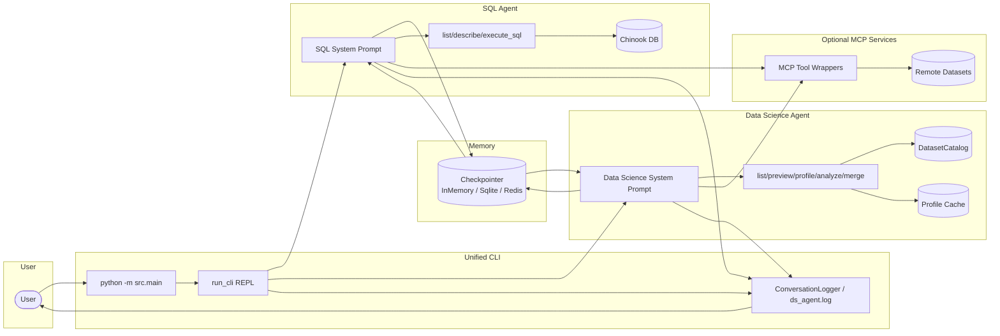

# Architecture Documentation

## System Overview

The project exposes two LangGraph agents that share observability and checkpointing infrastructure while targeting different toolchains.

## Core Components

### Agent layer
- `src/sql_agent.py::build_agent_and_context` creates the SQL LangGraph agent, seeding it with the Chinook database, optional MCP tools, and the chosen checkpointer.
- `src/ds_agent.py::build_agent` constructs the data science agent, wiring dataset tooling, catalog-aware prompts, and optional MCP dataset connectors.
- Conversation state lives in LangGraph; the CLI passes `thread_id` so checkpoints can be resumed across launches for both agents.
- System prompts inject tone instructions plus agent-specific context (table schemas for SQL, dataset inventory and MCP summary for the data science agent).

### Tooling

#### SQL toolkit (`src/sql_agent_tools.py`)
- `execute_sql`: read-only SELECT execution guarded by `_ensure_read_only`.
- `list_tables`: enumerates database tables.
- `describe_table`: PRAGMA-based schema inspection.

#### Data science toolkit (`src/ds_agent_tools.py`)
- `list_datasets`, `preview_dataset`: surface catalog metadata and row samples (capped at 100 rows).
- `profile_dataset_tool`: computes per-column summaries with caching under `data/profiles/`.
- `analyze_dataset`: performs lightweight descriptive analysis with heuristics for missing values, distribution summaries, and categorical frequencies.
- `merge_datasets`: joins catalog datasets (CSV, Parquet, SQLite) with guardrails for join keys and limit fallbacks.
- Structured logging: every tool writes to `logs/ds_agent.log`, capturing dataset load strategies, row counts, and execution duration.

#### MCP toolkit (`src/sql_agent_mcp.py`)
- Loads Model Context Protocol servers defined in configuration files.
- Exposes both blocking (`load_mcp_tools`) and async (`aload_mcp_tools`) loaders so integrations can choose the right execution model.
- Merges MCP tools with either agent, allowing remote SQL utilities or dataset services to participate in LangGraph planning.

### Memory and state
- `InMemorySaver` is used by default for disposable sessions.
- `SqliteSaver` (requires `langgraph[sqlite]`) persists checkpoints to a user-provided path.
- `RedisSaver` (requires `langgraph[redis]` and `redis`) supports shared deployments via `--redis-url`.
- `--reset-memory` performs best-effort cleanup for SQLite and Redis backends before reloading the saver.

### Safety controls
- SQL path: `_ensure_read_only` rejects blank statements, non-SELECT queries, and DML/DDL keywords before they reach SQLite.
- Data science path: dataset tools operate in read-only mode (pandas loads only), capped previews guard against large outputs, and merge operations validate join keys.
- Structured prompts keep the agents focused on safe tool usage.
- The CLI refuses to start if `.env` is missing, ensuring credentials are explicit.

### Tone and personalization
- System prompts enforce concise English responses and step-by-step reasoning guidance tuned for each agent.
- Thread identifiers allow the agents to reuse prior conversation context when checkpoints are enabled.

### Structured output
- SQL agent: Pydantic models (for example `InvoiceSummary`) describe JSON responses, with `STRUCTURED_PROMPTS` mapping schema keys to `(model, instructions, suffix)` tuples.
- Passing `--structured-output <key>` instructs the SQL agent to respond with the chosen schema; the CLI validates returned JSON and surfaces errors to the user.
- Data science agent currently focuses on free-form analysis with structured tool outputs (JSON profiles) rather than enforced schemas, but the LangGraph wiring supports future structured expansions.

## Extension Points

- Register additional tools and append them to either toolkit (SQL or data science) prior to agent construction.
- Provide an MCP configuration file via `--mcp-config` to attach external services, including remote dataset providers.
- Implement custom middleware (logging, policy enforcement, analytics) and insert it into the LangGraph runtime.
- Extend structured outputs or adjust default tone constants in `src/sql_agent.py` and `src/ds_agent.py`.
- Expand dataset loaders in `src/datasets/loaders.py` or add new data formats via `register_loader`.

## Security Architecture

### Defense in depth
1. SQL validation: rejects non-SELECT statements and DML/DDL keywords before they reach SQLite.
2. Dataset hygiene: data science tools never write back to disk, cap previews, and expose profiling metadata so data quality issues are surfaced early.
3. Database isolation: the runtime downloads the canonical Chinook snapshot if missing; file-level permissions can reinforce read-only behaviour.
4. Observability: optional JSONL logging (`--log-path`) captures every turn; data science tooling also records telemetry to `logs/ds_agent.log` for audits.

### Threat model
**Protected:** Accidental schema changes, obvious DML/DDL attempts, multi-statement payloads caught by the validator, malformed dataset join specifications.

**Not protected:** Long-running analytical queries, `SELECT *` statements without LIMIT (the agent may produce them), vulnerabilities in external MCP servers or remote datasets, model hallucinations, downstream misuse of exported CSV/Parquet data.

## Database Schema

The agent targets the Chinook sample database.

**Catalog:** `Artist`, `Album`, `Track`, `Genre`, `MediaType`.  
**Customers & Sales:** `Customer`, `Employee`, `Invoice`, `InvoiceLine`.  
**Playlists:** `Playlist`, `PlaylistTrack`.

Key relationships mirror the Chinook ERD (for example an `Album` has many `Track` records). Typical analytical queries include tracking top selling tracks or customer lifetime value.

### Observability
- Optional conversation logger writes user and assistant payloads to JSONL for the SQL agent.
- Data science tools emit structured log lines to `logs/ds_agent.log` (dataset loads, profiling duration, merge stats).
- CLI flags allow token streaming, verbose event logs (`--event-stream`), or single-shot responses (`--no-stream`).
- LangSmith instrumentation can be added externally by configuring environment variables consumed by LangChain.
