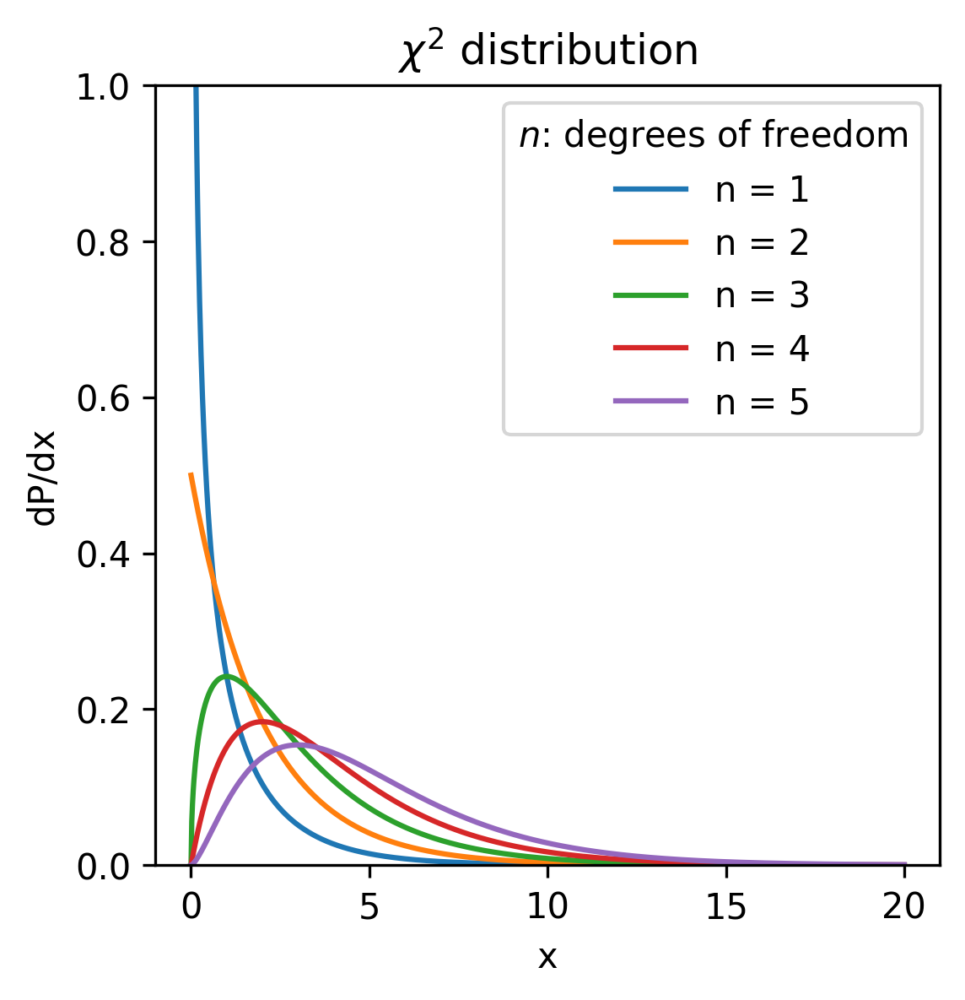
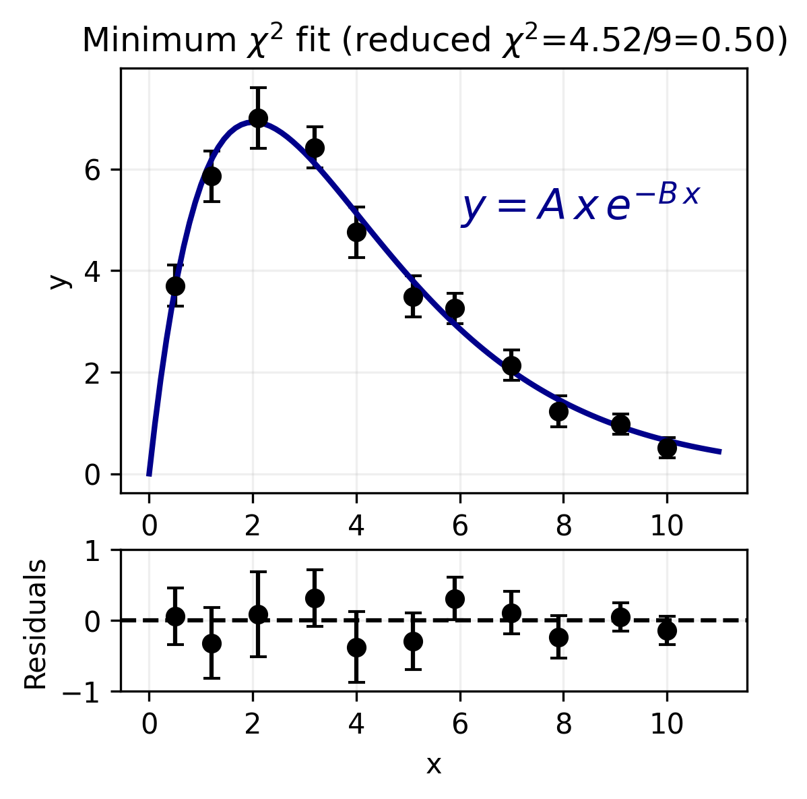

# Chi-Square and the Goodness-of-Fit Test

When fitting a model to data, we need a way to quantify how well the model matches the observations. The chi-square statistic does this by comparing the deviations between the data and the model to the expected measurement uncertainties. In this post, I briefly introduce the chi-square distribution and show how it is used in the goodness-of-fit test.

A $\chi^2$ random variable with $\nu$ degrees of freedom is the sum of the squares of $\nu$ independent standard normal variables
$$
\chi^2 = \sum_{i=1}^{\nu}Z_i^2, \; Z_i\sim \mathcal{N}(0,1).
$$
Its probability density function is given by
$$
f(\chi^2;\nu)=\dfrac{(\chi^2)^{\nu/2-1}e^{-\chi^2/2}}{2^{\nu/2}\Gamma(\nu/2)}.
$$

$\Gamma$ is the so-called *gamma function*, the analytical extension of the factorial. The expected value of a $\chi^2$ distribution is equal to the number of degrees of freedom $\nu$ and the variance is equal to $2\nu$. $\chi^2$ distributions are shown in the following figure for different numbers of degrees of freedom.

<figure align="center">
  
  <figcaption>Chi-square distribution for different numbers of degrees of freedom.</figcaption>
</figure>

For $\nu=2$, the $\chi^2$ distribution is a special case of the gamma distribution and is identical to an exponential distribution with the mean $\mu=\nu=2$ and variance of $\sigma^2=2\nu=4$. 

The upper-tail probability for a $\chi^2$ variable with $\nu$ degrees of freedom is
$$
P(\chi^2 \geq \chi^2_{\text{min}}; \nu) = \int_{\chi^2_\mathrm{min}}^{\infty} f(t;\nu) \, dt.
$$
It gives the probability that, if the data were drawn from the hypothesized parent distribution, one would obtain a value of $\chi^2$ equal to or greater than $\chi^2_\mathrm{min}$. In the goodness-of-fit setting, the upper-tail probability becomes the p-value.

## Testing the quality of fit using $\chi^2$

In data fitting, we compute a chi-square statistic from the observed data and the model. Under suitable assumptions, that statistic approximately follows a $\chi^2$ distribution with the appropriate number of degrees of freedom. In a goodness-of-fit test, the null hypothesis is that the model describes the data and that the measurement errors behave as assumed. A large value of $\chi^2$ corresponds to a small upper-tail probability, suggesting that the observed discrepancies between data and model are larger than expected from random fluctuations alone.

Consider a number $N$ of measurements ($y_1 \pm \sigma_1, \dots,\, y_N\pm\sigma_N$), and each measurement $y_i\pm\sigma_i$ corresponds to a value $x_i$ of a variable $x$. Assume we have a model for the dependence of $y$ on the variable $x$ given by a function $f$:
$$
y=f(x;\vec{\theta}),
$$
where $\vec{\theta}=(\theta_1, \dots, \theta_m)$ is a set of unknown parameters. If the measurements $y_i$ are independently distributed around the value $f(x_i, \vec{\theta})$ according to Gaussian distributions with standard deviations $\sigma_i$, the likelihood function for this problem can be written as the product of $N$ Gaussian PDFs:
$$
L(\vec{y};\vec{\theta})=\prod_{i=1}^N \dfrac{1}{\sqrt{2\pi\sigma_i^2}} \exp \left[- \dfrac{(y_i-f(x_i;\vec{\theta}))^2}{2\sigma_i^2}\right],
$$
where $\vec{y}=(y_1, \dots, y_N)$. 

Maximizing $L(\vec{y}, \vec{\theta})$ is equivalent to minimizing $-2\log L(\vec{y}, \vec{\theta})$:	
$$
-2 \log L(\vec{y}; \vec{\theta}) = \sum_{i=1}^{N} \dfrac{\left(y_i - f(x_i;\vec{\theta})\right)^2}{\sigma_i^2} + \sum_{i=1}^{N} \log (2\pi\sigma_i^2).
$$
The last term does not depend on the parameters $\vec{\theta}$ if the uncertainties $\sigma_i$ are known and fixed, hence it is a constant that can be dropped when performing the minimization. The first term is a $\chi^2$ function to be minimized. The residuals are defined as
$$
r_i=y_i-\hat{y}_i = y_i - f(x_i;\hat{\vec{\theta}}),
$$
where $\hat{\vec{\theta}}$ denotes the fitted parameter values.

An example of the fit performed on a computer-generated dataset with the minimum $\chi^2$ method is shown in the following figure. 

<figure align="center">
  
  <figcaption>Minimum chi-squared fit of a function model to a set of data points with error bars.</figcaption>
</figure>

Here, the points with the error bars are used to fit a function model of the type $y=f(x)=A\,x\,e^{-B\,x}$, where $A$ and $B$ are unknown parameters determined by the fit. The fit curve is superimposed as a solid blue line. Residuals are shown in the bottom section of the plot.

To summarize the overall agreement between the model and the data, one often uses the reduced chi-square, 
$$
\chi^2_\nu= \dfrac{\chi^2}{\nu}, \; \nu=N-m,
$$
where $N$ is the number of data points and $m$ is the number of fitted parameters. The reduced chi-square is a goodness-of-fit statistic obtained by dividing the chi-square value by the number of degrees of freedom. It assesses how well a model fits data as follows:

- $\chi^2_\nu \approx 1$: broadly consistent with a good fit and correctly estimated uncertainties,
- $\chi^2_\nu \gg 1$: possible poor fit, underestimated uncertainties, or unmodeled systematics,
- $\chi^2_\nu \ll 1$: possible overestimated uncertainties, correlations, or an overly flexible (complex) model.  

This interpretation assumes that the measurement errors are independent, approximately Gaussian, and have known variances; otherwise, the fitted $\chi^2$ statistic need not follow a $\chi^2$ distribution in this simple form. If the measurement errors are correlated, this simple form of $\chi^2$ is no longer adequate and a covariance-matrix form should be used instead. The Reduced chi-square is a useful summary statistic, but the formal goodness-of-fit test is based on the full $\chi^2$ value and its corresponding p-value.

In summary, the chi-square statistic measures how large the deviations between the data and the model are relative to the measurement uncertainties. When the errors are independent, approximately Gaussian, and have known variances, the fitted $\chi^2$ value can be interpreted using the chi-square distribution. In that case, the reduced chi-square provides a useful summary of fit quality, while the upper-tail probability, or $p$-value, provides the formal basis for the goodness-of-fit test.

Reference: Section 2.9 and 5.12, Statistical Methods for Data Analysis in Particle Physics, Second Edition, by Luca Lista.

____

[Mohit Saharan](https://linkedin.com/in/msaharan), P#2, This post was inspired by my past work, where I used the chi-square goodness-of-fit test.