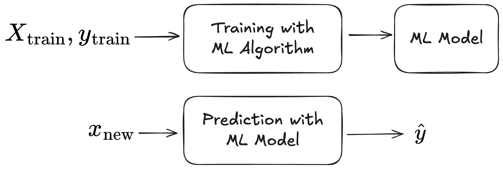
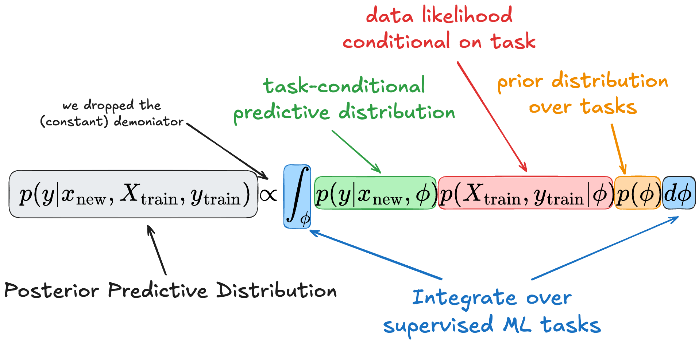

[Mohit Saharan](https://linkedin.com/in/msaharan), P4

# Understanding tabular foundation models: posterior predictive distribution

Previous post: [P#3, Tabular Foundation Models - 1](https://www.linkedin.com/posts/msaharan_20260415-tabular-foundation-models-1pdf-activity-7450221503234621441-QYwS?utm_source=share&utm_medium=member_desktop&rcm=ACoAAC8005UBr31urJ8gF7KXefP2-G8r_HNvI2g). In yesterday's post, I wrote the content to get familiar with the vocabulary. Today, I will pick sections from it that I didn't (fully) understand. I will put the snippets as quotes and the explanation in plain text.

## TabPFN and TabICL

> PFNs can be thought of as framework to train neural networks to perform Bayesian inference. The prior distribution is
>
> represented by the data used for pre-training, and the prediction is the posterior distribution.

The [first post](https://mindfulmodeler.substack.com/p/tabular-ml-is-about-to-get-weird) on tabular foundation models (TFM) by C. Molnar mentions the paper titled "[Transformers can do Bayesian inference](https://arxiv.org/pdf/2112.10510)" that introduces the Prior-Data Fitted Networks (PFNs). I guess I should read this paper to understand the meaning of the quote text above. But it's a little too technical for me right now, so I will refer to the explanation C. Molnar gave in his [second post](https://mindfulmodeler.substack.com/p/how-pfns-make-tabular-foundation). I will type as I see, while selecting the relevant parts of the post.

### We want the posterior predictive distribution

In supervised ML, we develop a ML model by training an algorithm on a labelled dataset and use the model to predict an unknown target $y$ from a feature vector $x$. This is shown in the following figure.

<figure align="center">
  
  <figcaption>The classic ML setup of training and prediction.</figcaption>
</figure>

The first setup towards a setup where we pre-train and move from train-then-predict to in-context learning is to conceptually wrap training and prediction into one function. This function accepts the triplet if training features, training labels, and the new data point and outputs the prediction. 

Technically, we could also achieve this with traditional ML approaches by wrapping, say, both training and prediction of a random forest into the same function call. This is not the same as in-context learning, but it brings us closer to pre-training and in-context learning. If we see the model training simply as a nuisance, we can reframe our initial problem of wanting to know $y$ from $x$ given a model. To go a step further, we could also wish to predict the distribution $p(y)$ instead of predicting $y$. By doing so, our model gives us a lot of utility for free, such as quantile regression, uncertainty quantification, and outlier detection. In mathematical terms, we would love to have the following:
$$
p(y|x_\text{new}, X_\text{train}, y_\text{train}).
$$
 In Bayesian terms, this is the posterior predictive distribution. 

### Using Bayes to sneak in pre-training

We will use a bit of probability theory to define the posterior predictive distribution for a given dataset and data point to involve other training tasks (based on the PFN paper). 

We start wiith the posterior predictive distribution:
$$
p(y|x_\text{new}, X_\text{train}, y_\text{train}).
$$
Using the law of total probability, we can insert a latent variable $\phi$ that represents the underlying supervised machine learning task:
$$
p(y|x_\text{new}, X_\text{train}, y_\text{train}) = \int_\phi p(y|x_\text{new}, \phi)\,p(\phi|X_\text{train}, y_{train})\,d\phi.
$$
Note that we "lost" $X_\text{train}$ and $y_\text{train}$ in the first term, but this is because $y$ is conditionally independent of the training data when we condition on the task $\phi$, because the task fully specifies the data generation.

The last term, the posterior of $\phi$ given the data, is a bit awkward to estimate or think about. We can get rid of it using Bayes theorem, which says that 
$$
p(A|B) = \dfrac{P(B|A)\,P(A)}{P(B)},
$$
by dropping the denominator (I guess $p(X_\text{train}, y_\text{train})=1$ because this is in fact the intial condition?):
$$
p(y|x_\text{new}, X_\text{train}, y_\text{train}) = \int_\phi p(y|x_\text{new}, \phi)\,p(X_\text{train}, y_{train}|\phi)\,p(\phi)\,d\phi.
$$
This formula of the posterior prediction distribution is the theoretical foundation of tabular foundation models like TabPFN. The following figure shows the components of this term graphically, and the different terms are as discussed below.

<figure align="center">
  
  <figcaption>The posterior prediction distribution that forms theoretical foundation of tabular foundation models like TabPFN.</figcaption>
</figure>

- The predictive posterior distribution of our target $y$, given its features $x_\text{new}$ and a context dataset (aka training dataset), requires integrating over (latent) tasks.
- This integration over tasks has three components:
  - A prior probability $P(\phi)$ of tasks: this tells us how likely the task we are integrating over is.
  - Likelihood of the training given the task $\phi$: this tells us how likely the observed dataset is given the task we are integrating over.
  - Probability of $y$ given its features and the task $\phi$: this gives us the probability of $y$ given the feature vector and conditional on the task.
- Intuition: we margenalize over all possible latent tasks $\phi$, weighing the prediction $p(y|x, \phi)$ by how plausible $\phi$ is given the prior and how plausible the observed data is given $\phi$.

Models like TabPFN approximate this posterior predictive distribution (PPD). However, it's not done by modeling the components of the equation individually, but they take a different approach.

### Task prior, synthetic data & transformers: ingredients to approximate the PPD

Here is how PFNs, such as TabPFN work:

- First, define a data-generation process from which one can sample tasks $\phi$. More concretely, one way to do this is by defining a function that that produces structural causal models with a different number of nodes and relations between the nodes. This essentially defines an implicit prior $p(\phi)$ from which one can sample tasks $\phi$. Note that no explicit definition of $p(\phi)$ is needed. It's just a generator that produces samples $\phi$; $p(\phi)$ is implicitly defined by this process.
- Based on such as structural causal model, one can sample labelled datasets. This part basically gives us a way to sample from $p(X_\text{train}, y_\text{train}|\phi)$.
- The third ingredient is a transformer architecture adapted to tabular data that processes the entire dataset (training points together with the query point) in a single forward pass. Self-attention operates across rows (data points) and columns (features), allowing the model to condition predictions on both other samples and feature relationships. This enables in-context learning: rather than updating parameters, the model infers the task and its inductive biases from the provided dataset. This attention-based model, trained on millions of synthetic datasets, is transferable across tabular problems.

PFNs are a general framework in which one specifies a prior over data-generating processes. For pre-training tabular foundation models, this prior is specifically instantiated for tabular data. TFMs such as TabPFN and TabICL differ in their priors, architectural choices of the transformer-based network, and in pre- and post-processing steps, while sharing the same underlying PFN principle.

## Outlook

Today, understanding one text snippet took the whole post. In future posts, I will look at other parts of [P3](https://www.linkedin.com/posts/msaharan_20260415-tabular-foundation-models-1pdf-activity-7450221503234621441-QYwS?utm_source=share&utm_medium=member_desktop&rcm=ACoAAC8005UBr31urJ8gF7KXefP2-G8r_HNvI2g) and this post (P4) that I didn't fully understand and elaborate until I understand the posts by C. Molnar and the hands-on code shown in [P3](https://www.linkedin.com/posts/msaharan_20260415-tabular-foundation-models-1pdf-activity-7450221503234621441-QYwS?utm_source=share&utm_medium=member_desktop&rcm=ACoAAC8005UBr31urJ8gF7KXefP2-G8r_HNvI2g) to a sufficient degree that I can remember them.