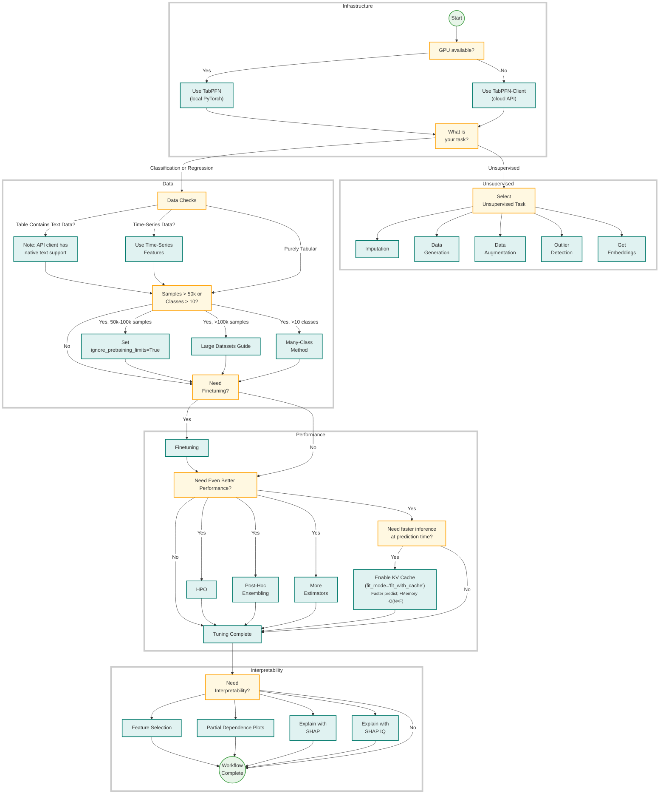

[Mohit Saharan](https://www.linkedin.com/in/msaharan), P7

___

# Understanding tabular foundation models: TabPFN repository

In the previous four blog posts ([P3](https://www.linkedin.com/posts/msaharan_20260415-tabular-foundation-models-1pdf-ugcPost-7450221502156791808-ZMP8?utm_source=share&utm_medium=member_desktop&rcm=ACoAAC8005UBr31urJ8gF7KXefP2-G8r_HNvI2g)-[P6](https://www.linkedin.com/posts/msaharan_20260420-understanding-tfms-pretraining-synthetic-datapdf-ugcPost-7452030754789699584-7coL?utm_source=share&utm_medium=member_desktop&rcm=ACoAAC8005UBr31urJ8gF7KXefP2-G8r_HNvI2g)), I read up on tabular foundation models to gain vocabulary on their theoretical aspects, such as their pre-training, their architectuere, and how they make predictions. By now, I think I know about them to a decent level to recognize the relevant parts in the code and gain the vocabulary of the engineering aspects. So, today, I am going to read through Prior Labs' TabPFN GitHub repository. 

## GitHub.com/PriorLabs/TabPFN

I am browsing the repository at this commit: https://github.com/PriorLabs/TabPFN/tree/eaefd29252a0897bd644c1840934b34ce08e194f.

 

Let's start with the README file.

### README

#### Basic Usage

Currently, the default model is TabPFN-2.6, which is trained purely on synthetic data. We can use it as follows.

```python
from tabpfn import TabPFNClassifier

clf = TabPFNClassifier()
clf.fit(X_train, y_train)
predictions = clf.predict(X_test)
```

Let's look at a complete example for binary classification.

```python
from sklearn.datasets import load_breast_cancer
from sklearn.metrics import accuracy_score, roc_auc_score
from sklearn.model_selection import train_test_split

from tabpfn import TabPFNClassifier

# Load data
X, y = load_breast_cancer(return_X_y=True)
X_train, X_test, y_train, y_test = train_test_split(
  X, y, test_size=0.33, random_state=42
)

# Initialize a classifier
clf = TabPFNClassifier()
clf.fit(X_train, y_train)

# Predict probabilities
prediction_probabilities = clf.predict_proba(X_test)
print("ROC AUC:", roc_auc_score(y_test, prediction_probabilities[:, 1]))

# Predict labels
predictions = clf.predict(X_test)
print("Accuracy", accuracy_score(y_test, predictions))
```

It seems quite straightforward to use. There's an example for multiclass classification, but let's leave it for later.

#### TabPFN Ecosystem

> Choose the right TabPFN implementation for our needs:
>
> - **[TabPFN Client](https://github.com/priorlabs/tabpfn-client)** Simple API client for using TabPFN via cloud-based inference.
>
> - **[TabPFN Extensions](https://github.com/priorlabs/tabpfn-extensions)** A powerful companion repository packed with advanced utilities, integrations, and features - great place to contribute:
>
>   - **`interpretability`**: Gain insights with SHAP-based explanations, feature importance, and selection tools.
>   - **`unsupervised`**: Tools for outlier detection and synthetic tabular data generation.
>   - **`embeddings`**: Extract and use TabPFN’s internal learned embeddings for downstream tasks or analysis.
>   - **`many_class`**: Handle multi-class classification problems that exceed TabPFN's built-in class limit.
>   - **`rf_pfn`**: Combine TabPFN with traditional models like Random Forests for hybrid approaches.
>   - **`hpo`**: Automated hyperparameter optimization tailored to TabPFN.
>   - **`post_hoc_ensembles`**: Boost performance by ensembling multiple TabPFN models post-training.
>
>   To install:
>
>   ```
>   git clone https://github.com/priorlabs/tabpfn-extensions.git
>   pip install -e tabpfn-extensions
>   ```
>
> - **[TabPFN (this repo)](https://github.com/priorlabs/tabpfn)** Core implementation for fast and local inference with PyTorch and CUDA support.
>
> - **[TabPFN UX](https://ux.priorlabs.ai/)** No-code graphical interface to explore TabPFN capabilities—ideal for business users and prototyping.

The TabPFN repo (this repo) and the TabPFN extensions repo are the most relevant for me right now. I didn't know about the extensions repo. Apparently, it's also a great place to contribute to the development. I quickly glanced at the [`priorlabs/tabpfn-extensions/src/tabpfn_extensions`](https://github.com/PriorLabs/tabpfn-extensions/tree/main/src/tabpfn_extensions) directory and want to spend some time there later to see how these utilities are implemented.

#### Workflow at a glance





### Relevant code

Let's use this diagram to figure out what I need to focus on now in the beginning. Assuming that I

- have local PyTorch,
- need classification/regression,
- have time-series data or purely tabular data,
- have less than 50k samples and less than 10 classes in the dataset,
- don't need finetuning,
- don't need better performance than default,
- need feature selection,
- need partial dependence plots,
- need explanation with SHAP,

I could read the following files and sections (line numbers mentioned after `:`) in this order. 

**Core Path (Local PyTorch, Classification/Regression, No Finetuning, Default Performance)**

1. `src/tabpfn/__init__.py:3` — entrypoints (`TabPFNClassifier`, `TabPFNRegressor`)
   - this is the public API surface that exposes TabPFNClassifier and TabPFNRegressor, so it’s our entry point from user code to the core implementation
2. `examples/tabpfn_for_binary_classification.py:21` — minimal classifier usage
   - shows the minimal binary-classification workflow (fit → predict_proba/predict) we’ll follow for default local PyTorch usage
3. `examples/tabpfn_for_multiclass_classification.py:24` — multiclass usage
   - shows the same workflow for multiclass tasks and how probabilities are evaluated in a multiclass setting
4. `examples/tabpfn_for_regression.py:24` — regressor usage
   - gives the baseline regression flow and highlights TabPFN’s distributional outputs (mean plus quantiles/mode), which ties directly to our regression understanding path

**Model Init + Default Execution Mode**

5. `src/tabpfn/base.py:93` — `initialize_tabpfn_model` (model/version/checkpoint resolution)
   - picks classifier vs regressor checkpoint(s), resolves auto model path, and prepares model objects for your local PyTorch workflow
6. `src/tabpfn/model_loading.py:567` — `load_model_criterion_config` (checkpoint loading contract)
   - actually loads checkpoint weights/config (and regression criterion), which is the foundation for all later fit/predict
7. `src/tabpfn/base.py:276` — `create_inference_engine` (we’ll use `fit_preprocessors` by default)
   - selects execution mode; with our settings this is typically fit_preprocessors (default, no special performance tuning)
8. `src/tabpfn/base.py:382` — `initialize_model_variables_helper` (device, precision, inference config resolution)
   - wires model + config + device + precision + inference config into estimator state before training context is built

**Dataset Constraints (<50k samples, <10 classes)**

9. `src/tabpfn/inference_config.py:181` — pretraining-limit defaults (`MAX_NUMBER_OF_CLASSES`, `MAX_NUMBER_OF_SAMPLES`, `MAX_NUMBER_OF_FEATURES`)
   - defines pretraining-relevant limits (`MAX_NUMBER_OF_CLASSES`, MAX_NUMBER_OF_SAMPLES, etc.) that our dataset assumptions rely on
10. `src/tabpfn/validation.py:32` — fit input validation path
    - canonical fit-time validation/shape checks for both classifier and regressor
11. `src/tabpfn/validation.py:204` — class-count check
    - enforces class-count compatibility (relevant to our “<10 classes” assumption)
12. `src/tabpfn/validation.py:220` — sample/feature limit checks
    - enforces sample/feature constraints (relevant to our “<50k samples” branch)

**Classification/Regression Internals** 

13. `src/tabpfn/classifier.py:635` — `_initialize_dataset_preprocessing`
    - handles modality detection, cleaning, label encoding, and estimator config generation for classification
14. `src/tabpfn/classifier.py:731` — `fit`
    - top-level classification flow for our default path (no finetuning, no HPO/post-hoc)
15. `src/tabpfn/classifier.py:1059` — `_raw_predict`
    - predict-time input normalization + safe forwarding into inference engine
16. `src/tabpfn/classifier.py:1283` — `logits_to_probabilities`
    - defines how raw model logits become probabilities (temperature/averaging/balancing policy)
17. `src/tabpfn/classifier.py:1357` — `forward` aggregation over estimators
    - aggregates estimator outputs and class permutations into final classification tensor outputs
18. `src/tabpfn/regressor.py:604` — `_initialize_dataset_preprocessing`
    - regression-side preprocessing plus target transform setup and ensemble config creation
19. `src/tabpfn/regressor.py:750` — `fit`
    -  top-level regression flow including target normalization and inference engine setup
20. `src/tabpfn/regressor.py:889` — `predict`
    - produces mean/median/mode/quantiles from ensemble outputs for our regression path
21. `src/tabpfn/regressor.py:1031` — `_iter_forward_executor`
    - aligns per-estimator outputs with border transforms before aggregation
22. `src/tabpfn/regressor.py:1258` — `_logits_to_output`
    - final decoding from distribution logits to user-facing regression outputs

**Tabular + “Time-Series as Features” Data Handling**

23. `src/tabpfn/preprocessing/modality_detection.py:17` — modality inference (numerical/categorical/text heuristics)
    - decides numeric/categorical/text treatment, central for both purely tabular and tabularized time-series features
24. `src/tabpfn/preprocessing/clean.py:35` — `clean_data`, `fix_dtypes`, `process_text_na_dataframe`
    - dtype fixing + categorical/text encoding + NA handling before model preprocessing
25. `src/tabpfn/preprocessing/ensemble.py:146` — ensemble member preprocessing
    - builds per-estimator transformed training contexts; this is core to TabPFN’s ensemble prompting behavior

**Inference Runtime (Default Performance Path)**

26. `src/tabpfn/inference.py:602` — `InferenceEngineCachePreprocessing` (default path with `fit_preprocessors`)
    - default runtime engine in our path; caches train preprocessing and reuses it across predictions
27. `src/tabpfn/inference.py:1301` — `_prepare_model_inputs` (train+test context construction)
    - concatenates `X_train` + `X_test` context for in-context prediction

**Model Mechanics (Understanding Why Predictions Work)**

28. `src/tabpfn/architectures/tabpfn_v2_6.py:611` — main model `forward`
    - the main architecture forward pass that turns context rows into test predictions
29. `src/tabpfn/architectures/tabpfn_v2_6.py:205` — train/test attention behavior
    - key train/test information-flow rule (prevents leakage from test labels)
30. `src/tabpfn/architectures/base/bar_distribution.py:184` — regression distribution decoding
    - defines regression distribution math over bins, which underlies uncertainty-aware outputs

**Feature Selection, PDP, SHAP**

31. Implemented in `tabpfn-extensions`, not in this repo
32. examples/notebooks/TabPFN_Demo_Local.ipynb — this repo’s integration example calling `tabpfn_extensions` interpretability APIs
    - demonstrates practical integration with `tabpfn_extensions` for SHAP/feature-selection-style interpretability on top of fitted TabPFN models

## Outro

Alright, now I have a good sense of the repository -- how things are done and what's where. I think now it's time to look into the hands-on examples and run them. Later.