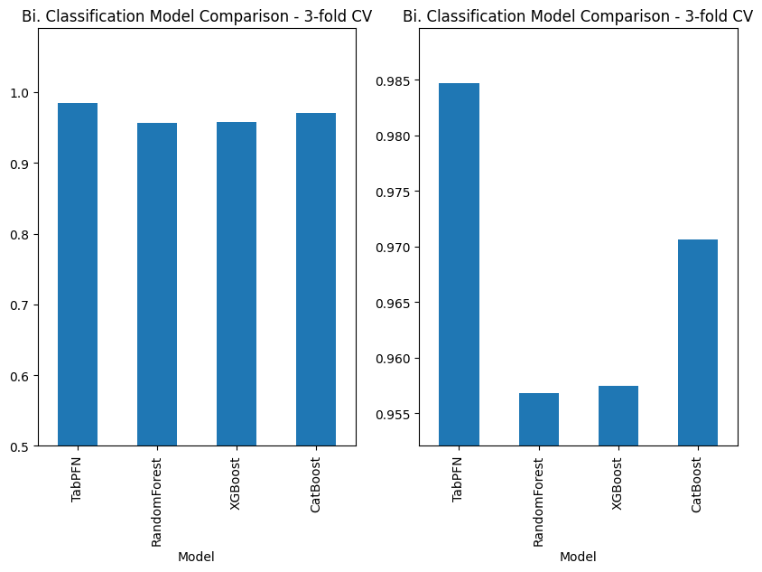

[Mohit Saharan](https://linkedin.com/in/msaharan), P8, 20260422

___

# Understanding tabular foundation models: playing with TabPFN hands-on demo

Today, I played with the official [hands-on demo of TabPFN](https://colab.research.google.com/github/PriorLabs/TabPFN/blob/main/examples/notebooks/TabPFN_Demo_Local.ipynb) listed on its GitHub repo. It contains examples to demonstrate several of its capabilities, as shown in the following figure.


As I mentioned in [yesterday's post (P7)](https://www.linkedin.com/posts/msaharan_20260421-understanding-tfm-tabpfn-repopdf-ugcPost-7452397228893114369-kKG1?utm_source=share&utm_medium=member_desktop&rcm=ACoAAC8005UBr31urJ8gF7KXefP2-G8r_HNvI2g). I only want to focus on a few capabilities in the beginning to dig deeper into how TabPFN works, so I removed the examples from the notebook that I didn't need. The removed sections are maked by strikethrough lines in the picture above. 

## Classification with TabPFN

### Binary classification

The notebook compares several models based on the ROC AUC metric. 

Originally, only the plot on the right was shown in the notebook, but I felt it was a little unfair to zoom in on the scale so much that it hides the fact that on the scale of 0.5 to 1, the performance is very close. Then, I added the plot on the left. But even after that, I was missing the uncertainties on the bars, because I wanted to see if the differences are statistically significant. That led me into thinking what kind of uncertainties would work best here and into the rabit hole of how to make this example more robust. Ultimately, I replaced the content of this cell to the following code block.

```python
# Compare different machine learning models by training each one multiple times
# on different parts of the data and averaging their performance scores for a
# more reliable performance estimate

from sklearn.model_selection import RepeatedStratifiedKFold, cross_validate
from scipy.stats import t as student_t

# Encode target labels to classes for baselines
le = LabelEncoder()
y = le.fit_transform(y)

# Define models
models = [
    ("TabPFN", TabPFNClassifier(random_state=42)),
    (
        "RandomForest",
        make_pipeline(
            column_transformer,  # string data needs to be encoded for model
            RandomForestClassifier(random_state=42),
        ),
    ),
    (
        "XGBoost",
        make_pipeline(
            column_transformer,  # string data needs to be encoded for model
            XGBClassifier(random_state=42),
        ),
    ),
    (
        "CatBoost",
        make_pipeline(
            column_transformer,  # string data needs to be encoded for model
            CatBoostClassifier(random_state=42, verbose=0),
        ),
    ),
]

# Use repeated stratified CV for more stable estimates
n_splits = 5
n_repeats = 5
cv = RepeatedStratifiedKFold(
    n_splits=n_splits,
    n_repeats=n_repeats,
    random_state=42,
)

# Use multiple metrics for a more complete comparison
n_classes = len(np.unique(y))
if n_classes > 2:
    scoring = {
        "roc_auc": "roc_auc_ovr_weighted",
        "balanced_accuracy": "balanced_accuracy",
        "neg_log_loss": "neg_log_loss",
    }
else:
    scoring = {
        "roc_auc": "roc_auc",
        "pr_auc": "average_precision",
        "balanced_accuracy": "balanced_accuracy",
        "neg_log_loss": "neg_log_loss",
    }

results = {}
for name, model in models:
    results[name] = cross_validate(
        model,
        X,
        y,
        cv=cv,
        scoring=scoring,
        n_jobs=1,
        verbose=1,
        error_score="raise",
    )

# Build summary table with mean metrics and 95% CI for ROC AUC
rows = []
for name, res in results.items():
    roc_scores = np.asarray(res["test_roc_auc"])
    n = len(roc_scores)
    roc_mean = roc_scores.mean()
    roc_std = roc_scores.std(ddof=1)
    t_crit = student_t.ppf(0.975, df=n - 1)
    roc_ci95 = t_crit * roc_std / np.sqrt(n)

    row = {
        "Model": name,
        "ROC AUC": roc_mean,
        "ROC AUC CI95": roc_ci95,
        "Balanced Accuracy": np.mean(res["test_balanced_accuracy"]),
        "Log Loss": -np.mean(res["test_neg_log_loss"]),
    }

    if "test_pr_auc" in res:
        row["PR AUC"] = np.mean(res["test_pr_auc"])

    rows.append(row)

summary = pd.DataFrame(rows).sort_values("ROC AUC", ascending=False)
display(summary.round(4))

# Plot ROC AUC with 95% CI error bars
ax = summary.plot(
    x="Model",
    y="ROC AUC",
    yerr="ROC AUC CI95",
    kind="bar",
    capsize=4,
    figsize=(10, 6),
    legend=False,
)

lower = max(0.0, (summary["ROC AUC"] - summary["ROC AUC CI95"]).min() * 0.995)
upper = min(1.0, (summary["ROC AUC"] + summary["ROC AUC CI95"]).max() * 1.005)
ax.set_ylim(lower, upper)
ax.set_ylabel("ROC AUC")
ax.set_title(
    f"Bi. Classification Model Comparison - Repeated Stratified CV ({n_splits}x{n_repeats})\nMean ROC AUC +/- 95% CI"
)
plt.tight_layout()

```


> Verbal summary of changes compared to the original version:
>
> 1. **Cross-validation design changed**
>
> - Original: `StratifiedKFold(n_splits=3, shuffle=True, random_state=42)`.
> - Modified: `RepeatedStratifiedKFold(n_splits=5, n_repeats=5, random_state=42)`.
> - Effect: per-model fits increased from `3` to `25` (overall from `12` to `100` for 4 models), improving stability of estimates but increasing runtime.
>
> 2. **Evaluation API changed**
> - Original: `cross_val_score` with one metric.
> - Modified: `cross_validate` with multiple metrics and explicit result dict per model.
> - Effect: richer diagnostics, not just a single ROC AUC vector.
>
> 3. **Scoring protocol broadened**
> - Original: ROC AUC only (`roc_auc` for binary, `roc_auc_ovr` for multiclass).
> - Modified:
>   - Binary: `roc_auc`, `average_precision` (PR AUC), `balanced_accuracy`, `neg_log_loss`.
>   - Multiclass: `roc_auc_ovr_weighted`, `balanced_accuracy`, `neg_log_loss`.
> - Effect: evaluation now covers ranking quality, thresholded performance, and probability calibration proxy (log loss). Multiclass AUC also changed from unweighted OVR to weighted OVR.
>
> 4. **Uncertainty estimation added**
> - Original: no uncertainty shown.
> - Modified: computes ROC AUC 95% CI using `t`-critical value:
>   - `CI95 = t_(0.975, n-1) * std / sqrt(n)` on repeated-CV ROC AUC scores.
> - Effect: plot now communicates uncertainty around mean ROC AUC.
>
> 5. **Output structure changed**
> - Original: one bar chart of mean ROC AUC.
> - Modified:
>   - Displays a summary table (`display(summary.round(4))`) with ROC AUC, CI, balanced accuracy, log loss, and PR AUC (binary).
>   - Plots ROC AUC bars with `yerr="ROC AUC CI95"` and `capsize=4`.
> - Effect: results are both tabular and visual, with uncertainty-aware bars.
>
> 6. **Error handling tightened**
> - Added `error_score="raise"` in CV.
> - Effect: failures are explicit instead of silently converted to `NaN`.
>

The changes resulted in the following summary table and figure.

| index | Model        | ROC AUC | ROC AUC CI95 | Balanced Accuracy | Log Loss | PR AUC  |
| ----- | ------------ | ------- | ------------ | ----------------- | -------- | ------- |
| 0     | TabPFN       | 0\.9843 | 0\.008       | 0\.9222           | 0\.1459  | 0\.9945 |
| 3     | CatBoost     | 0\.9772 | 0\.0092      | 0\.8742           | 0\.1824  | 0\.9925 |
| 2     | XGBoost      | 0\.9656 | 0\.0135      | 0\.8651           | 0\.2226  | 0\.9882 |
| 1     | RandomForest | 0\.9596 | 0\.0134      | 0\.8356           | 0\.2373  | 0\.9859 |

.png)

I could use this new code cell in the future to compare these models on other datasets.

### Regression

In the case of regression, too, the original version of the code produced the following comparison of the performance of the models based on the R2 metric in a simple manner.

.png)

I replaced the original cell contents with the following code block.

```python
# Compare different machine learning models by training each one multiple times
# on different parts of the data and averaging their performance scores for a
# more reliable performance estimate

from sklearn.model_selection import RepeatedKFold, cross_validate
from scipy.stats import t as student_t

# Define models
models = [
    ("TabPFN", TabPFNRegressor(random_state=42)),
    (
        "RandomForest",
        make_pipeline(
            column_transformer,  # string data needs to be encoded for model
            RandomForestRegressor(random_state=42),
        ),
    ),
    (
        "XGBoost",
        make_pipeline(
            column_transformer,  # string data needs to be encoded for model
            XGBRegressor(random_state=42),
        ),
    ),
    (
        "CatBoost",
        make_pipeline(
            column_transformer,  # string data needs to be encoded for model
            CatBoostRegressor(random_state=42, verbose=0),
        ),
    ),
]

# Use repeated CV for a more stable estimate on this small-to-medium dataset
n_splits = 5
n_repeats = 5
cv = RepeatedKFold(n_splits=n_splits, n_repeats=n_repeats, random_state=42)

# Evaluate both error magnitude and explained variance
scoring = {
    "rmse": "neg_root_mean_squared_error",
    "mae": "neg_mean_absolute_error",
    "medae": "neg_median_absolute_error",
    "r2": "r2",
}

results = {}
for name, model in models:
    results[name] = cross_validate(
        model,
        X,
        y,
        cv=cv,
        scoring=scoring,
        n_jobs=1,
        verbose=1,
        error_score="raise",
    )

# Summarize with 95% confidence intervals for RMSE and R2
rows = []
for name, res in results.items():
    rmse_scores = -np.asarray(res["test_rmse"])
    mae_scores = -np.asarray(res["test_mae"])
    medae_scores = -np.asarray(res["test_medae"])
    r2_scores = np.asarray(res["test_r2"])

    n = len(rmse_scores)
    t_crit = student_t.ppf(0.975, df=n - 1)

    rmse_mean = rmse_scores.mean()
    rmse_ci95 = t_crit * rmse_scores.std(ddof=1) / np.sqrt(n)

    r2_mean = r2_scores.mean()
    r2_ci95 = t_crit * r2_scores.std(ddof=1) / np.sqrt(n)

    rows.append(
        {
            "Model": name,
            "RMSE": rmse_mean,
            "RMSE CI95": rmse_ci95,
            "MAE": mae_scores.mean(),
            "MedAE": medae_scores.mean(),
            "R2": r2_mean,
            "R2 CI95": r2_ci95,
        }
    )

summary = pd.DataFrame(rows).sort_values("RMSE", ascending=True)
display(summary.round(4))

# Plot primary metric (RMSE) and secondary metric (R2) with uncertainty
fig, axs = plt.subplots(1, 2, figsize=(14, 6))

summary.plot(
    x="Model",
    y="RMSE",
    yerr="RMSE CI95",
    kind="bar",
    capsize=4,
    ax=axs[0],
    legend=False,
)
rmse_lower = max(0.0, (summary["RMSE"] - summary["RMSE CI95"]).min() * 0.98)
rmse_upper = (summary["RMSE"] + summary["RMSE CI95"]).max() * 1.02
axs[0].set_ylim(rmse_lower, rmse_upper)
axs[0].set_title("Regression Model Comparison - RMSE (lower is better)")
axs[0].set_ylabel("RMSE")

summary.plot(
    x="Model",
    y="R2",
    yerr="R2 CI95",
    kind="bar",
    capsize=4,
    ax=axs[1],
    legend=False,
)
r2_lower = (summary["R2"] - summary["R2 CI95"]).min()
r2_upper = (summary["R2"] + summary["R2 CI95"]).max()
r2_pad = max(0.01, 0.05 * (r2_upper - r2_lower))
axs[1].set_ylim(r2_lower - r2_pad, min(1.0, r2_upper + r2_pad))
axs[1].set_title("Regression Model Comparison - R2 (higher is better)")
axs[1].set_ylabel("R2")

fig.suptitle(
    f"Repeated CV ({n_splits}x{n_repeats}) - Mean +/- 95% CI",
    y=1.02,
)
plt.tight_layout()


```

> Verbal summary of changes compared to the original version:
>
> 1. **Evaluation protocol upgraded**
>
> - Original: `KFold(n_splits=3, shuffle=True, random_state=42)`.
> - Modified: `RepeatedKFold(n_splits=5, n_repeats=5, random_state=42)`.
> - Net effect: per-model evaluations increase from `3` to `25` folds (4 models: `12` fits -> `100` fits).
>
> 2. **API changed from single-score to multi-score evaluation**
> - Original: `cross_val_score(..., scoring="r2")`.
> - Modified: `cross_validate(..., scoring={...}, error_score="raise")`.
> - New behavior: captures multiple metrics and fails loudly on errors instead of silently masking failures.
>
> 3. **Scoring scope expanded**
> - Original: only `R2`.
> - Modified: `RMSE`, `MAE`, `MedAE`, and `R2`.
> - Technical detail: negative sklearn losses are sign-corrected (`-test_rmse`, `-test_mae`, `-test_medae`) before reporting.
>
> 4. **Uncertainty estimation added**
> - Original: no uncertainty.
> - Modified: 95% confidence intervals computed for `RMSE` and `R2` using Student-t:
>   - `CI95 = t_(0.975, n-1) * std / sqrt(n)`.
>
> 5. **Result aggregation changed**
> - Original: DataFrame with mean `R2` only.
> - Modified: summary DataFrame with means and CI columns:
>   - `RMSE`, `RMSE CI95`, `MAE`, `MedAE`, `R2`, `R2 CI95`.
> - Sorted by `RMSE` ascending (lower error prioritized).
>
> 6. **Visualization changed**
> - Original: one bar plot (`R2` mean only).
> - Modified: two-panel figure with error bars:
>   - Left: `RMSE +/- CI95` (lower is better).
>   - Right: `R2 +/- CI95` (higher is better).
> - Added dynamic axis bounds and a CV protocol title (`5x5` repeated CV).
>

The change resulted in the following summary table and figure.

| index | Model        | RMSE    | RMSE CI95 | MAE     | MedAE   | R2      | R2 CI95 |
| ----- | ------------ | ------- | --------- | ------- | ------- | ------- | ------- |
| 0     | TabPFN       | 2\.6804 | 0\.2312   | 1\.7467 | 1\.2275 | 0\.9088 | 0\.0163 |
| 3     | CatBoost     | 2\.9868 | 0\.144    | 2\.0358 | 1\.4142 | 0\.8908 | 0\.0088 |
| 2     | XGBoost      | 3\.2282 | 0\.2022   | 2\.1975 | 1\.5605 | 0\.8704 | 0\.0167 |
| 1     | RandomForest | 3\.2615 | 0\.1965   | 2\.2228 | 1\.5686 | 0\.8675 | 0\.0167 |

.png)

## Outro

I got started with this code example today. I also examined the model interpretation (SHAP) section today but didn't make any changes to it so didn't feel the need to discuss it here. In the next few iterations of my exploration, I will keep the same notebook while making sure the classification example, the regression example, and the model interpretation using SHAP are properly implemented. I think, for now, it's important to make sure I understand this much and try to test these examples on different datasets.