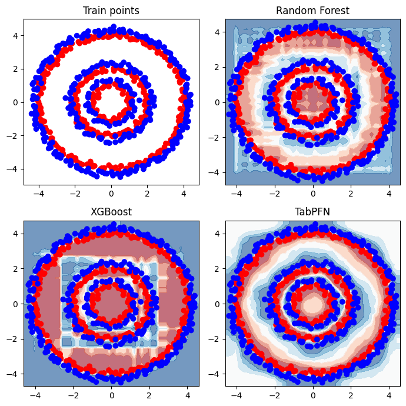
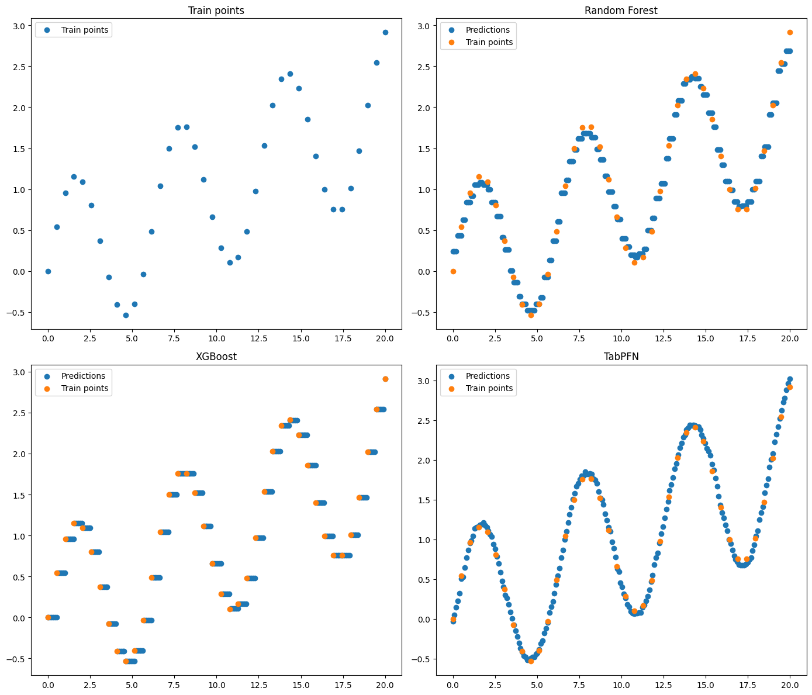
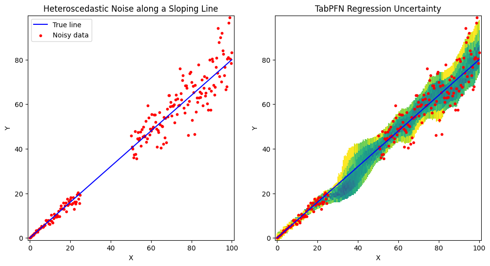

[Mohit Saharan](https://linkedin.com/in/msaharan), P11, 20260427

___

# Understanding tabular foundation models: predictive behavior of TabPFN

This post continues my series on tabular foundation models. So far, I have covered the basic vocabulary of tabular foundation models in [P3](https://www.linkedin.com/posts/msaharan_20260415-tabular-foundation-models-1pdf-activity-7450221503234621441-QYwS?utm_source=share&utm_medium=member_desktop&rcm=ACoAAC8005UBr31urJ8gF7KXefP2-G8r_HNvI2g), the posterior predictive distribution in [P4](https://www.linkedin.com/posts/msaharan_20260416-understanding-tfms-ppdpdf-activity-7450580114225938432-9UYN?utm_source=share&utm_medium=member_desktop&rcm=ACoAAC8005UBr31urJ8gF7KXefP2-G8r_HNvI2g), the architecture in [P5](https://www.linkedin.com/posts/msaharan_20260417-understanding-tfm-architecture-tabpfnpdf-activity-7450946343922999318-6Lw_?utm_source=share&utm_medium=member_desktop&rcm=ACoAAC8005UBr31urJ8gF7KXefP2-G8r_HNvI2g), pre-training in [P6](https://www.linkedin.com/posts/msaharan_20260420-understanding-tfms-pretraining-synthetic-datapdf-activity-7452030755720888320-INN6?utm_source=share&utm_medium=member_desktop&rcm=ACoAAC8005UBr31urJ8gF7KXefP2-G8r_HNvI2g), the TabPFN repository in [P7](https://www.linkedin.com/posts/msaharan_20260421-understanding-tfm-tabpfn-repopdf-activity-7452397229723623425-DVO3?utm_source=share&utm_medium=member_desktop&rcm=ACoAAC8005UBr31urJ8gF7KXefP2-G8r_HNvI2g), the hands-on demo's classification and regression examples in [P8](https://www.linkedin.com/posts/msaharan_20260422-understanding-tfms-tabpfn-handson-demopdf-activity-7452807834171387904-s5Ah?utm_source=share&utm_medium=member_desktop&rcm=ACoAAC8005UBr31urJ8gF7KXefP2-G8r_HNvI2g), TabPFN Client in [P9](https://www.linkedin.com/posts/msaharan_20260423-understanding-tfm-trying-tabpfn-clientpdf-activity-7453126821384073216-2bqA?utm_source=share&utm_medium=member_desktop&rcm=ACoAAC8005UBr31urJ8gF7KXefP2-G8r_HNvI2g), and TabPFN embeddings in [P10](https://www.linkedin.com/posts/msaharan_tabpfn-tabularfoundationmodels-machinelearning-activity-7453455329779941376-ymp3?utm_source=share&utm_medium=member_desktop&rcm=ACoAAC8005UBr31urJ8gF7KXefP2-G8r_HNvI2g).

For a new reader, the minimum background is this: TabPFN is a pretrained tabular foundation model. Unlike XGBoost or Random Forest, its ordinary `.fit()` call does not update model weights to learn a fresh model from scratch. Instead, `.fit()` prepares the labelled rows as context for the current task, and TabPFN uses that context to predict new rows. For more theory, P3, P4, P5, and P6 are the better starting points; this post gives only the background needed for today's topic.

Today I cover the predictive behavior section of the official TabPFN hands-on demo notebook. You can find my version of the notebook [here](https://github.com/msaharan/dsaiengineering/blob/a9d811ea7fba03d81870933cb1d229a1d7d29221/blog/20260427-understanding-tfm-predictive-behavior-tabpfn.assets/tabpfn-hands-on-demo-msaharan-20260427.ipynb) in my GitHub repository.

Model scores such as ROC AUC, RMSE, and \(R^2\) tell us how models perform on average. In this post, I use the TabPFN demo to ask a more diagnostic question: how do TabPFN, Random Forest, and XGBoost behave across the input space? We will inspect probability surfaces, regression curves, and quantile intervals to see which behaviors are standard supervised-ML diagnostics and which reflect TabPFN's pretrained, context-conditioned workflow.

The post is organized as follows:

1. **Conceptual background:** the terms and equations needed to understand the examples.
   - Working vocabulary.
   - Supervised learning vs TabPFN, mathematically.
   - Mathematical objects we will inspect.
   - Classical diagnostics vs TabPFN's workflow.
2. **Hands-on demo:** three examples from the notebook.
   - Classification decision boundaries.
   - Regression curve fitting.
   - Regression uncertainty with quantiles.
3. **Summary and conclusion:** the main takeaways and what comes next.
   - What the conceptual background prepared us to inspect.
   - What the examples demonstrated.
   - What changes when the same diagnostics are applied to TabPFN.

## 1. Conceptual Background

Before going to the hands-on demo, I want to set up the concepts that make the examples meaningful. This section does three things:

1. It defines the vocabulary used in the post.
2. It connects TabPFN's prediction step to the posterior predictive distribution from P4.
3. It defines the mathematical objects we will inspect in the demo: classification probability surfaces, regression mean functions, quantiles, and interval coverage.

### 1.1 Working Vocabulary

The key terms for this post are:

- **Tabular foundation model:** a pretrained model designed to work across many tabular prediction tasks.
- **In-context learning:** the model uses labelled rows as context for the current task instead of updating pretrained weights in the usual task-specific training loop.
- **Predictive behavior:** the shape and reliability of the model's predictions, not just the final score.
- **Decision boundary:** in classification, the region where the model switches from one class to another.
- **Quantiles:** values below which specified fractions of a predictive distribution fall, useful for uncertainty.

The familiar supervised ML workflow is:

```python
model = XGBClassifier()
model.fit(X_train, y_train)
preds = model.predict(X_test)
```

Here, `.fit()` learns task-specific trees from the dataset.

TabPFN uses a similar interface:

```python
model = TabPFNClassifier()
model.fit(X_train, y_train)
preds = model.predict(X_test)
```

But the meaning is different. TabPFN is already pretrained. In the standard prediction workflow, `.fit()` validates the data and prepares preprocessing, caching, and task context. Conceptually, the training rows and labels become context for the current task:

$$
(X_\text{train}, y_\text{train}).
$$

The test rows are queries:

$$
X_\text{test}.
$$

For one query row \(x_\text{new}\), TabPFN conceptually predicts the posterior predictive distribution I discussed in P4:

$$
p(y|x_\text{new}, X_\text{train}, y_\text{train}).
$$

Here, \(p(\cdot)\) means a predictive probability distribution: class probabilities for classification, and a distribution over possible target values for regression.

For this post, the important point is practical. Classical supervised models can also provide more than hard class labels: classifiers such as Random Forest, XGBoost, and CatBoost can return class probabilities, and specialized methods can return uncertainty estimates or quantiles. So the diagnostic workflow itself is not unique to TabPFN. What is different here is that TabPFN produces its predictions by conditioning a pretrained tabular model on the current dataset, and TabPFN regression can expose distributional summaries such as quantiles directly through the prediction API.

### 1.2 Supervised learning vs TabPFN, mathematically

The code later in the post uses familiar sklearn-style calls such as `.fit()` and `.predict()`. To avoid treating TabPFN as just another tree model, this subsection makes the difference explicit. First, I describe the usual supervised-learning abstraction. Then I connect TabPFN back to the posterior predictive distribution from P4.

Let the labelled dataset be:

$$
D = \{(x_i, y_i)\}_{i=1}^n.
$$

Here, \(D\) is the current training dataset, \(x_i\) is the feature vector for row \(i\), \(y_i\) is its target value or class label, and \(n\) is the number of labelled rows. I use lowercase \(x\) and \(y\) for concrete feature and target values. Later, uppercase \(X\) and \(Y\) refer to random variables.

As a useful abstraction, ordinary supervised learning usually chooses a function class \(\mathcal{F}\) and fits a task-specific model by minimizing an empirical loss:

$$
\hat{f}
= \arg\min_{f \in \mathcal{F}}
\frac{1}{n}\sum_{i=1}^{n}\ell(y_i, f(x_i)) + \lambda \Omega(f).
$$

Here, \(f\) is a candidate prediction function, \(\ell\) is a loss function, \(\Omega(f)\) is a regularization term, \(\lambda \geq 0\) controls the strength of regularization, and \(\hat{f}\) is the model learned specifically for this dataset. The notation \(\arg\min\) means "choose the function that makes this objective as small as possible." Tree-based models such as Random Forest, XGBoost, and CatBoost differ in how they define \(\mathcal{F}\), how they optimize the model, and how they regularize it, but the basic idea is still dataset-specific fitting.

TabPFN is conceptually different. Following the terminology I used in P4, we can insert a latent task variable \(\phi\) into the posterior predictive distribution. Here, \(\phi\) represents the underlying supervised machine learning task: the feature-target relationship, the noise pattern, and other task-level assumptions that determine how data is generated.

For a new row \(x_\text{new}\), the posterior predictive distribution can be written as:

$$
p(y_\text{new}|x_\text{new}, D)
= \int p(y_\text{new}|x_\text{new}, \phi)\,p(\phi|D)\,d\phi.
$$

The first term does not include \(D\) because, after conditioning on the latent task \(\phi\), the task itself is assumed to contain the information needed to describe how \(x_\text{new}\) maps to \(y_\text{new}\). The integral means that the prediction averages over possible tasks \(\phi\), weighted by how plausible each task is after seeing \(D\). If the set of possible tasks were discrete, this would look like a weighted sum instead of an integral.

Using Bayes' rule: 

$$
p(\phi|D) = \frac{p(D|\phi)p(\phi)}{p(D)}.
$$

The prior \(p(\phi)\) represents assumptions about what kinds of tabular tasks are likely. The likelihood \(p(D|\phi)\) says how likely the current dataset is under task \(\phi\). The posterior \(p(\phi|D)\) says which tasks remain plausible after seeing the current dataset. The denominator \(p(D)\) is a normalizing constant.

This gives the same intuition as P4: we are averaging predictions across possible latent tasks, weighted by how plausible those tasks are after seeing the context dataset.

TabPFN does not explicitly compute this integral at prediction time. Instead, it is pretrained on many synthetic tasks so that the neural network amortizes this inference. In this context, amortization means that much of the work of learning how to infer tasks has already happened during pretraining; at prediction time, the model uses \(D\) as context and \(x_\text{new}\) as a query to directly output predictions that approximate this posterior predictive behavior.

This is a useful theoretical lens, but it should not be read as a guarantee that TabPFN is perfectly Bayesian for every real dataset. It is an amortized approximation learned from the task distribution used during pretraining. The closer a real task is to the kinds of tasks represented by that prior, the more useful we should expect this behavior to be.

This is the mathematical reason why the same sklearn-looking code can mean different things:

```python
model.fit(X_train, y_train)
```

For XGBoost, this learns task-specific trees. For TabPFN, this prepares preprocessing, cache state, and task context for a pretrained model.

### 1.3 Mathematical objects we will inspect

The introduction named three diagnostic views: probability surfaces, regression curves, and quantile intervals. This subsection defines the mathematical objects behind those views so that the hands-on demo is easier to interpret.

I will use three handles to make predictive behavior visible:

1. A classification probability surface.
2. A regression mean function.
3. Regression quantiles and interval coverage.

The next few equations define these objects before we use them in the notebook examples.

For binary classification, let \(X\) be the random feature vector and \(Y\) be the random class label. The notation \(\mathbb{P}\) means probability. For a specific input value \(x\), define:

$$
\eta(x) = \mathbb{P}(Y=1|X=x, D).
$$

Here, \(\eta(x)\) is the model's estimated probability of the positive class given the training dataset \(D\). The decision boundary at threshold \(\tau\) is:
$$
\mathcal{B}_\tau = \{x : \eta(x) = \tau\}.
$$

For the usual threshold \(\tau=0.5\), the boundary is where a 0.5-threshold decision rule switches between classes. Looking at \(\eta(x)\), not only the predicted class, tells us how the model's positive-class probability changes across the feature space.

For regression, we shift from class probabilities to a distribution over possible numeric target values. Its conditional cumulative distribution function is:

$$
F_x(y) = \mathbb{P}(Y \leq y | X=x, D).
$$

Here, \(F_x(y)\) is the probability that the target \(Y\) is less than or equal to the candidate value \(y\), given input \(x\) and context \(D\). From this distribution, we can define the predictive mean, where \(\mathbb{E}\) means expectation:

$$
\mu(x) = \mathbb{E}[Y|X=x,D],
$$

and the \(\alpha\)-quantile, where \(\alpha\) is a probability level between 0 and 1:

$$
Q_\alpha(x) = \inf \{y : F_x(y) \geq \alpha\}.
$$

The notation \(\inf\) means the infimum: the leftmost value, or limiting lower bound, where the cumulative probability reaches at least \(\alpha\).

This is useful because the notebook asks TabPFN for quantiles. Once we have quantiles, we can form prediction intervals. For example, an 80% central prediction interval can be written as:

$$
[Q_{0.1}(x), Q_{0.9}(x)].
$$

This interval is useful only if it is calibrated. For a well-calibrated central 80% interval, on a held-out dataset \(\{(x_j, y_j)\}_{j=1}^m\), where \(m\) is the number of held-out rows, we would expect:

$$
\frac{1}{m}\sum_{j=1}^{m}
\mathbf{1}\{y_j \in [Q_{0.1}(x_j), Q_{0.9}(x_j)]\}
\approx 0.8.
$$

This equation is the mathematical version of the interval coverage check used later in the post.

The indicator \(\mathbf{1}\{\cdot\}\) equals 1 when the condition inside the braces is true and 0 otherwise. So the average counts the fraction of held-out targets that fall inside the predicted interval.

### 1.4 Classical diagnostics vs TabPFN's workflow

The diagnostics in this post are familiar supervised ML tools. What changes is not the diagnostic itself, but the source of the predictions being diagnosed: TabPFN is pretrained and conditions on the current dataset as context.

- **Probability surfaces and decision boundaries:** standard supervised ML can visualize any probabilistic classifier with `predict_proba` in 2D. TabPFN adds a probability surface produced by conditioning a pretrained model on the current context dataset.
- **Smooth regression curves:** splines, Gaussian processes, neural networks, and tuned boosting workflows can produce smooth predictions. TabPFN may produce a smooth-looking mean function from a small context dataset without building a custom smooth model.
- **Quantile predictions and intervals:** quantile regression, conformal prediction, Bayesian models, and ensembles can provide intervals. TabPFN regression can expose distributional summaries such as quantiles directly through the prediction API.
- **Meaning of `.fit()`:** classical models usually fit task-specific parameters from the current dataset. Ordinary TabPFN `.fit()` prepares preprocessing, cache state, and context for a pretrained model whose weights are not updated.

So the point is not that TabPFN invented these diagnostics. The point is to apply familiar diagnostics to TabPFN and ask whether its pretrained, context-conditioned workflow gives useful behavior with less task-specific tuning.

## 2. Hands-on Demo: Inspecting Predictive Behavior

The conceptual background gave us the objects to inspect: a probability surface, a mean function, and quantile intervals. Now I use the notebook to inspect those objects directly for TabPFN, Random Forest, and XGBoost.

The notebook section has three examples:

1. Classification decision boundaries.
2. Regression curve fitting.
3. Regression uncertainty with quantiles.

The full notebook contains the helper functions and plotting code. Below, I show the parts that matter for understanding the workflow.

### 2.1 Classification decision boundaries

The first example creates a binary classification dataset made of concentric circles. This is useful for studying predictive behavior because the correct class transition is nonlinear and easy to inspect visually.

The important plotting choice is `response_method="predict_proba"`. I do not only want to know which class the model predicts; I want to see the probability surface.

Mathematically, the plot visualizes an estimate of:

$$
\eta(x) = \mathbb{P}(Y=1|X=x, D)
$$

over a grid of \(x\)-values. The color transition region corresponds to the decision boundary \(\mathcal{B}_{0.5}\).

```python
X_train, y_train = generate_circle_data(
    num_points_per_circle=[50, 100, 200],
    radii=[1, 2, 4],
    noise_factor=0.1,
)

rf = RandomForestClassifier().fit(X_train[:, :2], y_train)
xgb = XGBClassifier().fit(X_train[:, :2], y_train)
tabpfn = TabPFNClassifier().fit(X_train[:, :2], y_train)

DecisionBoundaryDisplay.from_estimator(
    tabpfn,
    X_train[:, :2],
    response_method="predict_proba",
    grid_resolution=50,
)
```

The notebook repeats this plotting workflow for Random Forest, XGBoost, and TabPFN. I show the TabPFN call here because the important detail is the use of `predict_proba` to visualize the probability surface.



Random Forest and XGBoost learn the circular pattern, but their probability surfaces contain more block-like regions. This is consistent with how tree models partition the feature space. A tree often produces a piecewise-constant function of the form:

$$
\hat{f}(x) = \sum_m c_m \mathbf{1}\{x \in R_m\}.
$$

Here, \(R_m\) is one region of the input space, such as a leaf region in a tree, and \(c_m\) is the prediction assigned to that region. Averaging many trees can smooth this behavior, but the partitioning can still be visible in simple 2D plots.

TabPFN's smoother radial probability surface reflects a different inductive bias: the boundary comes from a pretrained model conditioning on the current rows as context rather than from task-specific tree partitions learned only from this dataset.

This 2D decision-boundary plot is useful because the toy dataset has two features. In real high-dimensional tabular projects, the same diagnostic idea usually shows up through calibration curves, residual plots by feature bins, partial dependence or ICE plots, SHAP dependence plots, and segment-level error analysis.

The lesson is not "TabPFN is always better." The lesson is that the same probability-surface diagnostic can reveal different inductive biases across models.

### 2.2 Regression curve fitting

The classification example inspected the probability surface \(\eta(x)\). The second example shifts to regression and inspects the learned mean function \(\mu(x)\). It uses a simple one-dimensional regression problem. The noiseless data-generating function is:

$$
f^\star(x) = \sin(x) + \frac{x}{10}.
$$

The notebook samples 40 training points, fits Random Forest, XGBoost, and TabPFN, and predicts on a dense grid.

```python
X_train, y_train = generate_sinx_plus_x(N=40)
X_test = np.linspace(0, 20, 200).reshape(-1, 1)

rf = RandomForestRegressor(random_state=42).fit(X_train, y_train)
xgb = XGBRegressor(random_state=42).fit(X_train, y_train)

tabpfn = TabPFNRegressor()
tabpfn.fit(X_train, y_train)

y_pred_tabpfn = tabpfn.predict(X_test)
```



The tree-based models follow the data, but their predictions are more step-like. This is expected because trees partition the feature space into regions. TabPFN produces a smoother curve that follows the sinusoidal trend.

For real regression projects, this kind of inspection maps directly to predicted-vs-actual plots, residual plots, and residuals by feature bins.

Smooth regression is not unique to TabPFN. A spline model, Gaussian process, neural network, or tuned boosting workflow may also produce smooth predictions. The TabPFN-specific point is that the estimated predictive mean \(\mu(x)\) is shaped by the pretrained model's learned prior and the small context dataset, without building a custom smooth model for this toy function.

### 2.3 Regression uncertainty with quantiles

The regression curve example focused on the mean function \(\mu(x)\). The third example moves from mean prediction to uncertainty. The notebook creates a line with heteroscedastic noise, meaning the noise grows with \(x\). In mathematical form, the toy data is approximately:

$$
y = 0.8x + \sigma(x)\epsilon,
\quad \sigma(x) = 0.1x,
\quad \epsilon \sim \mathcal{N}(0,1).
$$

Here, \(x\) is the input, \(0.8x\) is the noiseless line, \(\sigma(x)\) is the input-dependent noise scale, and \(\epsilon\) is standard normal random noise.

The notebook also leaves a gap in the training data. This lets us inspect whether TabPFN expresses higher uncertainty where the data is noisier or sparse.

The key call is:

```python
reg = TabPFNRegressor()
reg.fit(x, y_noisy)
preds = reg.predict(x_test, output_type="full")
```

With `output_type="full"`, TabPFN returns several summaries of the predictive distribution, including mean, median, mode, and quantiles. If quantiles are not specified, the default quantiles are:

```python
[0.1, 0.2, 0.3, 0.4, 0.5, 0.6, 0.7, 0.8, 0.9]
```



The left panel shows the generated data. The right panel shows TabPFN's predictive quantile bands. The bands are narrow where the data is dense and low-noise. They become wider in noisier regions and around the gap where the model has less direct context.

This behavior is consistent with useful distributional predictions, but the intervals still need to be validated with held-out coverage checks.

The TabPFN-specific point here is convenience and integration: TabPFN regression can expose distributional summaries directly through the model output interface. Traditional supervised ML can also provide uncertainty, but usually through a separate method such as quantile regression, conformal prediction, Bayesian modeling, or ensembling.

Quantiles are model outputs, not guarantees. For a held-out dataset, I would request the two interval endpoints explicitly and compute empirical coverage:

```python
q10_pred, q90_pred = reg.predict(
    X_holdout,
    output_type="quantiles",
    quantiles=[0.1, 0.9],
)

coverage_80 = np.mean((y_holdout >= q10_pred) & (y_holdout <= q90_pred))
print(f"80% interval coverage: {coverage_80:.3f}")
```

Here, `X_holdout` and `y_holdout` are rows and targets that were not used in `reg.fit(...)`. If the value is close to `0.8`, allowing for sampling noise, the interval is roughly calibrated on that held-out sample. If it is much lower, the model is overconfident. If it is much higher, the intervals may be too wide to be operationally useful. This is a diagnostic, not a proof of calibration for every future segment.

## 3. Summary and Conclusion

In this post, I used predictive behavior as a diagnostic lens for comparing TabPFN with familiar supervised ML baselines.

The conceptual section connected the notebook examples to three mathematical objects: the classification probability surface \(\eta(x)\), the regression mean function \(\mu(x)\), and the regression predictive distribution with quantiles \(Q_\alpha(x)\). This made the later plots easier to interpret because each visual had a mathematical object behind it.

The hands-on examples then showed those objects in code. The classification example compared probability surfaces, the regression curve-fitting example compared learned mean functions, and the uncertainty example used TabPFN regression quantiles to inspect how predictive intervals behave in noisy or sparse regions.

The main takeaway is that the diagnostics themselves are not new to tabular foundation models. What is different in TabPFN is the workflow: a pretrained tabular model conditions on the current dataset as context, and in regression it can expose distributional summaries such as quantiles directly through its prediction API. That makes it worth asking, example by example, whether TabPFN gives useful behavior with less task-specific tuning.

With this post, I have moved one step further through the official TabPFN hands-on demo. In the upcoming posts, I will continue exploring the remaining parts of the TabPFN ecosystem and focus on ideas that can be applied in real tabular data workflows. Stay tuned.
