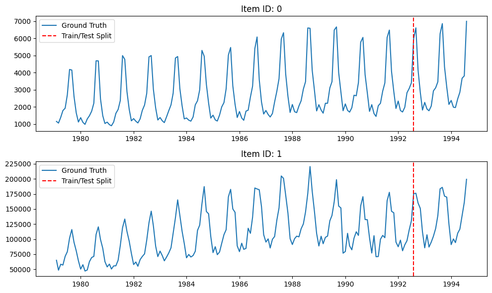
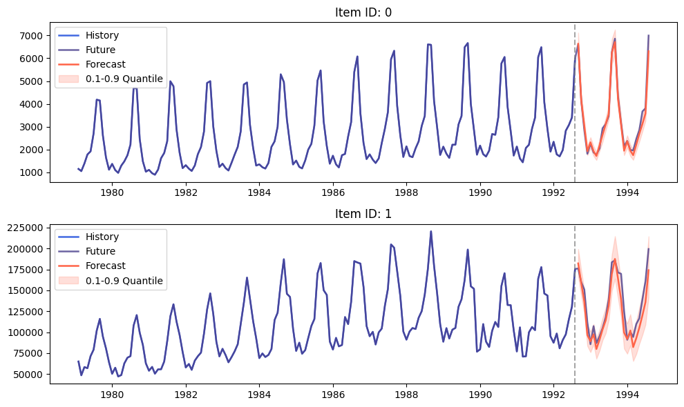

[Mohit Saharan](https://linkedin.com/in/msaharan), P12, 20260428

___

# Understanding tabular foundation models: time series forecasting with TabPFN

## 1. Introduction

This post continues my series on tabular foundation models. So far, I have covered the basic vocabulary of tabular foundation models in [P3](https://www.linkedin.com/posts/msaharan_20260415-tabular-foundation-models-1pdf-activity-7450221503234621441-QYwS?utm_source=share&utm_medium=member_desktop&rcm=ACoAAC8005UBr31urJ8gF7KXefP2-G8r_HNvI2g), the posterior predictive distribution in [P4](https://www.linkedin.com/posts/msaharan_20260416-understanding-tfms-ppdpdf-activity-7450580114225938432-9UYN?utm_source=share&utm_medium=member_desktop&rcm=ACoAAC8005UBr31urJ8gF7KXefP2-G8r_HNvI2g), the architecture in [P5](https://www.linkedin.com/posts/msaharan_20260417-understanding-tfm-architecture-tabpfnpdf-activity-7450946343922999318-6Lw_?utm_source=share&utm_medium=member_desktop&rcm=ACoAAC8005UBr31urJ8gF7KXefP2-G8r_HNvI2g), pre-training in [P6](https://www.linkedin.com/posts/msaharan_20260420-understanding-tfms-pretraining-synthetic-datapdf-activity-7452030755720888320-INN6?utm_source=share&utm_medium=member_desktop&rcm=ACoAAC8005UBr31urJ8gF7KXefP2-G8r_HNvI2g), the TabPFN repository in [P7](https://www.linkedin.com/posts/msaharan_20260421-understanding-tfm-tabpfn-repopdf-activity-7452397229723623425-DVO3?utm_source=share&utm_medium=member_desktop&rcm=ACoAAC8005UBr31urJ8gF7KXefP2-G8r_HNvI2g), the hands-on demo's classification and regression examples in [P8](https://www.linkedin.com/posts/msaharan_20260422-understanding-tfms-tabpfn-handson-demopdf-activity-7452807834171387904-s5Ah?utm_source=share&utm_medium=member_desktop&rcm=ACoAAC8005UBr31urJ8gF7KXefP2-G8r_HNvI2g), TabPFN Client in [P9](https://www.linkedin.com/posts/msaharan_20260423-understanding-tfm-trying-tabpfn-clientpdf-activity-7453126821384073216-2bqA?utm_source=share&utm_medium=member_desktop&rcm=ACoAAC8005UBr31urJ8gF7KXefP2-G8r_HNvI2g), TabPFN embeddings in [P10](https://www.linkedin.com/posts/msaharan_tabpfn-tabularfoundationmodels-machinelearning-activity-7453455329779941376-ymp3?utm_source=share&utm_medium=member_desktop&rcm=ACoAAC8005UBr31urJ8gF7KXefP2-G8r_HNvI2g), and TabPFN's predictive behavior in [P11](https://open.substack.com/pub/dsaiengineering/p/p11-understanding-tabular-foundation?utm_campaign=post-expanded-share&utm_medium=web).

For a new reader, the minimum background is this: TabPFN is a pretrained tabular foundation model. Unlike XGBoost or Random Forest, its ordinary `.fit()` call does not update model weights to learn a new model from scratch for the current dataset. Instead, `.fit()` prepares the labelled rows as context, and TabPFN uses that context to predict new rows. This is why I have repeatedly described TabPFN as a context-conditioned predictor rather than just another sklearn-like estimator.

Today I cover the time series forecasting section of the official [TabPFN hands-on demo notebook](https://colab.research.google.com/github/PriorLabs/TabPFN/blob/main/examples/notebooks/TabPFN_Demo_Local.ipynb). You can find my local version of the notebook [here](https://github.com/msaharan/dsaiengineering/blob/b1aa38c94d824bef493a6dbaa2eaeb38c04ed4ef/blog/20260428-understanding-tfm-time-series-forecasting-tabpfn.assets/tabpfn-hands-on-demo-msaharan-20260428.ipynb).

In P3, I left time series forecasting as "Later." This post fills that gap. The interesting question is: if TabPFN is a tabular foundation model, how can it forecast a sequence? At first, this is not obvious because ordinary tabular models usually treat rows as examples in a table, while time series forecasting depends on the order of observations, seasonality, and future horizons. The answer is not that TabPFN suddenly becomes an ARIMA model, a recurrent neural network, or a native time-series transformer. The main idea in TabPFN-TS is to convert forecasting into a tabular regression problem.

This is where TabPFN-TS comes in. The notebook cites the work of Hoo et al., whose current arXiv paper is listed as [From Tables to Time: Extending TabPFN-v2 to Time Series Forecasting](https://arxiv.org/abs/2501.02945). That work is the reference behind the TabPFN-TS workflow used in the notebook. The [TabPFN-TS repository](https://github.com/PriorLabs/tabpfn-time-series) summarizes the workflow as:

1. Transform a time series into a table.
2. Extract temporal features and add them to the table.
3. Perform regression on the table using TabPFNv2.
4. Use the regression output as the time series forecast.

The post is organized as follows:

1. Introduction: why time series forecasting belongs in this TabPFN series.
2. Conceptual background: the forecasting vocabulary and the tabular-regression formulation.
3. Hands-on demo: loading the Chronos data, adding features, predicting, and reading the forecast plot.
4. Summary and conclusion: what this example shows and how to evaluate forecasts in practice.

## 2. Conceptual Background

Before going to the hands-on demo, I want to set up the concepts that make the example meaningful. This section does five things:

1. It defines the basic vocabulary of time series forecasting.
2. It explains how a sequence can be represented as a supervised tabular regression problem.
3. It separates what is standard supervised ML from what is specific to TabPFN-TS.
4. It explains why temporal features matter.
5. It connects point forecasts and quantile forecasts back to the predictive-distribution language from earlier posts.

### 2.1 Working Vocabulary

The key terms for this post are:

- Time series: observations indexed by time, such as monthly tourism demand, hourly electricity load, daily sales, or sensor readings.
- Forecast horizon: the future window we want to predict. In the notebook, `prediction_length = 24`, so the model predicts 24 future monthly values.
- History/context window: the observed part of the time series that is available before the forecast starts.
- Point forecast: a single predicted value for each future timestamp.
- Probabilistic forecast: a forecast that describes uncertainty, often through quantiles.
- Quantile forecast: a prediction for a chosen quantile level, such as the 0.1 or 0.9 quantile.
- Covariates/features: extra columns known at prediction time, such as calendar features, holidays, weather, promotions, or a running time index.
- Zero-shot forecasting: applying a pretrained model to a new forecasting problem without training a task-specific forecasting model from scratch.

In ordinary supervised regression, we usually have a table:

$$
X =
\begin{bmatrix}
x_1^\top \\
x_2^\top \\
\vdots \\
x_n^\top
\end{bmatrix},
\quad
y =
\begin{bmatrix}
y_1 \\
y_2 \\
\vdots \\
y_n
\end{bmatrix}.
$$

Each row \(x_i\) contains features, and \(y_i\) is the target value. A regressor learns or uses a mapping from rows to targets.

Here, \(X\) is the feature matrix, \(y\) is the target vector, \(n\) is the number of rows, and \(x_i^\top\) means that the feature vector for row \(i\) is written as a row vector. The superscript \(\top\) denotes transpose.

In time series forecasting, the data initially looks different. For one item, we observe:

$$
y_1, y_2, \ldots, y_T,
$$

and want to predict:

$$
y_{T+1}, y_{T+2}, \ldots, y_{T+H}
$$

Here, \(T\) is the last observed time index, and \(H\) is the forecast horizon.

The key move in TabPFN-TS is to make the second problem look like the first problem.

### 2.2 Forecasting as Tabular Regression

Suppose we have multiple time series indexed by item \(i\). For item \(i\), let \(y_{i,t}\) be the observed value at time \(t\), and let \(T_i\) be the last observed time index available before forecasting starts. The forecasting task is to estimate future values:

$$
y_{i,T_i+h},
\quad h = 1, 2, \ldots, H.
$$

In the single-series notation above, the last observed index was \(T\). With multiple series, I write this as \(T_i\) because each item \(i\) may have its own last observed timestamp. Here, \(H\) is the forecast horizon, and \(h\) is the number of steps ahead from the end of the observed history for item \(i\). To use a tabular model, we build a feature vector for each item-time pair:

$$
x_{i,t} = g(i, t, \text{calendar}(t), \text{seasonal}(t), \text{known covariates}_{i,t}).
$$

Here, \(g(\cdot)\) is the feature-construction function. It turns time information and any known covariates into ordinary tabular columns. The training table contains rows where the target is known:

$$
\mathcal{D}_\text{train}
= \{(x_{i,t}, y_{i,t}) : i \in \mathcal{I},\ t \leq T_i\}.
$$

Here, \(\mathcal{I}\) is the set of item IDs included in the forecasting task. The future table contains rows where the target is unknown:

$$
\mathcal{D}_\text{future}
= \{x_{i,T_i+h} : i \in \mathcal{I},\ h = 1, 2, \ldots, H\}.
$$

Now the forecasting problem has become a tabular regression problem:

$$
\hat{y}_{i,T_i+h}
= f(x_{i,T_i+h}; \mathcal{D}_\text{train}).
$$

Here, \(f\) is a prediction function, and \(\hat{y}_{i,T_i+h}\) is the predicted value for item \(i\) at forecast step \(h\).

For a classical supervised model, \(f\) would usually be a model fitted specifically to the current training table. For example, a supervised regressor might choose:

$$
\hat{f}
= \arg\min_{f \in \mathcal{F}}
\sum_{(x,y)\in \mathcal{D}_\text{train}}
\ell(y, f(x)).
$$

Here, \(\mathcal{F}\) is the model class, \(\ell\) is the regression loss, and \(\hat{f}\) is the fitted task-specific model. Random Forest, XGBoost, LightGBM, and CatBoost all differ in how they define and optimize \(\mathcal{F}\), but in this workflow they are still learning a fresh model from the current transformed table.

For TabPFN, the meaning is different. TabPFN is already pretrained, and the current training rows become context. Conceptually, the prediction is closer to:

$$
p(y_{i,T_i+h} | x_{i,T_i+h}, \mathcal{D}_\text{train}).
$$

Here, \(p(\cdot)\) denotes a predictive distribution over the future target value.

This is the same posterior-predictive-distribution viewpoint I discussed in P4 and reused in P11. The difference is that the row \(x_{i,T_i+h}\) now represents a future timestamp, not a generic tabular row.

This framing also explains why the time-series package can support point forecasts and probabilistic forecasts. If TabPFN produces a predictive distribution for the target at a future row, then the output can be summarized as a mean, median, or quantiles. This is a useful conceptual lens, not a guarantee that the output is perfectly calibrated for every dataset.

### 2.3 Standard Supervised ML vs What Is New Here

The conversion from a time series to a tabular regression problem is not unique to TabPFN. A practitioner could build the same kind of table and fit XGBoost, LightGBM, Random Forest, CatBoost, or a linear model on the generated rows. In that sense, the feature-engineering idea is a standard supervised-ML move.

What is new in the TabPFN-TS workflow is the model used after the transformation. Instead of training and tuning a new forecasting model from scratch, TabPFN-TS uses a pretrained tabular foundation model as the regression engine. The training rows act as context, the future rows act as queries, and the model returns point and quantile predictions through the time-series wrapper.

So the split is:

- Standard supervised ML part: turn timestamps into rows, create temporal features, define known-target training rows and unknown-target future rows.
- TabPFN-specific part: use a pretrained, context-conditioned tabular model instead of fitting a task-specific model from scratch.
- TabPFN-TS convenience: return both point forecasts and quantile forecasts through one forecasting interface.

There is an important caveat. TabPFN-TS relies on temporal featurization; TabPFN is not modeling sequence order natively in the same way as a dedicated sequence model. The sequence structure becomes available to the model through columns such as running index, calendar features, seasonal features, and known covariates.

### 2.4 Why Temporal Features Matter

If we only create rows without useful time-derived features, a tabular model has no direct way to know that January 1980 and January 1981 are related, or that December and January are adjacent months. This is why temporal feature engineering is central to the TabPFN-TS workflow.

The notebook uses three feature groups:

```python
selected_features = [
    RunningIndexFeature(),
    CalendarFeature(),
    AutoSeasonalFeature(),
]
```

The running index gives each timestamp an ordered numeric position within each item. If item \(i\) has \(n_i\) observed rows, the running index over the observed history is:

$$
0, 1, 2, \ldots, n_i - 1.
$$

This \(n_i\) counts rows in the observed history; it is separate from \(T_i\), which denotes the last observed time index used in the forecasting equations. The running index helps the model see trend-like behavior. Calendar features encode timestamp information such as year, month, day of week, and similar components. Seasonal features encode repeated patterns. A standard way to encode cyclic seasonality is:

$$
\sin \left(\frac{2\pi t}{P}\right),
\quad
\cos \left(\frac{2\pi t}{P}\right),
$$

where \(P\) is the period. For monthly data with annual seasonality, \(P=12\). Using both sine and cosine is useful because it represents the cycle on a circle. This avoids treating the end of a period and the beginning of the next period as far apart.

In the notebook output, the transformed table contains columns such as:

```text
target, running_index, year, second_of_minute_sin, second_of_minute_cos, ...,
sin_#0, cos_#0, sin_#1, cos_#1, sin_#2, cos_#2
```

The target column is known in the training rows and missing in the future rows. The time-derived features are known for both training and future rows. That is exactly what forecasting needs: at prediction time, we do not know the future target, but we do know the future timestamps.

### 2.5 Point Forecasts, Quantiles, and Coverage

For item \(i\) and forecast step \(h\), the future row is \(x_{i,T_i+h}\), and the random future target is \(Y_{i,T_i+h}\). A point forecast gives one value:

$$
\hat{y}_{i,T_i+h}.
$$

A probabilistic forecast gives more information. The conditional cumulative distribution function is:

$$
F_{i,h}(y)
= \mathbb{P}(Y_{i,T_i+h} \leq y | x_{i,T_i+h}, \mathcal{D}_\text{train}).
$$

Here, \(\mathbb{P}\) denotes probability, and \(F_{i,h}(y)\) is the probability that the future target is less than or equal to the candidate value \(y\), given the future row and the training context.

The \(\alpha\)-quantile is:

$$
Q_\alpha(i,h)
= \inf\{y : F_{i,h}(y) \geq \alpha\}.
$$

Here, \(\alpha\) is a quantile level between 0 and 1, and \(\inf\) means the infimum: the smallest value, or limiting lower bound, where the cumulative probability reaches at least \(\alpha\).

For example, the interval:

$$
[Q_{0.1}(i,h), Q_{0.9}(i,h)]
$$

is an 80% central prediction interval. In the demo, TabPFN-TS returns the point forecast and quantile columns from `0.1` to `0.9`.

As in yesterday's post, quantile intervals should not be treated as automatic guarantees. They need to be checked on held-out data. Let the held-out future points be indexed by \((i_j,h_j)\) for \(j=1,\ldots,m\), where \(m\) is the number of held-out item-horizon pairs being evaluated. The empirical 80% coverage is:

$$
\frac{1}{m}\sum_{j=1}^{m}
\mathbf{1}\{y_{i_j,T_{i_j}+h_j} \in [Q_{0.1}(i_j,h_j), Q_{0.9}(i_j,h_j)]\}.
$$

Here, \(\mathbf{1}\{\cdot\}\) is the indicator function: it equals 1 when the condition is true and 0 otherwise.

For context, when quantile models are trained directly, a common loss is the pinball loss. For quantile level \(\alpha\), true value \(y\), and quantile prediction \(q\), it is:

$$
L_\alpha(y,q)
= (\alpha - \mathbf{1}\{y < q\})(y-q).
$$

This loss penalizes under-prediction and over-prediction asymmetrically, which is exactly what is needed for quantile estimation.

The coverage calculation answers a different question from the pinball loss. If the empirical coverage value is close to 0.8, the interval is roughly calibrated on that held-out sample. If it is much lower, the forecast intervals are overconfident. If it is much higher, the intervals may be too wide to be useful.

## 3. Hands-on Demo

The conceptual background gave us the main objects: a time-indexed sequence, a transformed tabular representation, a future table with unknown targets, and point/quantile forecasts. Now I use the notebook to walk through the time-series example.

The mental model for the demo is:

- Training rows: past timestamps with known target values.
- Future rows: future timestamps with `target = NaN`.
- Features: running index, calendar features, seasonal features, and any known covariate columns.
- Output: point forecast plus quantile columns for each future row.

The full notebook contains the setup code and imports. Below, I show the parts that matter for understanding the workflow.

### 3.1 Loading the Time Series Data

The demo uses a dataset from the [Chronos datasets collection](https://huggingface.co/datasets/autogluon/chronos_datasets) on Hugging Face. To keep the example small, it uses only two time series from `monash_tourism_monthly`.

```python
dataset_metadata = {
    "monash_tourism_monthly": {"prediction_length": 24},
    "m4_hourly": {"prediction_length": 48},
}

dataset_choice = "monash_tourism_monthly"
num_time_series_subset = 2
```

The notebook then loads the dataset, converts it into a `TimeSeriesDataFrame`, keeps only two item IDs, and creates a train/test split. The last 24 months are held out as the future window.

```python
from datasets import load_dataset
from tabpfn_time_series import TimeSeriesDataFrame
from tabpfn_time_series.data_preparation import generate_test_X, to_gluonts_univariate

prediction_length = dataset_metadata[dataset_choice]["prediction_length"]
dataset = load_dataset("autogluon/chronos_datasets", dataset_choice)

tsdf = TimeSeriesDataFrame(to_gluonts_univariate(dataset["train"]))
tsdf = tsdf[
    tsdf.index.get_level_values("item_id").isin(tsdf.item_ids[:num_time_series_subset])
]

train_tsdf, test_tsdf_ground_truth = tsdf.train_test_split(
    prediction_length=prediction_length
)
test_tsdf = generate_test_X(train_tsdf, prediction_length)
```

The first important object is `train_tsdf`: the observed history. The second is `test_tsdf_ground_truth`: the future values that we hide from the model but keep for evaluation. The third is `test_tsdf`: the future table that contains the timestamps where predictions are needed. The function `generate_test_X` creates those future timestamp rows for the forecast horizon, with unknown targets.

The following plot shows the two tourism series and the train/test split.



Both series show strong yearly seasonality. The vertical dashed red line marks the point where the training history ends and the held-out future window starts. Since the forecast horizon is 24 months, the model is asked to forecast two full seasonal cycles.

### 3.2 Adding Time Features

The next step is the most important conceptual step in the demo. The raw time series is transformed into a tabular regression problem by adding features.

```python
from tabpfn_time_series import FeatureTransformer
from tabpfn_time_series.features import (
    AutoSeasonalFeature,
    CalendarFeature,
    RunningIndexFeature,
)

selected_features = [
    RunningIndexFeature(),
    CalendarFeature(),
    AutoSeasonalFeature(),
]

feature_transformer = FeatureTransformer(selected_features)

train_tsdf, test_tsdf = feature_transformer.transform(train_tsdf, test_tsdf)
```

After this transformation, the training table has a known `target` column and many feature columns. The future table has the same feature columns, but the `target` column is missing:

```text
item_id  timestamp    target     running_index    year    ...    sin_#0    cos_#0
0        1979-01-31   1149.8700  0                1979    ...    0.0000    1.0000
0        1979-02-28   1053.8002  1                1979    ...    0.5000    0.8660
...
0        1992-08-31   NaN        163              1992    ...   -0.5000   -0.8660
```

This is the point where forecasting becomes tabular. The rows with known targets form the context. The rows with unknown targets form the query set.

### 3.3 Predicting with TabPFN-TS

In my run, I used `local` mode, which runs TabPFN on my local GPU, instead of `client` mode, which uses GPUs hosted in Prior Labs' cloud:

```python
from tabpfn_time_series import TabPFNMode, TabPFNTimeSeriesPredictor

predictor = TabPFNTimeSeriesPredictor(
    tabpfn_mode=TabPFNMode.LOCAL,
)

pred = predictor.predict(train_tsdf, test_tsdf)
```

The output `pred` is again indexed by `item_id` and `timestamp`. It contains a point forecast in the `target` column and quantile forecasts in columns such as `0.1`, `0.2`, ..., `0.9`.

```text
                         target          0.1          0.2  ...          0.8          0.9
item_id timestamp
0       1992-08-31  6632.519531  6147.241211  6321.268066  ...  6938.606445  7118.754395
        1992-09-30  4159.460938  3881.989502  3977.088379  ...  4355.097656  4479.076172
        1992-10-31  3012.987549  2780.682861  2859.992432  ...  3172.838623  3264.242920
```

This output format is useful because it gives both a central forecast and uncertainty bands without first setting up a separate conformal wrapper or separately trained quantile model.

### 3.4 Visualizing the Forecast

The notebook visualizes the history, the held-out future values, the TabPFN-TS point forecast, and the 0.1 to 0.9 quantile band.

```python
from tabpfn_time_series.plot import plot_pred_and_actual_ts

plot_pred_and_actual_ts(
    train=train_tsdf,
    test=test_tsdf_ground_truth,
    pred=pred,
)
```



The blue curve is the observed history. The purple curve is the held-out future, which is available only because this is a demo. The red curve is the TabPFN-TS forecast. The shaded red region is the 0.1 to 0.9 quantile interval.

The forecast captures the most obvious structure in both series: strong annual seasonality, sharp yearly peaks, and a recurring drop after the peak. This is exactly where the feature transformation matters. The model is not seeing a raw sequence alone; it is seeing a tabular representation that exposes time position and seasonal phase.

The forecast is not perfect. For example, the sharpness and height of some future peaks are difficult to match exactly. That is expected because monthly tourism demand is not deterministic. The useful question is not whether every point lands exactly on the future curve. The useful question is whether the model captures the seasonal structure, gives sensible point forecasts, and expresses uncertainty that is reasonable for the held-out window.

### 3.5 Evaluating Forecasts in Practice

The demo is useful as a first look, but a real forecasting workflow would need numerical evaluation. At minimum, a practitioner should compute point forecast errors and quantile coverage on the held-out window.

```python
import numpy as np

eval_df = test_tsdf_ground_truth[["target"]].rename(
    columns={"target": "actual"}
).join(
    pred.rename(columns={"target": "forecast"})
)

q10_col = 0.1 if 0.1 in eval_df.columns else "0.1"
q90_col = 0.9 if 0.9 in eval_df.columns else "0.9"

mae = (eval_df["actual"] - eval_df["forecast"]).abs().mean()
rmse = np.sqrt(((eval_df["actual"] - eval_df["forecast"]) ** 2).mean())
coverage_80 = (
    (eval_df["actual"] >= eval_df[q10_col])
    & (eval_df["actual"] <= eval_df[q90_col])
).mean()

print(f"MAE: {mae:.3f}")
print(f"RMSE: {rmse:.3f}")
print(f"80% interval coverage: {coverage_80:.3f}")
```

For a more complete evaluation, it is also useful to break the errors down by item ID and forecast horizon. In forecasting, average error can hide important behavior. A model may be good for short horizons but weak for longer horizons, or good for one item but poor for another.

```python
eval_df = eval_df.reset_index()
eval_df["horizon"] = eval_df.groupby("item_id").cumcount() + 1
eval_df["absolute_error"] = (eval_df["actual"] - eval_df["forecast"]).abs()

display(
    eval_df.groupby("horizon")["absolute_error"]
    .mean()
    .rename("MAE by horizon")
)
```

This is the same diagnostic attitude as yesterday's post. The plot is useful for seeing behavior, but numerical evaluation is what makes that behavior measurable.

## 4. Summary and Conclusion

In this post, I used the time series forecasting section of the official TabPFN hands-on demo to understand how TabPFN can be applied outside ordinary static tabular prediction.

The conceptual section made the key step explicit: TabPFN-TS frames univariate time series forecasting as tabular regression. This transformation is not unique to TabPFN; supervised ML models such as XGBoost, LightGBM, Random Forest, and CatBoost can also use time-derived tabular features. What changes with TabPFN-TS is the regression engine: a pretrained, context-conditioned tabular foundation model is used instead of fitting a new task-specific model from scratch.

Operationally, the observed history becomes rows with known targets. Future timestamps become rows with missing targets. Running-index, calendar, and seasonal features give the tabular model information about trend, time position, and cyclic structure.

The hands-on demo then showed this idea in code. We loaded two monthly tourism time series from the Chronos datasets collection, held out the last 24 months, added temporal features, predicted with `TabPFNTimeSeriesPredictor`, and visualized both point forecasts and 0.1 to 0.9 quantile intervals.

The main takeaway is that TabPFN is not being used as a native sequence model here. The bridge is feature engineering. Once time is represented as tabular features, TabPFNv2 can be used as a zero-shot tabular regressor for future timestamps.

This makes the workflow conceptually simple and practically interesting. It also creates clear evaluation questions: how accurate are the point forecasts, how well calibrated are the quantile intervals, and how does the model behave across different horizons, seasonalities, and item IDs?

With this post, I have covered another remaining section of the official TabPFN hands-on demo. In the upcoming posts, I will continue exploring the parts of the TabPFN ecosystem that can translate into useful workflows for real tabular and time-dependent data problems. As I continue this series, I welcome feedback and requests from readers: what did you find most useful in this post, and which aspects of tabular foundation models should I explore next?
