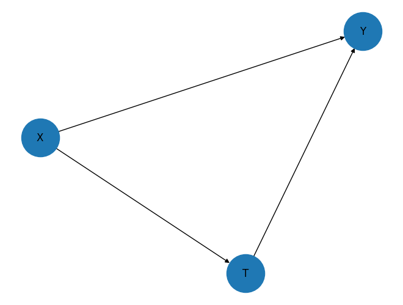
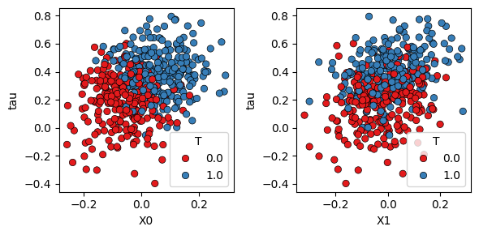
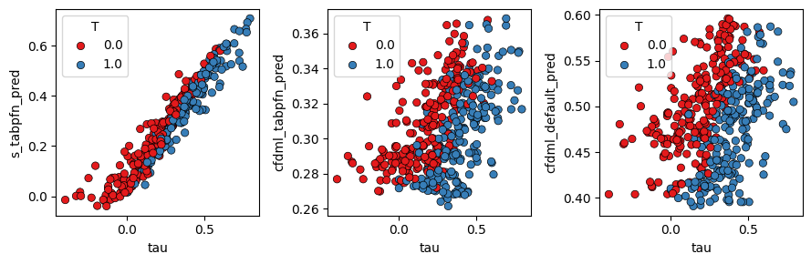

[Mohit Saharan](https://linkedin.com/in/msaharan), P13, 20260429

___

# Understanding tabular foundation models: causal inference with TabPFN

## 1. Introduction

This post continues my series on tabular foundation models. So far, I have covered the basic vocabulary of tabular foundation models in [P3](https://www.linkedin.com/posts/msaharan_20260415-tabular-foundation-models-1pdf-activity-7450221503234621441-QYwS?utm_source=share&utm_medium=member_desktop&rcm=ACoAAC8005UBr31urJ8gF7KXefP2-G8r_HNvI2g), the posterior predictive distribution in [P4](https://www.linkedin.com/posts/msaharan_20260416-understanding-tfms-ppdpdf-activity-7450580114225938432-9UYN?utm_source=share&utm_medium=member_desktop&rcm=ACoAAC8005UBr31urJ8gF7KXefP2-G8r_HNvI2g), the architecture in [P5](https://www.linkedin.com/posts/msaharan_20260417-understanding-tfm-architecture-tabpfnpdf-activity-7450946343922999318-6Lw_?utm_source=share&utm_medium=member_desktop&rcm=ACoAAC8005UBr31urJ8gF7KXefP2-G8r_HNvI2g), pre-training in [P6](https://www.linkedin.com/posts/msaharan_20260420-understanding-tfms-pretraining-synthetic-datapdf-activity-7452030755720888320-INN6?utm_source=share&utm_medium=member_desktop&rcm=ACoAAC8005UBr31urJ8gF7KXefP2-G8r_HNvI2g), the TabPFN repository in [P7](https://www.linkedin.com/posts/msaharan_20260421-understanding-tfm-tabpfn-repopdf-activity-7452397229723623425-DVO3?utm_source=share&utm_medium=member_desktop&rcm=ACoAAC8005UBr31urJ8gF7KXefP2-G8r_HNvI2g), the hands-on demo's classification and regression examples in [P8](https://www.linkedin.com/posts/msaharan_20260422-understanding-tfms-tabpfn-handson-demopdf-activity-7452807834171387904-s5Ah?utm_source=share&utm_medium=member_desktop&rcm=ACoAAC8005UBr31urJ8gF7KXefP2-G8r_HNvI2g), TabPFN Client in [P9](https://www.linkedin.com/posts/msaharan_20260423-understanding-tfm-trying-tabpfn-clientpdf-activity-7453126821384073216-2bqA?utm_source=share&utm_medium=member_desktop&rcm=ACoAAC8005UBr31urJ8gF7KXefP2-G8r_HNvI2g), TabPFN embeddings in [P10](https://www.linkedin.com/posts/msaharan_tabpfn-tabularfoundationmodels-machinelearning-activity-7453455329779941376-ymp3?utm_source=share&utm_medium=member_desktop&rcm=ACoAAC8005UBr31urJ8gF7KXefP2-G8r_HNvI2g), TabPFN's predictive behavior in [P11](https://open.substack.com/pub/dsaiengineering/p/p11-understanding-tabular-foundation?utm_campaign=post-expanded-share&utm_medium=web), and time series forecasting with TabPFN in [P12](https://open.substack.com/pub/dsaiengineering/p/p12-understanding-tabular-foundation?utm_campaign=post-expanded-share&utm_medium=web).

For a new reader, the minimum background is this: TabPFN is a pretrained tabular foundation model. Unlike XGBoost or Random Forest, its ordinary `.fit()` call does not update model weights to learn a fresh model from scratch. Instead, `.fit()` prepares the labelled rows as context for the current task, and TabPFN uses that context to predict new rows. That is why I have described TabPFN as a context-conditioned predictor throughout this series.

Today I cover the causal inference section of the official [TabPFN hands-on demo notebook](https://colab.research.google.com/github/PriorLabs/TabPFN/blob/main/examples/notebooks/TabPFN_Demo_Local.ipynb). You can find my local version of the notebook [here](https://github.com/msaharan/dsaiengineering/blob/1cda532a192c14129c7567e4a6fb789956d80292/blog/20260429-understanding-tfm-causal-inference-tabpfn.assets/tabpfn-hands-on-demo-msaharan-20260429.ipynb).

The interesting question is different from the previous posts. In classification and regression, the goal was to predict an observed target. In causal inference, the goal is to estimate what would change if we intervened. For example: if two customers have similar covariates, but one receives a treatment and the other does not, how much of the outcome difference should be attributed to the treatment rather than to pre-existing differences between the customers?

A practical caveat is important here. TabPFN does not automatically make a causal claim true. It is still a predictive model. In the notebook, TabPFN is used as a base learner inside causal estimators from `econml`. The causal identification comes from the assumptions and estimator design. TabPFN contributes flexible outcome and propensity modeling.

The notebook places this example in a broader research direction: choosing base models for CATE estimators with AutoML ([Vandershueren et al., 2025](https://openreview.net/forum?id=QbOoz74GNO)), using TabPFN as an out-of-the-box base learner in CATE pipelines ([Zhang et al., 2025](https://arxiv.org/pdf/2505.20003)), and pretraining PFN-style models directly for causal effect estimation ([Robertson et al.](https://arxiv.org/pdf/2506.06039)). I will not review those papers here. I use them as signposts for why this notebook section belongs in the TabPFN ecosystem.

The post is organized as follows:

1. Introduction: why causal inference is different from ordinary prediction.
2. Conceptual background: potential outcomes, CATE, confounding, propensity models, outcome models, and PEHE.
3. Hands-on demo: generating a synthetic CATE dataset, fitting CATE estimators with TabPFN, and reading the evaluation.
4. Summary and conclusion: what this example shows, what it does not show, and what to keep in mind.

## 2. Conceptual Background

Before going to the hands-on demo, I want to set up the concepts that make the example meaningful. This section does five things:

1. It explains why causal inference is not the same as prediction.
2. It defines potential outcomes and the conditional average treatment effect.
3. It explains the observed-confounder setting used in the notebook.
4. It shows where outcome models and propensity models enter the workflow.
5. It defines the PEHE metric used to evaluate CATE estimates in the synthetic demo.

### 2.1 Working Vocabulary

The key terms for this post are:

- Treatment: the action or exposure whose effect we want to estimate. In the notebook, this is the binary variable \(T \in \{0,1\}\).
- Outcome: the response variable affected by treatment. In the notebook, this is \(Y\).
- Covariates: observed features measured before treatment. In the notebook, these are the columns in \(X\).
- Potential outcomes: \(Y(1)\) and \(Y(0)\), the outcomes that would be observed under treatment and no treatment.
- Individual treatment effect: \(\tau_i = Y_i(1) - Y_i(0)\), the effect for one individual unit.
- CATE: the conditional average treatment effect, \(\tau(x) = \mathbb{E}[Y(1) - Y(0) | X=x]\). Here, \(\mathbb{E}\) means expectation, or the average value under the relevant probability distribution.
- Propensity score: \(e(x) = \mathbb{P}(T=1 | X=x)\), the probability of receiving treatment given covariates. Here, \(\mathbb{P}\) means probability.
- Outcome model: a model for \(\mathbb{E}[Y | T=t, X=x]\), usually estimated separately or jointly for \(t=0\) and \(t=1\).
- Confounder: a variable that affects both treatment assignment and outcome.
- Unconfoundedness: the assumption that, after conditioning on observed covariates \(X\), treatment assignment is independent of the potential outcomes.

I use \(i\) to index one row or unit, \(x\) for a specific covariate value, \(X\) for the covariate random variable or matrix depending on context, \(T\) for treatment, and \(Y\) for the observed outcome. This is consistent with the earlier posts, where lowercase symbols denote concrete values and uppercase symbols denote random variables or matrices.

In ordinary supervised learning, we usually learn a prediction rule:

$$
\hat{f}(x) \approx \mathbb{E}[Y | X=x].
$$

This is useful, but it is associational. It answers: given features \(x\), what outcome do we expect?

Causal inference asks a different question:

$$
\mathbb{E}[Y | do(T=1), X=x]
-
\mathbb{E}[Y | do(T=0), X=x].
$$

The notation \(do(T=1)\) means that treatment is set by intervention, not merely observed. This distinction matters because people who receive a treatment may differ systematically from people who do not receive it.

### 2.2 Potential Outcomes and CATE

For each unit \(i\), imagine two possible outcomes:

$$
Y_i(1) = \text{outcome for unit } i \text{ if treated},
$$

$$
Y_i(0) = \text{outcome for unit } i \text{ if not treated}.
$$

The individual treatment effect is:

$$
\tau_i = Y_i(1) - Y_i(0).
$$

The fundamental problem of causal inference is that, for a real unit, we usually observe only one of these two outcomes. If \(T_i=1\), we observe \(Y_i(1)\) and not \(Y_i(0)\). If \(T_i=0\), we observe \(Y_i(0)\) and not \(Y_i(1)\). The observed outcome is:

$$
Y_i = T_iY_i(1) + (1-T_i)Y_i(0).
$$

Since individual effects are not directly observed in ordinary data, many causal workflows estimate average effects. The object in the notebook is the conditional average treatment effect:

$$
\tau(x)
= \mathbb{E}[Y(1) - Y(0) | X=x].
$$

This tells us how the treatment effect changes across the covariate space. In other words, CATE estimation is about treatment-effect heterogeneity.

This is different from the average treatment effect, which averages over the population:

$$
\text{ATE} = \mathbb{E}[Y(1) - Y(0)].
$$

If the treatment effect is the same for everyone, CATE and ATE carry similar information. If the effect varies by \(X\), CATE is more informative because it tells us where the treatment works more or less strongly.

The same object can be written using the intervention notation:

$$
\tau(x)
= \mathbb{E}[Y | do(T=1), X=x]
- \mathbb{E}[Y | do(T=0), X=x].
$$

This is the equation shown in the notebook's causal inference section. The point is not only to predict \(Y\). The point is to compare two counterfactual worlds for the same covariate profile \(x\).

### 2.3 Confounding and Identification

The notebook uses a simple observed-confounder graph:



The graph has three arrows:

- \(X \rightarrow T\): covariates affect treatment assignment.
- \(X \rightarrow Y\): covariates affect the outcome.
- \(T \rightarrow Y\): treatment affects the outcome.

This is a confounded observational setting because \(X\) affects both \(T\) and \(Y\). If we ignore \(X\), the observed association between \(T\) and \(Y\) mixes at least two effects:

1. The causal effect of treatment on outcome.
2. The pre-existing difference in covariates between treated and untreated units.

The notebook is constructed so that all confounding is observed in \(X\). This is the setting where the unconfoundedness assumption can hold:

$$
(Y(0), Y(1)) \perp\!\!\!\perp T | X.
$$

Here, \(\perp\!\!\!\perp\) means statistical independence, and the vertical bar \(|\) means "conditional on." So this expression says that, after conditioning on \(X\), treatment assignment behaves as if it were independent of the two potential outcomes.

In practice, this is a strong assumption. It cannot be guaranteed by using TabPFN, XGBoost, Random Forest, or any other predictive model. It is a causal assumption about the data-generating process. In randomized experiments, randomization can help justify it. In observational data, it depends on whether the relevant confounders were measured and adjusted for.

The consistency assumption is also needed. It says that the observed outcome equals the potential outcome under the treatment actually received:

$$
Y = Y(T).
$$

So, if \(T=1\), the observed outcome is \(Y(1)\), and if \(T=0\), the observed outcome is \(Y(0)\).

There is another important assumption called overlap or positivity:

$$
0 < \mathbb{P}(T=1 | X=x) < 1.
$$

This means that for the covariate profiles we care about, there must be some treated and some untreated examples. If everyone with a certain covariate profile always receives treatment, then we do not have empirical support for the untreated counterfactual in that region.

For a binary treatment, under assumptions such as consistency, unconfoundedness, and overlap, the CATE can be identified from observed data:

$$
\tau(x)
= \mathbb{E}[Y | T=1, X=x]
- \mathbb{E}[Y | T=0, X=x].
$$

This equation is where predictive modeling enters the workflow. We need to estimate conditional outcome functions from data.

### 2.4 Outcome Models, Propensity Models, and TabPFN

Many CATE estimators use one or both of the following nuisance models:

$$
m_t(x) = \mathbb{E}[Y | T=t, X=x],
$$

$$
e(x) = \mathbb{P}(T=1 | X=x).
$$

Here, \(m_t(x)\) is an outcome model and \(e(x)\) is a propensity model. They are called nuisance models because they are not always the final object of interest, but the causal estimator uses them to estimate the treatment effect.

This is exactly where TabPFN can be useful. TabPFN is a pretrained tabular model that can serve as:

- a regression model for the outcome \(Y\);
- a classification model for the treatment \(T\);
- a flexible base learner inside a causal estimator.

The notebook uses TabPFN in two ways:

1. As the overall model in an S-learner.
2. As the outcome and treatment model inside `CausalForestDML`.

The S-learner fits one model for the outcome:

$$
\hat{m}(x,t) \approx \mathbb{E}[Y | X=x, T=t].
$$

Then it estimates CATE by changing only the treatment input:

$$
\hat{\tau}(x) = \hat{m}(x,1) - \hat{m}(x,0).
$$

This is simple and intuitive. The same fitted outcome model is asked two counterfactual prediction questions.

The `CausalForestDML` approach uses a different strategy. At a high level, double machine learning first estimates nuisance components such as the baseline outcome model and treatment model, then uses residualized variation to estimate treatment effects. A simplified residual idea is:

$$
\tilde{Y} = Y - \hat{g}(X),
$$

$$
\tilde{T} = T - \hat{e}(X).
$$

Here, \(g(x) = \mathbb{E}[Y|X=x]\) is the baseline outcome function, \(\hat{g}(X)\) is its estimate, and \(\hat{e}(X)\) is the estimated treatment propensity. The final stage then uses the part of \(Y\) and \(T\) not already explained by \(X\) to estimate heterogeneous treatment effects. The causal forest part allows the treatment effect to vary over the feature space.

The important point for this post is: TabPFN is not replacing causal identification. It is replacing or supporting the predictive sub-models inside the causal pipeline.

This split is useful for practitioners who already know supervised ML. The causal workflow is mostly familiar model-fitting machinery, but used for a different target:

- Standard supervised ML part: fit flexible models for outcomes or treatment assignment from tabular data.
- Causal inference part: decide whether the graph and assumptions justify interpreting adjusted differences as causal effects.
- TabPFN-specific part: use a pretrained, context-conditioned tabular model as a strong default base learner without training a fresh task-specific model from scratch.

So the new capability is not "causality from TabPFN." The practical capability is that a tabular foundation model can be plugged into existing causal estimators as a low-tuning base learner for the predictive components.

### 2.5 PEHE

Since the notebook uses synthetic data, the true CATE \(\tau(x)\) is known. That means we can evaluate the estimated CATE directly. The metric used is PEHE, which stands for precision in estimation of heterogeneous effects.

For test points \(x_1,\ldots,x_n\), PEHE is:

$$
\text{PEHE}
= \sqrt{
\frac{1}{n}
\sum_{i=1}^{n}
(\hat{\tau}(x_i) - \tau(x_i))^2
}.
$$

This is simply the root mean squared error between the estimated treatment effect and the true treatment effect. Lower PEHE is better.

In real observational data, we usually do not know \(\tau(x)\), so PEHE cannot be computed directly. That is why synthetic examples are useful for learning: they let us test whether the estimator can recover a known causal effect under a controlled data-generating process.

## 3. Hands-on Demo

The conceptual background prepared us for the notebook example. The causal section of the notebook does four things:

1. It creates a synthetic observed-confounder setting.
2. It generates potential outcomes and a true CATE value for each row.
3. It fits three CATE estimators.
4. It compares the estimated CATE values with the known true values using PEHE.

The full notebook contains the install commands and imports. Below, I show the parts that matter for understanding the workflow.

### 3.1 Generating the Causal Graph

The notebook first draws the graph:

```python
import networkx as nx

edges = [["X", "Y"], ["T", "Y"], ["X", "T"]]
graph = nx.DiGraph(edges)
nx.draw(graph, with_labels=True, node_size=2000)
```

This graph makes the identification setup explicit. \(X\) affects treatment assignment, \(X\) also affects the outcome, and treatment affects the outcome. So a naive comparison of treated and untreated outcomes would be confounded.

The reason the example is still manageable is that \(X\) is observed. The causal estimator can adjust for \(X\).

### 3.2 Creating the Synthetic CATE Dataset

The notebook creates a dataset with 500 rows and 5 covariates:

```python
import numpy as np

num_samples, num_features, train_test_split = 500, 5, 75

noise_scale = 0.01
exogenous_scale = 0.1
heterogeneity_scale = 2

X = np.random.normal(loc=0, scale=exogenous_scale, size=(num_samples, num_features)).astype(np.float32)
prop_eps = np.random.normal(loc=0, scale=noise_scale, size=(num_samples)).astype(np.float32)
Y_eps = np.random.normal(loc=0, scale=noise_scale, size=(num_samples)).astype(np.float32)

w_X_Y = np.random.uniform(size=num_features)
w_X_T = np.random.uniform(size=num_features)
w_X_T_effect = np.random.uniform(size=num_features)

T_0 = np.zeros(shape=num_samples).astype(np.float32)
T_1 = np.ones(shape=num_samples).astype(np.float32)

base_X_Y = np.sum(w_X_Y * X, axis=1)
base_X_T = np.sum(w_X_T * X, axis=1)
heterogeneity_term = np.sum(w_X_T_effect * X, axis=1)

propensity = np.sin(base_X_T) + prop_eps
T = (propensity > propensity.mean()).astype(np.float32)

Y_0 = np.cos(base_X_Y) + np.sin(0.3 * T_0) + Y_eps
Y_1 = np.cos(base_X_Y) + np.sin(0.3 * T_1 + heterogeneity_scale * heterogeneity_term) + Y_eps

Y = Y_0 * (1 - T) + Y_1 * T
tau = Y_1 - Y_0
```

Here, `train_test_split` is the notebook's variable name for the number of training rows. It is not the `train_test_split` function from `sklearn`.

The treatment assignment depends on \(X\) through `base_X_T`, which is why \(X \rightarrow T\) appears in the graph. The outcome depends on \(X\) through `base_X_Y`, which is why \(X \rightarrow Y\) appears. The treated and untreated potential outcomes differ through the treatment term, which is why \(T \rightarrow Y\) appears.

This code is useful because it makes the hidden causal quantities visible. In real data, we would observe \(X\), \(T\), and \(Y\), but not both \(Y_0\) and \(Y_1\). In this synthetic dataset, we know both potential outcomes, so we can compute:

$$
\tau = Y_1 - Y_0.
$$

The notebook stores this row-level ground truth treatment effect as `tau`. In this synthetic construction, `tau` is the target used to evaluate how well the estimators recover the heterogeneous treatment effect.

The following plot shows the true treatment-effect heterogeneity against two features, with points colored by observed treatment assignment:

```python
import pandas as pd
import seaborn as sns
import matplotlib.pyplot as plt

df = pd.DataFrame({**{f"X{i}": X[:, i] for i in range(num_features)}, "T": T, "Y": Y, "Y_0": Y_0, "Y_1": Y_1, "tau": tau})
fig, axes = plt.subplots(ncols=2, figsize=(6, 3))
sns.scatterplot(data=df, x="X0", y="tau", hue="T", ax=axes[0], edgecolor="black", palette="Set1")
sns.scatterplot(data=df, x="X1", y="tau", hue="T", ax=axes[1], edgecolor="black", palette="Set1")
fig.tight_layout()
```



The treatment effect is not constant. It changes with the covariates. This is what makes the task a CATE estimation task rather than only an average treatment effect estimation task.

The notebook then creates a train/test split:

```python
perm = np.random.permutation(num_samples)
train_idx, test_idx = perm[:train_test_split], perm[train_test_split:]
X_train, X_test = X[train_idx], X[test_idx]
Y_train, Y_test = Y[train_idx], Y[test_idx]
T_train, T_test = T[train_idx], T[test_idx]
tau_test = tau[test_idx]
```

In this run, the training set has only 75 rows and the test set has 425 rows. That makes the example a useful small-data setting for TabPFN.

### 3.3 Fitting CATE Estimators with TabPFN

The notebook compares three estimators:

- `s_tabpfn`: an S-learner using `TabPFNRegressor` as the overall outcome model.
- `cfdml_tabpfn`: `CausalForestDML` using `TabPFNRegressor` for the outcome model and `TabPFNClassifier` for the treatment model.
- `cfdml_default`: `CausalForestDML` with its default nuisance models.

The imports are:

```python
from econml.metalearners import SLearner
from econml.dml import CausalForestDML
from tabpfn import TabPFNClassifier, TabPFNRegressor
```

The S-learner is fitted as:

```python
s_tabpfn = SLearner(overall_model=TabPFNRegressor())

s_tabpfn.fit(Y=Y_train, X=X_train, T=T_train)
s_tabpfn_cate = s_tabpfn.effect(X=X_test)
```

Conceptually, this estimates a single outcome function \(\hat{m}(x,t)\), then evaluates the difference:

$$
\hat{\tau}(x) = \hat{m}(x,1) - \hat{m}(x,0).
$$

The TabPFN-backed causal forest is fitted as:

```python
cfdml_tabpfn = CausalForestDML(model_y=TabPFNRegressor(), model_t=TabPFNClassifier(), discrete_treatment=True)

cfdml_tabpfn.fit(Y=Y_train, X=X_train, T=T_train)
cfdml_tabpfn_cate = cfdml_tabpfn.effect(X=X_test)
```

Here, TabPFN is used for the nuisance models. The final heterogeneous treatment-effect estimation is handled by `CausalForestDML`.

The default comparison is:

```python
cfdml_default = CausalForestDML(discrete_treatment=True)

cfdml_default.fit(Y=Y_train, X=X_train, T=T_train)
cfdml_default_cate = cfdml_default.effect(X=X_test)
```

This comparison is useful because it separates two questions:

1. Does TabPFN work well as a direct base learner in a simple meta-learner?
2. Does TabPFN improve the nuisance-modeling stage inside a more structured causal estimator?

### 3.4 Evaluating CATE Recovery

Since the synthetic data contains the true test-set treatment effect `tau_test`, the notebook computes PEHE:

```python
from sklearn.metrics import root_mean_squared_error

s_tabpfn_pehe = root_mean_squared_error(tau_test, s_tabpfn_cate)
cfdml_tabpfn_pehe = root_mean_squared_error(tau_test, cfdml_tabpfn_cate)
cfdml_default_pehe = root_mean_squared_error(tau_test, cfdml_default_cate)

print(f"s_tabpfn PEHE: {s_tabpfn_pehe}")
print(f"cfdml_tabpfn PEHE: {cfdml_tabpfn_pehe}")
print(f"cfdml_default PEHE: {cfdml_default_pehe}")
```

In my notebook run, the output was:

- `s_tabpfn` PEHE: 0.0715.
- `cfdml_tabpfn` PEHE: 0.1956.
- `cfdml_default` PEHE: 0.2803.

Lower PEHE means better recovery of the true heterogeneous treatment effect. In this run, the S-learner with TabPFN performs best.

The final plot compares the true CATE on the x-axis with each model's predicted CATE on the y-axis:

```python
df_test = pd.DataFrame({"T": T_test, "Y": Y_test, "tau": tau_test, **{f"X{i}": X_test[:, i] for i in range(num_features)}})
df_test["s_tabpfn_pred"], df_test["cfdml_tabpfn_pred"], df_test["cfdml_default_pred"] = s_tabpfn_cate, cfdml_tabpfn_cate, cfdml_default_cate

fig, axes = plt.subplots(ncols=3, figsize=(9, 3))
sns.scatterplot(data=df_test, x="tau", y="s_tabpfn_pred", hue="T", ax=axes[0], edgecolor="black", palette="Set1")
sns.scatterplot(data=df_test, x="tau", y="cfdml_tabpfn_pred", hue="T", ax=axes[1], edgecolor="black", palette="Set1")
sns.scatterplot(data=df_test, x="tau", y="cfdml_default_pred", hue="T", ax=axes[2], edgecolor="black", palette="Set1")
fig.tight_layout()
```



The left panel shows that `s_tabpfn_pred` closely tracks the true \(\tau\). The middle and right panels show more compressed and noisier estimates for the two causal forest variants in this particular run.

This result should be read as a controlled notebook example, not as a general benchmark. The notebook uses a small synthetic dataset, no fixed random seed in the shown code, and one data-generating process. What it shows is narrower but still useful: in this setting, TabPFN can be a strong base learner for recovering a smooth heterogeneous treatment effect from a small context dataset.

For a stronger evaluation template, I would add two diagnostics:

1. Add a diagonal \(y=x\) reference line to the predicted-vs-true CATE plots.
2. Repeat the experiment over many random seeds and report mean PEHE with uncertainty intervals.

That would make the comparison more stable and easier to read.

## 4. Summary and Conclusion

In this post, I used the causal inference section of the official TabPFN hands-on demo to understand how TabPFN can be used inside CATE estimation workflows.

The conceptual section separated prediction from causal inference. Ordinary supervised learning estimates associations such as \(\mathbb{E}[Y|X=x]\). Causal inference asks intervention questions such as \(\mathbb{E}[Y|do(T=1),X=x] - \mathbb{E}[Y|do(T=0),X=x]\). This distinction is the main reason we needed potential outcomes, confounding, unconfoundedness, overlap, outcome models, and propensity models before reading the code.

The hands-on demo then created a synthetic observed-confounder setting with \(X \rightarrow T\), \(X \rightarrow Y\), and \(T \rightarrow Y\). Because the data were synthetic, the notebook had access to both potential outcomes \(Y_0\) and \(Y_1\), so it could compute the true CATE \(\tau = Y_1 - Y_0\). That made PEHE available as a direct evaluation metric.

The notebook compared three estimators: an S-learner using TabPFN, a `CausalForestDML` estimator using TabPFN for nuisance models, and a default `CausalForestDML` estimator. In my run, the S-learner with TabPFN had the lowest PEHE and the clearest predicted-vs-true CATE pattern.

The main takeaway is not that TabPFN solves causal inference by itself. It does not. The causal assumptions still matter. The estimator still matters. The graph still matters. What TabPFN may offer is a strong tabular base learner for the predictive subproblems inside causal estimators, especially in small-to-medium tabular settings where ordinary model selection and tuning can become tedious.

This also connects back to the pre-training discussion from P6. TabPFN's synthetic pretraining already uses structural causal models as part of the prior over tabular tasks. The current demo uses TabPFN as a base model inside standard CATE estimators. The next step in the field is even more direct: pretraining PFN-style models specifically for causal effect estimation, such as the Do-PFN direction mentioned in the notebook.

With this post, I have covered another remaining section of the TabPFN hands-on demo. In the upcoming posts, I will continue exploring the parts of the TabPFN ecosystem that are most relevant for practical tabular data workflows: when TabPFN should be used directly, when it should be used as a component inside a larger method, and when classical tabular ML remains the simpler choice.
