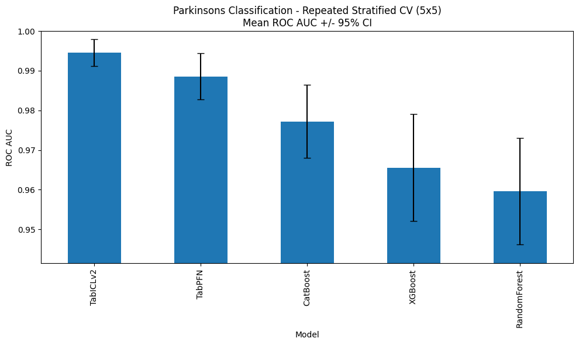
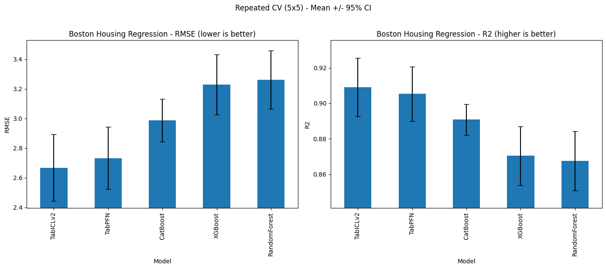
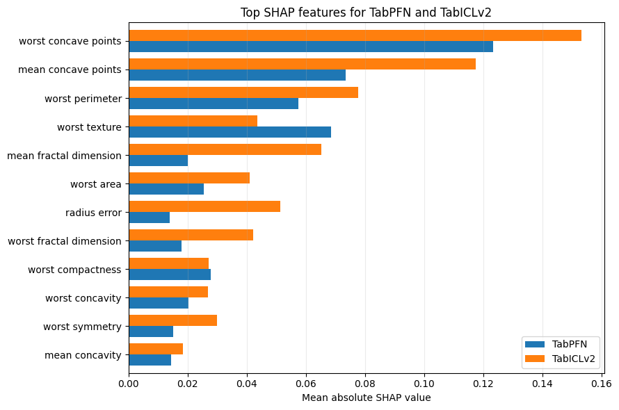
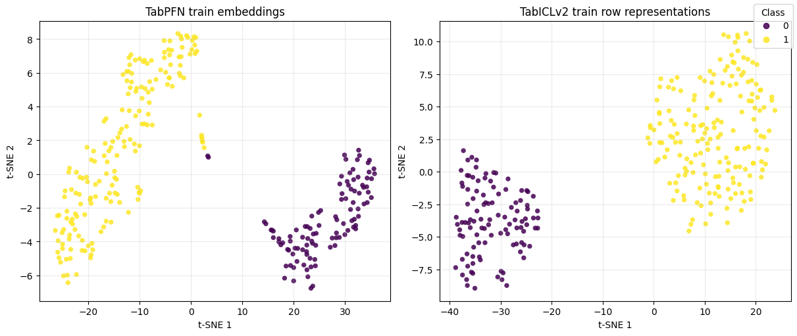
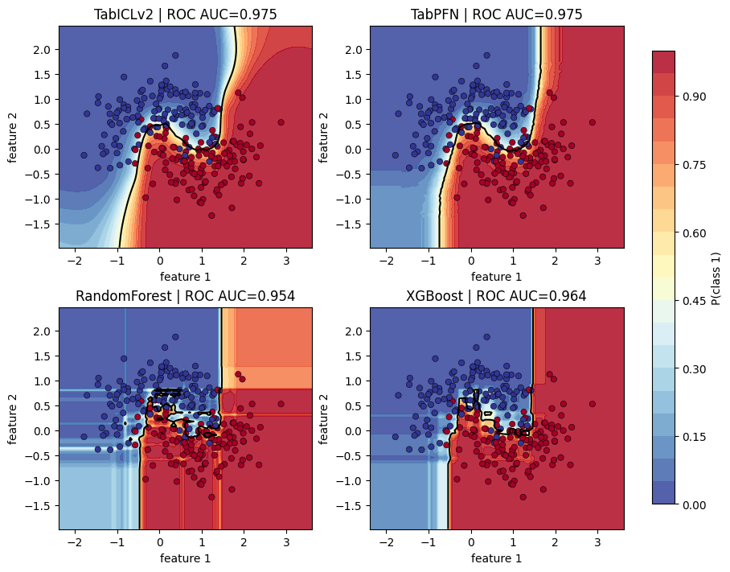
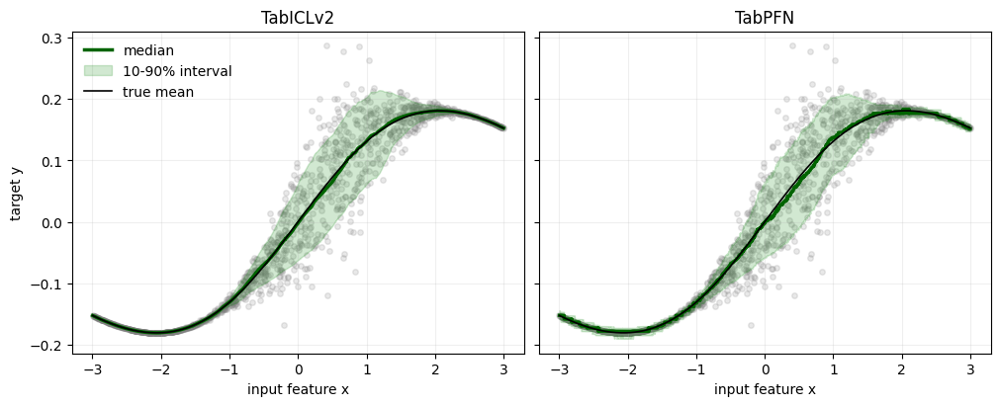

[Mohit Saharan](https://linkedin.com/in/msaharan), P14, 20260430

___

# Tabular foundation models - comparing TabPFN, TabICL and supervised ML models (getting started)

This post continues my series on tabular foundation models. So far, I have covered the basic vocabulary of tabular foundation models in [P3](https://www.linkedin.com/posts/msaharan_20260415-tabular-foundation-models-1pdf-activity-7450221503234621441-QYwS?utm_source=share&utm_medium=member_desktop&rcm=ACoAAC8005UBr31urJ8gF7KXefP2-G8r_HNvI2g), the posterior predictive distribution in [P4](https://www.linkedin.com/posts/msaharan_20260416-understanding-tfms-ppdpdf-activity-7450580114225938432-9UYN?utm_source=share&utm_medium=member_desktop&rcm=ACoAAC8005UBr31urJ8gF7KXefP2-G8r_HNvI2g), the architecture in [P5](https://www.linkedin.com/posts/msaharan_20260417-understanding-tfm-architecture-tabpfnpdf-activity-7450946343922999318-6Lw_?utm_source=share&utm_medium=member_desktop&rcm=ACoAAC8005UBr31urJ8gF7KXefP2-G8r_HNvI2g), pre-training in [P6](https://www.linkedin.com/posts/msaharan_20260420-understanding-tfms-pretraining-synthetic-datapdf-activity-7452030755720888320-INN6?utm_source=share&utm_medium=member_desktop&rcm=ACoAAC8005UBr31urJ8gF7KXefP2-G8r_HNvI2g), the TabPFN repository in [P7](https://www.linkedin.com/posts/msaharan_20260421-understanding-tfm-tabpfn-repopdf-activity-7452397229723623425-DVO3?utm_source=share&utm_medium=member_desktop&rcm=ACoAAC8005UBr31urJ8gF7KXefP2-G8r_HNvI2g), the hands-on demo's classification and regression examples in [P8](https://www.linkedin.com/posts/msaharan_20260422-understanding-tfms-tabpfn-handson-demopdf-activity-7452807834171387904-s5Ah?utm_source=share&utm_medium=member_desktop&rcm=ACoAAC8005UBr31urJ8gF7KXefP2-G8r_HNvI2g), TabPFN Client in [P9](https://www.linkedin.com/posts/msaharan_20260423-understanding-tfm-trying-tabpfn-clientpdf-activity-7453126821384073216-2bqA?utm_source=share&utm_medium=member_desktop&rcm=ACoAAC8005UBr31urJ8gF7KXefP2-G8r_HNvI2g), TabPFN embeddings in [P10](https://www.linkedin.com/posts/msaharan_tabpfn-tabularfoundationmodels-machinelearning-activity-7453455329779941376-ymp3?utm_source=share&utm_medium=member_desktop&rcm=ACoAAC8005UBr31urJ8gF7KXefP2-G8r_HNvI2g), TabPFN's predictive behavior in [P11](https://open.substack.com/pub/dsaiengineering/p/p11-understanding-tabular-foundation?utm_campaign=post-expanded-share&utm_medium=web), time series forecasting with TabPFN in [P12](https://open.substack.com/pub/dsaiengineering/p/p12-understanding-tabular-foundation?utm_campaign=post-expanded-share&utm_medium=web), and using TabPFN for causal inference in [P13](https://open.substack.com/pub/dsaiengineering/p/p13-understanding-tabular-foundation?utm_campaign=post-expanded-share&utm_medium=web).

For a new reader, the minimum background is this: TabPFN is a pretrained tabular foundation model. Unlike XGBoost or Random Forest, its ordinary `.fit()` call does not update model weights to learn a fresh model from scratch. Instead, `.fit()` prepares the labelled rows as context for the current task, and TabPFN uses that context to predict new rows. That is why I have described TabPFN as a context-conditioned predictor throughout this series. 

In previous posts, I completed the examples given in TabPFN's hands-on demo notebook, except for unsupervised learning, which I left out intentionally. Today, I moved on to TabICLv2, which is a different tabular foundational model. I chose TabICLv2 because it's almost as good as TabPFN and is free and open source, whereas TabPFN requiresc commercial license.

TabICLv2's GitHub repository contains examples that demonstrate its usability, but there's no comprehensive Jupyter notebook, and I felt that the examples are also basic. To test TabICLv2 and learn the similarities and differences between TabPFN and TabICL, I felt I first needed to develop a testbench, so today I created a Jupyter notebook containing the TabPFN-related code from my previous notebooks and the TabICL code from their GH repo. You can find the notebook [here](https://github.com/msaharan/dsaiengineering/blob/b3976b9d53bcfefc870fb355f9390aae9621290a/blog/20260430-understanding-tfm-tabpfn-tabicl-supml.assets/tfm-tabpfn-tabicl-supml-20260430.ipynb) in my GitHub repo. 

## Using the Notebook

To use the notebook, you can download it from my GH repo and run it in Kaggle. Once you open Kaggle, - you can create a notebook as follows, 

and import my notebook.

Make sure to use the GPU because both TabPFN and TabICL are extremely slow on CPU.

Once you have the setup ready, you would need Prior Labs' API token to download the weights of TabPFN andand Hugging Face access token (optional) to download TabICL. You can specify them in Kaggle secrets, and they will be imported automatically when the notebook runs.

The secrets are always available on Kaggle (privately, only to you). So once you set them, you can always import any notebook I share on GitHub and use it immediately with your secrets.

## Contents

The first four sections (0-3) of the notebook contain the code from my previous posts. I felt the examples given in TabICL repository were not as good as the ones I looked at in previous posts. Since I had already worked on making the classification, regression, and model interpretability (SHAP and embeddings) examples work in the previous posts, I thought I would use them here and include TabICL instead of reinventing new examples. So that's what I did today. I will show the plots below.

The examples in section 4 and 5 are from the TabICL repository. For now, I only added them here and made them work. I will look into the details in future posts. 

### Classification and Regression

The following figures show the comparison of all the models for classification and regression tasks. I verified that the performance of TabPFN and other classical ML models is consistent with the previous blog posts. TabICL shows improvement compared to TabPFN, but the difference is statistically insignificant. However, please keep in mind that this (and other observations mentioned below) is a preliminary observation, and I plan to look into the details in future posts.

### Model Interpretability: SHAP and Embeddings

For now, I think there's no need to comment on the SHAP plot other than the fact that this plot is a different format from the previous blog posts to enable the side-by-side comparison. I could look into the SHAP performance comparison in future posts, but I don't think this is a priority, for now. 

The embeddings section highlighted an important point. While TabPFN exposes embeddings through `TabPFNEmbedding`, TabICLv2 does not currently expose the same public embedding API. However, it can cache row representations when `kv_cache="repr"` is used, and this was used to produce the comparison shown below.

### Probability Surfaces

The following figure shows how each classifier distributes class probability across a noisy two-dimensional input space. the point is not to ask which model has the best score, but how each model behaves between observed training points. For now, I won't go into the details and leave them for future posts.

### Quantile Regression

The following figure shows the comparison of predictive intervals on a regression problem. Again, I will discuss the details in future post.

## Closing Thoughts

I am happy to have moved on from TabPFN to TabICL. Today, I shared only the code because it took me the whole time I allocate to this work to get the code set up, working, and refined. I will go deeper in comparing TabPFN and TabICL in future posts. In the meantime, I encourage you to play with the notebook so that you will better understand the upcoming posts. It takes just a few minutes to get these notebooks up and running in Kaggle, so you have no reason not to try. Once you do, let me know in the comments what you think of these models and the modifications you made.
