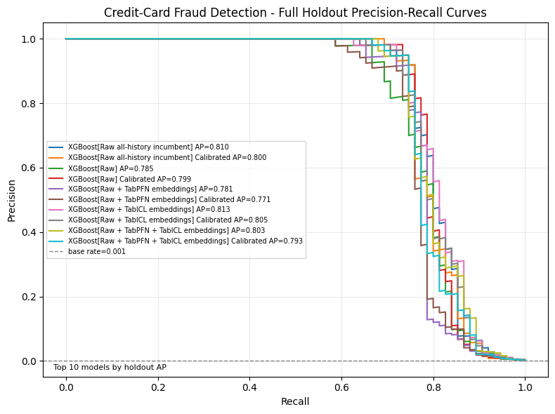
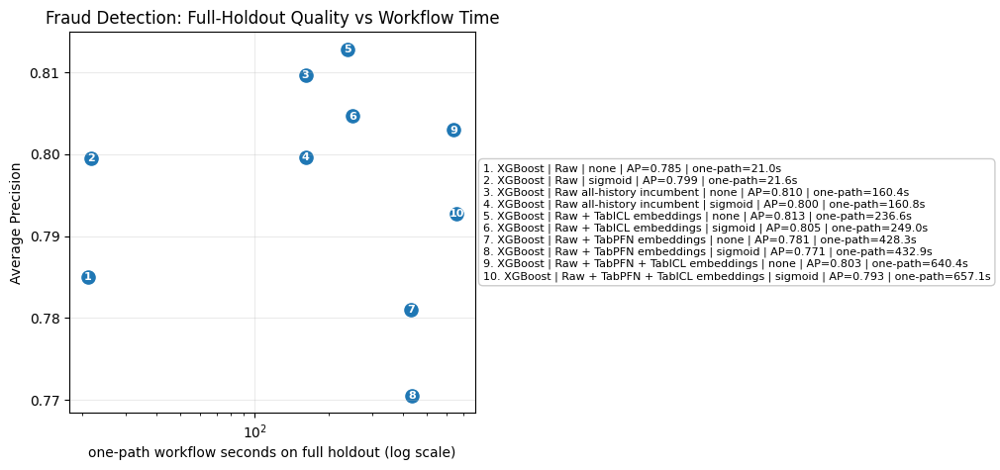
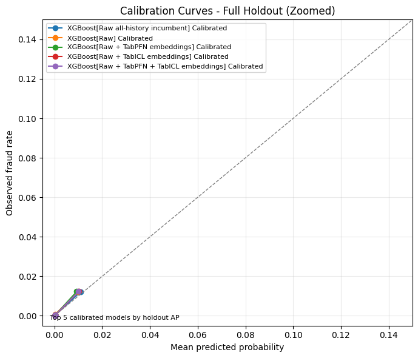

[Mohit Saharan](https://linkedin.com/in/msaharan), P16, 20260504

___

# TabPFN and TabICL embeddings for fraud-detection workflows

This post continues my series on tabular foundation models. So far, I have covered the basic vocabulary of tabular foundation models in [P3](https://www.linkedin.com/posts/msaharan_20260415-tabular-foundation-models-1pdf-activity-7450221503234621441-QYwS?utm_source=share&utm_medium=member_desktop&rcm=ACoAAC8005UBr31urJ8gF7KXefP2-G8r_HNvI2g), the posterior predictive distribution in [P4](https://www.linkedin.com/posts/msaharan_20260416-understanding-tfms-ppdpdf-activity-7450580114225938432-9UYN?utm_source=share&utm_medium=member_desktop&rcm=ACoAAC8005UBr31urJ8gF7KXefP2-G8r_HNvI2g), the architecture in [P5](https://www.linkedin.com/posts/msaharan_20260417-understanding-tfm-architecture-tabpfnpdf-activity-7450946343922999318-6Lw_?utm_source=share&utm_medium=member_desktop&rcm=ACoAAC8005UBr31urJ8gF7KXefP2-G8r_HNvI2g), pre-training in [P6](https://www.linkedin.com/posts/msaharan_20260420-understanding-tfms-pretraining-synthetic-datapdf-activity-7452030755720888320-INN6?utm_source=share&utm_medium=member_desktop&rcm=ACoAAC8005UBr31urJ8gF7KXefP2-G8r_HNvI2g), the TabPFN repository in [P7](https://www.linkedin.com/posts/msaharan_20260421-understanding-tfm-tabpfn-repopdf-activity-7452397229723623425-DVO3?utm_source=share&utm_medium=member_desktop&rcm=ACoAAC8005UBr31urJ8gF7KXefP2-G8r_HNvI2g), the hands-on demo's classification and regression examples in [P8](https://www.linkedin.com/posts/msaharan_20260422-understanding-tfms-tabpfn-handson-demopdf-activity-7452807834171387904-s5Ah?utm_source=share&utm_medium=member_desktop&rcm=ACoAAC8005UBr31urJ8gF7KXefP2-G8r_HNvI2g), TabPFN Client in [P9](https://www.linkedin.com/posts/msaharan_20260423-understanding-tfm-trying-tabpfn-clientpdf-activity-7453126821384073216-2bqA?utm_source=share&utm_medium=member_desktop&rcm=ACoAAC8005UBr31urJ8gF7KXefP2-G8r_HNvI2g), TabPFN embeddings in [P10](https://www.linkedin.com/posts/msaharan_tabpfn-tabularfoundationmodels-machinelearning-activity-7453455329779941376-ymp3?utm_source=share&utm_medium=member_desktop&rcm=ACoAAC8005UBr31urJ8gF7KXefP2-G8r_HNvI2g), TabPFN's predictive behavior in [P11](https://open.substack.com/pub/dsaiengineering/p/p11-understanding-tabular-foundation?utm_campaign=post-expanded-share&utm_medium=web), time series forecasting with TabPFN in [P12](https://open.substack.com/pub/dsaiengineering/p/p12-understanding-tabular-foundation?utm_campaign=post-expanded-share&utm_medium=web), using TabPFN for causal inference in [P13](https://open.substack.com/pub/dsaiengineering/p/p13-understanding-tabular-foundation?utm_campaign=post-expanded-share&utm_medium=web), comparing TabPFN, TabICL, and supervised ML models in [P14](https://open.substack.com/pub/dsaiengineering/p/p14-tabular-foundation-models-comparing?utm_campaign=post-expanded-share&utm_medium=web), and using TabPFN and TabICL directly for fraud detection in [P15](https://open.substack.com/pub/dsaiengineering/p/p15-tabpfn-and-tabicl-for-fraud-detection?r=535odk&utm_campaign=post-expanded-share&utm_medium=web).

P15 used the public credit-card fraud dataset to compare TabPFN, TabICL, Logistic Regression, and XGBoost as direct fraud scorers. That is a useful first question, but it is not the most practical industry question. Many teams already have classical ML workflows in production, and tabular foundation models can be expensive at inference time. So the more relevant question is: can these models improve an existing workflow without replacing the production scorer?

This notebook is built around that question. TabPFN and TabICL are not used as direct fraud scorers. Instead, they are used as offline representation models. They see an earlier labelled context, generate row embeddings, and those embeddings are appended to the raw features. The downstream fraud scorer remains GPU-accelerated XGBoost. In other words, the notebook asks whether a practical classical fraud workflow becomes stronger when we add TabPFN and TabICL embeddings as additional features.

You can find the notebook [in my GitHub repository](https://github.com/msaharan/dsaiengineering/blob/main/blog/20260504-tabpfn-tabicl-embeddings-fraud-det-workflows.assets/tabpfn-tabicl-fraud-detection-20260504.ipynb), and you can also [clone it directly on Kaggle](https://www.kaggle.com/code/msaharan/tabpfn-tabicl-fraud-detection-20260504). The notebook is meant to be run on Kaggle with GPU enabled. It installs cuDF for pandas acceleration, uses CUDA for TabPFN and TabICL, and uses a CuPy-backed XGBoost path so that the downstream scorer also runs on GPU.

## Conceptual background

### The practical question

In many tabular ML systems, especially in fraud, credit risk, churn, pricing, and transaction monitoring, the production model is often a classical supervised model. XGBoost, LightGBM, CatBoost, Random Forest, and Logistic Regression remain common because they are fast, stable, easy to monitor, and familiar to data teams.

Tabular foundation models are interesting because they can learn useful representations from tabular data. But for an industry team, replacing an existing production scorer is a high bar. A replacement model has to be better, fast enough, stable under drift, explainable enough for the decision process, compatible with existing feature stores and monitoring, and acceptable under licensing and infrastructure constraints.

The notebook uses a lower-friction integration pattern:

1. Keep the production-style downstream model as XGBoost.
2. Use TabPFN and TabICL offline to generate row embeddings.
3. Append those embeddings to the raw transaction features.
4. Compare XGBoost trained on raw features against XGBoost trained on raw + embedding features.

This is closer to how a team might pilot tabular foundation models without rebuilding its whole fraud system.

Before looking at the dataset and results, it is useful to make the integration point precise. The downstream model is still ordinary supervised ML. The tabular foundation model contribution is an extra representation step before XGBoost.

### Where tabular foundation model embeddings enter the supervised workflow

For a supervised model such as XGBoost, the workflow is familiar. We start with raw features \(x_i\) for transaction \(i\), a binary label \(y_i \in \{0,1\}\), and train a task-specific model

$$
\hat{p}_i = h_\theta(x_i)
$$

where \(\hat{p}_i\) is the predicted fraud score or fraud probability, and \(\theta\) represents the parameters learned from this dataset.

That part is still present in this notebook. XGBoost remains the downstream supervised model. The new part is the feature-generation step before XGBoost.

A tabular foundation model (TFM) is a pretrained model intended to work across many tabular tasks. In this notebook, TabPFN and TabICL are given an earlier labelled context

$$
C = \{(x_j, y_j)\}_{j=1}^{m}
$$

where \(j\) indexes the context rows and \(m\) is the number of rows in the context set. An embedding is a dense numerical vector that represents how a model internally encodes a row. The TFM maps a later row \(x_i\) into an embedding vector

$$
z_i = f_{\text{TFM}}(x_i; C)
$$

where \(f_{\text{TFM}}\) is the embedding function after conditioning on \(C\), and \(z_i\) is the resulting representation produced for row \(i\). The downstream XGBoost model is then trained on an augmented feature vector:

$$
\tilde{x}_i = [x_i, z_i]
$$

where the brackets mean feature concatenation. So the similarity to ordinary supervised ML is that we still train and evaluate a supervised fraud model with labels, validation data, calibration data, and a future holdout. The difference is that the model receives additional representation features from a pretrained context-conditioned tabular model. That embedding-generation capability is the part that comes from TabPFN and TabICL.

### Dataset

The notebook uses a public copy of the credit-card fraud dataset loaded from TensorFlow's storage bucket. It contains:

- 284,807 transactions;
- 492 fraud transactions;
- 284,315 non-fraud transactions;
- a fraud rate of about 0.1727%;
- anonymized PCA-style features `V1` to `V28`;
- `Amount`;
- `Time`;
- the binary target `Class`.

This is not a perfect production dataset. The features are anonymized, and there are no customer, card, merchant, device, or account identifiers. That limits what we can test. For example, a production fraud model should usually check entity-level leakage, delayed labels, future aggregate features, and drift by customer or merchant segment. This public dataset does not expose enough raw business context for that.

Even with those limitations, it is useful for this notebook because it has the basic shape of a fraud problem: severe class imbalance, a time column, and a binary rare-event target.

### Fraud detection is a ranking problem before it is a classification problem

Because the target is so rare, metric choice matters before model choice. A model can look good under a broad metric and still be useless for an alert queue.

Accuracy is not a useful headline metric here. A model that predicts "not fraud" for every transaction would be more than 99% accurate, but it would catch no fraud.

The more useful deployment question is whether the model ranks fraud cases near the top of the risk queue. This is why the notebook focuses on precision, recall, Average Precision, and alert counts.

For binary labels:

$$
\text{Precision} = \dfrac{TP}{TP + FP}
$$

$$
\text{Recall} = \dfrac{TP}{TP + FN}
$$

Here, \(TP\) means true positives, \(FP\) means false positives, and \(FN\) means false negatives.

Precision asks: among the transactions we flag, what fraction are truly fraud?

Recall asks: among all fraud transactions, what fraction did we catch?

Average Precision summarizes the precision-recall curve. One common way to write it is:

$$
AP = \sum_{k=1}^{K} (R_k - R_{k-1}) P_k
$$

where the steps are ordered by increasing recall, \(K\) is the number of evaluated threshold steps, and \(P_k\) and \(R_k\) are precision and recall at step \(k\). In rare-event problems, Average Precision is usually more informative than ROC AUC because it focuses directly on the positive class and the quality of the alert queue.

Still, even Average Precision is not the end of the story. Fraud teams work with review capacity. A team may ask:

- How many alerts do we need to review to catch 80% of fraud cases?
- How many alerts do we need to review to catch 90%?
- At a fixed alert budget, how many fraud cases are found?
- Does the model score behave like a calibrated probability, or only like a ranking score?

The notebook therefore includes both model-quality metrics and operating-point tables.

### Chronological evaluation

Good metrics are still not enough if the split does not match deployment. For fraud, the model is trained on past transactions and used on future transactions.

Random train-test splits can be misleading because the real use case is future prediction. So the notebook sorts the data by `Time` and uses chronological windows:

- Earliest 20%: TabPFN/TabICL representation context.
- Next 40%: downstream XGBoost training window.
- Next 10%: validation window for model selection.
- Next 10%: calibration window.
- Final 20%: full holdout.

The representation-context window is important. TabPFN and TabICL need labelled rows to condition their embeddings. To avoid giving a row access to its own label, the TFM context is earlier than the downstream training, validation, calibration, and holdout rows.

The downstream model sees these feature sets:

- Raw: 29 features.
- Raw + TabPFN embeddings: 221 features.
- Raw + TabICL embeddings: 541 features.
- Raw + TabPFN + TabICL embeddings: 733 features.

The raw features exclude the target. In this default run, `Time` is used for splitting but not used as a model feature. That is a conservative default because `Time` can encode period-specific artifacts in public fraud datasets. A production team may use timestamp-derived features, but those features should be reviewed carefully.

### Why the training windows are sampled

The full dataset has a very low fraud rate. If we train or condition a model on a small chronological slice without sampling, the positive class may be too sparse for useful learning or tuning. The notebook therefore uses fraud-enriched sampled windows for two parts of the workflow:

- the TFM representation context;
- the fair raw-vs-embedding downstream training window.

The sampling keeps all fraud rows in those windows and caps the number of normal rows. This is a case-control style design. It is common in rare-event modeling, but it must be interpreted correctly: the sampled training prevalence is not the deployment prevalence.

That is why validation, calibration, and the full holdout are kept at full prevalence. The final comparison is made on the future holdout with the real final-window base rate. The sampled training window also should not be confused with the final XGBoost fit size: after tuning, the uncalibrated fair raw-vs-embedding models are refit on the full downstream pre-holdout history for which embeddings were generated, excluding the earlier TFM context rows.

### Model choices

With the representation, split, and sampling policy defined, the remaining question is what should score the transactions.

The notebook uses XGBoost as the production-style scorer. That choice is deliberate. XGBoost is a strong and widely used supervised model for tabular data, and it is a credible incumbent for fraud workflows.

The raw all-history incumbent is a separate XGBoost baseline that uses raw features only and can use every pre-holdout row, including the earlier representation-context rows. This is a stronger classical baseline than the fair raw-vs-embedding row because it asks whether using more ordinary historical data is already competitive with adding TFM embeddings.

TabPFN and TabICL are used as embedding generators rather than as final scorers. In this setup:

- TabPFN exposes a public embedding API through `get_embeddings`.
- TabICL does not expose the same sklearn-level public embedding API, so the notebook extracts row representations through the fitted model's internal representation-cache path and records the TabICL version.

That TabICL detail is important. It means the TabICL embedding path is useful for exploration, but if someone uses it as benchmark infrastructure, the version should be pinned and reviewed.

The notebook also keeps Logistic Regression as an optional CPU benchmark, but it is not enabled in the default run. The main workflow uses GPU XGBoost because the industrial question is about a strong deployable scorer, and because sklearn Logistic Regression would make the notebook slower without answering the main question.

In implementation terms, the notebook does the following:

1. Load the fraud CSV and validate that `Time` and `Class` are present.
2. Sort rows by `Time`.
3. Build the chronological context, training, validation, calibration, and holdout windows.
4. Extract TabPFN and TabICL embeddings from the earlier context into later windows.
5. Build raw and embedding-enhanced feature bundles.
6. Tune GPU XGBoost with chronological validation folds.
7. Refit the selected models, evaluate the full holdout, and inspect operating points, calibration, runtime, and leakage checks.

### Hyperparameter tuning and calibration

The notebook uses randomized hyperparameter search with chronological folds. Randomized search is used because it can explore a wider parameter space than a small manual grid without testing every possible combination. The folds preserve time order: each candidate is trained on earlier rows and validated on a later contiguous slice.

Because fraud is rare, the code also checks that each tuning fold has enough fraud rows in both the training and validation sides. If a fold has too few fraud cases, it is not a useful fold for model selection. In this run, the fair raw-vs-embedding tuning had only one valid chronological fold after those checks. That is a limitation, and I discuss it again in the outlook section.

The notebook also evaluates sigmoid-calibrated variants of XGBoost. Calibration is different from ranking. A model can rank fraud cases well but produce scores that should not be interpreted as probabilities.

Two probability-quality metrics are reported:

$$
\text{Brier score} = \frac{1}{N}\sum_{i=1}^{N}(\hat{p}_i - y_i)^2
$$

and

$$
\text{Log loss} = -\frac{1}{N}\sum_{i=1}^{N}\left[y_i\log(\hat{p}_i) + (1-y_i)\log(1-\hat{p}_i)\right]
$$

Here, \(N\) is the number of evaluated rows, \(i\) indexes those rows, \(y_i\) is the true label, and \(\hat{p}_i\) is the model's predicted fraud probability. Lower is better for both metrics. In a fraud workflow, calibration matters if the score is used as a probability for thresholds, policies, or downstream decisions. If the score is used only for ranking a queue, calibration is still useful to inspect but not necessarily the primary objective.

## Hands-on demo

The rest of the post reports the completed notebook run and focuses on the full holdout because that is the closest view to deployment.

### Run integrity

The completed notebook ran without execution errors. The environment used Python 3.12.12, pandas 2.3.3, cuDF 26.2.1, CuPy 14.0.1, scikit-learn 1.6.1, XGBoost 3.2.0, torch 2.10.0+cu128, TabPFN 7.1.1 (pip version), and TabICL 2.1.1. The run used two CUDA devices.

The notebook also checks basic data quality and leakage conditions. The target is excluded from the features, the chronological split is ordered by `Time`, and the default feature set does not include `Time`. The duplicate diagnostics are more nuanced: exact duplicate rows exist, but exact duplicate groups do not cross time windows. Model-feature duplicate groups do cross time windows, but the detected cross-window groups did not contain fraud rows. I treat this as a review item rather than a fatal leakage finding.

### Splits

The actual row counts after chronological splitting and sampling were:

- TFM embedding context, sampled: 4,157 rows, 157 fraud rows, 3.7768% fraud rate.
- Classical training window, sampled: 4,203 rows, 203 fraud rows, 4.8299% fraud rate.
- Validation window, full prevalence: 28,480 rows, 24 fraud rows, 0.0843% fraud rate.
- Calibration window, full prevalence: 28,481 rows, 33 fraud rows, 0.1159% fraud rate.
- Test holdout, sampled: 20,075 rows, 75 fraud rows, 0.3736% fraud rate.
- Test holdout, full prevalence: 56,962 rows, 75 fraud rows, 0.1317% fraud rate.

The full holdout is the deployment-facing view because it keeps the natural final-window fraud rate. The sampled holdout is useful for quick inspection, but the main conclusions should come from the full holdout.

For scale, the fair raw-vs-embedding tuning matrix has 32,683 rows, and the fair uncalibrated final-training matrix has 170,884 rows. The raw all-history incumbent's uncalibrated final-training matrix has 227,845 rows because it can use the representation-context window as ordinary raw-feature history.

### Full-holdout model quality

On the full holdout, the main results were:

Here, `Workflow seconds` means the one-path time for the feature set: shared offline embedding preparation, when applicable, plus downstream XGBoost tuning, fitting, optional calibration, and prediction time.

- Raw + TabICL embeddings, no calibration: Average Precision 0.8128, workflow 236.6 seconds.
- Raw all-history incumbent, no calibration: Average Precision 0.8097, workflow 160.4 seconds.
- Raw + TabICL embeddings, sigmoid calibration: Average Precision 0.8046, workflow 249.0 seconds.
- Raw + TabPFN + TabICL embeddings, no calibration: Average Precision 0.8029, workflow 640.4 seconds.
- Raw, sigmoid calibration: Average Precision 0.7995, workflow 21.6 seconds.
- Raw, no calibration: Average Precision 0.7850, workflow 21.0 seconds.
- Raw + TabPFN embeddings, no calibration: Average Precision 0.7811, workflow 428.3 seconds.

The main read is not that every embedding helps. The main read is more specific:

- TabICL embeddings improved XGBoost's full-holdout AP over the fair raw baseline: 0.8128 versus 0.7850.
- The raw all-history incumbent was also strong: 0.8097 AP.
- TabPFN embeddings alone did not help in this run.
- Combining TabPFN and TabICL was slower than using TabICL alone and did not improve the full-holdout AP.

That makes the conclusion more practical than dramatic. The useful pattern in this run is not "add all foundation-model embeddings." It is "TabICL embeddings were useful as additional features for XGBoost, but the raw all-history XGBoost incumbent remained very competitive."

### Precision-recall curves

The precision-recall plot shows the top XGBoost variants on the full holdout. The dashed baseline is near zero because the fraud base rate is about 0.13% in the final window.

The curves are close, which matters. This is not a case where the embedding-enhanced model completely changes the problem. The best rows are all strong XGBoost variants. Still, the TabICL-enhanced curve is slightly better in AP than the raw all-history incumbent and the raw fair baseline.

The honest interpretation is this: TabICL embeddings improved the ranking signal in this run, but the improvement is incremental and should be judged against runtime, feature-generation complexity, and the strength of the existing raw-feature workflow.

### Runtime versus AP

The runtime plot is one of the most useful figures in the notebook. It shows that the best AP is not the only thing that matters.

Raw XGBoost is fastest. Raw + TabICL takes longer because the TabICL embeddings have to be generated, but it improves AP. Raw + TabPFN + TabICL is much slower and does not improve AP over TabICL alone in this run. Raw + TabPFN alone is also not attractive here because it is slower than raw XGBoost and lower AP than the raw baseline in the full-holdout results.

This is the tradeoff the notebook is meant to surface. If embeddings are produced offline in a batch-scored workflow, several minutes of feature generation may be acceptable. If the use case needs low-latency online scoring, the engineering burden is different.

### Alert-count view

The operating-point results make the comparison more concrete. On the full holdout:

At 80% recall:

- Raw + TabICL embeddings: 91 alerts, 60 frauds found, 65.93% precision.
- Raw all-history incumbent: 94 alerts, 60 frauds found, 63.83% precision.
- Raw: 109 alerts, 60 frauds found, 55.05% precision.
- Raw + TabPFN + TabICL embeddings: 116 alerts, 60 frauds found, 51.72% precision.

At 90% recall:

- Raw all-history incumbent: 1,064 alerts, 68 frauds found, 6.39% precision.
- Raw + TabICL embeddings: 1,087 alerts, 68 frauds found, 6.26% precision.
- Raw + TabPFN + TabICL embeddings: 2,147 alerts, 68 frauds found, 3.17% precision.
- Raw: 2,284 alerts, 68 frauds found, 2.98% precision.

At 80% recall, Raw + TabICL embeddings required the fewest alerts among these rows. At 90% recall, the raw all-history incumbent was slightly better than Raw + TabICL embeddings, with 1,064 alerts versus 1,087. Both were much better than the fair raw baseline.

This is a useful result because it prevents a simplistic conclusion. Depending on the operating point, the best practical choice may be Raw + TabICL or the raw all-history incumbent. The embedding path helps, but the strong incumbent baseline deserves respect.

### Calibration

The calibration results are less decisive than the ranking results.

On the full holdout:

- Raw + TabICL embeddings: AP 0.8128, Brier score 0.0004, log loss 0.0023.
- Raw all-history incumbent: AP 0.8097, Brier score 0.0004, log loss 0.0028.
- Raw + TabICL embeddings, calibrated: AP 0.8046, Brier score 0.0004, log loss 0.0031.
- Raw: AP 0.7850, Brier score 0.0004, log loss 0.0030.
- Raw, calibrated: AP 0.7995, Brier score 0.0004, log loss 0.0032.

The calibration curves are compressed near the origin because the positive class is extremely rare. They do not, by themselves, prove that calibration improved probability quality. In this run, calibration often lowered AP, and log loss did not consistently improve.

This does not mean calibration is useless. It means this notebook should treat calibration as a diagnostic, not as a guaranteed improvement. In a production fraud workflow, I would want more reliability diagnostics: score-bin tables, expected calibration error, calibration by segment, and careful separation between the model used before calibration and the same model after calibration.

### What I take from the demo

The notebook supports a practical hypothesis: tabular foundation model embeddings can be useful as additional features for an existing classical fraud workflow. It also shows why the comparison has to include strong classical incumbents, operating-point metrics, runtime, calibration diagnostics, and leakage checks. This is the kind of evidence I want to build: not a leaderboard claim, but a reusable workflow that shows what improves, what does not, and what still needs review.

## Known shortcomings in this version

The most important shortcomings I see are:

1. The exact ranking should be treated cautiously. The current completed run makes `Raw + TabICL embeddings` the best full-holdout AP row, with the raw all-history incumbent close behind. A previous completed execution of the same workflow put `Raw + TabPFN + TabICL embeddings` ahead by about 0.001 AP. The stable lesson is that TabICL embeddings look useful and TabPFN adds non-trivial cost here; the unstable lesson would be claiming that one embedding combination is always best.

2. The fair raw-vs-embedding tuning is not yet as strong as I want. The notebook requests multiple chronological folds, but after enforcing minimum fraud counts, the fair raw-vs-embedding comparison has only one valid fold. The raw all-history incumbent has more valid chronological folds. This means the hyperparameter-selection protocol is not equally strong for all rows yet.

3. The all-history raw incumbent is a serious baseline. This is good, but it also raises the bar. A production team may prefer a strong raw-feature XGBoost model trained on all available pre-holdout history over an embedding-enhanced path if the embedding lift is small or unstable. Future versions should keep this incumbent and make the comparison even cleaner.

4. Calibration is not isolated cleanly enough yet. The calibrated rows use a calibration window, while the uncalibrated final models can train on more pre-holdout labels. That means the comparison mixes two effects: calibration and different training-window sizes. I want to add an uncalibrated calibration-base row trained on the same rows as the calibrated base model, so the calibration effect can be evaluated more directly.

5. The calibration plots are visually weak. Because fraud is extremely rare, the reliability curves are compressed near the origin. They are useful as a warning, but not strong enough as production-grade calibration evidence. Better diagnostics would include Brier score, log loss, expected calibration error, and reliability tables by score quantile.

6. The sampling design needs to remain explicit. The TFM context and downstream training windows are intentionally fraud-enriched, while validation, calibration, and the full holdout remain full-prevalence windows. That is a reasonable rare-event design, but it should always be stated clearly so the reader does not confuse training prevalence with deployment prevalence.

7. The public dataset limits the leakage analysis. The notebook checks chronological order, target exclusion, duplicate rows, and duplicate model-feature rows. But the dataset does not expose customer, account, merchant, device, or label-timing information. In production, those would be required for stronger entity-level leakage and delayed-label checks.

8. The TabICL embedding path needs version discipline. TabPFN exposes a public embedding path. TabICL row representations are extracted through model internals in this notebook. That is acceptable for exploration, but a benchmark or production testbench should pin the version and review that extraction path whenever TabICL changes.

I include this section because I do not want the post to read like a finished benchmark. It is a working notebook that already gives useful signal, but the output review also shows exactly where the next engineering iterations should go.

## Summary and Conclusion

This post asks a different question from direct fraud scoring: can TabPFN or TabICL improve an existing XGBoost fraud workflow through embeddings?

The answer from this run is cautious but useful:

1. TabICL embeddings improved XGBoost ranking quality on the full holdout.
2. The raw all-history XGBoost incumbent remained very competitive.
3. TabPFN embeddings did not help in this particular run.
4. Combining TabPFN and TabICL embeddings was not worth the extra runtime here.
5. Operating-point metrics are essential because AP alone does not tell a fraud team how large the review queue will be.
6. Calibration should be evaluated separately from ranking and should not be assumed to improve the workflow automatically.

The most practical conclusion is this:

> If a team already has a strong XGBoost fraud workflow, TabICL embeddings are worth testing as offline representation features. But they should be tested against a strong raw-feature incumbent, under chronological validation, with alert-count metrics and runtime included.

That is a more modest conclusion than saying tabular foundation models replace classical ML. It is also, in my view, more useful.

## Outlook

This work is still in progress. The notebook already gives a more practical view of TFM adoption in a fraud workflow, but the known-shortcomings section above is the clearest map for the next iteration.

The next step is not simply to add more models. The next step is to make the evaluation protocol stronger: better chronological tuning, cleaner calibration comparisons, clearer figures, and more datasets. After that, it will be easier to say when TFM embeddings are genuinely useful for an existing tabular ML workflow and when a strong classical incumbent is still the better engineering choice.

I will continue improving this version in that direction. Direct prediction is one path for tabular foundation models. Offline embeddings are another. Feature auditing, data-quality checks, uncertainty estimation, and cold-start modelling may be others. I am learning by building these notebooks step by step, and the goal is to turn that learning into workflows that are useful to both model developers and data teams trying to understand where these models fit.
