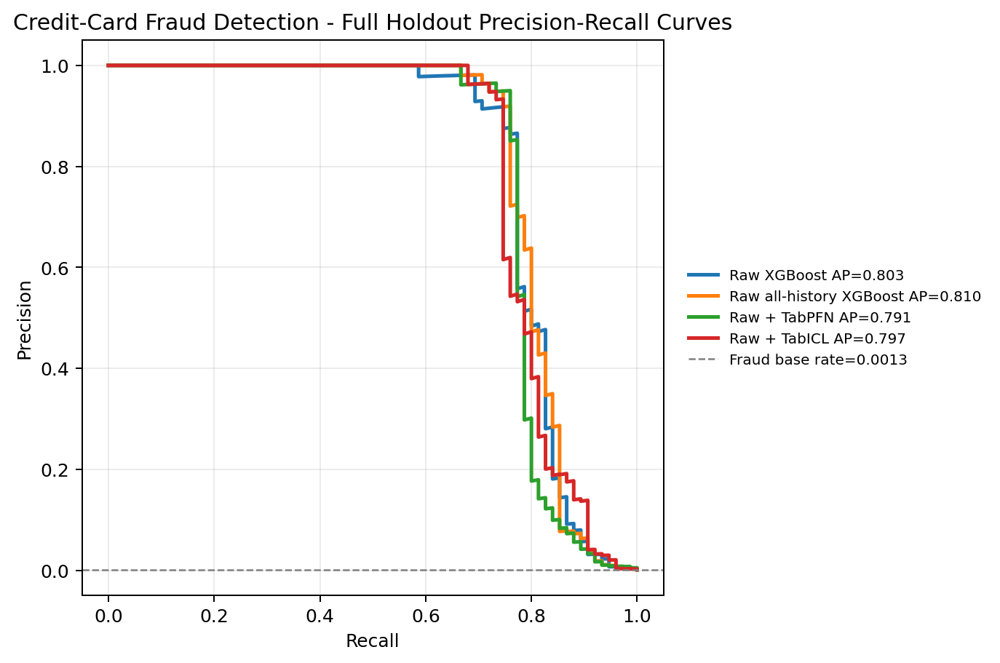
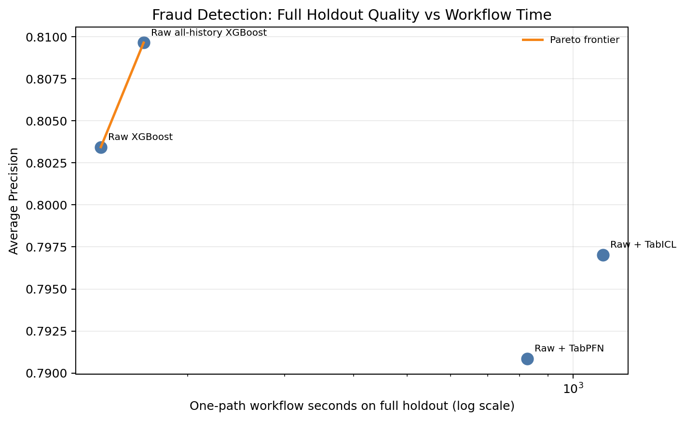
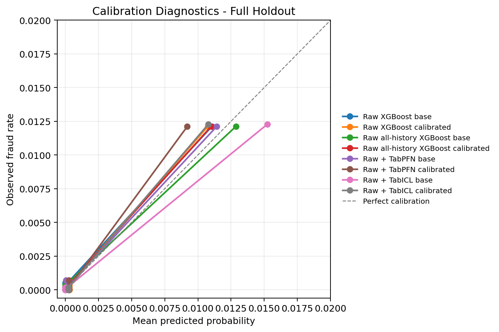

[Mohit Saharan](https://linkedin.com/in/msaharan), P17, 20260505

---

# TabPFN and TabICL embeddings for fraud-detection workflows

This post continues my series on tabular foundation models. So far, I have covered the basic vocabulary of tabular foundation models in [P3](https://www.linkedin.com/posts/msaharan_20260415-tabular-foundation-models-1pdf-activity-7450221503234621441-QYwS?utm_source=share&utm_medium=member_desktop&rcm=ACoAAC8005UBr31urJ8gF7KXefP2-G8r_HNvI2g), the posterior predictive distribution in [P4](https://www.linkedin.com/posts/msaharan_20260416-understanding-tfms-ppdpdf-activity-7450580114225938432-9UYN?utm_source=share&utm_medium=member_desktop&rcm=ACoAAC8005UBr31urJ8gF7KXefP2-G8r_HNvI2g), the architecture in [P5](https://www.linkedin.com/posts/msaharan_20260417-understanding-tfm-architecture-tabpfnpdf-activity-7450946343922999318-6Lw_?utm_source=share&utm_medium=member_desktop&rcm=ACoAAC8005UBr31urJ8gF7KXefP2-G8r_HNvI2g), pre-training in [P6](https://www.linkedin.com/posts/msaharan_20260420-understanding-tfms-pretraining-synthetic-datapdf-activity-7452030755720888320-INN6?utm_source=share&utm_medium=member_desktop&rcm=ACoAAC8005UBr31urJ8gF7KXefP2-G8r_HNvI2g), the TabPFN repository in [P7](https://www.linkedin.com/posts/msaharan_20260421-understanding-tfm-tabpfn-repopdf-activity-7452397229723623425-DVO3?utm_source=share&utm_medium=member_desktop&rcm=ACoAAC8005UBr31urJ8gF7KXefP2-G8r_HNvI2g), the hands-on demo's classification and regression examples in [P8](https://www.linkedin.com/posts/msaharan_20260422-understanding-tfms-tabpfn-handson-demopdf-activity-7452807834171387904-s5Ah?utm_source=share&utm_medium=member_desktop&rcm=ACoAAC8005UBr31urJ8gF7KXefP2-G8r_HNvI2g), TabPFN Client in [P9](https://www.linkedin.com/posts/msaharan_20260423-understanding-tfm-trying-tabpfn-clientpdf-activity-7453126821384073216-2bqA?utm_source=share&utm_medium=member_desktop&rcm=ACoAAC8005UBr31urJ8gF7KXefP2-G8r_HNvI2g), TabPFN embeddings in [P10](https://www.linkedin.com/posts/msaharan_tabpfn-tabularfoundationmodels-machinelearning-activity-7453455329779941376-ymp3?utm_source=share&utm_medium=member_desktop&rcm=ACoAAC8005UBr31urJ8gF7KXefP2-G8r_HNvI2g), TabPFN's predictive behavior in [P11](https://open.substack.com/pub/dsaiengineering/p/p11-understanding-tabular-foundation?utm_campaign=post-expanded-share&utm_medium=web), time series forecasting with TabPFN in [P12](https://open.substack.com/pub/dsaiengineering/p/p12-understanding-tabular-foundation?utm_campaign=post-expanded-share&utm_medium=web), using TabPFN for causal inference in [P13](https://open.substack.com/pub/dsaiengineering/p/p13-understanding-tabular-foundation?utm_campaign=post-expanded-share&utm_medium=web), comparing TabPFN, TabICL, and supervised ML models in [P14](https://open.substack.com/pub/dsaiengineering/p/p14-tabular-foundation-models-comparing?utm_campaign=post-expanded-share&utm_medium=web), using TabPFN and TabICL directly for fraud detection in [P15](https://open.substack.com/pub/dsaiengineering/p/p15-tabpfn-and-tabicl-for-fraud-detection?r=535odk&utm_campaign=post-expanded-share&utm_medium=web), and using TabPFN and TabICL embeddings in an XGBoost fraud workflow in [P16](https://open.substack.com/pub/dsaiengineering/p/p16-tabpfn-and-tabicl-embeddings-fraud-detection-workflows?r=535odk&utm_campaign=post-expanded-share&utm_medium=web).

This post builds on that last idea. The question is not whether TabPFN or TabICL should replace XGBoost as the fraud model. The question is more practical:

> Can offline row embeddings from TabPFN or TabICL improve a production-style XGBoost fraud-detection workflow enough to justify the extra representation step?

I am learning these models by building examples and testing workflow patterns, so I treat this as a workflow demonstration rather than a benchmark claim. The goal is to make the integration pattern, the possible benefits, and the caveats visible. That can be useful both for labs building tabular foundation models and for data and AI practitioners who want to understand how these models might fit into workflows they already know.

You can find the notebook [in my GitHub repository](https://github.com/msaharan/dsaiengineering/blob/main/blog/20260505-tabpfn-tabicl-embeddings-fraud-det-workflows.assets/tabpfn-tabicl-fraud-detection-20260505.ipynb), and you can also [clone it directly on Kaggle](https://www.kaggle.com/code/msaharan/tabpfn-tabicl-fraud-detection-20260505-v3). The notebook is meant to be run on Kaggle with GPU enabled. It installs cuDF for pandas acceleration, uses CUDA for TabPFN and TabICL, and uses a CuPy-backed XGBoost path so that the downstream scorer also runs on GPU.

## Background and scope

To follow the work presented here, a few concepts from earlier posts are useful. I have discussed them in more detail before, so I will use this section to connect the current notebook to that background.

If you need a refresher on row embeddings from TabPFN, you can refer to [P10](https://www.linkedin.com/posts/msaharan_tabpfn-tabularfoundationmodels-machinelearning-activity-7453455329779941376-ymp3?utm_source=share&utm_medium=member_desktop&rcm=ACoAAC8005UBr31urJ8gF7KXefP2-G8r_HNvI2g). If you want the broader comparison between TabPFN, TabICL, and standard supervised ML models, [P14](https://open.substack.com/pub/dsaiengineering/p/p14-tabular-foundation-models-comparing?utm_campaign=post-expanded-share&utm_medium=web) is the relevant reference. For the fraud-detection setup, rare-event metrics, and the first direct use of TabPFN and TabICL as fraud scorers, see [P15](https://open.substack.com/pub/dsaiengineering/p/p15-tabpfn-and-tabicl-for-fraud-detection?r=535odk&utm_campaign=post-expanded-share&utm_medium=web). For the earlier version of the embedding-plus-XGBoost workflow, including the motivation for using embeddings as offline representation features, see [P16](https://open.substack.com/pub/dsaiengineering/p/p16-tabpfn-and-tabicl-embeddings-fraud-detection-workflows?r=535odk&utm_campaign=post-expanded-share&utm_medium=web).

### What changed in this notebook

The main integration pattern is the same one introduced in P16: TabPFN and TabICL are still used as offline representation generators, and XGBoost remains the downstream fraud scorer. The models themselves have not changed: the notebook still compares raw XGBoost, a raw all-history XGBoost incumbent, raw + TabPFN embeddings, and raw + TabICL embeddings.

The main changes are in the comparison design and the notebook structure.

First, the combined `Raw + TabPFN + TabICL` feature set is no longer part of the main comparison. This version evaluates one embedding source at a time. That makes the adoption question cleaner because using both embedding systems together would add a different level of operational cost and complexity.

Second, the tuning setup has been strengthened. Yesterday's notebook intended to use chronological cross-validation, but the fair raw-vs-embedding path effectively had only one usable fold after the fraud-count checks. That made the tuning signal weaker than the design intended. In this version, the fair raw-vs-embedding comparison uses the downstream tuning history after excluding the representation-context rows, and it has five valid chronological folds. The raw all-history incumbent also uses five chronological folds, so the main model configurations are selected under a more consistent tuning protocol before the holdout results are inspected.

Third, the calibration section is organized more carefully. In this workflow, a calibrated model cannot use the calibration window for base model fitting, because that window is held out for fitting the post-hoc sigmoid calibration map. If I compare a calibrated configuration only against a fully trained uncalibrated configuration, two things change at once: the score transformation and the amount of data used to fit the base XGBoost model. This version therefore keeps calibration-base configurations separate from sigmoid-calibrated configurations. The calibration-base configuration shows the uncalibrated model trained on the same pre-calibration data as the calibrated model. The calibrated configuration then shows what changes after applying the sigmoid calibration step. That makes calibration easier to inspect as its own diagnostic.

Fourth, the notebook now leaves behind cleaner review artifacts: curated result tables, bootstrap uncertainty tables, provenance information, embedding matrix summaries, CUDA memory summaries, and final figures. These files are saved in the Kaggle output directory and are available to download as a zip file after the run completes. That makes the run easier to audit after execution instead of relying only on displayed notebook output.

### Evaluation setup reminders

The evaluation logic follows the same principles discussed in P15 and P16. The public fraud dataset has a `Time` column, so the notebook uses chronological windows rather than random splitting. The percentage partitioning is the same as yesterday's embedding workflow: earliest 20% as the source window for the TabPFN/TabICL representation context, next 40% for downstream XGBoost training, next 10% for validation, next 10% for calibration, and final 20% for holdout evaluation. The actual TabPFN/TabICL context passed to the embedding models is sampled from the earliest window, while the fair downstream comparison still excludes that full earliest window from XGBoost tuning and fitting. The important point is that embeddings for later rows are generated only from earlier labelled context rows.

The metric logic is also the same as before. Accuracy is not useful for this rare-event fraud dataset, so the notebook reports Average Precision and alert-queue metrics: top-alert recall, top-percent recall, and the number of alerts needed to reach target recall levels.

Calibration remains a diagnostic rather than the main comparison target. The difference in this notebook is not the definition of calibration, but the cleaner organization of calibration-base and sigmoid-calibrated configurations described above. The results section reports Brier score, log loss, ECE 10, and reliability artifacts where they help interpret probability quality. Here, ECE 10 means expected calibration error computed with 10 bins.

With that scope in place, the rest of the post focuses on the experimental results rather than re-explaining the earlier fraud-detection setup.

## Results

### Comparison design

The notebook compares four model configurations. `Raw XGBoost` is the standard supervised-learning baseline using the 29 raw model features. `Raw all-history XGBoost` is a stronger incumbent-style baseline: it still uses only raw features, but it can use all pre-holdout labelled history because it does not need to reserve an earlier window for TabPFN or TabICL context. `Raw + TabPFN` adds 192 TabPFN embedding features to the raw features, and `Raw + TabICL` adds 512 TabICL embedding features to the raw features.

This setup separates two practical questions. The raw baselines ask whether standard XGBoost is already strong enough, especially when it can use all available pre-holdout raw history. The embedding configurations ask whether a context-conditioned representation from TabPFN or TabICL adds useful information beyond those raw features.

The tuning design is meant to keep that comparison clear. The embedding configurations cannot use the representation-context labels again as downstream training labels, because those labels were already used to condition the embedding model. The fair raw-vs-embedding comparison therefore excludes the representation-context window from downstream tuning. The all-history raw incumbent is reported separately because it answers a different question: how competitive is a strong raw-feature XGBoost workflow if it simply uses more labelled history instead of adding a foundation-model representation step?

Compared with yesterday's notebook, the important tuning change is qualitative rather than just numeric: model selection is no longer based on a single usable chronological fold. The fair raw-vs-embedding path and the raw all-history incumbent both use five valid chronological folds before the final holdout is inspected.

The next sections read the results through several views: full-holdout ranking, alert-queue behavior, uncertainty, runtime and memory, and calibration. I use those views together because no single metric captures the whole workflow tradeoff.

### Full-holdout results

The full holdout is the deployment-facing view because it keeps the final-window fraud base rate. It contains 56,962 transactions and only 75 fraud cases, so small movements in the top of the ranking can change the interpretation.

The first question is whether the embedding features improve the overall fraud ranking. Average Precision is the main summary for that question. The compact result list is:

- Raw all-history XGBoost: AP 0.8097, workflow time 173.3 seconds, Top 0.5% Recall 0.8533, Top 1% Recall 0.8533, Brier 0.000424, ECE 10 0.000104.
- Raw XGBoost: AP 0.8034, workflow time 147.0 seconds, Top 0.5% Recall 0.8400, Top 1% Recall 0.8667, Brier 0.000403, ECE 10 0.000231.
- Raw + TabICL: AP 0.7970, workflow time 1147.8 seconds, Top 0.5% Recall 0.8267, Top 1% Recall 0.9067, Brier 0.000451, ECE 10 0.000485.
- Raw + TabPFN: AP 0.7909, workflow time 840.2 seconds, Top 0.5% Recall 0.8000, Top 1% Recall 0.8400, Brier 0.000381, ECE 10 0.000184.

I read these numbers in three layers.

First, the point AP ranking favors the raw-feature baselines. Raw all-history XGBoost is highest, and standard raw XGBoost is close behind. If the TabPFN or TabICL embeddings were adding a broadly useful ranking signal, I would expect one of the embedding configurations to move above the raw baselines on AP. That does not happen in this run.

Second, runtime changes the practical bar. Raw XGBoost finishes in about 147 seconds, while the embedding workflows take much longer because they add representation generation and wider downstream feature matrices. For an embedding workflow to be attractive in this kind of setting, I would want to see either a clear ranking improvement, a meaningful operating-point improvement, or some other production value that justifies the additional representation step.

Third, the metrics are seeing different things. TabICL has the best Top 1% recall even though it does not have the best AP. TabPFN has the best Brier score among these four configurations, but weaker ranking and alert behavior. That means the result is not a single-metric result where one configuration is best on every view. It separates ranking quality, alert-queue behavior, probability diagnostics, and engineering cost.

The precision-recall figure shows the same story visually. The dashed horizontal line is the fraud base rate. Because fraud is rare, that line sits very low; a useful model should lift precision far above that line for the transactions it ranks near the top.

The four curves are all well above the base-rate line in the high-score region, which means all four XGBoost-based configurations are learning useful fraud rankings. But the curves are close to each other. There is no clean visual separation where an embedding curve stays clearly above both raw baselines across most of the recall range. If that had happened, it would be stronger evidence that the TabPFN or TabICL representation was improving the ranking broadly.

Instead, the figure suggests a narrower interpretation. The raw all-history and raw XGBoost curves are already strong. The embedding curves are competitive, but they do not visibly dominate. When curves are this close, the figure should not be read alone; the alert-budget results below are needed because fraud teams operate at specific review capacities, not across the whole precision-recall curve at once.

### Alert-budget interpretation

The alert-budget view asks a more operational question than AP. Instead of summarizing the whole precision-recall curve, it asks how many transactions a team would need to review to recover a target share of the known fraud cases.

On this full holdout, 80% recall means finding 60 of the 75 fraud cases. At that target:

- Raw all-history XGBoost needs 94 alerts to find 60 frauds, with precision 0.6383.
- Raw XGBoost needs 116 alerts to find 60 frauds, with precision 0.5172.
- Raw + TabICL needs 127 alerts to find 60 frauds, with precision 0.4724.
- Raw + TabPFN needs 199 alerts to find 60 frauds, with precision 0.3015.

At this operating point, the raw all-history incumbent is the most efficient queue. This is what I would expect if the standard raw-feature workflow already captures most of the easy-to-rank fraud cases. If TabPFN or TabICL embeddings had helped strongly at this level, they would have reduced the alert count needed to find those same 60 frauds. They do not do that here.

The picture changes at 90% recall. Here the target is to find 68 of the 75 fraud cases, so the model has to rank deeper into the difficult part of the fraud set:

- Raw + TabICL needs 490 alerts to find 68 frauds, with precision 0.1388.
- Raw all-history XGBoost needs 1,064 alerts to find 68 frauds, with precision 0.0639.
- Raw XGBoost needs 1,177 alerts to find 68 frauds, with precision 0.0578.
- Raw + TabPFN needs 1,598 alerts to find 68 frauds, with precision 0.0426.

This is the main operational nuance. AP favors the raw all-history incumbent, but the 90% recall operating point favors TabICL. One way to read this is that TabICL does not improve the whole ranking enough to lead on AP, but it may move some additional fraud cases into a useful part of the high-recall review queue.

If the AP leader and the 90% recall leader had been the same model, the conclusion would be simpler. Here they differ. That is why I would not summarize this notebook with only AP. A fraud team targeting a compact 80% recall queue might prefer the raw all-history incumbent. A team targeting very high recall could reasonably investigate the TabICL queue behavior further.

For fixed alert budgets on the full holdout:

- At 100 alerts, Raw all-history XGBoost finds 60 frauds and reaches 80.0% recall.
- At 500 alerts, Raw + TabICL finds 68 frauds and reaches 90.7% recall.
- At 1000 alerts, Raw + TabICL still finds 68 frauds and remains at 90.7% recall.
- At the top 0.5% of transactions, Raw all-history XGBoost finds 64 frauds and reaches 85.3% recall.
- At the top 1% of transactions, Raw + TabICL finds 68 frauds and reaches 90.7% recall.

These fixed-budget numbers give the same intuition from the opposite direction. If the team can only review about 100 transactions, raw all-history XGBoost gives the best result. If the team can review around 500 transactions or the top 1% of this holdout, TabICL finds more of the hard-to-catch fraud cases. AP, fixed alert budgets, and target-recall alert counts each answer a different question.

### Uncertainty

The notebook uses bootstrap resampling on the full holdout to estimate uncertainty. This matters because the full holdout has only 75 fraud cases. With so few positives, a small number of transactions moving up or down the ranked list can change AP or alert-count estimates.

For full-holdout AP:

- Raw XGBoost has point AP 0.8034, bootstrap median 0.8032, and 95% interval from 0.6972 to 0.8709.
- Raw all-history XGBoost has point AP 0.8097, bootstrap median 0.8140, and 95% interval from 0.7189 to 0.8947.
- Raw + TabPFN has point AP 0.7909, bootstrap median 0.7905, and 95% interval from 0.7061 to 0.8687.
- Raw + TabICL has point AP 0.7970, bootstrap median 0.7973, and 95% interval from 0.7063 to 0.8723.

These intervals overlap heavily. That does not make the point estimates useless, but it does change the strength of the claim. My reading is that raw all-history XGBoost has the best AP point estimate, not that it is clearly separated from every other configuration. If the intervals had been well separated, I would be more comfortable making a stronger ranking claim.

For alerts needed at 90% recall:

- Raw XGBoost has point estimate 1,177, bootstrap median 1,230, and 95% interval from 212 to 9,822 alerts.
- Raw all-history XGBoost has point estimate 1,064, bootstrap median 1,046, and 95% interval from 129 to 7,311 alerts.
- Raw + TabPFN has point estimate 1,598, bootstrap median 1,598, and 95% interval from 451 to 7,972 alerts.
- Raw + TabICL has point estimate 490, bootstrap median 495, and 95% interval from 254 to 3,449 alerts.

The TabICL point estimate remains interesting because it is much lower than the raw baselines, but the intervals are still wide. I would not read this as a deployment recommendation. I read it as a signal that this operating point is worth a more careful follow-up test on richer and larger fraud data.

### Runtime and memory

The runtime plot shows the engineering tradeoff:

In this figure, the vertical axis is AP and the horizontal axis is workflow time. The most attractive region is the upper-left: high AP with low runtime. A point far to the right needs a meaningful quality improvement to justify its extra cost.

The raw-feature models sit much closer to that attractive region. They are fast and have the best AP point estimates. The embedding workflows move far to the right because they add offline representation generation and wider downstream feature matrices. In this run, they do not move upward enough on AP to compensate.

The workflow times are:

- Raw XGBoost: 147.0 seconds.
- Raw all-history XGBoost: 173.3 seconds.
- Raw + TabPFN: 840.2 seconds, including 371.4 seconds of shared TabPFN embedding preparation.
- Raw + TabICL: 1147.8 seconds, including 120.5 seconds of shared TabICL embedding preparation.

One subtle point is that TabICL embedding preparation is faster than TabPFN embedding preparation in this run, but the full Raw + TabICL workflow is slower. The likely reason is the downstream XGBoost search over a wider feature matrix: TabICL contributes 512 embedding columns, while TabPFN contributes 192. This is an important workflow lesson. Embedding extraction time alone is not the whole cost. The downstream model also has to tune and fit on the expanded feature set.

The embedding matrix sizes also matter:

- TabPFN final training embeddings: 170,884 rows, 192 columns, about 125.2 MB.
- TabPFN full-holdout embeddings: 56,962 rows, 192 columns, about 41.7 MB.
- TabICL final training embeddings: 170,884 rows, 512 columns, about 333.8 MB.
- TabICL full-holdout embeddings: 56,962 rows, 512 columns, about 111.3 MB.

Both embedding paths fit on the Kaggle two-T4 GPU runtime used for the notebook. TabPFN used both CUDA devices and reached about 936.8 MB maximum allocated memory per device during extraction. TabICL used device 0 more heavily, reaching about 3657.3 MB maximum allocated memory and 4548.0 MB reserved memory after extraction.

For practitioners, the lesson is that representation quality should be judged together with representation cost. If the embedding point had moved clearly upward in the runtime plot, the extra cost might be easy to defend. Here the AP view does not justify the added cost by itself, so the main reason to investigate TabICL further is the high-recall operating-point behavior seen above.

### Calibration diagnostics

Calibration remains diagnostic rather than a clear improvement. This section asks a different question from ranking: if the model gives a transaction a low or high fraud probability, should that score be interpreted as a calibrated probability?

The clean comparison is between each calibration-base model and its sigmoid-calibrated version. AP stays the same for those pairs because sigmoid calibration is monotonic: it changes the probability scale but does not change the ranking order.

The probability-quality picture is mixed:

- For raw XGBoost, sigmoid calibration keeps AP at 0.8047 but worsens Brier score, log loss, and ECE 10 relative to the raw calibration-base configuration.
- For raw all-history XGBoost, sigmoid calibration keeps AP at 0.7997, improves Brier score, worsens log loss, and worsens ECE 10 relative to the raw all-history calibration-base configuration.
- For Raw + TabPFN, sigmoid calibration keeps AP at 0.7918 but worsens Brier score, log loss, and ECE 10 relative to the TabPFN calibration-base configuration.
- For Raw + TabICL, sigmoid calibration keeps AP at 0.7978 and improves Brier score and ECE 10 relative to the TabICL calibration-base configuration, but worsens log loss.
- Among the uncalibrated configurations, Raw all-history XGBoost has the best ECE 10, while Raw + TabPFN has the best Brier score and log loss.

That is why I do not treat calibration as a clear improvement in this notebook. If calibration had consistently improved Brier score, log loss, and ECE without harming the workflow, I would read it as useful probability cleanup. Here it improves some diagnostics for TabICL but not enough to make a broad claim.

The calibration figure is also harder to read than the precision-recall figure. Most scores and observed fraud rates are very close to zero because the event is so rare. Visually, that compresses the reliability curves near the origin. The diagonal reference line shows ideal calibration: predicted probability and observed fraud rate would match along that line.

The curves do not provide a clean visual story where one calibrated model clearly tracks the diagonal and the others clearly do not. For this reason, I treat the calibration plot as a warning to inspect probability quality, not as decisive evidence. The reliability-bin CSVs saved by the notebook are more useful than the figure when reviewing calibration in detail.

### Public-data constraints

The leakage checks are included to keep the result in perspective. The notebook verifies the checks that are possible in this public dataset: the target is excluded from features, `Time` is used for chronological splitting, and `Time` is not used as a model feature in the default run.

The dataset is anonymized, so important production checks remain unavailable. I cannot test customer-level, card-level, merchant-level, or account-level leakage. I also cannot verify raw feature lineage or label availability timing. That means the results should be read as a workflow demonstration, not as a production fraud benchmark.

For a real fraud dataset, I would repeat this same workflow with entity-aware splits, delayed-label handling, feature timestamp checks, and drift monitoring before trusting the result.

## Known limitations

The public-data constraints above are not the only caveats. There are also limits in this particular experiment design.

This is one public dataset, so I would not generalize the result to all fraud datasets, transaction workflows, or tabular foundation models.

The full holdout has only 75 fraud cases. The bootstrap intervals help, but they also show why point estimates should be interpreted cautiously.

The TabPFN and TabICL representation context is sampled from the earliest 20% source window rather than using every row in that window. The sampling keeps the rare fraud rows but caps the number of normal rows, so the context seen by the embedding models is smaller and more fraud-enriched than the full chronological source window. That could affect the learned row representations and may be one reason the embedding configurations do not improve AP here. This notebook does not isolate that factor, so I treat it as a hypothesis for follow-up rather than as an explanation proven by the run.

The TabICL embedding path uses model internals rather than a stable public embedding method comparable to TabPFN's `get_embeddings`. That does not make the experiment invalid, but I would version-pin and review that code path.

I have not yet added interpretability methods such as SHAP, missing-data stress tests, categorical stress tests, drift-by-period analysis, or group-aware splitting. Those are important next steps for a broader testbench.

## Summary and conclusion

This notebook tests a practical integration pattern:

1. Keep XGBoost as the downstream fraud scorer.
2. Use TabPFN or TabICL as an offline row-embedding generator.
3. Append those embeddings to raw transaction features.
4. Evaluate the result with chronological splits, AP, alert counts, runtime, memory, calibration diagnostics, and leakage checks.

The result does not show tabular foundation model embeddings outperforming the raw baselines across the main summary view. Raw all-history XGBoost has the best full-holdout point AP, and raw XGBoost is close while being much faster. Single-source TabPFN and TabICL embeddings do not beat the raw baselines by AP in this run. The bootstrap intervals overlap heavily, so I read the AP ranking cautiously.

The useful nuance is the high-recall operating point. At 90% recall, Raw + TabICL needs 490 alerts to recover 68 of 75 fraud cases, compared with 1,064 alerts for raw all-history XGBoost and 1,177 alerts for raw XGBoost. That makes TabICL worth investigating for high-recall review-queue settings, even though it is not the best AP/runtime configuration overall.

My interpretation is that tabular foundation model embeddings are best evaluated as workflow components, not only as standalone model scores. The important question is not only whether an embedding configuration has the highest AP. It is whether the embedding improves a business-relevant operating point enough to justify the added representation path.

For practitioners, the reusable lesson is the evaluation design. A tabular foundation model embedding experiment needs comparison against a strong classical baseline, with time-aware splitting, alert-budget metrics, calibration diagnostics, runtime accounting, memory accounting, and leakage checks.

For labs and researchers, this kind of notebook can be useful as a field-facing test. It does not replace formal benchmarks, but it can show how model capabilities appear when inserted into workflows that data teams already understand.

## Outlook

With this dataset, I am reaching the point where the next useful experiments may need richer transaction context than the public file provides. I plan to keep extending the workflow in directions that matter for real data science teams, including representation-context ablations, interpretability, missing-data behavior, categorical features, time-derived feature policy, drift by time period, and group-aware splitting when entity IDs are available. For the embedding workflow specifically, I would like to test larger context samples, different normal-row sampling policies, repeated context draws, and context choices that preserve the source-window class balance more closely when model limits allow it.

However, these experiments take time, and I may change direction if I find a better experiment or a more useful problem to work on. If this line of testing is useful to you, comments are a good place to tell me whether you want to see these experiments carried through and what parts of the workflow you think would be most worth testing next.

My current goal is not to prove that one model family is always better. It is to build reusable examples that make benefits, costs, and caveats visible enough for both model builders and practitioners to reason about them.
