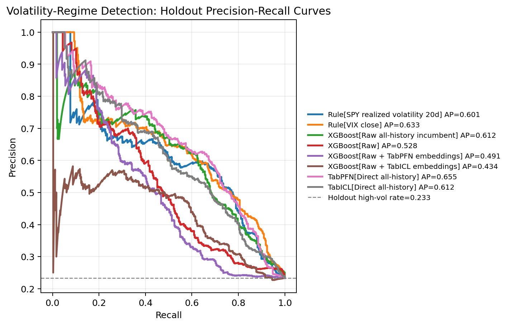
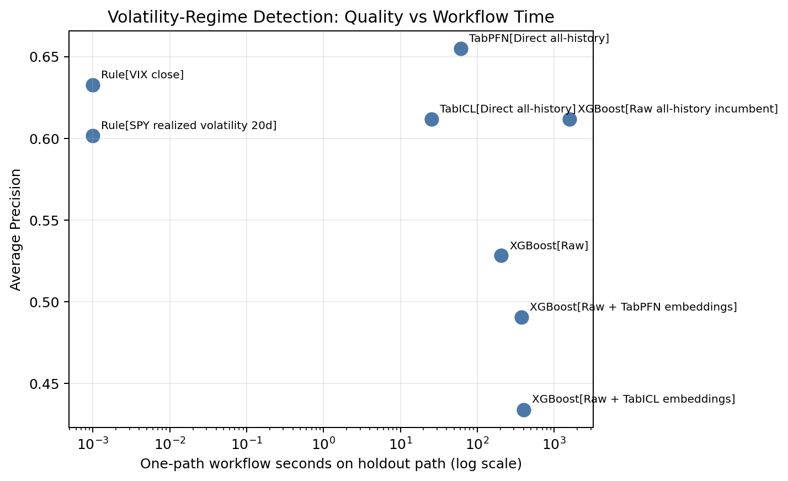
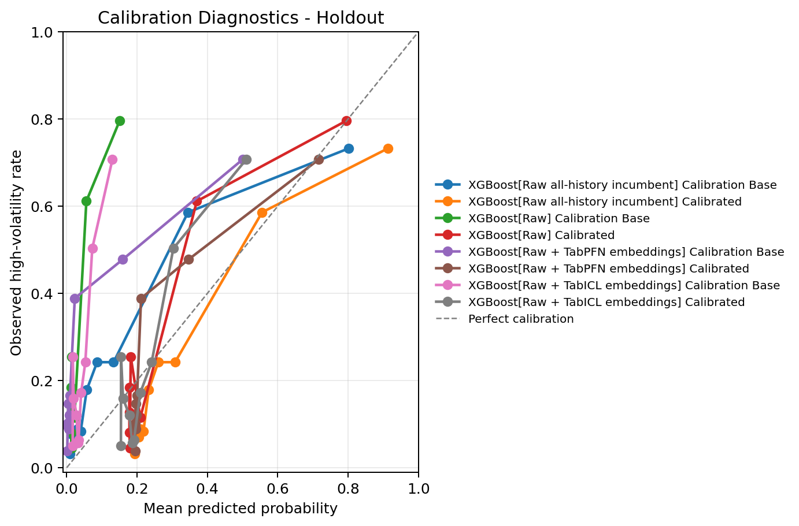
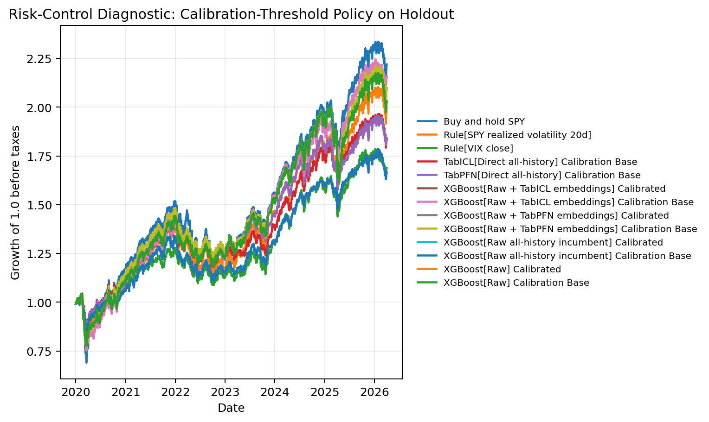

[Mohit Saharan](https://linkedin.com/in/msaharan), P18, 20260506

---

# Volatility-Regime Forecasting with TabPFN, TabICL, and Classical Tabular Models

This post continues my series on tabular foundation models (TFMs). So far, I have covered the basic vocabulary of tabular foundation models in [P3](https://www.linkedin.com/posts/msaharan_20260415-tabular-foundation-models-1pdf-activity-7450221503234621441-QYwS?utm_source=share&utm_medium=member_desktop&rcm=ACoAAC8005UBr31urJ8gF7KXefP2-G8r_HNvI2g), the posterior predictive distribution in [P4](https://www.linkedin.com/posts/msaharan_20260416-understanding-tfms-ppdpdf-activity-7450580114225938432-9UYN?utm_source=share&utm_medium=member_desktop&rcm=ACoAAC8005UBr31urJ8gF7KXefP2-G8r_HNvI2g), the architecture in [P5](https://www.linkedin.com/posts/msaharan_20260417-understanding-tfm-architecture-tabpfnpdf-activity-7450946343922999318-6Lw_?utm_source=share&utm_medium=member_desktop&rcm=ACoAAC8005UBr31urJ8gF7KXefP2-G8r_HNvI2g), pre-training in [P6](https://www.linkedin.com/posts/msaharan_20260420-understanding-tfms-pretraining-synthetic-datapdf-activity-7452030755720888320-INN6?utm_source=share&utm_medium=member_desktop&rcm=ACoAAC8005UBr31urJ8gF7KXefP2-G8r_HNvI2g), the TabPFN repository in [P7](https://www.linkedin.com/posts/msaharan_20260421-understanding-tfm-tabpfn-repopdf-activity-7452397229723623425-DVO3?utm_source=share&utm_medium=member_desktop&rcm=ACoAAC8005UBr31urJ8gF7KXefP2-G8r_HNvI2g), the hands-on demo's classification and regression examples in [P8](https://www.linkedin.com/posts/msaharan_20260422-understanding-tfms-tabpfn-handson-demopdf-activity-7452807834171387904-s5Ah?utm_source=share&utm_medium=member_desktop&rcm=ACoAAC8005UBr31urJ8gF7KXefP2-G8r_HNvI2g), TabPFN Client in [P9](https://www.linkedin.com/posts/msaharan_20260423-understanding-tfm-trying-tabpfn-clientpdf-activity-7453126821384073216-2bqA?utm_source=share&utm_medium=member_desktop&rcm=ACoAAC8005UBr31urJ8gF7KXefP2-G8r_HNvI2g), TabPFN embeddings in [P10](https://www.linkedin.com/posts/msaharan_tabpfn-tabularfoundationmodels-machinelearning-activity-7453455329779941376-ymp3?utm_source=share&utm_medium=member_desktop&rcm=ACoAAC8005UBr31urJ8gF7KXefP2-G8r_HNvI2g), TabPFN's predictive behavior in [P11](https://open.substack.com/pub/dsaiengineering/p/p11-understanding-tabular-foundation?utm_campaign=post-expanded-share&utm_medium=web), time series forecasting with TabPFN in [P12](https://open.substack.com/pub/dsaiengineering/p/p12-understanding-tabular-foundation?utm_campaign=post-expanded-share&utm_medium=web), using TabPFN for causal inference in [P13](https://open.substack.com/pub/dsaiengineering/p/p13-understanding-tabular-foundation?utm_campaign=post-expanded-share&utm_medium=web), comparing TabPFN, TabICL, and supervised ML models in [P14](https://open.substack.com/pub/dsaiengineering/p/p14-tabular-foundation-models-comparing?utm_campaign=post-expanded-share&utm_medium=web), using TabPFN and TabICL directly for fraud detection in [P15](https://open.substack.com/pub/dsaiengineering/p/p15-tabpfn-and-tabicl-for-fraud-detection?r=535odk&utm_campaign=post-expanded-share&utm_medium=web), and using TabPFN and TabICL embeddings in an XGBoost fraud workflow in [P16](https://open.substack.com/pub/dsaiengineering/p/p16-tabpfn-and-tabicl-embeddings-fraud-detection-workflows?r=535odk&utm_campaign=post-expanded-share&utm_medium=web) and in [P17](https://open.substack.com/pub/dsaiengineering/p/p17-tabpfn-and-tabicl-embeddings-for-fraud-detection-workflows?r=535odk&utm_campaign=post-expanded-share&utm_medium=web).

In this post, I am turning the direction of this series toward quantitative finance. I am starting with volatility-regime forecasting because it is a natural bridge between supervised tabular ML and a practical finance workflow. The question is:

> Can we identify market states where future risk is unusually high?

More precisely, I build a supervised tabular workflow that uses information available at the close of date `t` to score whether SPY's realized volatility over the next 20 trading days will be high. This is not a price forecast, a trading signal, or an investment recommendation. It is a workflow test: can TabPFN, TabICL, XGBoost, TFM embeddings, and simple volatility-domain rules produce useful high-volatility rankings under a chronological market-regime split?

The main result is that direct TabPFN and TabICL look more useful as scoring models than the appended-embedding workflows look as feature generators for XGBoost. In this run, direct TabPFN gives the strongest holdout Average Precision point estimate, VIX remains a very strong domain baseline, and the downstream XGBoost embedding variants do not improve ranking under substantial market-regime shift.

The second point is about evaluation. Tabular foundation models should be evaluated as workflow components, not only as model names on a leaderboard. Direct prediction, offline embeddings, calibration, runtime, and risk-control thresholds can tell different stories. This notebook is part of my learning-by-building process, and the goal is to make those workflow tradeoffs visible in a quantitative-finance setting.

Because this is the first version of the workflow, I frame the results as exploratory evidence under regime shift, not as a definitive benchmark or trading claim.

You can find the notebook in my GitHub repository [here](https://github.com/msaharan/dsaiengineering/blob/main/blog/20260506-tabpfn-tabicl-volatility-regime-forecasting.assets/tabpfn-tabicl-volatility-regime-forecasting-20260506.ipynb) or you can also [clone it directly](https://www.kaggle.com/code/msaharan/tabpfn-tabicl-volatility-forecasting-20260506-v3) on Kaggle. The notebook is meant to be run with GPU enabled.

## Background and scope

To follow this notebook, the most useful references from earlier posts are P4, P10, P12, P14, P15, P16, and P17.

P4 introduced the posterior predictive distribution viewpoint. That remains useful here because TabPFN and TabICL are not trained from scratch in the same way as XGBoost. They use labelled rows as context and produce predictions for query rows. P10 introduced row embeddings, which are reused here as offline features. P12 showed how a time-indexed problem can be converted into a tabular prediction problem. P14 compared TabPFN, TabICL, and standard supervised ML models. P15 to P17 moved the discussion toward practical workflow tests: chronological splits, rare-event ranking, alert queues, calibration, runtime, and embedding-enhanced XGBoost workflows.

Today's notebook keeps that workflow-testing style but changes the domain. Instead of fraud detection, the task is volatility-regime forecasting. The models are still used in supervised tabular form, but the data now comes from public market, volatility, macro, and credit series. The evaluation is also more finance-specific: VIX, the Cboe Volatility Index that summarizes market-implied 30-day volatility expectations for the S&P 500, and recent realized volatility become substantive domain baselines. The split must respect time, and the final diagnostic asks whether scores can support a simple risk-control rule. That rule is only a diagnostic. It is not a trading recommendation.

### Volatility-regime forecasting as tabular classification

The raw financial object is a price series. Let \(P_t\) be the adjusted close price of SPY on trading day \(t\). A common daily log return is:

$$
r_t = \log(P_t) - \log(P_{t-1}).
$$

Volatility is the variability of returns. In this notebook, the target is based on future realized volatility over the next \(H=20\) trading days. A simple way to write the future realized volatility from signal date \(t\) is:

$$
RV_{t,H}
= \sqrt{252}
\sqrt{
\frac{1}{H-1}
\sum_{h=1}^{H}
\left(r_{t+h} - \bar{r}_{t,H}\right)^2
}.
$$

Here, \(H=20\) is the forecast horizon, and \(\bar{r}_{t,H}\) is the average of the future returns \(r_{t+1}, \ldots, r_{t+H}\). The multiplier \(\sqrt{252}\) annualizes daily volatility under the usual convention of about 252 trading days per year. This matches the notebook's use of a rolling standard deviation of future log returns. Some finance texts define realized volatility from sums of squared returns without demeaning; this post uses the rolling-standard-deviation convention because that is what the notebook computes. Because this formula uses future returns, \(RV_{t,H}\) is not a feature. It is the target we are trying to forecast.

The notebook turns this into a binary classification problem. Let \(q\) be a high-volatility threshold estimated only from pre-calibration history. Then the label is:

$$
y_t =
\mathbf{1}\{RV_{t,20} \geq q\}.
$$

Here, \(y_t=1\) means that the next 20 trading days fall into a high-volatility regime, and \(y_t=0\) means they do not. The indicator \(\mathbf{1}\{\cdot\}\) returns 1 when the condition is true and 0 otherwise. The notebook uses \(\geq q\), so rows exactly at the threshold are included in the high-volatility class.

The supervised learning table then has the familiar form:

$$
\mathcal{D}
= \{(x_t, y_t)\}_{t=1}^{n}.
$$

Here, \(\mathcal{D}\) is the labelled tabular dataset and \(n\) is the number of rows. The row \(x_t\) contains features available at or before the close of date \(t\). Examples include recent returns, recent realized volatility, drawdowns, moving-average distances, VIX, interest rates, credit spreads, and cross-asset relationships. The label \(y_t\) uses future SPY realized volatility and is only used for training and evaluation.

This is similar to the time-series framing in P12: the sequence problem is converted into a supervised tabular problem. The difference is that P12 predicted future values directly, while today's notebook predicts whether a future risk measure crosses a regime threshold.

### Why this is not a price forecast

A price forecast asks for a predicted future price or return, for example:

$$
\hat{P}_{t+H}
\quad \text{or} \quad
\hat{r}_{t+H}.
$$

That is not what this notebook does. It asks for a score:

$$
s_t \approx \mathbb{P}(y_t=1 | x_t, \mathcal{D}_{\text{train}}).
$$

Here, \(s_t\) is the model score for date \(t\), \(\mathbb{P}(\cdot)\) denotes probability, and \(\mathcal{D}_{\text{train}}\) is the training subset of the labelled table. The score is an estimate of the probability, or at least the rank-order risk, that the next 20 trading days will be high-volatility. This distinction matters. A high score does not say that SPY will go up or down. It says that the row has features associated with higher future realized volatility in the context of the fitted workflow.

This is why the evaluation focuses on ranking, calibration, and operating points rather than directional price accuracy. A useful volatility-regime score should put many future high-volatility dates near the top of the ranked list, and if it is interpreted as a probability, its probability scale should also be checked.

### Chronological validation and leakage

In ordinary tabular demos, it is common to use random train-test splits. That would be inappropriate here. Financial data is time ordered, market regimes change, and future information must not leak into past decisions.

The core rule is:

> At signal date \(t\), features may use information available at or before \(t\), but the label uses returns after \(t\).

So the notebook uses chronological windows rather than random splits. The earlier windows provide context, tuning data, and calibration data. The final 2020-forward period is held out as the future-facing evaluation window.

This design handles several separate questions:

- Can the model learn from earlier market conditions and generalize to later conditions?
- Does the high-volatility threshold come from pre-holdout history rather than from the final holdout?
- Are TabPFN and TabICL context labels kept separate from downstream XGBoost labels when embeddings are used?
- Does calibration use a separate window rather than the same rows used for final holdout evaluation?

This does not remove every limitation. The future 20-day realized-volatility targets overlap across nearby dates. For example, the target for date \(t\) and the target for date \(t+1\) share many future return observations. That is why independent-and-identically-distributed, or IID, assumptions are weak here and why the notebook later uses calendar-month block bootstrap for uncertainty.

### Ranking metrics and operating points

The positive class is not fraud-rare in the same way as the credit-card fraud dataset in P15 to P17, but this is still an alert-style problem. The model produces a score for each date, and we sort dates from highest predicted risk to lowest predicted risk.

Precision asks:

> Among dates flagged as high risk, what fraction were actually followed by high realized volatility?

Recall asks:

> Among all future high-volatility dates, what fraction did the score identify within the flagged set?

Average Precision, or AP, summarizes the precision-recall curve. It is useful because it evaluates the ranked list across many possible thresholds. ROC AUC is also reported. ROC AUC asks how often a randomly chosen high-volatility row is ranked above a randomly chosen low-volatility row. I still treat AP and operating-point metrics as more directly relevant here because the output is naturally used as a ranked risk queue.

Operating points ask more concrete questions:

- If I inspect the top 10% or top 20% highest-risk dates, how much future high volatility do I capture?
- If I want 80% recall, how many dates must be placed into the alert queue?
- If I want 90% recall, does the queue become too broad to be useful?

These questions are important because two models can have similar AP but behave differently at the threshold a practitioner actually uses.

### Calibration is different from ranking

Ranking quality and probability quality are different. A model can sort high-risk dates above low-risk dates while still producing probability values that are too high or too low.

If the score is only used for ordering, monotonic transformations do not matter much. If the score is interpreted as:

$$
\mathbb{P}(y_t=1 | x_t),
$$

then calibration matters. A calibrated model should have the property that, among rows receiving scores near 0.30, roughly 30% should actually be positive. The notebook therefore reports probability diagnostics such as Brier score, log loss, and expected calibration error.

Brier score is the mean squared error of predicted probabilities:

$$
\frac{1}{n}\sum_{t=1}^{n}(s_t - y_t)^2.
$$

Log loss penalizes confident wrong probabilities more sharply:

$$
-\frac{1}{n}\sum_{t=1}^{n}
\left[
y_t \log(s_t) + (1-y_t)\log(1-s_t)
\right].
$$

Expected calibration error, or ECE, bins predictions by score and compares average predicted probability with observed event frequency inside each bin. The notebook reports ECE with 10 score bins. These are probability-quality diagnostics, not replacements for AP.

For Brier score, log loss, and ECE, lower values are better. For AP and ROC AUC, higher values are better.

### Classical supervised ML versus tabular foundation models

For a classical supervised model such as XGBoost, fitting means learning a task-specific model from the current training table. Conceptually, this is:

$$
\hat{f}
= \arg\min_{f \in \mathcal{F}}
\sum_{(x_t,y_t)\in \mathcal{D}_{\text{train}}}
\ell(y_t, f(x_t)).
$$

Here, \(\mathcal{F}\) is the model class, \(\ell\) is the training loss, and \(\hat{f}\) is the fitted model. Hyperparameter tuning then selects a configuration using validation data.

For TabPFN and TabICL, the mental model is different. The large model is pretrained. The labelled rows in `.fit()` are better understood as task context rather than as a full weight-training dataset. Using notation closer to P4, the prediction is closer to:

$$
p(y_{\text{new}} | x_{\text{new}}, X_{\text{context}}, y_{\text{context}}),
$$

where \(x_{\text{new}}\) is a new query row, \(y_{\text{new}}\) is its unknown label, \(X_{\text{context}}\) is the context feature matrix, and \(y_{\text{context}}\) is the corresponding context-label vector. This is the same posterior-predictive-distribution idea discussed in P4, adapted to the volatility-regime label used here.

This gives two possible workflow roles for tabular foundation models:

- Direct scorer: TabPFN or TabICL receives labelled context rows and directly predicts high-volatility probabilities or scores for later rows.
- Representation generator: TabPFN or TabICL produces row embeddings, and those embeddings are appended to raw features for a downstream model such as XGBoost.

The second role is the same integration pattern explored in P16 and P17. It is not guaranteed to help. Embeddings may add useful information, but they may also be redundant with the raw features, interact poorly with a small or quiet tuning window, or make the downstream feature space harder to tune. That is why this notebook evaluates direct TFM scoring and embedding-enhanced XGBoost as separate workflow components.

### What is in scope today

This post is a first volatility-regime workflow test. It is in scope to ask whether direct TabPFN, direct TabICL, raw XGBoost, embedding-enhanced XGBoost, VIX, and recent realized volatility produce useful high-volatility rankings under a chronological holdout.

It is also in scope to inspect probability calibration, runtime, uncertainty, feature drift, leakage checks, and a simple risk-control diagnostic.

It is not in scope to claim a trading strategy, forecast exact future prices, optimize a portfolio, or produce a definitive benchmark for all financial datasets. The useful contribution is narrower: a reproducible workflow for testing tabular foundation models as components in a realistic volatility-regime forecasting pipeline.

## Code and results

With the scope in place, this section walks through the notebook outputs. The practical question is:

> Given the information available at the close of date `t`, can a model score whether SPY's realized volatility over the next 20 trading days will fall into a high-volatility regime?

I discuss the outputs as a workflow test under regime shift. The notebook compares direct TabPFN and TabICL scoring, XGBoost on raw features, XGBoost on raw features plus TabPFN or TabICL embeddings, simple volatility-domain rules, calibration diagnostics, operating-point behavior, uncertainty, runtime, risk-control diagnostics, drift, and leakage checks.

### 1. Data and target

The target asset is SPY. The feature set uses public daily data from yfinance, VIX history from Cboe, and macro/credit series from FRED. The market features include SPY, QQQ, IWM, TLT, IEF, GLD, HYG, EEM, and VNQ. The macro and credit inputs include 10-year Treasury yield, 2-year Treasury yield, the 10y-2y yield curve, high-yield OAS, investment-grade OAS, and the effective federal funds rate.

This public-data choice matters. It makes the notebook reproducible, but it is not the same thing as an institutional point-in-time market data system. So I read the results as a research workflow demonstration rather than as a deployable market-data pipeline.

The target is a binary high-volatility label. The notebook computes SPY's future 20-trading-day realized volatility, annualizes it, and labels a row as high-volatility if that future realized volatility is at least a pre-holdout threshold. The threshold is estimated only from history ending on 2017-12-29. In this run, the threshold is the 80th percentile of pre-calibration history, which gives:

- Target asset: SPY.
- Forecast horizon: 20 trading days.
- High-volatility threshold: 0.200602 annualized realized volatility.
- Threshold source window: data available through 2017-12-29.
- Rows after target filtering: 5,094.

This thresholding policy is important because it prevents the 2020-forward holdout from defining what "high volatility" means. The holdout can then be used as a future-facing test period rather than as part of the label-design procedure. This is a practical approximation for a public-data notebook, not a claim that this threshold would be the right operational definition in every volatility workflow.

### 2. Feature table

The feature table is daily and indexed by signal date. The notebook builds features that would be available at or before the signal date: returns, realized volatility, downside volatility, drawdowns, moving-average distances, volume changes, VIX features, rates, credit-spread features, and cross-asset correlations.

The feature policy is intentionally broad but audited. The notebook starts with 297 candidate features. Seven sparse credit-spread-derived features are dropped because they do not have enough usable pre-calibration history. The retained feature table has:

- 290 base features.
- 284 missingness indicators.
- 574 final model features.

The missingness indicators are part of the feature policy rather than a cosmetic detail. Public macro and credit series do not all start at the same time or update with the same density. If missingness itself is informative, the model can use those indicators. If missingness is mainly a data artifact, later leakage and drift checks help keep that visible.

### 3. Chronological split design

The split design is central to the notebook because volatility forecasting is not an iid random-split problem.

The notebook uses these chronological windows:

- TabPFN/TabICL representation context: 2006-01-03 to 2011-12-30, with 1,511 rows and 36.0% high-volatility rows.
- Fair downstream tuning window: 2012-01-03 to 2017-12-29, with 1,509 rows and 4.0% high-volatility rows.
- Calibration window: 2018-01-02 to 2019-12-31, with 503 rows and 22.3% high-volatility rows.
- Holdout: 2020-01-02 to 2026-04-02, with 1,571 rows and 23.3% high-volatility rows.
- Raw all-history final training window: 2006-01-03 to 2019-12-31, with 3,523 rows and 20.3% high-volatility rows.

The split rates already tell us why this is a hard experiment. The fair downstream tuning window is unusually quiet: only 60 of 1,509 rows are high-volatility rows. The holdout then includes COVID, the 2022 inflation/rate shock, the post-2022 lower-volatility period, and the 2025/early-2026 episodes. A model selected in a quiet 2012-2017 validation setting may not transfer cleanly into a noisier 2020-forward regime.

The representation-context split also keeps the embedding comparison honest. TabPFN and TabICL use the early context labels to condition their representations. Therefore, the fair downstream XGBoost workflows using those embeddings do not reuse that same context window as downstream XGBoost training labels. The raw all-history XGBoost model is reported separately because it answers a different practical question: what if a classical model simply uses all pre-holdout labels instead of reserving some of them for a TFM context?

### 4. Model configurations

The notebook compares three kinds of scorers.

First, it includes simple domain rules:

- `Rule[VIX close]`, which uses VIX as a volatility-domain score.
- `Rule[SPY realized volatility 20d]`, which uses recent SPY realized volatility as a score.

Second, it includes XGBoost workflows:

- `XGBoost[Raw]`, trained on the fair raw feature set.
- `XGBoost[Raw all-history incumbent]`, a stronger raw-feature reference that uses all pre-holdout labels.
- `XGBoost[Raw + TabPFN embeddings]`, with 574 raw features plus 192 TabPFN embedding columns, for 766 total features.
- `XGBoost[Raw + TabICL embeddings]`, with 574 raw features plus 512 TabICL embedding columns, for 1,086 total features.

Third, it includes direct TFM scoring:

- `TabPFN[Direct all-history]`.
- `TabICL[Direct all-history]`.

This distinction is important. Direct TFM scoring and TFM embeddings answer different workflow questions. Direct scoring asks whether TabPFN or TabICL can act as the classifier. The embedding path asks whether a TFM representation improves a downstream XGBoost model. This run gives different answers to those two questions.

### 5. Tuning and validation caveat

The XGBoost workflows use randomized hyperparameter search with chronological validation folds. This is better aligned with the time-ordered nature of the problem than random cross-validation. However, the fair raw-vs-embedding path has only one usable chronological fold after the positive-count checks. That fold has 920 training rows with 26 high-volatility rows and 196 validation rows with 33 high-volatility rows.

That is the main experimental caveat in this section. The run is internally coherent, but the fair XGBoost model-selection signal is fragile. I would not read the XGBoost rankings as a definitive statement about all possible XGBoost configurations. I read them as the result of this specific, audited workflow under a difficult regime shift.

### 6. Main holdout results

The final holdout has 1,571 rows and 366 high-volatility rows, so the high-volatility base rate is 23.3%. Average Precision is the main ranking metric because this is naturally an alert-style problem: the score is useful if it pushes future high-volatility periods toward the top of the ranked list.

The main holdout results are:

- `TabPFN[Direct all-history]`: AP 0.655, ROC AUC 0.821, Top 20% Recall 0.560, 639 alerts for 80% recall, workflow time 61.0 seconds.
- `Rule[VIX close]`: AP 0.633, ROC AUC 0.832, Top 20% Recall 0.555, 611 alerts for 80% recall, workflow time 0.0 seconds.
- `XGBoost[Raw all-history incumbent]`: AP 0.612, ROC AUC 0.811, Top 20% Recall 0.552, 725 alerts for 80% recall, workflow time 1584.4 seconds.
- `TabICL[Direct all-history]`: AP 0.612, ROC AUC 0.798, Top 20% Recall 0.508, 724 alerts for 80% recall, workflow time 25.6 seconds.
- `Rule[SPY realized volatility 20d]`: AP 0.601, ROC AUC 0.809, Top 20% Recall 0.514, 659 alerts for 80% recall, workflow time 0.0 seconds.
- `XGBoost[Raw]`: AP 0.528, ROC AUC 0.712, Top 20% Recall 0.451, 1042 alerts for 80% recall, workflow time 205.6 seconds.
- `XGBoost[Raw + TabPFN embeddings]`: AP 0.491, ROC AUC 0.657, Top 20% Recall 0.437, 1210 alerts for 80% recall, workflow time 378.2 seconds.
- `XGBoost[Raw + TabICL embeddings]`: AP 0.434, ROC AUC 0.704, Top 20% Recall 0.437, 952 alerts for 80% recall, workflow time 401.3 seconds.

The result is not "TFM embeddings improve XGBoost." In this run, they do not. The more useful result is that direct TabPFN, direct TabICL, and simple volatility-domain scores are competitive with the tuned XGBoost workflows, and in some views they are ahead of them.

The clearest positive result is direct TabPFN's ranking quality. It has the highest AP and the highest Top 20% Recall. The most important baseline result is VIX. VIX has the highest ROC AUC and the most efficient 80% recall queue overall. This is a useful reminder that, in a finance workflow, a simple domain signal can be a substantive baseline.

The direct TabICL result is also useful, but less dominant. Its AP is essentially tied with the raw all-history XGBoost incumbent, while its runtime is much lower. The embedding-enhanced XGBoost result is the clearest non-improvement result: adding TabPFN or TabICL row embeddings to raw features lowers downstream XGBoost AP in this holdout.

### 7. Precision-recall curves

This figure shows precision on the vertical axis and recall on the horizontal axis. The dashed horizontal line is the holdout base rate, about 0.233. A model above that line is ranking high-volatility rows better than random ordering.

The first thing to notice is that all models are above the base-rate line for much of the curve. This suggests that the scores contain useful ranking signal in this holdout, rather than behaving like random ordering.

The second thing to notice is the grouping. Direct TabPFN, VIX, raw all-history XGBoost, TabICL direct, and recent SPY realized volatility form the stronger group. They are not separated by a huge margin, but they sit above the fair raw XGBoost and the embedding-enhanced XGBoost workflows through much of the useful recall range.

The third thing to notice is the embedding result. If TabPFN or TabICL embeddings were improving XGBoost as general-purpose features in this workflow, I would expect their curves to move above raw XGBoost or at least approach the stronger group. Instead, the embedding curves sit lower. The TabPFN embedding workflow has some early precision strength, but it does not hold up through the middle of the curve. The TabICL embedding workflow has the lowest AP in this run.

This figure is why I would frame the experiment as a workflow-component test. Direct TFM scores can be useful even when offline TFM embeddings do not help a downstream tree model.

### 8. Operating points

AP summarizes the whole ranked list, but an actual alerting or risk-control workflow usually operates at a finite queue size. That is why the notebook also reports target-recall and fixed-top-rate views.

At 50% recall, the most efficient queues are:

- TabPFN direct: 271 alerts, precision 0.675.
- XGBoost raw all-history: 273 alerts, precision 0.670.
- VIX rule: 282 alerts, precision 0.649.

At this moderate-recall operating point, TabPFN direct, raw all-history XGBoost, and VIX are very close. A practitioner choosing among them would probably care about stability, calibration, cost, and interpretability, not only the two-alert difference between the first two rows.

At 80% recall, the ordering changes:

- VIX rule: 611 alerts, precision 0.480.
- TabPFN direct: 639 alerts, precision 0.459.
- SPY realized-volatility rule: 659 alerts, precision 0.445.
- XGBoost raw all-history: 725 alerts, precision 0.404.

Here VIX is the most efficient score. This is an important practical result. Direct TabPFN has the best AP, but VIX gives the shortest 80% recall queue.

At 90% recall, VIX has the shortest queue among the reported scores:

- VIX rule: 865 alerts, precision 0.382.
- XGBoost raw all-history: 1037 alerts, precision 0.318.
- TabPFN direct: 1061 alerts, precision 0.311.
- TabICL direct: 1065 alerts, precision 0.310.

The fixed top-rate view tells a similar story but emphasizes TabPFN's broad ranking strength:

- At the top 5% of holdout rows, TabPFN direct, TabICL direct, and XGBoost raw plus TabPFN embeddings each reach 18.0% recall.
- At the top 10%, TabPFN direct leads with 33.1% recall.
- At the top 20%, TabPFN direct leads with 56.0% recall, narrowly ahead of VIX and raw all-history XGBoost.
- At the top 30%, TabPFN direct leads with 71.9% recall, narrowly ahead of the recent-SPY-realized-volatility rule.

So the operating-point conclusion is more nuanced than the AP ranking. Direct TabPFN has the best broad-ranking point estimate in this run. VIX is the strongest high-recall queue baseline. The best model depends on the operating point.

### 9. Uncertainty

The notebook uses 300 calendar-month block-bootstrap iterations. This is more appropriate than IID row bootstrap here because the 20-day target windows overlap and market regimes are temporally clustered.

For AP, the point estimates and 95% intervals are:

- TabPFN direct: point AP 0.655, bootstrap median 0.656, 95% interval 0.439 to 0.805.
- VIX rule: point AP 0.633, bootstrap median 0.632, 95% interval 0.464 to 0.783.
- XGBoost raw all-history: point AP 0.612, bootstrap median 0.615, 95% interval 0.424 to 0.755.
- TabICL direct: point AP 0.612, bootstrap median 0.611, 95% interval 0.429 to 0.766.
- SPY realized-volatility rule: point AP 0.601, bootstrap median 0.612, 95% interval 0.385 to 0.749.
- XGBoost raw: point AP 0.528, bootstrap median 0.523, 95% interval 0.315 to 0.688.
- XGBoost raw plus TabPFN embeddings: point AP 0.491, bootstrap median 0.480, 95% interval 0.280 to 0.665.
- XGBoost raw plus TabICL embeddings: point AP 0.434, bootstrap median 0.439, 95% interval 0.279 to 0.587.

The intervals overlap heavily among the stronger models. That does not erase the point-estimate story, but it limits the claim. I would not say that TabPFN "wins" as a definitive benchmark result. The more defensible statement is that TabPFN direct has the strongest point AP in this run, while VIX, TabICL direct, and raw all-history XGBoost are close enough that the result should be treated as exploratory.

The embedding result is still meaningful in a workflow sense. The embedding-enhanced XGBoost variants do not show a clear downstream ranking benefit here, and they cost more than raw XGBoost.

### 10. Year-by-year behavior

The yearly breakdown explains why a single holdout AP number is not enough.

High-volatility labels are concentrated unevenly:

- 2020: 131 high-volatility rows out of 253.
- 2021: 3 high-volatility rows out of 252.
- 2022: 178 high-volatility rows out of 251.
- 2023: 0 high-volatility rows out of 250.
- 2024: 14 high-volatility rows out of 252.
- 2025: 38 high-volatility rows out of 250.
- 2026 partial: 2 high-volatility rows out of 63.

This is not a stable IID classification problem. Entire years can be mostly high-volatility, mostly quiet, or impossible to evaluate with AP and ROC AUC because there are no positive labels.

The yearly AP leaders also change:

- In 2020, XGBoost raw plus TabICL embeddings has the highest AP at 0.778.
- In 2021, there are only 3 positives; raw XGBoost has the highest AP at 0.071, but the sample is too small for a strong conclusion.
- In 2022, raw XGBoost leads AP at 0.842, with VIX close behind at 0.826.
- In 2023, there are no positives, so AP and ROC AUC are undefined.
- In 2024, there are only 14 positives; VIX has the highest AP at 0.062.
- In 2025, raw all-history XGBoost has the highest AP at 0.563.
- In the partial 2026 window, raw all-history XGBoost has the highest AP at 0.171, but there are only 2 positives.

This is one of the most useful scientific lessons from the notebook. The full-holdout AP aggregates several different market regimes. A model can look useful overall while behaving differently across the COVID shock, the 2022 inflation/rate shock, and quieter years. That is why I read this as a regime-sensitivity workflow, not a final model ranking.

### 11. Runtime versus ranking quality

The runtime plot is a workflow-cost diagnostic, not a controlled timing benchmark. It puts holdout AP on the vertical axis and total workflow seconds on the horizontal axis, so the most attractive region is the upper-left: higher ranking quality with lower measured workflow cost.

The caveat is that the timings are not all produced under the same validation workload. In this run, the raw all-history XGBoost incumbent used three chronological validation folds, while the fair raw-vs-embedding XGBoost workflows had only one usable fold after the positive-count checks. Direct TabPFN and direct TabICL were not tuned through rolling CV in this notebook; each was fitted once on the all-history pre-holdout context and then scored on holdout. A fair timing benchmark would rerun comparable workflows under a matched evaluation policy. For this post, I read the figure as a record of the cost of this specific notebook execution, alongside the ranking results.

Under that interpretation, the domain rules remain important. They sit at essentially zero workflow time and are strong, especially VIX with AP 0.633 and ROC AUC 0.832. This reinforces the earlier point that a simple market-implied volatility signal is a substantive baseline.

The direct TFM points are also useful in this view, with that one-fit interpretation in mind. TabICL direct finishes in 25.6 seconds with AP 0.612. TabPFN direct takes 61.0 seconds and has the highest AP point estimate at 0.655. These numbers are not meant to be a universal speed comparison against every possible XGBoost setup, but they show that direct TFM scoring is not expensive in this particular workflow.

The embedding-enhanced XGBoost points are less attractive in this run because they add feature width without improving holdout ranking. TabPFN embeddings add 192 columns, and TabICL embeddings add 512 columns. The final feature sets grow to 766 and 1,086 columns respectively, but the larger feature matrices do not improve AP in the 2020-forward holdout.

So the practical takeaway is measured rather than absolute: in this volatility-regime workflow, direct TFM scoring looks more promising than using TFM row embeddings as appended features for downstream XGBoost, while the exact runtime comparison should be revisited with a matched fold policy.

### 12. Calibration and probability quality

The calibration figure plots mean predicted probability against observed high-volatility rate by score bin. The diagonal line is perfect calibration: if the model says 30%, about 30% of those rows should be positive.

The direct TFM probability diagnostics are relatively clean among the reported configurations:

- TabPFN direct: Brier 0.125, log loss 0.406, ECE 0.039.
- TabICL direct: Brier 0.134, log loss 0.427, ECE 0.041.
- XGBoost raw all-history: Brier 0.133, log loss 0.424, ECE 0.040.
- XGBoost raw: Brier 0.188, log loss 0.601, ECE 0.154.
- XGBoost raw plus TabPFN embeddings: Brier 0.167, log loss 0.701, ECE 0.105.
- XGBoost raw plus TabICL embeddings: Brier 0.194, log loss 0.638, ECE 0.163.

The main calibration issue is the fair XGBoost probability scale. The calibration-quality view shows that sigmoid calibration improves those probability diagnostics. For raw XGBoost, ECE improves from 0.203 to 0.093 and log loss improves from 0.735 to 0.432 on the holdout rows in the calibration-quality comparison. For raw plus TabPFN embeddings, ECE improves from 0.162 to 0.094. For raw plus TabICL embeddings, ECE improves from 0.189 to 0.095.

However, sigmoid calibration is monotonic, so it does not change the ranking. It can make the scores more interpretable as probabilities, but it does not change a lower AP curve into a higher AP curve. This is another example of why the notebook evaluates the workflow through multiple lenses: ranking quality, probability quality, runtime, and operating thresholds can tell different stories.

### 13. Risk-control diagnostic

This figure needs careful framing. It is not evidence of a trading strategy. It is a diagnostic that asks whether a high-volatility score can support a simple pre-specified risk-control rule.

The policy uses calibration-window score quantiles to define high-risk periods. On holdout, the policy reduces SPY exposure during periods scored as high risk. The selected view discussed below uses the notebook's 20% target action-rate setting and a 0.5 high-risk weight, meaning the policy holds half SPY exposure during periods classified as high risk. The figure compares growth of 1.0 before taxes, with transaction costs included in the notebook's policy accounting.

For learned models in this diagnostic, the selected policy rows use calibration-base score variants where needed because the calibration window is reserved for threshold selection. I shorten the labels below for readability.

Buy-and-hold has the highest final equity at 2.219, but it also has the largest max drawdown at -0.337 and Sharpe 0.726. Several score-driven risk-control policies have lower final equity but smoother paths:

- XGBoost raw plus TabICL embeddings: Sharpe 0.888, final equity 2.155, max drawdown -0.277.
- XGBoost raw plus TabPFN embeddings: Sharpe 0.838, final equity 2.098, max drawdown -0.263.
- XGBoost raw: Sharpe 0.824, final equity 2.030, max drawdown -0.255.
- TabPFN direct: Sharpe 0.817, final equity 1.843, max drawdown -0.199.
- TabICL direct: Sharpe 0.807, final equity 1.835, max drawdown -0.199.
- VIX rule: Sharpe 0.742, final equity 1.690, max drawdown -0.199.

This is interesting because the best high-volatility classifiers are not automatically the best risk-control policies. The policy result depends on threshold timing, exposure reduction, transaction costs, and the path of SPY returns, not only on classification AP. The right conclusion is not "use this as a strategy." The right conclusion is that score utility can differ from classification ranking, so a production research workflow should test both.

### 14. Drift and leakage checks

The drift table confirms that the holdout is a real distribution-shift test. The notebook reports population stability index, or PSI, as a drift diagnostic. Larger PSI values indicate larger differences between the pre-holdout and holdout feature distributions. The largest drift features include:

- Computed 10y-2y yield curve: preholdout mean 1.333, holdout mean 0.240, PSI 5.42.
- FRED 10y-2y yield curve: preholdout mean 1.333, holdout mean 0.240, PSI 5.41.
- SPY-TLT 126-day correlation: preholdout mean -0.393, holdout mean -0.043, PSI 3.02.
- Federal funds rate: preholdout mean 1.300, holdout mean 2.783, PSI 2.43.
- QQQ-TLT 126-day correlation: preholdout mean -0.340, holdout mean -0.003, PSI 2.36.

This drift is not incidental. The 2020-forward holdout contains a different macro environment from much of the pre-holdout period: COVID, the zero-rate aftermath, inflation, rate hikes, and changed stock-bond correlation behavior. That helps explain why validation and holdout behavior can diverge, and why simple market-implied signals like VIX remain strong.

The leakage checks are also mostly clean:

- Target columns are excluded from the feature set.
- The high-volatility threshold is estimated before calibration and holdout.
- The chronological split order passes.
- The TabPFN/TabICL representation context is not reused as downstream XGBoost training labels in the fair embedding path.
- The raw all-history XGBoost incumbent is reported separately from the fair raw-vs-embedding comparison.
- Overlapping 20-day labels are recorded as a known limitation, which is why the uncertainty view uses calendar-month block bootstrap.
- The risk-policy section is explicitly marked as educational and diagnostic, not an investment recommendation.

This is the final reason I would keep the claims cautious. The notebook passes the checks needed for a clean public-data experiment, but the holdout is a hard regime-shift period and the target windows overlap. That makes the result scientifically useful, but not definitive.

## Known limitations

The issues are experimental rather than mechanical:

1. The fair raw-vs-embedding XGBoost path has only one usable chronological CV fold. This makes the downstream XGBoost tuning less stable than ideal.

2. The fair tuning window has a much lower high-volatility rate than the later calibration and holdout windows. This can create model-selection mismatch.

3. The raw all-history incumbent is not strictly fair to embedding workflows because it uses more labels, but it is an important practical baseline. I keep that distinction explicit rather than treating it as the same comparison as the fair raw-vs-embedding path.

4. Direct all-history TFM models and embedding-enhanced XGBoost models answer different questions. Direct TFM scores can be strong even if embeddings do not help XGBoost.

5. The risk-control section is path-dependent and should stay framed as a diagnostic. It should not be described as investment evidence.

6. Year-level metrics are unstable in years with very few positives. 2023 has zero positives, so AP and ROC AUC are undefined. 2021 and 2026 have too few positives for strong model comparisons.

## Summary and conclusion

This first volatility-regime notebook gives a useful but cautious result. Direct tabular foundation model scoring looks promising for this workflow, especially direct TabPFN. On the 2020-forward holdout, TabPFN direct has the strongest Average Precision point estimate and the strongest Top 20% Recall. Direct TabICL is also competitive with the raw all-history XGBoost incumbent while being much faster in this run.

The result is not a simple "foundation models beat classical ML" story. VIX remains a very strong domain baseline and is the most efficient score at some high-recall operating points. That is an important practical anchor. If a market-implied volatility signal is already strong, then any ML workflow has to justify its added complexity against that baseline.

The clearest non-improvement result is the embedding path. In this run, appending TabPFN or TabICL row embeddings to raw features does not improve downstream XGBoost ranking. That does not mean TFM embeddings are useless in general. It means that, in this volatility-regime setup, useful direct TFM scores do not automatically translate into useful offline features for a downstream tree model.

The broader lesson is that tabular foundation models should be evaluated as components inside a workflow. Direct scoring, embedding generation, calibration, runtime, alert thresholds, risk-policy diagnostics, and drift checks answer different questions. A model can look strong in one view and weaker in another. For this reason, I read today's result as an exploratory workflow test under market-regime shift, not as a definitive benchmark or trading claim.

## Outlook

This is the first attempt at this volatility-regime workflow, and it needs more work. The next step is to make the experiment more robust before drawing stronger conclusions.

The first improvement is validation depth. The fair raw-vs-embedding XGBoost path had only one usable chronological CV fold after the positive-count checks. I want to redesign the split or validation policy so that the downstream XGBoost comparison has a stronger model-selection signal.

The second improvement is regime analysis. The yearly results show that 2020, 2022, quiet years, and partial 2026 behave very differently. I want to inspect performance by market phase more carefully rather than relying mainly on full-holdout aggregates.

The third improvement is workflow realism. I want to add stronger feature-lag checks, richer drift diagnostics, sensitivity tests for the high-volatility threshold, and comparisons against more finance-standard volatility baselines. I also want to keep the risk-control section clearly diagnostic while making it more rigorous.

My plan is to continue iterating on this example until it becomes a reusable volatility-regime testbench for TabPFN, TabICL, and classical supervised tabular models.
