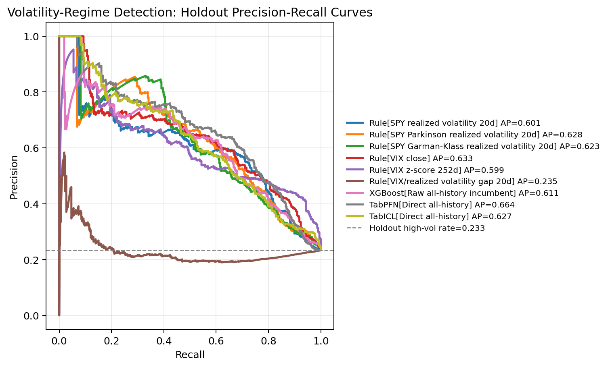
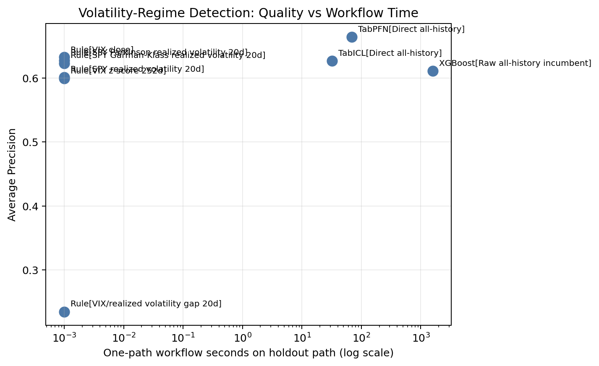
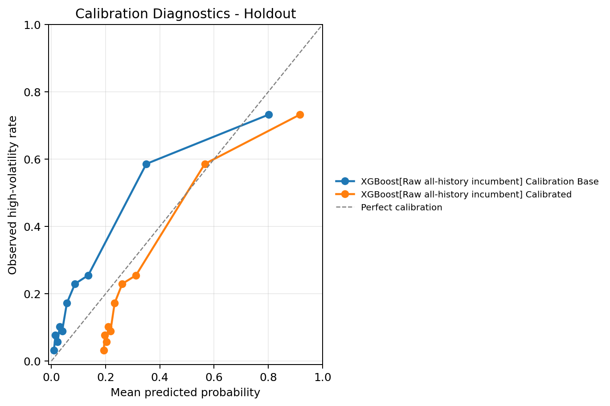
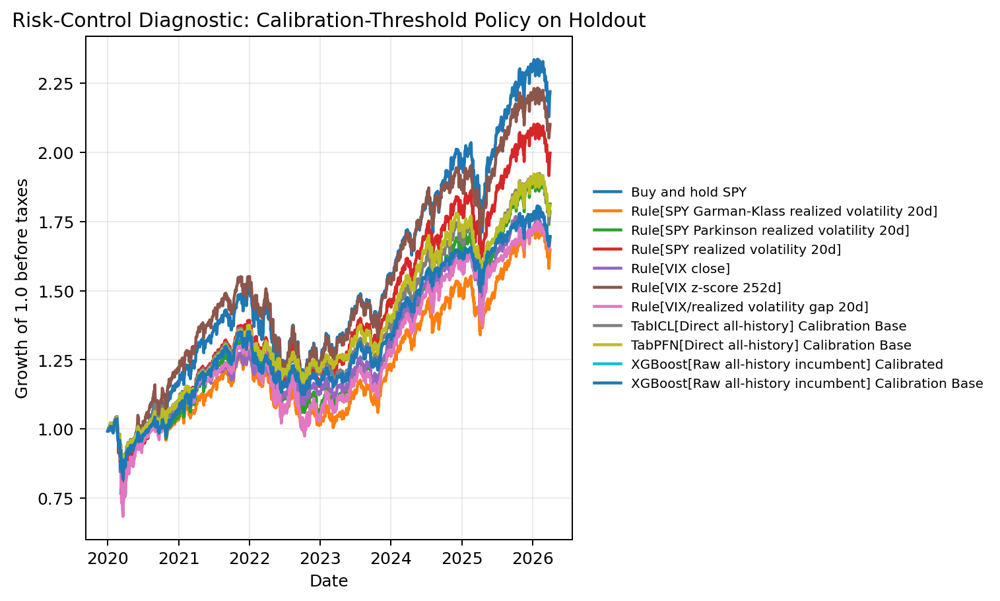

[Mohit Saharan](https://linkedin.com/in/msaharan), P19, 20260507

---

# Volatility-Regime Forecasting with TabPFN, TabICL, and Classical Tabular Models - 2

In [P18](https://open.substack.com/pub/dsaiengineering/p/p18-volatility-regime-forecasting-tabpfn-tabicl--classical-tabular-models?utm_campaign=post-expanded-share&utm_medium=web), I discussed volatility-regime forecasting, where the question was: 

> Given the information available at the close of date \(t\), can a model score whether SPY's realized volatility over the next 20 trading days will fall into a high-volatility regime?

That kind of score can be useful in a business workflow in several ways. A portfolio team might use it to decide when to review gross exposure. A risk team might use it to prioritize stress checks. A model-risk team might use it to monitor whether market conditions are moving outside the regime where a strategy was validated. A product team building investing tools might use it as a risk-state feature rather than as a trading signal. The value is in improving the timing and quality of risk attention.

To explore this question, I built a supervised tabular workflow that used information available at the close date \(t\) to score whether SPY's realized volatility over the next 20 trading days would be high. In that workflow, I compared the performance and workflow-related pros and cons of direct TabPFN and TabICL scoring, XGBoost on raw features, XGBoost on raw features plus TabPFN or TabICL embeddings, and simple volatility-domain rules.

The main result was that direct TabPFN and TabICL looked more useful as scoring models than the embedding-enhanced XGBoost workflows, while raw XGBoost and volatility-domain rules formed competitive baselines. 

This post follows up on P18 while focusing on the business aspects. At the end of that post, I highlighted several limitations of the workflow. In this version, I addressed the most important ones: the validation window is less thin, the volatility-domain baselines are stronger, and the diagnostics now look at threshold sensitivity and market regimes more directly. Some limitations remain, especially around public data, overlapping targets, and regime-dependent validation.

Because the volatility-domain rules were so competitive in P18, I added four more rules to learn how much simple finance structure can explain before a learned model is worth the added complexity. This is important for business evaluation. If a simple volatility-domain rule gives almost the same risk-ranking value as a learned model for almost no expense, the learned model has to justify itself through a clearer alert queue, better robustness, better probability quality, better complementarity, or better downstream decision impact.

I also removed the embedding-enhanced XGBoost workflows from this version. Across P16, P17, and P18, those embedding-enhanced workflows did not consistently improve performance. My guess is that I was doing something wrong there, so I took them out until I understand the reason.

You can find the notebook in my GitHub repository [here](https://github.com/msaharan/dsaiengineering/blob/main/blog/20260507-tabpfn-tabicl-volatility-regime-forecasting-2.assets/tabpfn-tabicl-volatility-regime-forecasting-20260507.ipynb) or you can also [clone it directly](https://www.kaggle.com/code/msaharan/tabpfn-tabicl-volatility-forecasting-20260507) on Kaggle. The notebook is meant to be run with GPU enabled.

## Discussion and results

### Technical changes

The target and final holdout are kept stable. The target is still future 20-trading-day SPY realized volatility crossing an 80th percentile threshold estimated only from data through 2017-12-29. The threshold is 0.200603 annualized realized volatility, and the final holdout is still 2020-01-02 to 2026-04-02.

The important changes are:

- The post-context tuning window now starts in 2010 instead of 2012. That gives optional benchmark tuning more high-volatility examples.
- The volatility-domain baseline set is stronger. P18 used a narrower baseline set; this version reports VIX close, VIX z-score, close-to-close realized volatility, Parkinson realized volatility, Garman-Klass realized volatility, and a VIX-minus-realized-volatility gap rule. These rules have the following definitions: 
  - `VIX close`: the market's implied volatility gauge for the S&P 500. It is a natural forward-looking risk baseline.
  - `VIX z-score 252d`: VIX relative to its own one-year history. This asks whether implied volatility is unusually high compared with its recent context.
  - `SPY realized volatility 20d`: recent close-to-close volatility of SPY. This asks whether volatility has already been elevated.
  - `SPY Parkinson realized volatility 20d`: a high-low range based volatility estimate. It uses intraday range information rather than only close-to-close moves.
  - `SPY Garman-Klass realized volatility 20d`: another range-based volatility estimate that uses open, high, low, and close information.
  - `VIX/realized volatility gap 20d`: the spread between implied and recently realized volatility. In this run, that particular construction is not well aligned with the future high-volatility target.
- The comparison is now direct: TabPFN, TabICL, raw all-history XGBoost, and domain rules.
- The notebook reports threshold sensitivity, named market-regime behavior, score-decile checks, runtime, calibration, uncertainty, drift/leakage checks, and a risk-control diagnostic.

- The feature policy also stays close to P18 but expands slightly with the additional volatility features. 

The split is:

| Window | Dates | Rows | High-vol rows | High-vol rate | Purpose |
|---|---:|---:|---:|---:|---|
| Early context window | 2006-01-03 to 2009-12-31 | 1,007 | 369 | 36.6% | Retained for split continuity |
| Post-context tuning | 2010-01-04 to 2017-12-29 | 2,013 | 235 | 11.7% | Optional benchmark selection |
| Calibration | 2018-01-02 to 2019-12-31 | 503 | 112 | 22.3% | Probability and threshold diagnostics |
| Holdout | 2020-01-02 to 2026-04-02 | 1,571 | 366 | 23.3% | Final future-facing evaluation |
| Raw all-history train | 2006-01-03 to 2019-12-31 | 3,523 | 716 | 20.3% | XGBoost incumbent and direct TabPFN/TabICL context |

This split matters because a business user does not care whether a model only works in a quiet 2012-2017 slice. The score has to survive a holdout that includes COVID, the inflation/rate shock, quiet years, and the more recent 2024-2026 period.

### Main holdout result

The holdout base rate is 23.3%. Average Precision is the main ranking metric because this is an alert-prioritization problem: sort dates from highest expected risk to lowest expected risk.

| Model | AP | ROC AUC | Top 20% recall | Alerts for 80% recall | Workflow seconds |
|---|---:|---:|---:|---:|---:|
| TabPFN direct | 0.664 | 0.830 | 0.577 | 618 | 69.4 |
| VIX close | 0.633 | 0.832 | 0.555 | 611 | 0.0 |
| Parkinson realized volatility | 0.628 | 0.814 | 0.552 | 699 | 0.0 |
| TabICL direct | 0.627 | 0.810 | 0.527 | 750 | 32.0 |
| Garman-Klass realized volatility | 0.623 | 0.802 | 0.519 | 754 | 0.0 |
| XGBoost raw all-history incumbent | 0.611 | 0.813 | 0.552 | 705 | 1592.9 |
| SPY realized volatility | 0.601 | 0.809 | 0.514 | 659 | 0.0 |
| VIX z-score 252d | 0.599 | 0.843 | 0.497 | 616 | 0.0 |
| VIX-realized volatility gap | 0.235 | 0.425 | 0.205 | 1438 | 0.0 |

The business interpretation is:

1. Direct TabPFN has the best broad ranking point estimate.
2. VIX close is almost as useful and costs essentially nothing.
3. TabICL is competitive and faster than TabPFN in this run.
4. XGBoost is respectable but expensive because the workflow includes randomized hyperparameter search.
5. The VIX-realized-volatility gap is a useful negative control: plausible finance features still need validation.

Although the foundation models and the classical ML benchmark perform well at this task, performance alone would not justify their use in production if simple domain rules provide nearly the same ranking value at almost no additional cost. The learned models need to improve the alert queue, add complementary coverage, improve probability quality, or support a better downstream decision.

### Precision-recall curve

The precision-recall curve shows the performance visually. Direct TabPFN, VIX close, Parkinson volatility, Garman-Klass volatility, TabICL direct, XGBoost, close-to-close realized volatility, and VIX z-score all sit well above the random baseline for much of the useful recall range. The curve shows that there are several viable risk-scoring candidates; the operating-point table shows what the queue would actually look like.

### Alert queue impact

The strongest business view is the alert queue.

At 50% recall, direct TabPFN captures half of future high-volatility rows with the shortest queue:

| Model | Alerts for 50% recall | Precision |
|---|---:|---:|
| TabPFN direct | 263 | 0.696 |
| Parkinson realized volatility | 278 | 0.658 |
| XGBoost raw all-history incumbent | 280 | 0.654 |
| VIX close | 282 | 0.649 |
| TabICL direct | 282 | 0.649 |

That is a practical point in TabPFN's favor. A smaller queue means fewer dates requiring review for the same captured share of future high-volatility events.

At 80% recall, the story changes:

| Model | Alerts for 80% recall | Precision |
|---|---:|---:|
| VIX close | 611 | 0.480 |
| VIX z-score 252d | 616 | 0.476 |
| TabPFN direct | 618 | 0.474 |
| SPY realized volatility | 659 | 0.445 |
| Parkinson realized volatility | 699 | 0.419 |
| XGBoost raw all-history incumbent | 705 | 0.416 |
| TabICL direct | 750 | 0.391 |

At high recall, VIX is still slightly more efficient than TabPFN. The difference between VIX close and TabPFN is only seven alerts, so I would not overstate it. The practical message is that the simple implied-volatility signal remains extremely hard to beat when the business goal is broad risk coverage.

At 90% recall, VIX z-score has the shortest queue: 751 alerts with precision 0.439. That is a reminder that "best model" depends on the operating requirement. If the business goal is to capture nearly all high-volatility periods, a normalized VIX signal can be more useful than the model with the best overall AP.

### Threshold sensitivity

A production definition of "high volatility" is not sacred. Risk teams may care about moderately elevated volatility, severe tail volatility, or multiple tiers.

The notebook tests this by holding scores fixed and changing the high-volatility threshold from the 70th to the 90th percentile. This is not a refit. It asks whether the same scores still rank risk well under alternate definitions.

| Sensitivity threshold | Holdout high-vol rate | Best AP row | AP |
|---|---:|---|---:|
| 70th percentile | 35.1% | TabPFN direct | 0.784 |
| 75th percentile | 30.8% | TabPFN direct | 0.761 |
| 80th percentile | 23.3% | TabPFN direct | 0.664 |
| 85th percentile | 17.0% | TabPFN direct | 0.647 |
| 90th percentile | 10.0% | TabICL direct | 0.500 |

This is valuable from a business perspective. TabPFN is robust across the 70th to 85th percentile definitions. TabICL becomes strongest at the stricter 90th percentile definition. That suggests TabICL may be especially worth inspecting for more severe tail-risk definitions, even though TabPFN is stronger at the primary threshold.

### Market regime behavior

The 2020-forward holdout is not one market. It contains different regimes.

| Holdout regime | Rows | High-vol rows | High-vol rate | Best AP row | AP |
|---|---:|---:|---:|---|---:|
| COVID shock 2020 | 253 | 131 | 51.8% | VIX z-score 252d | 0.812 |
| Post-COVID reopen 2021 | 252 | 3 | 1.2% | VIX-realized volatility gap | 0.074 |
| Inflation/rate shock 2022 | 251 | 178 | 70.9% | Garman-Klass realized volatility | 0.840 |
| Late holdout 2024-2026 | 565 | 54 | 9.6% | TabPFN direct | 0.370 |

The quiet 2023 regime is intentionally absent from this table because it has no positive high-volatility rows under the primary target definition, so AP and ROC AUC are undefined. That absence is itself informative: some market blocks do not contain enough target events to support a meaningful model comparison.

This is probably the most important risk-management lesson in the run. Model quality is regime-dependent.

In 2020, a VIX z-score is highly informative because market-implied volatility was extreme relative to its own history. In 2022, range-based realized-volatility estimators work very well because the high-volatility label dominates the year. In the later 2024-2026 period, where the positive rate is much lower, direct TabPFN has the best AP.

For a business user, this means the model should not be monitored only with one full-holdout AP number. It should be monitored by market state. A risk score that works in crisis conditions may not be the best score in quiet conditions, and the reverse can also be true.

### Score-decile sanity check

A risk score should concentrate future high-volatility events in its highest score buckets. The decile check makes that visible.

| Model | Top decile high-vol rate | Bottom decile high-vol rate |
|---|---:|---:|
| Parkinson realized volatility | 78.5% | 4.5% |
| TabICL direct | 75.9% | 1.9% |
| TabPFN direct | 75.3% | 8.3% |
| XGBoost raw all-history incumbent | 74.1% | 2.5% |
| VIX close | 71.5% | 3.8% |
| VIX-realized volatility gap | 27.8% | 51.0% |

This is the kind of diagnostic one might want in a risk dashboard. The top bucket should be meaningfully different from the bottom bucket. Most of the strong models pass that test. The VIX-realized-volatility gap fails it badly in this construction, which explains its poor AP and ROC AUC.

### Runtime and complexity

Runtime should be interpreted carefully. This is notebook workflow time, not a controlled benchmark. Still, the cost signal is useful.

The domain rules are effectively free. VIX close gives AP 0.633 with no model fitting. Parkinson volatility gives AP 0.628 with no model fitting. That is a serious business baseline.

Direct TabICL takes 32.0 seconds in this run and gives AP 0.627. Direct TabPFN takes 69.4 seconds and gives AP 0.664. Those are reasonable workflow costs for an offline research notebook.

The raw all-history XGBoost incumbent takes 1592.9 seconds because it includes randomized hyperparameter search. It gives AP 0.611. That does not mean XGBoost is bad. It means that in this notebook configuration, the extra tuning cost does not buy a stronger holdout ranking than the simpler domain rules or direct TabPFN/TabICL.

### Calibration and probability quality

Ranking and probability quality are different. A model can sort high-risk dates well while still producing probabilities that are too high or too low.

For the selected model configurations that output probabilities:

| Model | Brier score | Log loss | ECE |
|---|---:|---:|---:|
| TabPFN direct | 0.123 | 0.401 | 0.044 |
| TabICL direct | 0.131 | 0.418 | 0.037 |
| XGBoost raw all-history incumbent | 0.133 | 0.425 | 0.040 |

Lower is better for these diagnostics. The probability diagnostics are reasonably close across the learned models. I would still treat these scores primarily as ranking and risk-prioritization tools unless a downstream workflow explicitly needs calibrated probabilities.

### Risk-control diagnostic

This section is not a trading strategy. It is a decision diagnostic.

The notebook asks: if a score marks a date as high risk, what happens if exposure is reduced according to a pre-specified rule? The selected policy uses a 20% target action rate and a 0.5 high-risk weight. The threshold is chosen from the calibration window, so the realized action rate in the holdout can differ from 20%. Transaction costs are included at 1 basis point.

The result shows the tradeoff clearly:

| Policy score | Sharpe | Final equity | Max drawdown |
|---|---:|---:|---:|
| VIX z-score 252d | 0.835 | 2.101 | -25.7% |
| SPY realized volatility | 0.802 | 1.997 | -23.1% |
| TabPFN calibration-base score | 0.797 | 1.808 | -19.9% |
| TabICL calibration-base score | 0.765 | 1.785 | -19.9% |
| VIX close | 0.742 | 1.690 | -19.9% |
| XGBoost calibrated | 0.740 | 1.696 | -21.2% |
| Buy and hold SPY | 0.726 | 2.219 | -33.7% |

Buy-and-hold has the highest final equity in this period, but it also has the largest drawdown. Several risk-score policies reduce drawdown materially while giving up some final equity. That is the actual business tradeoff: risk control versus participation.

The best Sharpe in the selected policy comes from VIX z-score, not from TabPFN. TabPFN gives a more compact classification queue at 50% recall and the highest AP point estimate, but risk-policy utility is not identical to classification ranking. 

### Uncertainty

The notebook uses 300 calendar-month block-bootstrap samples because the 20-day target windows overlap and market regimes cluster in time.

The AP confidence intervals overlap heavily:

| Model | AP point estimate | 95% block-bootstrap interval |
|---|---:|---:|
| TabPFN direct | 0.664 | 0.496 to 0.806 |
| VIX close | 0.633 | 0.437 to 0.777 |
| Parkinson realized volatility | 0.628 | 0.431 to 0.779 |
| TabICL direct | 0.627 | 0.429 to 0.762 |
| Garman-Klass realized volatility | 0.623 | 0.423 to 0.764 |
| XGBoost raw all-history incumbent | 0.611 | 0.392 to 0.764 |

This limits the claim. I would say TabPFN has the best AP point estimate in this run. I would not say it is conclusively better than VIX, TabICL, XGBoost, or the strongest realized-volatility rules.

## Summary and conclusion

This post is less about proving that one model wins and more about understanding how a volatility-regime score could create business value.

Direct TabPFN looks promising as a compact risk-ranking model. It has the strongest holdout AP point estimate, the most compact 50% recall queue, and good score-decile separation. TabICL is also worth attention: it is competitive at the primary threshold, faster than TabPFN in this run, and strongest at the 90th percentile sensitivity threshold. 

XGBoost is a useful classical incumbent but not the best business tradeoff in this notebook configuration. Its AP is respectable, but the randomized-search workflow cost is high relative to the value added over domain rules and direct TabPFN/TabICL scoring.

VIX and realized-volatility rules remain essential baselines. VIX is transparent, economically meaningful, free to compute, and nearly tied with TabPFN at the 80% recall operating point. VIX z-score is especially useful at very high recall and in the risk-control diagnostic. 

The risk-control diagnostic shows that useful classification scores do not automatically translate into the best portfolio-style tradeoff, and the regime diagnostics show that the full holdout is not one stable market state. Moreover, no single metric is enough. AP, alert queues, threshold sensitivity, regime behavior, calibration, runtime, and risk-control diagnostics each answer a different business question.

The conclusion is that tabular foundation models can add value in a finance risk-scoring workflow, but only when they are evaluated next to simple domain rules, operating constraints, regime shifts, and decision diagnostics. 
