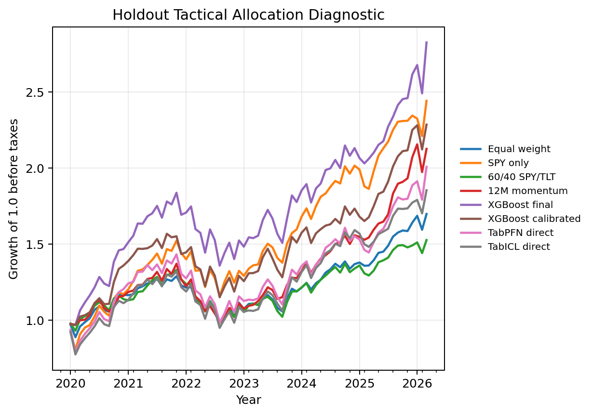
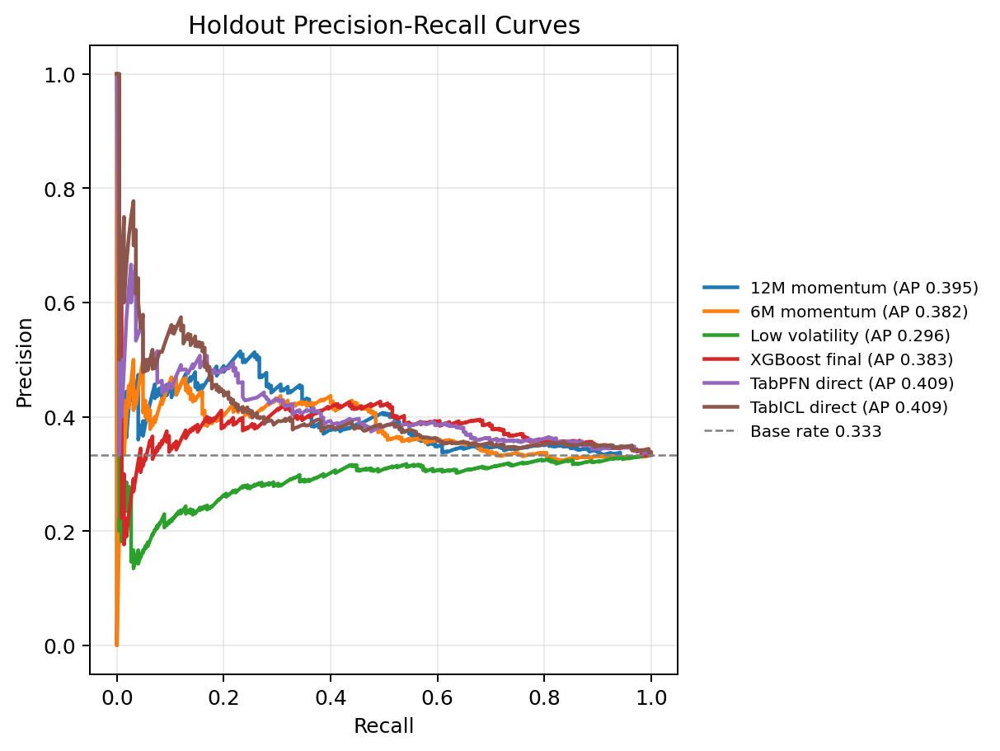
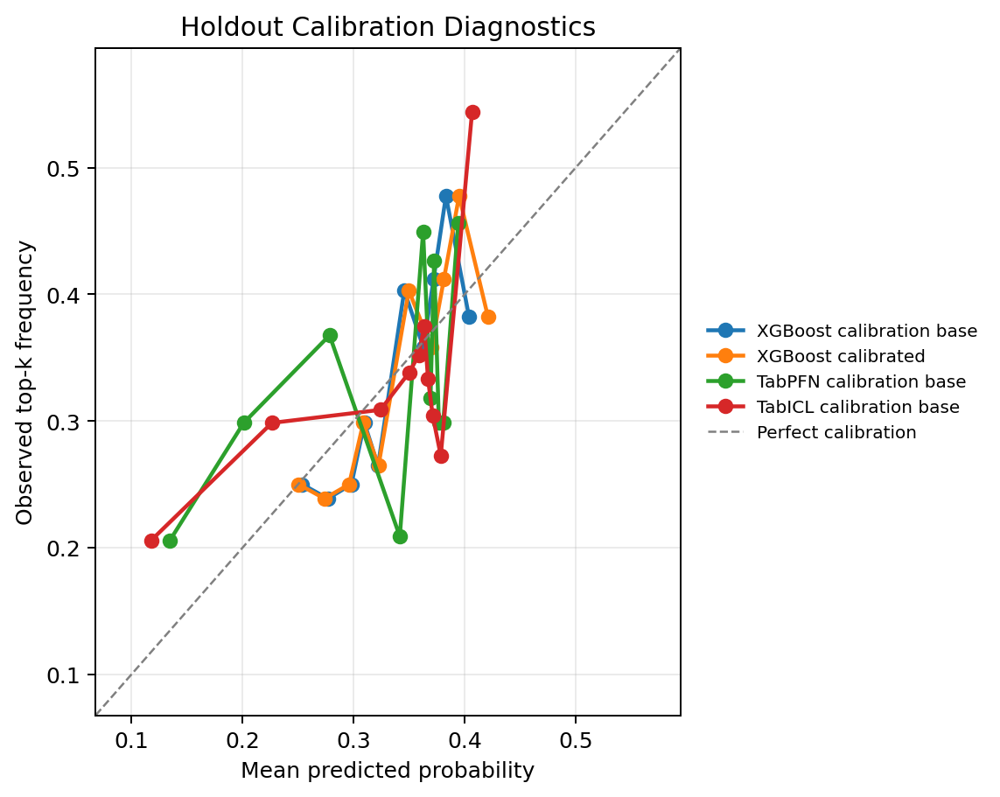
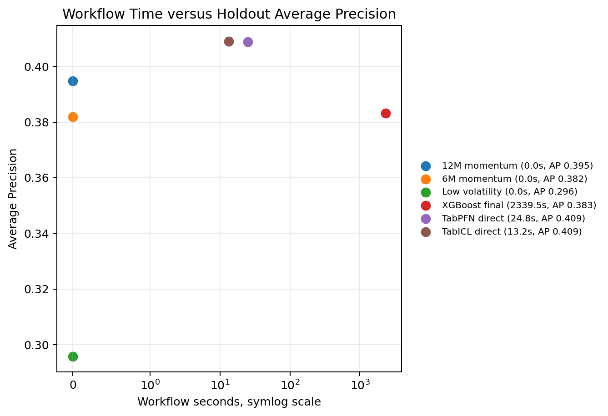

[Mohit Saharan](https://linkedin.com/in/msaharan), P20, 20260508

---

# Tactical asset allocation with TabPFN, TabICL, and XGBoost

This post continues the quantitative-finance part of my tabular foundation model (TFM) series. After the volatility-regime forecasting notebooks in [P18](https://open.substack.com/pub/dsaiengineering/p/p18-volatility-regime-forecasting-tabpfn-tabicl--classical-tabular-models?r=535odk&utm_campaign=post-expanded-share&utm_medium=web) and [P19](https://open.substack.com/pub/dsaiengineering/p/p19-volatility-regime-forecasting-tabpfn-tabicl-classical-ml-models-2?r=535odk&utm_campaign=post-expanded-share&utm_medium=web), I am moving from single-market risk scoring to a cross-asset allocation question. The practical question is:

> Given information available at a monthly signal date, can TabPFN, TabICL, XGBoost, and simple allocation rules rank assets in a public ETF universe by next-month relative attractiveness?

More precisely, I build a supervised tabular workflow that converts monthly tactical asset allocation into a cross-sectional top-group classification problem. Each row is an asset-month observation. The label is whether that asset is among the next-month top three assets in a nine-ETF universe. The models are evaluated as allocation scorers, not as price forecasters. A useful score should help rank assets within each month, remain credible under chronological validation, and survive comparison with simple momentum and benchmark allocation rules.

This is a useful place to test direct TFM scoring because the input-output table is familiar to a supervised ML practitioner, but the workflow mechanism is different. XGBoost learns task-specific parameters from the labelled allocation table. TabPFN and TabICL use labelled rows as context for a pretrained tabular learner and then score later query rows. The notebook therefore asks whether that context-based prediction capability remains useful once the workflow includes chronological splits, leakage checks, calibration diagnostics, deterministic finance rules, and portfolio diagnostics.

The main result is deliberately modest. Direct TabICL and TabPFN are competitive row-level rankers, with holdout Average Precision around 0.409 against a 0.333 base rate. XGBoost has lower row-level Average Precision in this run but stronger monthly portfolio diagnostic point estimates. The 12-month momentum rule remains a serious baseline. The uncertainty intervals overlap enough that I do not treat the exercise as a model-ranking contest. The useful conclusion is that direct tabular foundation model scoring can be evaluated seriously inside a tactical allocation workflow, but classical GPU-accelerated tabular ML and simple finance rules still need to be part of the comparison.

I treat this as a learning-by-building research workflow. The goal is to make the modeling choices explicit enough that a data or AI practitioner can inspect them, and modest enough that a quant finance professional would recognize what is still outside scope. I am not trying to present a finished allocation system. I am trying to build a careful public example of how TFMs can be placed inside a realistic validation and diagnostic structure.

You can find the notebook in my GitHub repository [here](https://github.com/msaharan/dsaiengineering/blob/main/blog/20260508-tabpfn-tabicl-tactical-asset-allocation.assets/tabpfn-tabicl-tactical-asset-allocation-20260508.ipynb), or you can [clone it directly](https://www.kaggle.com/code/msaharan/tabpfn-tabicl-tactical-asset-allocation-20260508) on Kaggle. The notebook is meant to be run with GPU enabled, and the results discussed in this post come from the full research configuration.

## Background and scope

### Series concepts reused here

The most useful prerequisites from earlier posts are P4, P12, P14, P15 to P17, and P18 to P19. I use three ideas from those posts here. First, TabPFN and TabICL can be viewed operationally through a posterior-predictive or in-context prediction lens: labelled rows provide task context for later query rows. Second, time-indexed market problems should be converted into supervised tables without breaking chronological validation. Third, model quality in an applied workflow is not one number; ranking, calibration, runtime, leakage, drift, and downstream decision diagnostics can disagree.

### The allocation task

This post keeps the same supervised tabular framing but changes the finance task. Volatility-regime forecasting asked whether a single market object, SPY, was likely to enter a high-risk state. Tactical asset allocation asks a relative allocation question across several assets:

> Given information available at a monthly signal date, can a model rank assets in a public ETF universe by their next-month attractiveness?

In the notebook, "attractiveness" is defined narrowly and mechanically. An asset is attractive for a given month if its next-month total return is in the top group within the configured ETF universe. This is not the only way to define tactical allocation. A production team might care about excess return over cash, drawdown risk, risk-adjusted return, benchmark-relative active return, mandate constraints, or tax-aware turnover. I use the top-group definition because it turns the allocation problem into a clear supervised tabular classification task while preserving the cross-asset ranking structure that matters for allocation.

The shift from volatility-regime forecasting to tactical allocation changes the interpretation of the supervised task. In volatility-regime forecasting, each row was a market date and the positive class was "future volatility is high." The score was naturally an alert-prioritization or risk-attention score. In tactical allocation, each row is an asset-month pair. The positive class is not "this asset has a good absolute return." It is "this asset belongs to the top group among the assets available in that month." This makes the target relative. The model is not asked to forecast the whole market direction. It is asked to help rank assets within the same market environment.

This is closer to many practical allocation and cross-sectional equity workflows than a single-asset price forecast. A portfolio process often needs to decide how to distribute capital across alternatives, not only whether one asset's return will be positive. Ranking, relative strength, turnover, and allocation stability therefore become central parts of the evaluation.

### Mathematical setup

Let \(i\) index assets in a universe of size \(N\), let \(N_t\) denote the number of assets available at month \(t\), and let \(t\) index monthly signal dates. Let \(P_{i,t}\) be the adjusted close price of asset \(i\) at the end of month \(t\). The next-month simple return is:

$$
R_{i,t+1}
= \frac{P_{i,t+1}}{P_{i,t}} - 1.
$$

At signal date \(t\), \(R_{i,t+1}\) is unknown. It is the future outcome used to define the training label and later evaluate the score. The feature vector for asset \(i\) at date \(t\) is:

$$
x_{i,t}
= \phi_i(\mathcal{F}_t),
$$

where \(\mathcal{F}_t\) denotes the information available at or before the signal date, and \(\phi_i(\cdot)\) is the feature-generation process for that asset and market state. In the notebook, examples include recent asset returns, realized volatility, downside volatility, drawdown, moving-average distance, volume z-scores, beta to SPY, VIX features, Treasury yields, yield-curve features, availability-checked public macro features, and static asset metadata.

For each month, the assets are ranked by their next-month returns. If \(K\) is the number of assets selected as the positive group, the label is:

$$
y_{i,t}
= \mathbf{1}\{
R_{i,t+1}
\text{ is among the top } K
\text{ returns in month } t+1
\}.
$$

Here, \(y_{i,t}=1\) means that asset \(i\) was in the next-month top group, and \(y_{i,t}=0\) means it was not. The indicator \(\mathbf{1}\{\cdot\}\) returns 1 when the condition is true and 0 otherwise.

The supervised learning table is then:

$$
\mathcal{D}
= \{(x_{i,t}, y_{i,t})\}_{i,t}.
$$

The label construction implies:

$$
\sum_{i=1}^{N_t} y_{i,t} = K,
\quad
\bar{y}_t = \frac{K}{N_t}.
$$

Here, \(\bar{y}_t\) is the positive-class rate in month \(t\). In the full holdout run, \(N_t=9\) and \(K=3\), so the monthly base rate is \(3/9=0.333\). This is why the notebook treats 0.333 as the non-informative Average Precision reference.

This notation is close to earlier posts, but there is one important difference. In the volatility-regime posts, the row index was essentially one date \(t\), because the target was a single market-level event for SPY. In this notebook, the row index is a pair \((i,t)\), because each month contributes one row per asset. This turns the problem into a panel-style tabular dataset: many assets observed through time, with a target that is defined relative to other assets in the same month.

### What the score means

A price forecast would ask for a prediction such as:

$$
\hat{P}_{i,t+1}
\quad \text{or} \quad
\hat{R}_{i,t+1}.
$$

That is not what this notebook does. The model produces a score:

$$
s_{i,t}
\approx
\mathbb{P}(y_{i,t}=1 \mid x_{i,t}, \mathcal{D}_{\text{train}}).
$$

The score can be read as a probability estimate if calibration is adequate, or more conservatively as a ranking score. In the allocation diagnostic, the practical use is ranking: for each month, sort assets by \(s_{i,t}\), select the top \(K\), and allocate equal weight to those selected assets.

This distinction matters. A high score does not say that an asset must go up next month. It says that, according to the fitted workflow, the asset has features associated with membership in the next-month top group within the configured universe. An asset can have a high score in a month where every asset loses money. Conversely, an asset can have a positive next-month return and still not be in the top group if several other assets did better.

That is why this notebook evaluates the workflow through both prediction diagnostics and allocation diagnostics. Average Precision and ROC AUC summarize row-level classification quality. Monthly rank correlation and top-\(K\) hit rate ask whether the scores are useful within each monthly cross-section. Portfolio diagnostics ask what happens when those scores are translated into a simple allocation rule with transaction costs.

### Chronological validation and leakage

Financial data is ordered in time, so random train-test splits are inappropriate. They can leak future regimes into model selection and make a model look more stable than it would be in a real research process.

The core rule is the same as in P18 and P19:

> At signal date \(t\), features may use information available at or before \(t\), but the label uses returns after \(t\).

The notebook uses chronological windows. Earlier data is used for model selection, a later pre-holdout window is used for calibration diagnostics, and the final period is reserved for holdout evaluation. Feature filtering and imputation are fitted before the calibration and holdout windows. That matters because even preprocessing can leak information if it is fitted on the full dataset.

The target also has a cross-sectional leakage risk. The label for asset \(i\) in month \(t\) is defined by comparing \(R_{i,t+1}\) with the other assets' \(R_{j,t+1}\) in the same future month. That future cross-sectional ranking is allowed for label construction, but none of those future returns can enter the feature vector \(x_{i,t}\). The notebook therefore excludes forward returns, forward excess returns, future ranks, and target columns from model features.

This design is still a public-data research workflow, not a production market-data system. Public ETF data from yfinance, public VIX history, and public FRED series are useful for reproducibility, but they do not provide the same guarantees as a licensed point-in-time institutional data store. That limitation is part of the reason the notebook includes an explicit leakage and reuse checklist.

### XGBoost versus direct TFMs

The input-output table is the same for XGBoost and the direct TFM scorers: rows contain features \(x_{i,t}\), and labels contain top-\(K\) membership \(y_{i,t}\). The difference is how each model uses that table. For a classical supervised model such as XGBoost, fitting means learning task-specific parameters from the current labelled dataset. Conceptually, the model is selected from a function class \(\mathcal{G}\) by minimizing a training objective:

$$
\hat{f}
= \arg\min_{f \in \mathcal{G}}
\sum_{(x_{i,t},y_{i,t}) \in \mathcal{D}_{\text{train}}}
\ell(y_{i,t}, f(x_{i,t})).
$$

Here, \(\mathcal{G}\) is the candidate class of scoring functions, \(\ell\) is the loss function, and \(\hat{f}\) is the fitted allocation scorer. Hyperparameter tuning then selects a configuration using chronological validation folds. In the notebook, XGBoost is the main classical supervised benchmark because it can run on GPU and is a strong practical baseline for tabular data.

For TabPFN and TabICL, the workflow is different. The large model is already pretrained. The labelled rows supplied through `.fit()` are better understood as task context rather than as the same kind of task-specific weight training used by XGBoost. In notation similar to P4 and P18, the prediction is closer to:

$$
\mathbb{P}(y_{\text{new}} \mid x_{\text{new}}, X_{\text{context}}, y_{\text{context}}),
$$

where \(x_{\text{new}}\) is a query row, \(y_{\text{new}}\) is the unknown label, \(X_{\text{context}}\) is the context feature matrix, and \(y_{\text{context}}\) is the corresponding vector of context labels.

This difference is the main reason to test tabular foundation models in this kind of notebook. A standard model such as XGBoost asks whether a task-specific learner can find a useful mapping from engineered market features to the top-\(K\) label. A tabular foundation model asks a related but different question: whether a pretrained in-context tabular learner can use the labelled allocation history as context and produce useful scores for later asset-month rows without the same task-specific training process.

The new capability being exercised here is therefore not that TFMs remove the need for careful data construction. They do not. The capability being tested is whether a pretrained tabular learner can use a relatively small labelled context and produce useful task-specific scores without the same hyperparameter-search and task-specific fitting procedure used by XGBoost. That is why the notebook still includes deterministic rules, chronological validation, calibration checks, and portfolio diagnostics. The TFM component is only one part of the workflow.

This is not a claim that tabular foundation models are automatically better for allocation. The value has to be demonstrated empirically against strong baselines, simple finance rules, runtime costs, and validation constraints. In this notebook, TabPFN and TabICL are evaluated as direct scorers. They are not used as embedding generators in the default path. That keeps today's comparison focused on a simpler operational question: can direct TFM scoring be useful in a monthly allocation workflow?

### Evaluation scope

The row-level classification target is imbalanced because only the top \(K\) assets in each month receive label 1. If the universe has \(N\) assets and all assets are available, the base rate is approximately \(K/N\). Accuracy is therefore not a very informative primary metric. A model can look accurate by mostly predicting the majority class and still be unhelpful for allocation.

Average Precision is useful because it evaluates the ranked list of asset-month rows by summarizing precision as recall increases. Precision is the fraction of selected or flagged rows that are true positives, and recall is the fraction of all true positives that have been selected or flagged. For a non-informative ranking, the expected precision is close to the positive-class base rate, which is why the 0.333 top-k label rate is the main reference point here. ROC AUC is also reported because it asks how often a randomly chosen positive row is ranked above a randomly chosen negative row. For allocation, however, row-level metrics are not sufficient. The model is used month by month, so the cross-sectional ordering inside each month matters.

A monthly rank diagnostic asks whether high scores correspond to higher next-month returns within the same month. One summary is Spearman rank correlation between scores and realized next-month returns:

$$
\rho_t
= \operatorname{corr}_{\text{Spearman}}
\left(
\{s_{i,t}\}_{i=1}^{N_t},
\{R_{i,t+1}\}_{i=1}^{N_t}
\right).
$$

Here, \(N_t\) is the number of available assets in month \(t\). A positive value means that, in that month, higher model scores tended to align with higher next-month returns. This is only one diagnostic; it does not include transaction costs or portfolio constraints.

The allocation diagnostic converts scores into portfolio weights. In the simple top-\(K\) equal-weight rule used here:

$$
w_{i,t}
=
\begin{cases}
1/K, & \text{if asset } i \text{ is selected in the top } K \text{ by score at } t, \\
0, & \text{otherwise.}
\end{cases}
$$

The next-month portfolio return before costs is:

$$
R^{p}_{t+1}
= \sum_i w_{i,t} R_{i,t+1}.
$$

The notebook also subtracts a simple transaction-cost term based on absolute weight turnover. If \(c\) is the transaction-cost rate and:

$$
\tau_t
= \sum_i |w_{i,t} - w_{i,t-1}|,
$$

then the net diagnostic return is:

$$
\widetilde{R}^{p}_{t+1}
= R^{p}_{t+1} - c \tau_t.
$$

The first month is treated as an initial allocation in the notebook. This does not make the diagnostic a production backtest. It is a controlled way to ask whether the score remains interesting after a basic cost penalty and monthly reallocation mechanics are included.

Calibration is a separate question. If the score is used only to rank assets within a month, a monotonic transformation of the score may not change the allocation. If the score is interpreted as:

$$
\mathbb{P}(y_{i,t}=1 \mid x_{i,t}),
$$

then probability quality matters. The notebook therefore reports Brier score, log loss, expected calibration error, and reliability-bin artifacts. Brier score is the mean squared error of predicted probabilities, log loss penalizes confident wrong probabilities, and expected calibration error compares binned predicted probabilities with observed frequencies. As in previous posts, I treat calibration diagnostics as complementary to ranking diagnostics rather than as replacements for them.

With these diagnostics defined, the scope of the post is intentionally narrow. This is a first tactical asset-allocation workflow test. It is in scope to ask whether deterministic allocation rules, XGBoost, direct TabPFN, and direct TabICL produce useful next-month top-group scores under chronological validation.

It is also in scope to inspect row-level classification quality, monthly rank quality, calibration, runtime, month-block bootstrap uncertainty, feature drift, leakage checks, and a simple transaction-cost-aware allocation diagnostic.

It is not in scope to claim a trading strategy, forecast exact asset prices, optimize a production portfolio, account for taxes, model liquidity in detail, or produce a definitive benchmark for financial ML. 

The useful contribution is narrower: a reproducible workflow for testing tabular foundation models as components inside a realistic, but still public-data-based, tactical allocation research pipeline.

## Code discussion and results

### Dataset and chronological splits

The notebook builds a monthly panel from nine liquid ETFs: SPY, QQQ, IWM, TLT, IEF, GLD, HYG, EEM, and VNQ. Each row is an asset-month observation. The target is whether that asset is among the next-month top three assets in the universe. With nine assets and three positives per full month, the natural class base rate is close to 33.3 percent. This base rate is important when reading the results: an Average Precision near 0.33 is approximately what a non-informative scorer should achieve, while values above that level indicate some ranking information.

The final modeling frame contains 2,172 asset-month rows across 243 monthly signal dates. The holdout window contains 675 rows across 75 months from January 2020 through March 2026. This period is a useful stress period for evaluation because it includes the COVID shock, the 2022 inflation and rate-hiking cycle, the subsequent recovery, and several large cross-asset rotations. It is also a difficult period for stable model selection, so the results should be interpreted as evidence from one demanding holdout window rather than as a universal ranking of methods.

| window | months | rows | positives | positive rate | date range |
|---|---:|---:|---:|---:|---|
| context | 72 | 633 | 216 | 34.1% | 2006-01-31 to 2011-12-31 |
| model selection | 144 | 1,281 | 432 | 33.7% | 2006-01-31 to 2017-12-31 |
| calibration | 24 | 216 | 72 | 33.3% | 2018-01-31 to 2019-12-31 |
| pre-holdout | 168 | 1,497 | 504 | 33.7% | 2006-01-31 to 2019-12-31 |
| holdout | 75 | 675 | 225 | 33.3% | 2020-01-31 to 2026-03-31 |

The split design is deliberately chronological. Model selection uses rolling validation folds inside the pre-holdout history, calibration is evaluated after the selection window, and the final holdout remains untouched until the final scoring step. The feature policy is also fitted before calibration and holdout evaluation. That detail matters because feature filtering, missingness decisions, and imputation can otherwise leak holdout distribution information into the model.

### Feature construction and data availability

The full run starts from market, volatility, rate, volume, relative-strength, drawdown, beta, and asset-identity features. The feature policy keeps candidate features only if they have enough non-missing observations in the model-selection source window and do not exceed the configured missingness threshold. After the FRED availability gate, 209 numeric candidate features are reviewed, all 209 base features are retained, 187 missingness indicators are added, and the final model matrix contains 396 columns.

This is a practical compromise. Public market and macro series are useful for reproducibility, but they are not equivalent to a licensed point-in-time data warehouse. A concrete example is credit-spread data. In this run, five FRED series have enough selection-window coverage and are included in features. The two public OAS series attempted through FRED, `BAMLH0A0HYM2` and `BAMLC0A0CM`, start only on 2023-05-09 in the downloaded file and have zero non-missing observations in the model-selection window. The notebook records their availability and excludes them from the model matrix rather than silently imputing unavailable credit-spread history.

The static asset-identity signal is encoded through ticker indicators rather than an ordinal numeric `asset_id`. This avoids giving the model an artificial numeric ordering among ETFs. A fixed identity signal is still a modeling choice: it lets the model learn persistent differences between asset classes, but it also means the result is tied to the configured universe rather than to a fully universe-agnostic allocation rule.

### Scorers compared

The notebook compares five scorer families. The deterministic rules provide finance-domain references, including momentum and low-volatility rules. The dummy prior provides a non-informative classification reference at the 0.333 base rate, but it is excluded from portfolio diagnostics because constant scores create arbitrary top-k tie-breaking. XGBoost is the GPU-accelerated classical supervised learner with rolling chronological model selection and calibration variants. TabPFN and TabICL are evaluated as direct allocation scorers: they receive labelled asset-month rows as context and score later holdout rows without the same task-specific fitting process used by XGBoost.

### Row-level ranking results

The first result view is row-level classification performance on the holdout period. Average Precision is the main metric because the target is a top-group label with a 33.3 percent base rate. ROC AUC, Brier score, expected calibration error, and runtime are shown here because they answer different questions. The notebook also saves log loss in the full artifact table.

| scorer | Average Precision | ROC AUC | Brier | ECE | workflow seconds |
|---|---:|---:|---:|---:|---:|
| TabICL direct | 0.409 | 0.565 | 0.219 | 0.061 | 13.2 |
| TabPFN direct | 0.409 | 0.580 | 0.219 | 0.045 | 24.8 |
| 12M momentum rule | 0.395 | 0.560 |  |  |  |
| XGBoost calibrated | 0.388 | 0.588 | 0.218 | 0.037 | 2,339.4 |
| XGBoost final | 0.383 | 0.581 | 0.219 | 0.052 | 2,339.5 |
| 6M momentum rule | 0.382 | 0.546 |  |  |  |
| risk-adjusted momentum rule | 0.381 | 0.537 |  |  |  |
| dummy prior | 0.333 | 0.500 |  |  |  |
| low-volatility rule | 0.296 | 0.439 |  |  |  |

The direct TabICL and TabPFN scores have the highest holdout Average Precision point estimates, both around 0.409. This is above the 0.333 base rate and above the deterministic momentum rules. The magnitude should be read carefully, though. The lift is meaningful for a difficult monthly cross-sectional task, but it is not large enough to support a strong claim of stable model-family superiority.

XGBoost illustrates why several metrics are needed. Its calibrated variant has a lower Average Precision point estimate than TabPFN and TabICL, but its ROC AUC is slightly higher. Average Precision focuses more directly on the positive class and on early ranking quality, while ROC AUC averages pairwise ranking behavior over the whole score distribution. In an allocation workflow that selects only the top few assets each month, Average Precision and monthly top-k diagnostics are usually more directly relevant than ROC AUC alone.

The deterministic rules are important baselines. The 12-month momentum rule is competitive with the learned models, which is not surprising in an asset-allocation setting. A learned model that cannot improve on simple relative-strength rules would not be very persuasive. The low-volatility rule performs poorly in this particular holdout window, which is also informative: it shows that not every simple financial heuristic is rewarded in the 2020-2026 regime.

The dummy prior is retained for classification calibration context, but it is not used as a portfolio scorer. A constant-prior score creates ties across all assets; converting those ties into a top-k portfolio would depend on arbitrary tie-breaking and can produce misleading deterministic selections.

The precision-recall figure shows the same result visually. The horizontal reference line is the holdout base rate. Curves that stay above this line are ranking positives better than a non-informative scorer. The TabPFN and TabICL curves sit modestly above the baseline over useful parts of the recall range, but they are not separated enough from the other competitive methods to justify strong superiority language.

### Monthly cross-sectional ranking results

Row-level classification metrics pool all asset-month rows together. Tactical allocation is implemented month by month, so the notebook also evaluates whether each scorer ranks assets well inside each monthly cross-section. The monthly diagnostics include mean Spearman information coefficient, top-k hit rate, average selected next-month return, average universe next-month return, and the difference between selected and universe returns.

| scorer | mean monthly IC | top-k hit rate | selected mean monthly return | universe mean monthly return | active monthly return |
|---|---:|---:|---:|---:|---:|
| XGBoost final | 0.118 | 0.436 | 1.54% | 0.78% | 0.76% |
| XGBoost calibrated | 0.093 | 0.404 | 1.25% | 0.78% | 0.47% |
| TabPFN direct | 0.094 | 0.404 | 1.11% | 0.78% | 0.33% |
| 12M momentum rule | 0.106 | 0.409 | 1.10% | 0.78% | 0.33% |
| risk-adjusted momentum rule | 0.054 | 0.378 | 1.02% | 0.78% | 0.24% |
| TabICL direct | 0.084 | 0.400 | 0.99% | 0.78% | 0.22% |
| 6M momentum rule | 0.077 | 0.396 | 0.99% | 0.78% | 0.21% |
| low-volatility rule | -0.106 | 0.289 | 0.43% | 0.78% | -0.35% |

This view changes the emphasis. XGBoost final has the strongest monthly rank diagnostic point estimates in the full run, even though TabPFN and TabICL have stronger row-level Average Precision point estimates. That is not a contradiction. Average Precision pools rows across the full holdout. Monthly rank diagnostics ask a narrower allocation question: in each month, did the scorer put the better next-month assets closer to the top of that month's list?

The 12-month momentum rule remains a serious baseline here as well. Its mean monthly IC and top-k hit rate are close to the direct TabPFN result. For a professional reader, this is an important result rather than an inconvenience. In tactical allocation, a model has to be compared against simple, interpretable allocation rules that already encode domain structure.

The negative low-volatility result is also useful. It indicates that this holdout period rewarded relative strength and risk-on selection more than defensive low-volatility selection. That interpretation is period-specific; it should not be generalized into a permanent statement about low-volatility investing.

### Portfolio translation

The portfolio diagnostic converts each score into a simple monthly top-three equal-weight portfolio and subtracts a transaction-cost assumption of 5 basis points per unit of absolute weight turnover. This is not a production backtest. It does not model taxes, market impact, execution timing beyond the close-to-close convention, fund-specific trading costs, mandate constraints, or liquidity rules. It is a controlled diagnostic for asking whether a score remains useful after it is translated into a repeatable allocation rule.

| portfolio | CAGR | annual volatility | Sharpe | max drawdown | annual turnover | final equity |
|---|---:|---:|---:|---:|---:|---:|
| XGBoost final top-k | 18.1% | 17.7% | 1.03 | -26.1% | 4.32 | 2.83 |
| 12M momentum top-k | 12.8% | 13.3% | 0.98 | -27.9% | 4.64 | 2.13 |
| SPY only | 15.4% | 17.4% | 0.91 | -23.9% | 0.16 | 2.44 |
| XGBoost calibrated top-k | 14.1% | 16.7% | 0.88 | -26.6% | 5.49 | 2.29 |
| risk-adjusted momentum top-k | 11.5% | 13.9% | 0.85 | -26.1% | 7.41 | 1.97 |
| 6M momentum top-k | 10.9% | 15.1% | 0.76 | -25.5% | 6.24 | 1.91 |
| equal weight | 8.8% | 12.7% | 0.73 | -23.2% | 0.16 | 1.70 |
| TabPFN direct top-k | 11.8% | 19.6% | 0.67 | -31.3% | 3.68 | 2.01 |
| low-volatility top-k | 4.8% | 7.5% | 0.67 | -13.4% | 2.51 | 1.34 |
| TabICL direct top-k | 10.4% | 18.7% | 0.62 | -28.1% | 4.85 | 1.85 |
| inverse-volatility benchmark | 6.0% | 10.2% | 0.62 | -21.3% | 1.13 | 1.44 |
| 60/40 benchmark | 7.0% | 13.5% | 0.57 | -26.2% | 0.16 | 1.53 |

The portfolio table gives a different perspective from the row-level model table. XGBoost final has the strongest portfolio diagnostic point estimates in this run, with a 18.1 percent CAGR, 1.03 Sharpe ratio, and final equity of 2.83 over the holdout period. SPY-only has a high final equity of 2.44, but it is a concentrated single-asset benchmark and has a lower Sharpe ratio than the XGBoost final diagnostic portfolio. The 12-month momentum rule remains strong and is a serious reference point for the learned models.

The direct TabPFN and TabICL portfolios finish above initial capital and above equal weight in final equity, but they do not dominate the stronger classical and deterministic allocation baselines. Their higher row-level Average Precision does not automatically translate into the strongest allocation outcome. This is why the notebook reports several diagnostic layers. A scorer can rank positives well in aggregate, yet still produce a higher-turnover or less stable top-k portfolio.

The equity-curve figure helps separate level, volatility, and drawdown behavior. The relevant reading is not only which line ends highest. A professional allocation review would also ask whether the path is stable, whether performance is concentrated in a few months, how much turnover is required, and whether a simpler benchmark offers a similar result with less operational complexity. The figure plots the final XGBoost scorer as well as its calibrated counterpart because the portfolio table shows that the distinction matters. The notebook also excludes the constant-prior dummy and duplicated deterministic rule portfolios from this score-driven portfolio view. In the post table, I present one calibrated XGBoost portfolio view when calibration-base and calibrated selections produce the same monthly allocation path.

### Calibration and probability quality

Calibration is evaluated separately from ranking. If scores are used only to sort assets within a month, a monotonic calibration transform may leave the top-k selection unchanged. If scores are presented as probabilities of next-month top-group membership, then calibration becomes part of the model quality assessment.

The XGBoost calibrated score improves the Brier score from 0.21875 to 0.21797 and expected calibration error from 0.0520 to 0.0366, while leaving Average Precision unchanged at 0.3877 for the calibrated-base score. This is the expected behavior for a monotonic probability calibration method: it can improve probability reliability without changing the ranking order materially.

TabPFN direct and TabICL direct have similar Brier scores around 0.219. Their expected calibration errors are about 0.045 and 0.061, respectively. These are not poor numbers for this task, but they also do not support an interpretation that the TFM scores are already production-grade probabilities. In this workflow, the most defensible interpretation of the scores is as ranking scores, with calibration diagnostics reported for transparency.

The calibration figure compares predicted probability bins with observed positive rates. A perfectly calibrated model would lie close to the diagonal. The zoomed view is useful because most probabilities are concentrated in a relatively narrow range rather than across the full 0 to 1 interval. That concentration is reasonable in this task: with three positives out of nine assets each month, even useful scores should not usually produce extreme probabilities.

### Runtime and research cost

Runtime is part of the research result, not just an engineering detail. XGBoost performs a broad randomized hyperparameter search under rolling chronological validation, so its workflow time is much longer than the direct TFM scorers in this run. TabPFN direct takes about 25 seconds and TabICL direct about 13 seconds, while the full XGBoost search takes about 39 minutes.

The runtime versus Average Precision figure shows the main engineering tradeoff. Direct TabPFN and TabICL provide competitive Average Precision at much lower workflow time. XGBoost is slower because it is being tuned more extensively, but in this run its final scorer produces the strongest portfolio diagnostic point estimates. The practical implication is not that one method is always better. It is that the right model choice depends on the research objective: quick direct scoring, probability quality, portfolio behavior, interpretability, or a more exhaustive supervised tuning process.

### Uncertainty, drift, and leakage

The notebook uses month-block bootstrap intervals so that uncertainty is resampled at the month level rather than by treating individual asset rows as independent observations. This matters because rows from the same month share the same market regime and are linked by the top-k target definition.

| scorer | AP | AP 95% interval | mean monthly IC | IC 95% interval | top-k hit rate | hit-rate 95% interval |
|---|---:|---:|---:|---:|---:|---:|
| TabICL direct | 0.409 | 0.358 to 0.473 | 0.084 | -0.030 to 0.182 | 0.400 | 0.333 to 0.467 |
| TabPFN direct | 0.409 | 0.362 to 0.472 | 0.094 | -0.004 to 0.205 | 0.404 | 0.342 to 0.471 |
| 12M momentum rule | 0.395 | 0.353 to 0.453 | 0.106 | 0.009 to 0.206 | 0.409 | 0.351 to 0.471 |
| XGBoost final | 0.383 | 0.344 to 0.438 | 0.118 | 0.015 to 0.220 | 0.436 | 0.373 to 0.493 |
| XGBoost calibrated | 0.388 | 0.350 to 0.439 | 0.093 | -0.008 to 0.192 | 0.404 | 0.347 to 0.462 |
| low-volatility rule | 0.296 | 0.273 to 0.336 | -0.106 | -0.216 to 0.007 | 0.289 | 0.218 to 0.364 |

The intervals are the main reason to avoid strong superiority language. TabICL and TabPFN have the highest AP point estimates, but their AP intervals overlap with the intervals for momentum and XGBoost. XGBoost final has the highest monthly IC and top-k hit-rate point estimates, and its IC interval is positive in this run, but it still should be read as holdout evidence rather than proof of a stable trading edge.

The low-volatility rule has the least favorable diagnostic profile in this comparison. Its Average Precision interval is below most other methods, and its mean monthly IC is negative. Even there, the correct interpretation is period-specific: the holdout regime did not favor this defensive rule under the notebook's top-k target and universe.

The feature-drift report shows substantial distribution changes between model-selection history and holdout. The largest population stability index values are concentrated in rate, yield-curve, beta, and volatility-related features. Examples include EEM beta to SPY, the 10-year minus 2-year yield curve, fed funds rate changes, Treasury yields, and ETF beta features.

This is not a defect in the notebook. It is the market environment the model has to face. A holdout from 2020 to 2026 is materially different from much of the 2006 to 2017 selection period. The implication is that model performance should be interpreted together with drift: a scorer that looks useful here has been evaluated through a demanding regime shift, but the same drift also warns against assuming stationarity.

The leakage checklist passes the main mechanical checks: target columns are excluded from the feature matrix, chronological splitting is preserved, feature policy and imputation are fitted before calibration and holdout evaluation, and next-month returns are used only as labels. The notebook also records the close-to-close convention. Features are computed from month-end values and next-month returns are measured from that same adjusted close to the next month-end adjusted close. This is a diagnostic convention rather than a fully executable live trading assumption. A production implementation would need an explicit trade-date and execution-price model.

### Result interpretation

The empirical story is deliberately mixed. Direct TabPFN and TabICL have the strongest row-level Average Precision point estimates, which is useful evidence that direct TFM scoring can be competitive in this allocation framing. XGBoost final has the strongest monthly rank and portfolio diagnostic point estimates, which shows why a classical supervised baseline remains essential. The 12-month momentum rule remains close enough to the learned models that it should be treated as a serious domain benchmark rather than a weak baseline. The bootstrap intervals overlap materially, so the right reading is not that one model family wins. The right reading is that direct TFM scoring, GPU XGBoost, and simple allocation rules each answer part of the workflow question, and the final judgment depends on ranking quality, allocation behavior, calibration, runtime, uncertainty, and data limitations together.

## Known limitations

The most important limitation is that this is a public-data research workflow, not an institutional production allocation system. The notebook uses yfinance, public Cboe VIX history, and public FRED files. That makes the workflow reproducible, but it does not provide the data lineage, point-in-time guarantees, vendor corrections, corporate-action controls, or operational monitoring that a production investment process would require.

The execution convention is also simplified. Features are computed from month-end close information, and the allocation diagnostic applies scores to the next close-to-close monthly return. The notebook documents this assumption, but it does not model when the month-end data becomes available, what price could actually be traded, whether a next-open execution convention would change the result, or how intraday slippage and market impact would affect rebalancing.

The universe is intentionally small. A nine-ETF universe is useful for a controlled notebook because the target is easy to inspect and the model behavior can be reviewed asset by asset. It is not large enough to represent the full complexity of a professional tactical allocation universe. The top-three label is also coarse: with nine assets, one third of the universe is labelled positive each month. A broader universe would make the ranking problem more realistic and would likely change the relative value of different models.

The portfolio diagnostic should not be read as a deployable backtest. It uses equal-weight top-k selection, a simple turnover-cost assumption, and a small number of benchmark portfolios. It does not include taxes, borrow constraints, fund-specific bid-ask spreads, market impact, capacity, mandate constraints, benchmark-relative risk budgets, turnover penalties during model selection, or drawdown-aware optimization. The diagnostic is useful for testing whether scores have allocation relevance; it is not sufficient for live portfolio approval.

The feature design includes ticker identity indicators and asset-group metadata. That is defensible for a fixed-universe allocator because the model may need to distinguish persistent asset-class behavior. It also limits the interpretation. Some of the signal may come from learning persistent ETF identities rather than from fully reusable market-state relationships. A stronger follow-up should include an identity-ablated run and compare how much performance remains when ticker identity is removed.

The uncertainty analysis is helpful but not definitive. Month-block bootstrap intervals are more appropriate than row-level independent resampling for this panel, but they still summarize only the observed holdout period. The 2020-2026 holdout contains important market regimes, yet it is still one historical path. The overlapping confidence intervals across TabPFN, TabICL, XGBoost, and momentum rules mean that the results should be interpreted as evidence of competitiveness, not as proof of stable model superiority.

Finally, the notebook evaluates direct TabPFN and TabICL scoring, not every possible way to use tabular foundation models. It does not test TFM embeddings, hybrid TFM-plus-XGBoost pipelines, larger universes, multi-horizon targets, benchmark-relative objectives, or constrained portfolio optimization. Those are natural extensions, but they are outside the scope of this post.

## Summary and conclusion

This post treated tactical asset allocation as a supervised tabular ranking problem. The objective was not to forecast exact prices or claim a deployable trading strategy. The objective was narrower: build a reproducible public-data workflow that asks whether different scorers can identify the next-month top group within a small ETF universe under chronological validation.

The empirical picture is mixed in a useful way. Direct TabICL and TabPFN produce the strongest holdout Average Precision point estimates, around 0.409 versus a 0.333 base rate. That is consistent with the pretrained tabular foundation models using the labelled asset-month context in a way that contains some cross-sectional ranking information. At the same time, the portfolio diagnostic favors the final XGBoost scorer, and the 12-month momentum rule remains highly competitive. This is the kind of result I would expect from a serious workflow test: the newer model class can be useful in this setup, but it does not make strong classical baselines or simple domain rules irrelevant.

The uncertainty analysis also matters. The confidence intervals overlap materially across the main competitive methods. XGBoost has the strongest monthly IC and top-k hit-rate point estimates in the holdout, while TabICL and TabPFN have the strongest row-level Average Precision point estimates. These are not contradictory findings; they show that different evaluation views answer different questions. For allocation work, row-level ranking, monthly cross-sectional ranking, portfolio behavior, turnover, calibration, and drift should be read together.

My conclusion is that direct TabPFN and TabICL scoring deserves attention in applied financial tabular workflows, but the evidence should be presented carefully. In this notebook, TFMs are credible components in a tactical allocation research pipeline. They are not shown to be universally better than XGBoost or momentum rules, and the notebook does not establish live trading suitability. The stronger contribution is the workflow itself: chronological splits, leakage checks, GPU-first model comparison, saved artifacts, calibration diagnostics, transaction-cost-aware portfolio diagnostics, month-block uncertainty, and explicit documentation of public-data limitations.

## Outlook

The next step is to make the allocation testbench more demanding. The current universe has nine ETFs and a top-three monthly target. That is enough for a controlled blog example, but it is still a small universe. A broader ETF universe, sector funds, international exposures, commodities, currencies, and duration buckets would create a more realistic cross-sectional ranking problem and make top-k selection less coarse.

The second direction is model-design sensitivity. The current notebook uses ticker identity indicators and asset-group metadata. That is defensible for a fixed-universe allocator, but it should be tested. A useful follow-up would compare the current feature set with an identity-ablated version, a metadata-only version, and a strictly time-series feature version. If performance depends heavily on persistent ticker identity, the interpretation is different from a model that generalizes mainly from market-state and asset-behavior features.

The third direction is portfolio realism. The current diagnostic includes monthly turnover costs, but it still uses a simple close-to-close convention. A stronger research version would include next-open or volume-weighted execution assumptions, wider transaction-cost sensitivity, liquidity filters, concentration limits, turnover constraints, drawdown-aware objectives, and benchmark-relative risk controls. Those additions would move the notebook closer to an institutional research prototype, although still not to a production trading system.

Finally, there is room to compare direct TFM scoring with the embedding workflows from earlier posts. In this notebook, TabPFN and TabICL are used as direct allocation scorers. A later version could test whether TFM embeddings improve a supervised XGBoost or neural ranking pipeline, and whether that hybrid approach is more stable than direct TFM scoring under regime drift. That would connect this allocation workflow back to the embedding-based fraud workflows from P16 and P17, while keeping the evaluation discipline from the volatility-regime and allocation posts.
