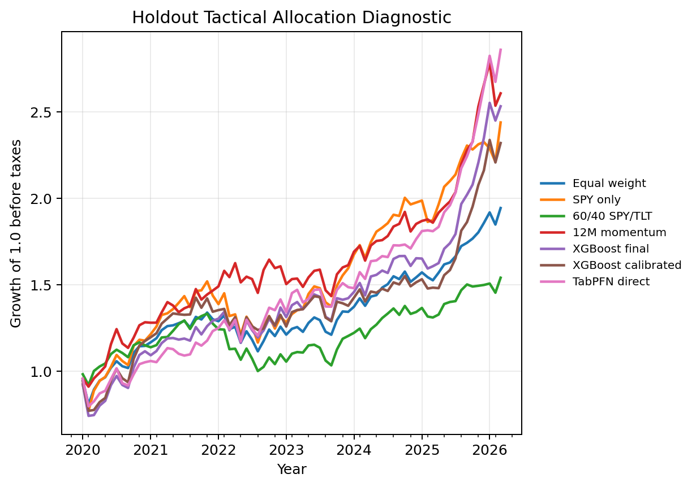
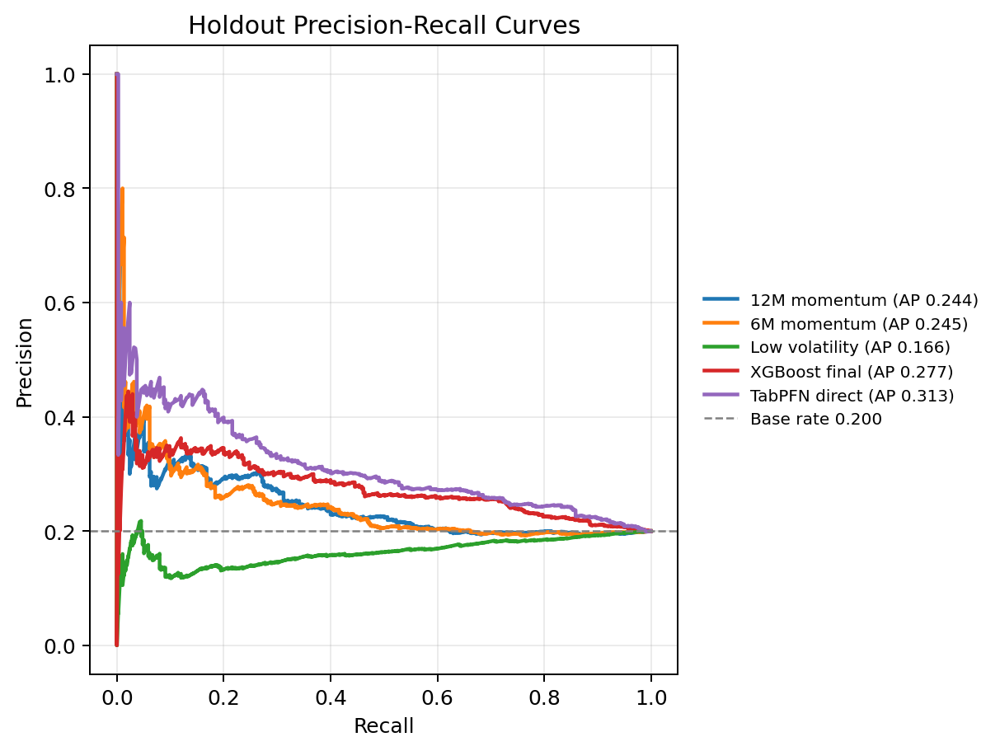
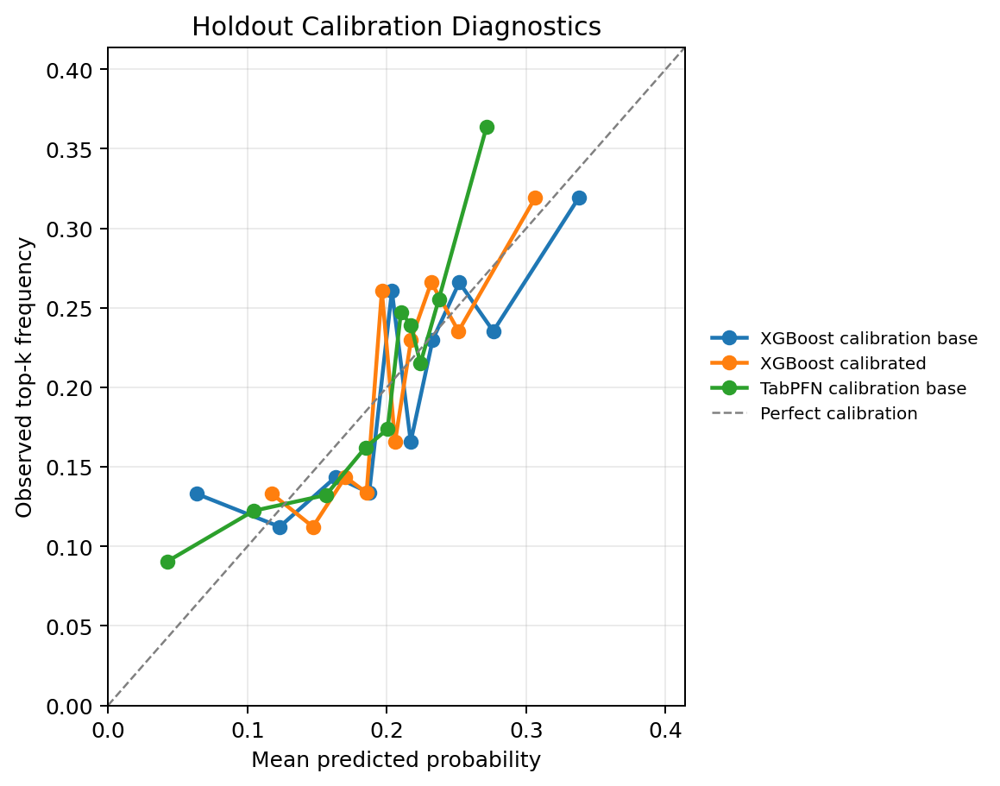
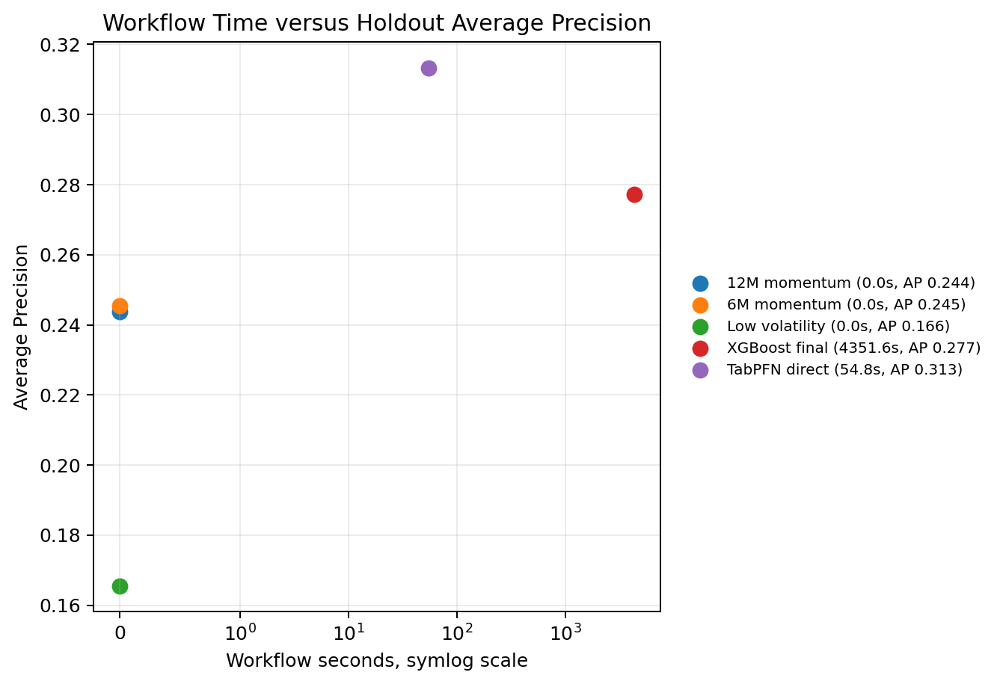

[Mohit Saharan](https://linkedin.com/in/msaharan), P21, 20260511

---

# Tactical asset allocation with TabPFN, TabICL, and XGBoost - 2

In [P20](https://open.substack.com/pub/dsaiengineering/p/p20-tactical-asset-allocation-with-tabpfn-tabicl-xgboost?r=535odk&utm_campaign=post-expanded-share&utm_medium=web), I converted tactical asset allocation into a supervised tabular ranking problem. Each row was an asset-month observation, the label indicated whether that asset landed in the next-month top group, and TabPFN, TabICL, XGBoost, and deterministic allocation rules were evaluated as allocation scorers rather than price forecasters.

That first version was intentionally controlled. It used a nine-ETF universe, a top-three target, ticker identity features, a close-to-close return convention, and a simple transaction-cost-aware portfolio diagnostic. The result was useful, but the limitations were also clear. A nine-asset universe makes the top-group label coarse. Static ticker identity can make the model learn persistent ETF identity rather than reusable market-state relationships. Close-to-close evaluation is easy to audit, but it is not the same as asking what would happen if a signal were acted on after month-end information is available. The portfolio diagnostic also needed more stress checks.

This post is the follow-up. I keep the same supervised tabular framing, but I make the allocation testbench more demanding in the directions that mattered most after P20:

- The universe is expanded from 9 ETFs to 25 ETFs.
- The target changes from top 3 of 9 to top 5 of 25.
- The base positive rate falls from about 0.333 to about 0.200.
- The target return convention changes from close-to-close to next-open-to-next-open.
- The main feature set removes ticker identity, asset-group metadata, and risk-bucket metadata.
- Feature-set sensitivity is checked with lightweight Logistic Regression diagnostics.
- The notebook adds multi-horizon and benchmark-relative audits.
- The portfolio section adds turnover, tax-drag, drawdown, benchmark-relative, and constrained-weight diagnostics.

The empirical result changes in an interesting way. In P20, direct TabPFN and TabICL had the strongest row-level Average Precision point estimates, around 0.409 against a 0.333 base rate, while XGBoost had stronger portfolio diagnostic point estimates. In this follow-up, TabICL is not part of the final empirical comparison because the full TabICL run hit RAM limits on Kaggle. Direct TabPFN remains the strongest row-level ranker among the models I completed, with holdout Average Precision of 0.313 against a 0.200 base rate. It also leads the main portfolio diagnostic in this run. XGBoost and the 12-month momentum rule remain serious baselines.

The most important interpretation is not that one model family wins. The useful result is that a more demanding allocation workflow changes the comparison while preserving the central lesson from P20: tabular foundation model scoring can be evaluated inside a realistic supervised ML workflow, but the conclusion depends on ranking quality, monthly cross-sectional behavior, allocation translation, uncertainty, and known limitations.

The equity-curve figure gives the high-level result before the tables. TabPFN direct finishes with the highest final equity among the plotted score-driven portfolios, but the path should not be read as a trading recommendation. It is a visual summary of how the monthly score-to-portfolio diagnostic behaved after the same top-five allocation rule and transaction-cost assumption were applied across scorers.

You can find the notebook in my GitHub repository [here](https://github.com/msaharan/dsaiengineering/blob/main/blog/20260511-tabpfn-tabicl-tactical-asset-allocation-2.assets/saved-versions/tabpfn-tabicl-tactical-asset-allocation-20260511-v3.ipynb) or you can [clone it directly](https://www.kaggle.com/code/msaharan/tabpfn-tabicl-tactical-asset-allocation-20260511) on Kaggle. The results discussed in this post come from the latest notebook version and its generated artifacts.

## Minimal notation for this follow-up

P20 gives the full formulation, so I will only restate the notation needed to read this follow-up. Each row is still an asset-month pair \((i,t)\). The feature vector \(x_{i,t}\) contains information available at or before the monthly signal date, and the score \(s_{i,t}\) is used to rank assets within that month. The target \(y_{i,t}\) is 1 when the asset belongs to the next-period top group and 0 otherwise.

The core object is unchanged:

$$
x_{i,t} = \phi_i(\mathcal{F}_t),
$$

where \(\mathcal{F}_t\) is the information set available at the signal date and \(\phi_i(\cdot)\) is the feature-generation process for asset \(i\). A scorer then produces:

$$
s_{i,t}
\approx
\mathbb{P}(y_{i,t}=1 \mid x_{i,t}, \mathcal{D}_{\text{train}}),
$$

where \(\mathcal{D}_{\text{train}}\) is either the training data for a fitted supervised model or the labelled context for a direct tabular foundation model scorer. This is the only TFM recap needed here. XGBoost learns task-specific parameters from the allocation table. TabPFN uses a pretrained tabular model and the labelled context rows to score query rows:

$$
\mathbb{P}_{\theta}
\left(
y_{\ast}=1
\mid
x_{\ast},
X_{\text{context}},
y_{\text{context}}
\right),
$$

where \(\theta\) denotes the pretrained TFM parameters, \(x_{\ast}\) is a query row, and \((X_{\text{context}}, y_{\text{context}})\) is the labelled context. The new capability I am exercising is this pretrained in-context scoring mechanism. The old discipline still applies: the target, chronology, leakage controls, baselines, calibration, and portfolio translation remain part of the experiment.

## What is new in this experiment
### A broader universe and a less coarse target

The P20 universe had 9 ETFs:

SPY, QQQ, IWM, TLT, IEF, GLD, HYG, EEM, VNQ.

This follow-up uses 25 ETFs:

SPY, QQQ, DIA, IWM, EFA, EEM, TLT, IEF, SHY, LQD, HYG, GLD, SLV, DBC, VNQ, IYR, XLB, XLE, XLF, XLI, XLK, XLP, XLU, XLV, XLY.

This adds more US equity style exposure, developed and emerging international equity, rates, credit, commodities, real estate, and US sectors. It is still not a production institutional universe, but it is a more demanding cross-sectional ranking problem than the first notebook.

Let \(N_t\) be the number of available assets in month \(t\). In the holdout period, \(N_t=25\) for the usable months. The target selects \(K=5\) assets. The monthly base rate is therefore approximately:

$$
\bar{y}_t = \frac{K}{N_t} = \frac{5}{25} = 0.20.
$$

This matters for Average Precision. In P20, a non-informative scorer had a reference level near 0.333 because three out of nine assets were positive each month. In this post, the reference level is near 0.200. A raw AP number from P20 and a raw AP number from this post should not be compared without remembering that the target is different.

### A next-open target convention

P20 used a close-to-close convention. That was easy to audit, but it left an execution caveat: if features are computed at month-end, what price could actually be traded after the signal is formed?

P20 used \(P_{i,t}\) for the adjusted month-end close price. I use a new symbol here because the execution convention changes from close-to-close to open-to-open. Let \(O^+_{i,t+1}\) denote the adjusted first tradable open after signal month \(t\), and let \(O^+_{i,t+2}\) denote the adjusted first tradable open after the next month. The selected one-month target return is:

$$
R^{\text{open}}_{i,t+1}
=
\frac{O^+_{i,t+2}}{O^+_{i,t+1}} - 1.
$$

The label is then:

$$
y_{i,t}
=
\mathbf{1}
\left\{
R^{\text{open}}_{i,t+1}
\text{ is among the top } K
\text{ cross-sectional returns}
\right\}.
$$

Here \(\mathbf{1}\{\cdot\}\) is the indicator function: it equals 1 when the condition inside the braces is true and 0 otherwise. The phrase "top \(K\)" means that assets are ranked within the same signal month by the selected forward return convention.

The notebook still saves both close-to-close and next-open returns for audit. This is important because a change in execution convention can change rankings. The goal is not to claim that this is now a complete execution model. It is a more realistic diagnostic convention than the P20 close-to-close target, but it still does not model intraday slippage, bid-ask spreads, order timing, market impact, or data release timing in production detail.

### Identity-ablated main features

The P20 notebook included ticker identity indicators and asset-group metadata. That choice was defensible for a fixed-universe allocation exercise, but it raised a good interpretation problem. If the model performs well, is it learning reusable relationships between market-state features and future relative returns, or is it learning persistent differences among named ETFs?

This post makes the main run identity-ablated. If \(z_i\) denotes static identity and metadata features for asset \(i\), the main feature policy is closer to:

$$
x^{\text{ablated}}_{i,t}
=
\phi_i(\mathcal{F}_t) \setminus z_i.
$$

The notebook excludes 34 static identity or metadata columns from the main model matrix. The final main feature matrix has 956 model features after retained base features and missingness indicators.

This does not mean identity information is unimportant. In fact, one diagnostic suggests it may be very important. The metadata-only Logistic Regression sensitivity model has a holdout AP of 0.282, which is above the 0.200 base rate and also slightly above the XGBoost final AP of 0.277 in this run. That does not mean metadata-only is a better allocation system. It means persistent asset identity and group structure contain meaningful information in this historical sample. For a practitioner, that is a useful warning: removing identity features makes the main experiment more conservative, but studying identity sensitivity remains part of the interpretation.

### Feature sensitivity as a diagnostic, not a full rerun

The notebook compares these feature policies with lightweight CPU Logistic Regression:

- full
- ticker-ablated
- identity-ablated
- metadata-only
- strict time-series

The important phrase is "lightweight diagnostic." I did not rerun the full TabPFN and XGBoost workflows for every feature variant because the practical constraint in this iteration was compute time. I had to rerun the notebook several times while working around TabICL memory failures and XGBoost tuning costs; each full attempt took close to two hours, with roughly 1.5 hours spent in the XGBoost tuning part. A full model-by-feature-variant study would be stronger, but that is a separate experiment. The current sensitivity check is useful for inspecting whether feature-family choices matter, but it should not be presented as a complete model-family sensitivity study.

The holdout feature sensitivity table is:

| feature variant | model | final features | holdout AP | holdout ROC AUC |
|---|---|---:|---:|---:|
| metadata-only | Logistic Regression | 34 | 0.282 | 0.621 |
| full | Logistic Regression | 990 | 0.213 | 0.525 |
| identity-ablated | Logistic Regression | 956 | 0.213 | 0.525 |
| strict time-series | Logistic Regression | 956 | 0.213 | 0.525 |
| ticker-ablated | Logistic Regression | 965 | 0.213 | 0.525 |

The metadata-only result is the surprising line. It suggests that persistent group and identity information can rank the holdout rows better than a weak linear model using the larger noisy feature set. This is not a reason to abandon time-series features. It is a reason to be careful with interpretation and to treat feature design as part of the scientific result.

### Alternative-objective audits

P20 noted that the top-group target was only one possible allocation objective. A production allocator might care about benchmark-relative active return, multi-month horizons, drawdown risk, tax-aware turnover, or risk-adjusted return.

This notebook does not retrain the main models for all of those objectives. Instead, it asks a narrower question: how do the existing one-month scores relate to alternative labels?

For a 3-month or 6-month horizon \(h\), the notebook compounds the selected one-month return convention. In this run, that selected convention is next-open-to-next-open:

$$
R^{(h)}_{i,t}
=
\prod_{m=0}^{h-1}
\left(1 + R^{\text{open}}_{i,t+1+m}\right)
- 1,
$$

where \(m\) indexes the one-month return offset inside the \(h\)-month compounding window. The notebook then assigns a top-\(K\) label using the same cross-sectional ranking idea. It also creates a benchmark-relative label against SPY:

$$
y^{\text{bench}}_{i,t}
=
\mathbf{1}
\left\{
R^{\text{open}}_{i,t+1} - R^{\text{open}}_{\text{SPY},t+1} > 0
\right\}.
$$

These are audits of the same scores, not new objective-specific training runs. This distinction matters. If a reader wants to know whether TabPFN is best for a six-month allocation target, the correct experiment would retrain and validate on that target. The current notebook asks whether the one-month next-open score contains some information about those alternative outcomes.

## Experimental results

### Dataset and splits

The final dataset contains 6,059 rows across 243 months and 25 assets. The holdout period contains 1,875 rows across 75 months, from January 2020 through March 2026. The holdout positive rate is exactly 0.200 because the target selects five assets out of twenty-five in each full holdout month.

The chronological split follows the same design logic as P20:

| split | rows | months | positive rate | start | end |
|---|---:|---:|---:|---|---|
| context | 1,784 | 72 | 0.202 | 2006-01-31 | 2011-12-31 |
| model selection | 3,584 | 144 | 0.201 | 2006-01-31 | 2017-12-31 |
| calibration | 600 | 24 | 0.200 | 2018-01-31 | 2019-12-31 |
| preholdout | 4,184 | 168 | 0.201 | 2006-01-31 | 2019-12-31 |
| holdout | 1,875 | 75 | 0.200 | 2020-01-31 | 2026-03-31 |

This is a time-ordered split, not a random split.

### Row-level classification

P20 used Average Precision, ROC AUC, Brier score, calibration diagnostics, monthly rank diagnostics, and portfolio diagnostics because the target is a top-group ranking label rather than an ordinary balanced classification target. Average Precision summarizes precision-recall ranking quality, ROC AUC summarizes pairwise positive-versus-negative ranking, and Brier score measures squared probability error. I keep those metrics here so the comparison is continuous. The new pieces in this post are not new row-level metrics; they are the lower base-rate target, the next-open target convention, identity-ablated features, feature-policy sensitivity, alternative-objective audits, and the extra portfolio stress diagnostics.

| scorer | base model | AP | ROC AUC | Brier score | workflow seconds |
|---|---|---:|---:|---:|---:|
| TabPFN direct | TabPFN | 0.313 | 0.642 | 0.155 | 54.8 |
| TabPFN calibration base | TabPFN | 0.295 | 0.631 | 0.156 | 32.3 |
| metadata-only sensitivity | Logistic Regression | 0.282 | 0.621 | 0.239 | 0.1 |
| XGBoost final | XGBoost | 0.277 | 0.614 | 0.157 | 4,351.6 |
| XGBoost calibrated | XGBoost | 0.276 | 0.608 | 0.156 | 4,351.6 |
| risk-adjusted momentum | rule | 0.247 | 0.523 | n/a | 0.0 |
| 6M momentum | rule | 0.245 | 0.526 | n/a | 0.0 |
| 12M momentum | rule | 0.244 | 0.531 | n/a | 0.0 |
| dummy prior | dummy | 0.200 | 0.500 | 0.160 | 0.0 |
| low volatility | rule | 0.166 | 0.405 | n/a | 0.0 |

The direct TabPFN scorer has the highest holdout AP and ROC AUC among the completed main models. The comparison with P20 needs care. P20's TabPFN and TabICL AP values were around 0.409, but the base rate was 0.333. Here the TabPFN AP is 0.313, but the base rate is 0.200. On the new, less coarse target, TabPFN is further above the non-informative reference than the raw AP alone would suggest.

The result is useful for the TFM question because the main TabPFN run is identity-ablated. The model is not being handed ticker identity or asset-group labels in the main feature matrix. It is using the labelled context rows and the time-varying feature table to score holdout asset-month rows.

In the precision-recall plot, the useful comparison is against the lower horizontal base-rate reference. The curves do not need to reach extreme precision to be useful in this setting; they need to stay meaningfully above the 0.200 reference over the part of the ranked list that matters for top-group selection. TabPFN direct does that most clearly among the completed main models.

That does not prove that TabPFN has discovered a stable allocation law. It shows that, in this public-data experiment, direct TabPFN scoring remains competitive after making the target harder, removing static identity features, and changing the execution convention.

### Monthly cross-sectional ranking

P20 showed why monthly rank diagnostics matter: TabPFN and TabICL had the strongest row-level AP point estimates, while XGBoost looked stronger in the monthly rank and portfolio views. That same separation of questions matters here. Row-level AP pools all holdout rows together, while allocation is applied month by month. A scorer can have useful pooled AP and still produce a weaker within-month ordering.

For each month \(t\), Spearman information coefficient is:

$$
\rho_t
=
\operatorname{corr}_{\text{Spearman}}
\left(
\{s_{i,t}\}_{i=1}^{N_t},
\{R^{\text{open}}_{i,t+1}\}_{i=1}^{N_t}
\right).
$$

The mean of \(\rho_t\) across holdout months summarizes whether higher scores tended to align with higher next-open returns within the same monthly cross-section.

| scorer | mean monthly IC | top-k hit rate | selected monthly return | universe monthly return | active monthly return |
|---|---:|---:|---:|---:|---:|
| TabPFN direct | 0.043 | 0.317 | 1.55% | 0.97% | 0.58% |
| XGBoost final | 0.036 | 0.309 | 1.43% | 0.97% | 0.46% |
| 12M momentum | 0.046 | 0.261 | 1.40% | 0.97% | 0.43% |
| XGBoost calibrated | 0.028 | 0.291 | 1.31% | 0.97% | 0.34% |
| risk-adjusted momentum | 0.001 | 0.275 | 1.29% | 0.97% | 0.32% |
| TabPFN calibration base | 0.027 | 0.291 | 1.19% | 0.97% | 0.23% |
| metadata-only sensitivity | 0.033 | 0.269 | 1.19% | 0.97% | 0.22% |
| 6M momentum | 0.011 | 0.253 | 0.92% | 0.97% | -0.05% |
| low volatility | -0.082 | 0.141 | 0.25% | 0.97% | -0.72% |

TabPFN direct leads on selected return and active return. XGBoost is close. The 12-month momentum rule has the highest mean IC among these rows, but a lower top-k hit rate and slightly lower selected return. This continues the P20 lesson: mean rank correlation, top-k hit rate, selected return, and portfolio performance are related but not identical.

The low-volatility rule performs poorly in this holdout under this target. That should be read as a period-specific result, not as a general claim against low-volatility investing. The 2020 to 2026 holdout contains a sharp crash, a rapid recovery, an inflation and rates shock, and a strong mega-cap growth period. A defensive rule can look weak under a relative top-five target if the period rewards risk-on or momentum-like exposures.

### Portfolio translation

The portfolio diagnostic converts scores into monthly top-five equal-weight portfolios and subtracts a 5 basis point cost per unit of one-way turnover. If \(w_{i,t}\) is the portfolio weight assigned to asset \(i\) after signal month \(t\), the pre-cost diagnostic portfolio return is:

$$
R^p_{t+1}
=
\sum_i w_{i,t} R^{\text{open}}_{i,t+1}.
$$

Turnover is:

$$
\tau_t
=
\sum_i |w_{i,t} - w_{i,t-1}|.
$$

In these two equations, the summation is over the available assets in the monthly universe. The turnover \(\tau_t\) is one-way turnover: a move from 20 percent in one asset to 0 percent contributes 20 percentage points, and a move from 0 percent to 20 percent in another asset contributes another 20 percentage points.

The net return used in the main portfolio table is:

$$
\widetilde{R}^p_{t+1}
=
R^p_{t+1} - c \tau_t,
$$

where \(c=0.0005\) for the 5 basis point transaction-cost assumption.

| strategy | CAGR | annual volatility | Sharpe | max drawdown | annual turnover | final equity |
|---|---:|---:|---:|---:|---:|---:|
| TabPFN direct | 18.3% | 16.2% | 1.12 | -16.7% | 6.11 | 2.86 |
| TabPFN inverse-vol capped top-k | 16.8% | 14.9% | 1.12 | -13.9% | 7.73 | 2.64 |
| 12M momentum top-k | 16.6% | 14.9% | 1.11 | -12.8% | 5.47 | 2.61 |
| risk-adjusted momentum | 14.7% | 15.4% | 0.97 | -15.7% | 9.63 | 2.36 |
| metadata-only sensitivity | 14.0% | 15.2% | 0.94 | -21.2% | 0.16 | 2.26 |
| TabPFN calibration base | 13.8% | 15.4% | 0.92 | -14.2% | 3.10 | 2.24 |
| XGBoost inverse-vol capped top-k | 15.4% | 17.3% | 0.92 | -17.3% | 10.68 | 2.45 |
| XGBoost final | 16.0% | 18.4% | 0.91 | -19.7% | 8.99 | 2.53 |
| SPY only | 15.3% | 17.8% | 0.89 | -23.3% | 0.16 | 2.44 |
| equal weight universe | 11.2% | 13.7% | 0.85 | -16.8% | 0.16 | 1.94 |
| 60/40 SPY/TLT | 7.2% | 12.8% | 0.60 | -24.9% | 0.16 | 1.54 |

This is the biggest empirical change from P20. In P20, XGBoost had the strongest portfolio diagnostic point estimates. In this follow-up, TabPFN direct leads the main portfolio table by Sharpe and final equity. It also remains ahead after the basic 5 basis point turnover cost.

I do not treat this as a stable trading result. The holdout is one historical path. The confidence intervals are wide. The portfolio is still a simple monthly top-five diagnostic, not a production optimizer. But the result is useful because it shows that the TabPFN row-level advantage is not only a row-level AP artifact in this run. It also survives a simple allocation translation.

### Turnover, tax drag, and weight constraints

The notebook adds several stress views that were missing or incomplete in P20.

The turnover-cap diagnostic blends previous weights toward new target weights. With a 50 percent turnover cap, the resulting portfolio can hold more than five assets because old positions decay rather than disappearing immediately. This is not a pure top-five portfolio. It is better described as post-score turnover-smoothed weights.

Selected turnover-cap results:

| strategy | turnover cap | CAGR | Sharpe | annual turnover | average holdings | final equity |
|---|---:|---:|---:|---:|---:|---:|
| TabPFN direct | 0.5 | 19.0% | 1.17 | 4.93 | 6.80 | 2.96 |
| 12M momentum top-k | 0.5 | 16.8% | 1.12 | 4.47 | 6.63 | 2.64 |
| XGBoost final | 0.5 | 18.6% | 1.03 | 5.84 | 9.77 | 2.91 |
| TabPFN direct | 1.0 | 18.7% | 1.14 | 6.01 | 5.20 | 2.92 |
| 12M momentum top-k | 1.0 | 16.5% | 1.11 | 5.40 | 5.16 | 2.59 |
| XGBoost final | 1.0 | 16.9% | 0.95 | 8.51 | 5.80 | 2.66 |

The stress result is favorable for TabPFN and XGBoost, but it changes portfolio meaning. A turnover-smoothed portfolio is not the same object as a strict top-five monthly portfolio. That is why the notebook saves the turnover-cap outputs separately.

The tax-drag sensitivity applies additional drag per unit of turnover. It is not a tax engine. It is a way to ask whether high-turnover strategies are fragile to additional frictions.

For TabPFN direct, CAGR falls from 18.3 percent with no extra tax drag to 14.8 percent with 50 basis points of tax drag per turnover. For XGBoost final, CAGR falls from 16.0 percent to 11.0 percent under the same stress. The larger drop for XGBoost is consistent with its higher annual turnover.

The weight-constraint artifact confirms that the main top-five equal-weight portfolios have 20 percent maximum asset weights and gross leverage of 1.0. It also shows that turnover is not trivial. XGBoost final has 52 months above 50 percent turnover and 17 months above 100 percent turnover. TabPFN direct has 24 months above 50 percent turnover and 5 months above 100 percent turnover. This is one reason portfolio diagnostics are necessary even when row-level AP looks good.

### Benchmark-relative diagnostics

The notebook also compares strategy returns against benchmark portfolios such as 60/40 SPY/TLT. Against 60/40, TabPFN direct has annualized active return of about 10.5 percent, tracking error of about 11.8 percent, and information ratio of about 0.89. XGBoost final has annualized active return of about 8.9 percent, tracking error of about 12.5 percent, and information ratio of about 0.71.

These numbers are diagnostics, not mandate-ready active-risk controls. A real benchmark-relative allocation process would usually include explicit tracking-error budgets, sector or asset-class constraints, capacity assumptions, and ex ante risk models. Still, adding the benchmark-relative view is useful because it moves the evaluation closer to how allocation results are often discussed in practice.

### Calibration

Calibration remains separate from ranking. If a score is only used to sort assets within a month, a monotonic calibration transform may leave the selected top-five set unchanged. If a score is described as a probability of top-group membership, probability quality matters. ECE means expected calibration error; in the notebook artifact used here, it is computed with 10 quantile bins.

The main holdout calibration view is:

| scorer | AP | Brier score | log loss | ECE |
|---|---:|---:|---:|---:|
| TabPFN direct | 0.313 | 0.155 | 0.487 | 0.041 |
| TabPFN calibration base | 0.295 | 0.156 | 0.491 | 0.032 |
| XGBoost final | 0.277 | 0.157 | 0.491 | 0.019 |
| XGBoost calibrated | 0.276 | 0.156 | 0.489 | 0.031 |
| metadata-only sensitivity | 0.282 | 0.239 | 0.669 | 0.280 |

TabPFN direct has the best AP among the listed scorers, while XGBoost final has the lowest expected calibration error among the listed learned scorers. That is not a contradiction. Ranking quality and probability reliability are different properties.

The metadata-only logistic score is a useful caution. Its AP is good, but its Brier score, log loss, and ECE are poor. That means it can rank some positives above negatives while still producing poor probability estimates. A practitioner familiar with supervised ML will recognize this pattern: a model can be directionally useful as a score and still poorly calibrated as a probability model.

### Runtime and research cost

Runtime is part of the research result. The direct TabPFN holdout scorer takes about 55 seconds in this run. XGBoost takes about 4,352 seconds because the workflow performs a GPU-accelerated XGBoost model-selection process. This is not a perfectly fair runtime contest because the workflows are doing different things. It is still practically relevant.

For a practitioner, the TFM capability is attractive when quick direct scoring is valuable. XGBoost remains attractive when task-specific fitting, feature importance workflows, and controlled hyperparameter searches are important. I do not see these as mutually exclusive tools. In a serious research workflow, I would want both kinds of baselines.

### Uncertainty

The notebook uses month-block bootstrap intervals. It resamples months rather than individual rows because rows from the same month share the same market environment and are tied together by the cross-sectional top-\(K\) target.

Selected row-level bootstrap intervals:

| scorer | AP | AP 95% interval | mean IC | IC 95% interval | top-k hit rate | hit-rate 95% interval |
|---|---:|---:|---:|---:|---:|---:|
| TabPFN direct | 0.313 | 0.280 to 0.362 | 0.043 | -0.011 to 0.093 | 0.317 | 0.275 to 0.365 |
| XGBoost final | 0.277 | 0.250 to 0.321 | 0.036 | -0.021 to 0.096 | 0.309 | 0.269 to 0.349 |
| metadata-only sensitivity | 0.282 | 0.252 to 0.321 | 0.033 | -0.017 to 0.088 | 0.269 | 0.229 to 0.309 |
| 12M momentum | 0.244 | 0.217 to 0.286 | 0.046 | -0.018 to 0.115 | 0.261 | 0.213 to 0.309 |
| 6M momentum | 0.245 | 0.221 to 0.289 | 0.011 | -0.057 to 0.081 | 0.253 | 0.208 to 0.307 |

Selected portfolio bootstrap intervals:

| strategy | CAGR | CAGR 95% interval | Sharpe | Sharpe 95% interval |
|---|---:|---:|---:|---:|
| TabPFN direct | 18.3% | 5.4% to 33.3% | 1.12 | 0.42 to 2.25 |
| XGBoost final | 16.0% | -1.1% to 31.7% | 0.91 | 0.05 to 1.71 |
| 12M momentum | 16.6% | 2.2% to 31.8% | 1.11 | 0.22 to 2.05 |
| SPY only | 15.3% | -0.1% to 33.5% | 0.89 | 0.09 to 1.92 |
| equal weight universe | 11.2% | -0.1% to 22.0% | 0.85 | 0.07 to 1.65 |

The intervals explain the cautious language. TabPFN has the best point estimates in the main diagnostics, but the uncertainty intervals overlap with strong baselines. This is evidence of competitiveness in one public-data holdout path, not proof of stable superiority.

## Known limitations

This is still a public-data research workflow. It uses yfinance, public Cboe VIX history, and public FRED series. That is useful for reproducibility, but it is not equivalent to a licensed point-in-time institutional market data system. Vendor corrections, corporate-action controls, survivorship handling, data release timing, and operational monitoring are outside the scope of this post.

The liquidity, spread, and market-impact proxy artifact should not be interpreted in this run. The notebook created `portfolio_liquidity_impact_proxy.csv`, but the artifact values are all zero because the underlying dollar-volume and high-low-spread proxy fields were missing. I am leaving the issue documented rather than fixing it today because the main post can stand without that artifact. Any claim about liquidity, spread, or participation should wait for a corrected rerun.

The feature sensitivity section is not a full model-family sensitivity study. It uses Logistic Regression diagnostics to inspect feature-policy effects. A stronger version would rerun TabPFN, XGBoost, and any enabled TFM scorers across all feature variants under the same chronological validation design.

The multi-horizon and benchmark-relative sections are audits of existing one-month scores. They do not retrain the main models for 3-month, 6-month, or benchmark-relative objectives. A proper alternative-objective study would define those labels as the main targets and repeat model selection and validation.

The portfolio diagnostics are not production backtests. They do not include a real execution model, tax lots, mandate constraints, borrow constraints, capacity, market-impact estimation, ex ante risk models, or benchmark-relative optimization. They are useful for testing whether model scores survive simple allocation translation, not for approving live capital.

TabICL is not part of the final empirical comparison in this post. That is an engineering limitation of my current public notebook run, not a statement about TabICL as a model family. The guarded TabICL code path remains in the notebook, but the completed results here should be read as TabPFN, XGBoost, Logistic Regression diagnostics, and deterministic-rule results.

TFM embeddings are still out of scope. This post evaluates direct TabPFN scoring. It does not test whether TabPFN or TabICL embeddings improve a downstream XGBoost, neural ranking, or portfolio optimization workflow.

Finally, my own goal in this series is learning by building. I am using the notebook to make assumptions visible and testable. The claims are intentionally limited to what this public experiment can support.

## Conclusion

This follow-up makes the P20 tactical allocation experiment more demanding. The universe grows from 9 to 25 ETFs, the target becomes top 5 of 25, the execution convention changes to next-open-to-next-open, static identity features are removed from the main model matrix, and the portfolio diagnostics become more realistic.

Within this configuration, direct TabPFN produces the strongest completed row-level ranking result: AP 0.313 against a 0.200 base rate. It also leads the main portfolio diagnostic, with 18.3 percent CAGR, 1.12 Sharpe, and final equity of 2.86 over the 2020 to 2026 holdout. XGBoost and 12-month momentum remain competitive. The bootstrap intervals overlap enough that I would not claim stable superiority for any model family.

The most useful conclusion is methodological. A tabular foundation model can be inserted into a supervised financial tabular workflow as a direct scorer, but it still has to be evaluated like any serious model: with chronological splits, leakage checks, baseline rules, calibration diagnostics, uncertainty intervals, feature sensitivity, execution assumptions, and portfolio translation. The newer capability is the pretrained in-context scoring mechanism. The older discipline of supervised ML and financial validation is still necessary.
