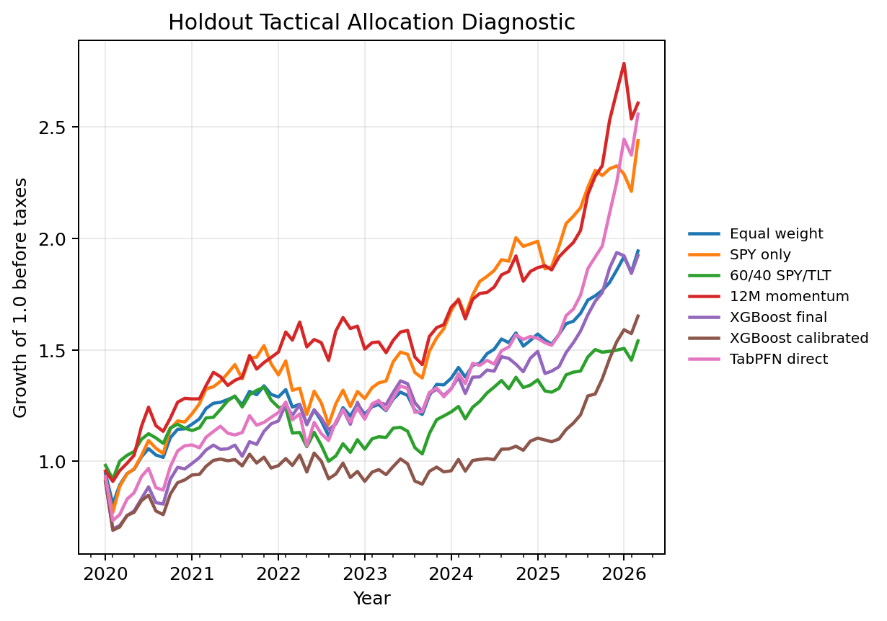
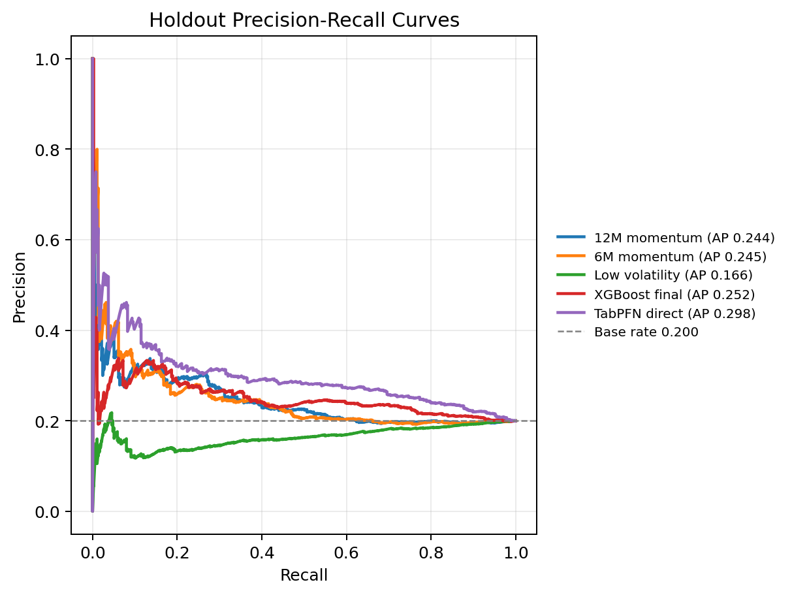
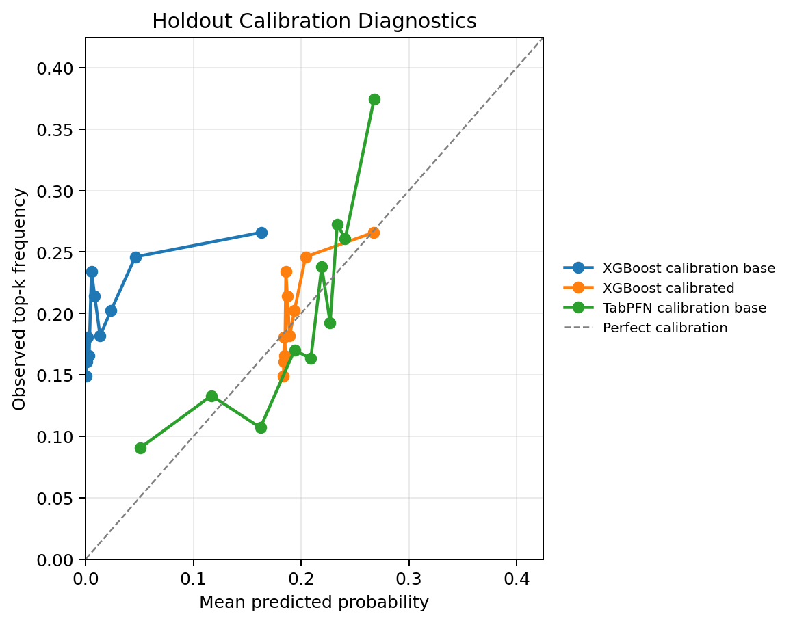
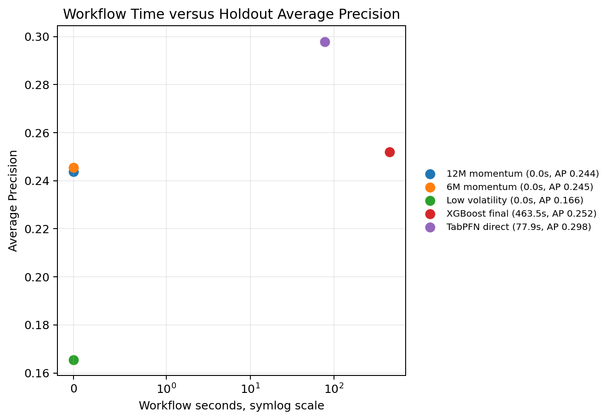

[Mohit Saharan](https://linkedin.com/in/msaharan), P22, 20260512

---

# Tactical asset allocation with TabPFN, TabICL, and XGBoost - 3

In [P20](https://open.substack.com/pub/dsaiengineering/p/p20-tactical-asset-allocation-with-tabpfn-tabicl-xgboost?r=535odk&utm_campaign=post-expanded-share&utm_medium=web), I converted tactical asset allocation into a supervised tabular ranking problem. Each row was an asset-month observation, the label indicated whether that asset belonged to the next-month top group, and TabPFN, TabICL, XGBoost, and deterministic allocation rules were evaluated as allocation scorers rather than price forecasters.

In [P21](https://open.substack.com/pub/dsaiengineering/p/p21-tactical-asset-allocation-with-tabpfn-tabicl-xgboost-2?r=535odk&utm_campaign=post-expanded-share&utm_medium=web), I made that first workflow more demanding. The universe expanded from 9 ETFs to 25 ETFs, the target changed from top 3 of 9 to top 5 of 25, the base positive rate fell from about 0.333 to 0.200, the return convention moved from close-to-close to next-open-to-next-open, and the main feature set removed static ticker identity features.

That follow-up made the workflow more credible, but it also made the remaining gaps easier to see. The liquidity diagnostic path was thin. Feature sensitivity was mostly a lightweight linear-model check. Alternative objectives were still closer to audits of the one-month score than to retrained objective-specific experiments. The portfolio section had improved, but it still needed a cleaner distinction between score quality and allocation quality.

So this post is the final follow-up for this tactical-allocation mini-series. I keep the same 25-ETF, top-5, next-open-to-next-open problem from P21, but I strengthen the experimental design around the remaining issues that are addressable in a public notebook. I leave three limitations outside today's scope: TabICL remains disabled, the dataset is still public rather than institutional point-in-time data, and tabular foundation model (TFM) embeddings are not tested. Those are real limitations, but this post is about making the rest of the testbench more complete.

I am treating this as a learning-in-public research notebook and worked example, not as a claim to have the final word on tactical allocation or tabular foundation models. I am learning as I go, and I want that to make the write-up more careful, not more tentative. The value of the post is in making the workflow inspectable enough that TFM labs, ML practitioners, data and AI teams, and quant readers can see the setup, the potential benefits, the tradeoffs, and the limitations clearly.

The empirical result is mixed in an informative way. TabPFN has the best completed row-level ranking result on the main target in this run. The TabPFN calibration-base scorer has holdout Average Precision of 0.302, and the final direct TabPFN scorer has AP 0.298, against a 0.200 base rate. XGBoost is above base rate but lower on this row-level view, with AP 0.252. However, the highest headline portfolio Sharpe is not TabPFN. It is the 12-month momentum top-k rule, with Sharpe 1.11. TabPFN portfolios are competitive and often close to the top, but they do not settle the allocation question against compact finance rules in this workflow.

For me, the conclusion is methodological rather than promotional. Direct TabPFN scoring still looks useful after the P21 workflow is strengthened, while the best deterministic allocation rule remains highly competitive at the portfolio layer. That is why this kind of notebook is worth building: it separates the modeling question, "can a pretrained tabular model rank asset-month rows?", from the allocation question, "does that score become the best portfolio rule after turnover, risk, and portfolio construction are included?"

The equity-curve figure previews the central tension in the post. The learned scores are useful, but the portfolio paths are close enough that the allocation layer has to be evaluated on its own terms. I discuss the Sharpe, drawdown, turnover, and uncertainty details after setting up the notation and experimental changes.

You can find the notebook in my GitHub repository [here](https://github.com/msaharan/dsaiengineering/blob/main/blog/20260512-tabpfn-tabicl-tactical-asset-allocation-3.assets/saved-versions/tabpfn-tabicl-tactical-asset-allocation-20260512-v2.ipynb) or you can [clone it directly](https://www.kaggle.com/code/msaharan/tabpfn-tabicl-tactical-asset-allocation-20260512) on Kaggle. 

## Minimal notation for this follow-up

P20 gives the full formulation, and P21 restates the notation for the broader universe and next-open target. I will only repeat the pieces needed to read this post, so the later tables and diagnostics have a common language.

Each row is an asset-month pair \((i,t)\). The index \(i\) denotes an ETF, and \(t\) denotes a monthly signal date. The information set available at the signal date is \(\mathcal{F}_t\). The feature vector is:

$$
x_{i,t} = \phi_i(\mathcal{F}_t),
$$

where \(\phi_i(\cdot)\) is the feature-generation process for asset \(i\). In this notebook, the main features include trailing returns, volatility, downside volatility, drawdown, moving-average distance, beta, volume and dollar-volume proxies, high-low range proxies, VIX features, Treasury features, and other public market-state features. The main feature policy is identity-ablated, meaning static ticker identity and asset-group metadata are excluded from the headline predictive matrix.

The target uses the next-open-to-next-open convention introduced in P21. Let \(O^+_{i,t+1}\) denote the adjusted first tradable open after signal month \(t\), and let \(O^+_{i,t+2}\) denote the adjusted first tradable open after the next month. The one-month forward return used for the main target is:

$$
R^{\text{open}}_{i,t+1}
=
\frac{O^+_{i,t+2}}{O^+_{i,t+1}} - 1.
$$

The label is:

$$
y_{i,t}
=
\mathbf{1}
\left\{
R^{\text{open}}_{i,t+1}
\text{ is among the top } K
\text{ returns in month } t+1
\right\}.
$$

Here, \(\mathbf{1}\{\cdot\}\) is the indicator function. It equals 1 when the condition inside the braces is true and 0 otherwise. Let \(N_t\) be the number of assets with a usable forward return in month \(t\), and let \(K\) be the number selected as positives. In the full holdout months, \(N_t=25\) and \(K=5\), so the monthly positive-class rate is:

$$
\bar{y}_t = \frac{K}{N_t} = \frac{5}{25} = 0.20.
$$

A scorer then produces:

$$
s_{i,t}
\approx
\mathbb{P}(y_{i,t}=1 \mid x_{i,t}, \mathcal{D}_{\text{train}}),
$$

where \(s_{i,t}\) is the model score and \(\mathcal{D}_{\text{train}}\) is the labelled training or context data available to the scorer. This is a top-group membership score, not a price forecast. A high score does not mean the asset must go up next month. It means the model ranks the asset as more likely to belong to the next-month top group within the available ETF cross-section.

The supervised table is familiar, but TabPFN and XGBoost use it differently. XGBoost learns task-specific parameters from the labelled allocation table. Conceptually, it selects a scoring function from a model family \(\mathcal{G}\):

$$
\hat{f}
=
\arg\min_{f \in \mathcal{G}}
\sum_{(x_{i,t},y_{i,t}) \in \mathcal{D}_{\text{train}}}
\ell(y_{i,t}, f(x_{i,t})).
$$

Here, \(\mathcal{G}\) is the candidate family of scoring functions, \(f\) is one candidate scorer, \(\ell\) is the loss function, and \(\hat{f}\) is the fitted scorer selected from that family.

Direct TabPFN uses a pretrained tabular model and labelled rows as task context:

$$
\mathbb{P}_{\theta}
\left(
y_\ast = 1
\mid
x_\ast,
X_{\text{context}},
y_{\text{context}}
\right),
$$

where \(\theta\) denotes the pretrained TabPFN parameters, \(x_\ast\) is a query row, \(y_\ast\) is its unknown label, and \((X_{\text{context}}, y_{\text{context}})\) is the labelled context. This is the TFM use case I am testing: whether a pretrained in-context tabular learner can produce useful allocation scores under the same chronology, leakage discipline, and portfolio diagnostics used for the classical supervised ML baseline.

With that notation in place, the rest of the post is about what changed in the testbench and how those changes affect the interpretation.

## What is new in this experiment

### Liquidity and high-low range are now part of the feature and diagnostic story

P21 added portfolio stress diagnostics, but the liquidity path still needed work. A strategy that looks good on returns alone can become less interesting once turnover, capacity, trading frictions, and liquidity are considered. Even in a public ETF notebook, I want the workflow to start carrying these concerns through the experiment.

Today's notebook adds dollar-volume and high-low range proxy features to the model frame. This is both a feature-set change and a diagnostic improvement. The final main feature matrix grows to 1,060 features after retained numeric columns and missingness indicators. That matters because P22 is not only rerunning P21 with extra reports; it is also giving the models additional liquidity-related inputs.

The portfolio diagnostics now include average weighted ADV, where ADV means average daily dollar volume, a high-low range proxy reported in basis points, and turnover-weighted participation at a USD 1 million notional portfolio size. These are proxies, not institutional execution data. The high-low proxy is based on intraday range and should not be read as a quoted bid-ask spread. The participation calculation is not a market-impact model. But the diagnostic is now an interpretable liquidity screen rather than a placeholder.

### Feature-policy sensitivity is now a model-family check

P21 used Logistic Regression as a lightweight sensitivity diagnostic. That was useful, but it did not answer whether the feature policy mattered similarly for TabPFN and for a tree-based classical tabular model.

Today's notebook reruns direct TabPFN and a fixed GPU XGBoost sensitivity model across five feature policies:

- full;
- ticker-ablated;
- identity-ablated;
- metadata-only;
- strict-time-series.

In this naming scheme, "full" keeps the complete candidate feature set, "ticker-ablated" removes ticker dummy features, "identity-ablated" removes ticker identity and asset-group metadata, "metadata-only" keeps only those static identity and metadata fields, and "strict-time-series" keeps the non-identity time-series and market-state features. In this run, the strict-time-series and identity-ablated matrices end up with the same retained feature count after filtering.

This is a fixed XGBoost sensitivity model rather than a second full XGBoost search. It uses a fixed GPU XGBoost configuration for the feature-policy comparison, while the main XGBoost row still uses the searched model. That is a reasonable compromise for this notebook because the purpose is to test whether the main identity-ablated conclusion is fragile, not to run a full nested model-selection study for every feature variant.

### Alternative objectives are retrained, not only audited

P21 made a useful start on alternative objectives, but the more direct version is to retrain and evaluate models on those objectives. Today's notebook does that for three targets:

- 1-month benchmark-relative outperformance versus SPY;
- 3-month top-k membership;
- 6-month top-k membership.

For the benchmark-relative target:

$$
y^{\text{bench}}_{i,t}
=
\mathbf{1}
\left\{
R^{\text{open}}_{i,t+1}
-
R^{\text{open}}_{\text{SPY},t+1}
> 0
\right\}.
$$

Here, \(R^{\text{open}}_{\text{SPY},t+1}\) is SPY's one-month forward open-to-open return under the same convention. This benchmark-relative target uses SPY as the label benchmark. Later, the portfolio benchmark-relative table uses a 60/40 SPY/TLT benchmark for active-risk diagnostics; those are related but distinct benchmark choices.

For an \(h\)-month top-k target, where \(h\) is the horizon length in months:

$$
R^{(h)}_{i,t}
=
\prod_{m=0}^{h-1}
\left(1 + R^{\text{open}}_{i,t+1+m}\right)
- 1.
$$

Here, \(m\) indexes the monthly return offsets inside the horizon. The \(h\)-month label then applies the same top-\(K\) cross-sectional rule to \(R^{(h)}_{i,t}\), with \(K=5\) in this experiment. This matters because a model trained to predict one-month top-k membership is not necessarily the right model for a six-month target or a benchmark-relative target.

The notebook also changes how multi-horizon results are interpreted. Overlapping 3-month and 6-month forward returns are not compounded as if they were independent monthly portfolio returns. They are reported as horizon-aware score-to-return diagnostics. This is less flashy, but it is conceptually cleaner.

### The portfolio layer is treated as a separate object

The score \(s_{i,t}\) is not the portfolio. A portfolio requires a selection rule, a weighting rule, turnover accounting, transaction costs, and some view of risk. The same row-level score can look better or worse after this translation.

Let \(w_{i,t}\) be the portfolio weight assigned to asset \(i\) after the signal at month \(t\). In the main top-k equal-weight portfolio, selected assets receive weight \(1/K\), unselected assets receive weight 0, and the portfolio return is:

$$
R^p_{t+1}
=
\sum_i w_{i,t} R^{\text{open}}_{i,t+1},
$$

with turnover:

$$
\tau_t
=
\sum_i |w_{i,t} - w_{i,t-1}|,
$$

and net diagnostic return:

$$
\widetilde{R}^p_{t+1}
=
R^p_{t+1} - c \tau_t,
$$

where the summation is over the available assets, \(R^p_{t+1}\) is the pre-cost portfolio return, \(\tau_t\) is the traded-weight turnover implied by the change in portfolio weights, \(\widetilde{R}^p_{t+1}\) is the cost-adjusted diagnostic return, and \(c=0.0005\), corresponding to 5 basis points per unit of traded weight. Under this convention, opening a fully invested long-only portfolio from cash has \(\tau_t=1\), and replacing the entire portfolio with non-overlapping long-only holdings has \(\tau_t=2\).

Today's notebook also adds benchmark-relative diagnostics, tax-drag sensitivity, turnover constraints, liquidity and participation proxies, drawdown summaries, and a trailing-covariance ex ante risk proxy. These do not make the notebook a production allocator. They keep the interpretation from resting only on a row-level model metric.

The next section walks through the resulting data frame, score quality, robustness checks, and portfolio translation in that order.

## Code discussion and experimental results

### Dataset and chronological splits

I start with the data shape because the rest of the metrics depend on this cross-section and chronology. The final model frame contains 6,059 asset-month rows across 243 months and 25 ETFs. The holdout period contains 1,875 rows across 75 months, from January 2020 through March 2026. The holdout positive rate is 0.200 because the target selects five assets out of twenty-five in each full holdout month.

The ETF universe is:

SPY, QQQ, DIA, IWM, EFA, EEM, TLT, IEF, SHY, LQD, HYG, GLD, SLV, DBC, VNQ, IYR, XLB, XLE, XLF, XLI, XLK, XLP, XLU, XLV, XLY.

This is still a public ETF universe, not an institutional production universe. It is broad enough to include US equity styles, international equity, rates, credit, commodities, real estate, and US sectors, while remaining small enough that the full notebook is inspectable. The rows are then split chronologically as follows:

| split | rows | months | positive rate | start | end |
|---|---:|---:|---:|---|---|
| context | 1,784 | 72 | 0.202 | 2006-01-31 | 2011-12-31 |
| model selection | 3,584 | 144 | 0.201 | 2006-01-31 | 2017-12-31 |
| calibration | 600 | 24 | 0.200 | 2018-01-31 | 2019-12-31 |
| preholdout | 4,184 | 168 | 0.201 | 2006-01-31 | 2019-12-31 |
| holdout | 1,875 | 75 | 0.200 | 2020-01-31 | 2026-03-31 |

Chronological split matters because random splits in market data can leak future regimes into model selection and make a score look more stable than it would be in a real research process. Feature filtering and imputation are fitted on the model-selection history before being applied to calibration and holdout rows.

### Main row-level score quality

The first empirical question is row-level: can a scorer separate future top-five asset-month rows from the other rows in the holdout set? Because the holdout label selects 5 assets out of 25 each month, a non-informative scorer has an Average Precision reference level of 0.200.

I keep the same row-level metrics used in P20 and P21. Average Precision summarizes precision-recall ranking quality, ROC AUC summarizes pairwise positive-versus-negative ranking, Brier score measures squared probability error, log loss penalizes confident wrong probability estimates, and ECE means expected calibration error, computed here with 10 quantile bins.

For comparability, the TabPFN runs use model version 2.6, the same model line used for P20 and P21. A newer TabPFN version was released while this post was being prepared, so pinning the version keeps the experiment from mixing model-version change with testbench change.

There are also three learned-score variants to keep separate. "Direct" means the final scorer fitted or contextualized on all pre-holdout rows and then evaluated on holdout. "Calibration base" means the scorer excludes the calibration-window labels; this gives a cleaner object for calibration-window evaluation and for checking what changes when the calibration window is not used as labelled context. "Calibrated" means a sigmoid calibration layer was fitted on the calibration window. The calibration-base score series is a distinct diagnostic series, not a separate model family. The deterministic rules are raw ranking scores, not calibrated probability models, so Brier score, log loss, and ECE are not reported for those rows.

| scorer | AP | ROC AUC | Brier score | log loss | ECE | workflow seconds |
|---|---:|---:|---:|---:|---:|---:|
| TabPFN calibration base | 0.302 | 0.638 | 0.155 | 0.490 | 0.040 | 59.0 |
| TabPFN direct | 0.298 | 0.635 | 0.155 | 0.488 | 0.032 | 77.9 |
| XGBoost final | 0.252 | 0.577 | 0.188 | 0.924 | 0.167 | 463.5 |
| risk-adjusted momentum rule | 0.247 | 0.523 | n/a | n/a | n/a | 0.0 |
| 6M momentum rule | 0.245 | 0.526 | n/a | n/a | n/a | 0.0 |
| 12M momentum rule | 0.244 | 0.531 | n/a | n/a | n/a | 0.0 |
| XGBoost calibrated | 0.240 | 0.555 | 0.159 | 0.498 | 0.022 | 461.3 |
| low-volatility rule | 0.166 | 0.405 | n/a | n/a | n/a | 0.0 |
| preholdout prior dummy | 0.200 | 0.500 | 0.160 | n/a | n/a | 0.0 |

The main row-level result is that TabPFN has clear lift over the 0.200 base rate. The calibration-base TabPFN row has AP 0.302, and direct TabPFN has AP 0.298. I do not treat that small difference as a meaningful contest between two TabPFN variants; the important point is that both are materially above the non-informative reference.

XGBoost is also above base rate, but lower than TabPFN on AP and ROC AUC in this run. The momentum rules are close to XGBoost on AP, which reinforces the value of deterministic finance baselines even before the portfolio layer is introduced.

The next two figures show the row-level ranking and calibration diagnostics visually, but I keep them to a small set of headline curves for readability. The tables carry the fuller variant comparison, including TabPFN calibration base.

The precision-recall figure should be read against the 0.200 base-rate reference. TabPFN does not need to produce a perfect ranking to be useful. It needs to keep the ranked list above the non-informative reference in the part of the list used for top-five selection.

Calibration is a separate question, so I read it from the calibration curve and the probability-error columns rather than from AP alone.

The calibration result tells a different story from the ranking result. XGBoost calibrated has a better Brier score and expected calibration error than XGBoost final, but it gives up AP. TabPFN direct has stronger ranking quality and reasonable calibration. This is a common supervised ML tradeoff: a score can become more probability-like without becoming a better top-k ranker.

The XGBoost calibration curve can look visually odd because the uncalibrated XGBoost probabilities are poorly scaled for this holdout. That is not the same as an invalid ranker. The score sanity checks show valid probabilities with no NaNs and no values outside \([0,1]\), and the XGBoost final row still has AP 0.252 versus the 0.200 base rate. The issue is probability reliability: the uncalibrated XGBoost score ranks some rows usefully, but its probability scale is not trustworthy. The sigmoid-calibrated XGBoost row fixes much of that probability-scale problem, as shown by the lower Brier score and ECE, but its AP falls to 0.240.

### Feature-policy sensitivity

Before translating scores into portfolios, I first check whether the main row-level result depends on a fragile feature policy. The main run is identity-ablated, so the model does not receive ticker identity or asset-group metadata in the headline feature matrix. The sensitivity study asks whether this choice changes the result sharply.

| feature variant and model | AP | ROC AUC | Brier score | ECE |
|---|---:|---:|---:|---:|
| full TabPFN | 0.302 | 0.635 | 0.155 | 0.028 |
| identity-ablated TabPFN | 0.298 | 0.635 | 0.155 | 0.032 |
| strict-time-series TabPFN | 0.298 | 0.635 | 0.155 | 0.032 |
| ticker-ablated TabPFN | 0.294 | 0.630 | 0.156 | 0.033 |
| metadata-only TabPFN | 0.290 | 0.626 | 0.154 | 0.044 |
| metadata-only fixed XGBoost | 0.282 | 0.620 | 0.240 | 0.281 |
| ticker-ablated fixed XGBoost | 0.261 | 0.584 | 0.208 | 0.211 |
| identity-ablated fixed XGBoost | 0.257 | 0.579 | 0.208 | 0.206 |
| strict-time-series fixed XGBoost | 0.257 | 0.579 | 0.208 | 0.206 |
| full fixed XGBoost | 0.250 | 0.577 | 0.206 | 0.203 |

The identity-ablated TabPFN result does not appear to depend heavily on that feature policy. Full features improve TabPFN AP only slightly, from 0.298 to 0.302. That suggests the main conclusion is not just a static-identity artifact.

The metadata-only result is still important. Metadata-only TabPFN reaches AP 0.290, and metadata-only fixed XGBoost reaches AP 0.282. This does not mean metadata-only is a sufficient allocation strategy. It means persistent asset-class structure is meaningful in this fixed ETF universe. That is worth noticing rather than treating feature design as an implementation detail. Feature design is part of the scientific result.

### Objective-specific retraining

The next sensitivity is the target itself. The objective-specific reruns ask whether the models still find useful structure when the label changes. This is more direct than the P21 audit because the models are retrained for the alternative labels.

| objective | positive rate | best holdout scorer | AP | ROC AUC |
|---|---:|---|---:|---:|
| benchmark outperform 1M | 0.422 | TabPFN direct | 0.466 | 0.569 |
| top-k next 3M | 0.200 | TabPFN direct | 0.325 | 0.664 |
| top-k next 6M | 0.200 | TabPFN direct | 0.337 | 0.675 |

The benchmark-relative target has a higher base rate, so AP 0.466 is a modest lift above 0.422. The 3-month and 6-month targets are more encouraging because their base rates remain 0.200 and TabPFN direct reaches AP 0.325 and 0.337. The table above shows the best holdout scorer for each objective, which is why calibration variants are not listed there unless they are the best row-level scorer. The table below is different: it shows selected score-to-return diagnostics, so it includes calibration-base variants when they produce a relevant portfolio diagnostic.

The return columns in the next table depend on the objective. For the benchmark-outperform rows, selected and universe horizon returns are SPY-relative one-month returns, and active horizon return is selected SPY-relative return minus universe SPY-relative return. For the 3-month and 6-month top-k rows, selected and universe horizon returns are raw cumulative open-to-open returns over the stated horizon.

The horizon-aware score-to-return diagnostics are:

| objective | scorer | observation months | selected horizon return | universe horizon return | active horizon return | selected target rate | monthly turnover |
|---|---|---:|---:|---:|---:|---:|---:|
| benchmark outperform 1M | TabPFN direct | 75 | -0.18% | -0.36% | 0.18% | 0.480 | 0.787 |
| benchmark outperform 1M | fixed XGBoost | 75 | -0.25% | -0.36% | 0.11% | 0.453 | 1.112 |
| top-k next 3M | TabPFN calibration base | 73 | 5.19% | 3.20% | 1.98% | 0.342 | 0.436 |
| top-k next 3M | TabPFN direct | 73 | 5.17% | 3.20% | 1.97% | 0.345 | 0.353 |
| top-k next 3M | fixed XGBoost | 73 | 4.20% | 3.20% | 0.99% | 0.299 | 0.808 |
| top-k next 6M | TabPFN direct | 70 | 11.21% | 6.48% | 4.73% | 0.357 | 0.317 |
| top-k next 6M | TabPFN calibration base | 70 | 10.32% | 6.48% | 3.83% | 0.314 | 0.494 |
| top-k next 6M | fixed XGBoost | 70 | 10.08% | 6.48% | 3.60% | 0.331 | 0.723 |

These are not independent tradable monthly portfolio returns. They are horizon-aware diagnostics of selected forward returns. That is the right interpretation because 3-month and 6-month forward windows overlap. The positive active horizon returns therefore say that the selected baskets had better subsequent horizon returns than the universe average in this historical holdout; they do not define an immediately compounding monthly strategy.

### Monthly cross-sectional ranking

After the row-level robustness checks, I return to the main one-month target and ask how the scores behave inside each monthly cross-section. Row-level AP pools all holdout rows together, but tactical allocation is applied month by month. The monthly rank diagnostic asks whether high scores line up with high next-month returns inside each monthly cross-section.

For month \(t\), the Spearman information coefficient is:

$$
\rho_t
=
\operatorname{corr}_{\text{Spearman}}
\left(
\{s_{i,t}\}_{i=1}^{N_t},
\{R^{\text{open}}_{i,t+1}\}_{i=1}^{N_t}
\right).
$$

The table below reports the mean and median of this monthly rank correlation, the top-k hit rate, and selected-minus-universe returns. The top-k hit rate is the fraction of selected assets that actually land in the realized top-five group, so a non-informative top-five selection would be expected to sit near 0.20 in a 25-asset month.

| scorer | mean IC | median IC | top-k hit rate | selected monthly return | universe monthly return | active monthly return |
|---|---:|---:|---:|---:|---:|---:|
| TabPFN calibration base | 0.0419 | 0.0562 | 0.317 | 1.48% | 0.97% | 0.51% |
| TabPFN direct | 0.0400 | 0.0715 | 0.288 | 1.43% | 0.97% | 0.47% |
| 12M momentum rule | 0.0464 | 0.0362 | 0.261 | 1.40% | 0.97% | 0.43% |
| risk-adjusted momentum rule | 0.0011 | -0.0031 | 0.275 | 1.29% | 0.97% | 0.32% |
| XGBoost final | 0.0295 | 0.0554 | 0.264 | 1.07% | 0.97% | 0.10% |
| 6M momentum rule | 0.0110 | 0.0138 | 0.253 | 0.92% | 0.97% | -0.05% |
| XGBoost calibrated | -0.0031 | -0.0169 | 0.245 | 0.86% | 0.97% | -0.11% |
| low-volatility rule | -0.0817 | -0.0969 | 0.141 | 0.25% | 0.97% | -0.72% |

This view supports the TabPFN result, but it also keeps the interpretation grounded. TabPFN calibration-base and direct TabPFN have positive monthly rank diagnostics and positive active selected returns. The 12-month momentum rule is very close, with the highest mean IC in this table. XGBoost final is positive, but its allocation translation is less favorable than its row-level AP alone might suggest.

The low-volatility rule has a low result under this target in this holdout. I read that as period-specific. The 2020-2026 holdout includes the COVID crash, a rapid recovery, an inflation and rate shock, and a strong growth-equity period. A defensive rule can look less favorable when the target rewards relative top-five returns in a risk-on or momentum-dominated path.

### Portfolio translation

The monthly ranking view is still not the same as a portfolio. The main portfolio diagnostic converts each scorer into a monthly top-five equal-weight portfolio and subtracts 5 basis points per unit of traded-weight turnover. This is not a production backtest. It is a controlled score-to-allocation diagnostic. CAGR means compound annual growth rate. Sharpe is computed from annualized mean monthly net return divided by annualized monthly volatility, using a zero risk-free-rate simplification, so it does not have to equal CAGR divided by annual volatility exactly.

Because the calibration-base score series is distinct, I also include its portfolio translation when it is part of the headline strategy set. I do not draw every such variant in the PR and calibration figures because that would make the figures harder to read; the tables are the authoritative place for the variant-level numbers.

| strategy | CAGR | annual vol | Sharpe | max drawdown | annual turnover | avg holdings | final equity |
|---|---:|---:|---:|---:|---:|---:|---:|
| 12M momentum top-k | 16.6% | 14.9% | 1.11 | -12.8% | 5.47 | 5.0 | 2.61 |
| TabPFN calibration-base top-k | 17.3% | 16.1% | 1.08 | -17.4% | 7.65 | 5.0 | 2.71 |
| TabPFN calibration-base inverse-vol capped | 15.8% | 14.7% | 1.07 | -14.9% | 9.10 | 5.0 | 2.50 |
| risk-adjusted momentum top-k | 14.7% | 15.4% | 0.97 | -15.7% | 9.63 | 5.0 | 2.36 |
| TabPFN direct inverse-vol capped | 16.5% | 18.3% | 0.93 | -20.4% | 8.60 | 5.0 | 2.60 |
| TabPFN direct | 16.2% | 18.5% | 0.91 | -21.1% | 6.94 | 5.0 | 2.56 |
| SPY only | 15.3% | 17.8% | 0.89 | -23.3% | 0.16 | 1.0 | 2.44 |
| equal weight universe | 11.2% | 13.7% | 0.85 | -16.8% | 0.16 | 25.0 | 1.94 |
| 6M momentum top-k | 10.0% | 15.0% | 0.71 | -13.2% | 7.39 | 5.0 | 1.81 |
| XGBoost final | 11.0% | 17.9% | 0.68 | -23.2% | 13.54 | 5.0 | 1.92 |
| XGBoost calibrated | 8.4% | 17.9% | 0.54 | -24.1% | 11.68 | 5.0 | 1.65 |
| 60/40 SPY/TLT | 7.2% | 12.8% | 0.60 | -24.9% | 0.16 | 2.0 | 1.54 |
| low-volatility top-k | 2.7% | 6.3% | 0.46 | -11.1% | 1.95 | 5.0 | 1.18 |

This is the key table for interpreting the experiment because it prevents the row-level metric from becoming the whole headline. TabPFN has the best row-level ranking result, but the 12-month momentum rule has the highest portfolio Sharpe point estimate. TabPFN calibration-base has the highest final equity in this subset, but it also has higher volatility and a larger drawdown than the 12-month momentum rule.

This is a plausible finance result, not a warning sign by itself. In ETF allocation, deterministic rules such as 6-month or 12-month momentum are meaningful baselines. They are compact expressions of persistent return continuation effects that many tactical-allocation systems compare against after costs, turnover, and risk are included. A supervised model or TFM score can improve row-level ranking and still not translate into the best portfolio result if the score creates more turnover, selects a more volatile basket, or concentrates in assets with less favorable drawdown timing.

This is not a contradiction. The row-level classification problem and the portfolio problem are connected but not identical. A model can identify more top-group rows overall and still produce a less attractive portfolio after monthly selection, turnover, risk concentration, and drawdown enter the picture.

### Portfolio realism and uncertainty

The score and allocation results need to be checked against broader portfolio diagnostics. The benchmark-relative view compares strategies against a 60/40 SPY/TLT benchmark. This is a portfolio-reporting benchmark, not the SPY benchmark used in the benchmark-outperformance label above. Annual active return is the annualized strategy-minus-benchmark return. Tracking error is the annualized volatility of that active return, and information ratio is annual active return divided by tracking error. This is not benchmark-relative optimization, but it is closer to how allocation results are often discussed in practice.

| strategy | annual active return | tracking error | information ratio | beta | correlation |
|---|---:|---:|---:|---:|---:|
| SPY only | 8.18% | 8.32% | 0.98 | 1.25 | 0.90 |
| TabPFN calibration-base top-k | 9.61% | 11.73% | 0.82 | 0.86 | 0.69 |
| 12M momentum top-k | 8.77% | 11.55% | 0.76 | 0.76 | 0.66 |
| TabPFN direct | 9.11% | 13.08% | 0.70 | 1.01 | 0.71 |
| equal weight universe | 3.87% | 6.36% | 0.61 | 0.94 | 0.89 |
| XGBoost final | 4.42% | 12.65% | 0.35 | 0.98 | 0.71 |

The liquidity proxy also now carries useful information. I include both TabPFN direct and TabPFN calibration-base here because they are both headline portfolio strategies in the main portfolio table, and liquidity is a property of the resulting traded weights rather than only a property of the model family. The spread-proxy column is the weighted high-low range proxy reported in basis points, not an estimate of realized transaction cost:

| strategy | avg weighted ADV | avg spread proxy | avg turnover-weighted participation | max monthly participation |
|---|---:|---:|---:|---:|
| SPY only | $35.5B | 129 bps | 0.52 bps | 0.52 bps |
| equal weight universe | $3.6B | 131 bps | 1.42 bps | 1.42 bps |
| 12M momentum top-k | $4.0B | 157 bps | 2.61 bps | 17.20 bps |
| TabPFN calibration-base top-k | $3.0B | 169 bps | 4.53 bps | 27.25 bps |
| TabPFN direct | $3.0B | 187 bps | 4.88 bps | 63.09 bps |
| XGBoost final | $1.9B | 158 bps | 4.99 bps | 29.07 bps |

At the USD 1 million diagnostic notional, the participation values are small. That does not prove the strategies are scalable. It says the notebook now has a working path for asking the capacity question instead of ignoring it. A real capacity study would need actual bid-ask quotes, order-book depth, creation-redemption mechanics, fund-specific spreads, and market-impact modeling.

The trailing-covariance ex ante risk proxy is also populated:

| strategy | avg ex ante annual vol | realized annual vol | realized/predicted vol | weight coverage |
|---|---:|---:|---:|---:|
| equal weight universe | 13.8% | 13.7% | 0.99 | 1.00 |
| TabPFN calibration-base top-k | 16.3% | 16.1% | 0.99 | 1.00 |
| XGBoost final | 16.6% | 17.9% | 1.08 | 1.00 |
| 12M momentum top-k | 17.6% | 14.9% | 0.84 | 1.00 |
| SPY only | 18.1% | 17.8% | 0.98 | 1.00 |
| TabPFN direct | 18.8% | 18.5% | 0.98 | 1.00 |

This is a proxy, not a production risk model. It still checks whether the portfolio construction is creating risk differences that a row-level metric would miss. In this table, the TabPFN direct portfolio's higher realized volatility is visible before looking at return alone, while the 12-month momentum portfolio realized less volatility than this trailing-covariance proxy expected.

The month-block bootstrap intervals remain wide:

| scorer | AP | AP 95% interval | mean IC | IC 95% interval | top-k hit rate | hit-rate 95% interval |
|---|---:|---:|---:|---:|---:|---:|
| TabPFN calibration base | 0.302 | 0.269 to 0.350 | 0.042 | -0.005 to 0.096 | 0.317 | 0.272 to 0.363 |
| TabPFN direct | 0.298 | 0.263 to 0.342 | 0.040 | -0.022 to 0.094 | 0.288 | 0.248 to 0.325 |
| XGBoost final | 0.252 | 0.222 to 0.289 | 0.029 | -0.042 to 0.088 | 0.264 | 0.216 to 0.307 |
| 12M momentum rule | 0.244 | 0.217 to 0.286 | 0.046 | -0.018 to 0.115 | 0.261 | 0.213 to 0.309 |

Selected portfolio intervals are similarly wide:

| strategy | CAGR | CAGR 95% interval | Sharpe | Sharpe 95% interval |
|---|---:|---:|---:|---:|
| 12M momentum top-k | 16.6% | 2.2% to 31.8% | 1.11 | 0.22 to 2.05 |
| TabPFN calibration-base top-k | 17.3% | 1.7% to 32.5% | 1.08 | 0.19 to 2.17 |
| TabPFN direct | 16.2% | 1.1% to 36.1% | 0.91 | 0.17 to 2.13 |
| XGBoost final | 11.0% | -3.5% to 25.9% | 0.68 | -0.04 to 1.71 |
| SPY only | 15.3% | -0.1% to 33.5% | 0.89 | 0.09 to 1.92 |

These intervals are the reason I keep the conclusion modest. TabPFN is competitive in this run and has the best main row-level ranking view, but the portfolio-level uncertainty overlaps with strong baselines. This is evidence from one public historical path, not a claim of stable model-family superiority.

### Runtime and research cost

After accuracy, portfolio behavior, and uncertainty, there is one more practical dimension: research cost. The final direct TabPFN scorer takes about 78 seconds. XGBoost final takes about 463 seconds after the early-stopping changes. This is not a pure speed comparison because TabPFN and XGBoost are doing different things, but it is relevant for notebook-first research workflows.

The practical lesson is not that one should replace XGBoost with TabPFN everywhere. XGBoost remains useful when a team wants task-specific fitting, tree-based diagnostics, feature-importance workflows, and controlled hyperparameter search. TabPFN is useful when direct pretrained tabular scoring is informative enough to justify its inclusion as a baseline or component in the research workflow.

## Known limitations

Those results still need boundaries. TabICL is disabled in today's empirical comparison. That is an engineering limitation of this public notebook run, not a statement about TabICL as a model family. I still want TabICL in the broader DSAIEngineering testbench because open-source usability matters for practical commercial work.

The data is still public. yfinance, public Cboe VIX history, and public FRED series make the notebook reproducible, but they are not a licensed point-in-time institutional data stack. A production version would need stronger data lineage, corporate-action controls, vendor quality checks, point-in-time macro release handling, and operational monitoring.

TFM embeddings are not tested. This post evaluates direct TabPFN scoring. A separate experiment could ask whether TabPFN or TabICL embeddings improve downstream XGBoost, a ranking model, a portfolio optimizer, or a strategy-selection meta-model.

The liquidity and high-low range diagnostics are proxies. The high-low range proxy is not a real quoted bid-ask spread. The participation diagnostic is useful for scale awareness, but it is not a market-impact model.

The objective-specific reruns are more direct than P21, but they are still focused diagnostics. A production benchmark-relative allocator would optimize active risk directly. A production multi-horizon allocator would define how overlapping signals map into actual position changes and rebalance timing.

The portfolio diagnostics are not production backtests. They do not include real execution, tax lots, mandate constraints, borrow constraints, capacity limits, market-impact estimation, a production ex ante risk model, model registry, or live monitoring. They are useful for testing whether model scores survive controlled allocation translation, not for approving live capital.

Finally, the holdout is one historical path. The month-block bootstrap intervals are wide. I read the result as evidence that direct TabPFN scoring is useful in this workflow, not as evidence that this TFM-based allocation workflow has a stable edge.

## Conclusion

This final follow-up puts the tactical asset-allocation notebook in a more complete and better-qualified state. P20 introduced the supervised ranking framing. P21 made the problem more demanding with a larger universe, a lower base-rate target, a next-open convention, and identity-ablated main features. Today's version strengthens the remaining experimental layers: liquidity, feature-policy sensitivity, objective-specific retraining, portfolio realism, and uncertainty.

The result is intentionally not a single-winner model-family story. TabPFN has the best completed row-level ranking result on the main target in this run. It also remains useful in monthly rank and portfolio diagnostics. But the best headline portfolio Sharpe belongs to the 12-month momentum rule, not to TabPFN, in this run. XGBoost remains an important classical supervised baseline, even though its main holdout AP is lower than TabPFN's in this run.

I read the deterministic-rule result as a normal bar in this domain. If an ML or TFM allocator does not improve on strong deterministic finance rules after chronology, transaction costs, turnover, drawdown, and uncertainty are carried through the workflow, then the appropriate conclusion is that the model is useful in some parts of the workflow but not the leading allocation rule in that experiment.

That mixed result is the point. Tabular foundation models can be evaluated as useful components inside quantitative workflows, while still being compared with classical ML baselines, deterministic financial rules, calibration checks, leakage controls, uncertainty intervals, and portfolio translation.

This closes the tactical-allocation mini-series for now. The next step is to carry the same evaluation discipline into a new quantitative workflow.
