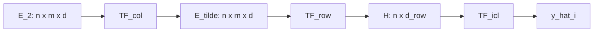

[Mohit Saharan](https://linkedin.com/in/msaharan), P28, 20260528
___
# Understanding Tabular Foundation Models: the architecture of TabICLv2 - 3
Subtitle: Compression then ICL
___
TabICLv2 does not run in-context learning on every cell in the table. It first compresses \(n\times m\) feature tokens into \(n\) row vectors, then runs ICL over those rows. Labels enter twice: once inside feature tokens (the previous post) and again on row tokens before dataset-wise ICL.

The previous post covered target-aware embedding, where labels are injected into the feature tokens of training rows. This post covers what happens next: the compression-then-ICL pipeline.

**What to watch for in this post**

- The tensor entering compression (\(E_2\))
- Three stages: \(\text{TF}_\text{col}\) → \(\text{TF}_\text{row}\) → \(\text{TF}_\text{icl}\)
- Two target injections (feature-token vs row-token)
- Why staging avoids full cell-level attention

As a reminder, the full pipeline is below. **In this episode, focus on \(\text{TF}_\text{col}\), \(\text{TF}_\text{row}\), and \(\text{TF}_\text{icl}\).** Later posts cover QASSMax and the prediction heads.

Given an input table \(X\in\mathbb{R}^{n\times m}\), where \(n\) is the number of rows and \(m\) is the number of columns, repeated feature grouping encodes columns into grouped feature positions using circular shifts to reduce feature-order symmetries. Target-aware embedding then injects observed target information for training rows. After those preprocessing steps, \(\text{TF}_\text{col}\) embeds each grouped feature position across rows, \(\text{TF}_\text{row}\) aggregates grouped feature embeddings into row representations \(h_i\), and \(\text{TF}_\text{icl}\) performs in-context learning to predict test targets \(\hat{y}_i\). QASSMax (query-aware scalable softmax, covered in post 4) is used inside parts of \(\text{TF}_\text{col}\) and \(\text{TF}_\text{icl}\) to reduce attention fading when the context contains many rows.


*TabICLv2 pipeline; this post covers the compression-then-ICL stack (middle blocks).*

## Compression then ICL

### Starting point: target-aware tokens \(E_2\)

Before compression begins, TabICLv2 has already constructed a target-aware token tensor
$$
E_2\in\mathbb{R}^{n\times m\times d}.
$$
Here \(d\) is the token embedding dimension. Each token \(E_2[i,j]\in\mathbb{R}^d\) represents row \(i\) and grouped feature position \(j\). After repeated feature grouping, \(m\) denotes the number of grouped feature positions being processed by the transformer stack.

The previous post derived target-aware embedding in full. For training rows, the update is
$$
E_2[i,j]=E_1[i,j]+u_i,
$$
where \(E_1\) is the feature-only tensor from repeated feature grouping and \(u_i\) is the row-level target vector from target-aware embedding (see the previous post for \(\text{Embed}_\text{TAE}\) and the test-row masking rule). For a labeled row, the same target vector is broadcast across all grouped feature positions.

The key fact for this post: compression does not operate on raw feature tokens. It operates on feature tokens that already contain training-label information. Labels first entered at the **feature-token** level in the previous post. A **second** target embedding is added later at the **row-token** level before dataset-wise ICL.

The compression-then-ICL pipeline explains what happens next. TabICLv2 must convert the \(n\times m\) grid of row-feature tokens into row-level representations that can be used for prediction. It does this in three stages:

1. column-wise embedding applies a Set Transformer \(\text{TF}_\text{col}\) to each grouped feature position;
2. row-wise interaction uses \(\text{TF}_\text{row}\) with learned \([\text{CLS}]\) tokens to compress grouped feature embeddings within each row;
3. dataset-wise ICL uses \(\text{TF}_\text{icl}\) so test row representations can attend to labeled training row representations.

Same three blocks, with tensor shapes at each step:



### Stage 1: Column-wise embedding (TF_col)

*Stage 1 — across rows, within one feature column.*

The first stage processes each grouped feature position across rows. Conceptually, for each grouped feature index \(j\), the model sees the sequence
$$
(E_2[1,j],E_2[2,j],\ldots,E_2[n,j]).
$$
Induced attention uses a small set of learned summary tokens that attend only to training rows, then broadcasts those summaries back to all rows—so test rows cannot contaminate the column summaries, but every row still receives context anchored to labeled examples. \(\text{TF}_\text{col}\) uses this mechanism to compare how the same grouped feature behaves across rows, rather than applying full attention over all rows.

Let \(\tilde{E}\in\mathbb{R}^{n\times m\times d}\) denote the output of the column-wise stage.

### Stage 2: Row-wise compression (TF_row)

*Stage 2 — across features, within one row. This is where compression happens.*

The second stage aggregates feature information within each row. For a fixed row \(i\), the model has grouped feature embeddings
$$
(\tilde{E}[i,1],\tilde{E}[i,2],\ldots,\tilde{E}[i,m]),
$$
and \(\text{TF}_\text{row}\) processes them together with learned \([\text{CLS}]\) tokens. The outputs at the \([\text{CLS}]\) positions are used as the row summary. Collectively, these \([\text{CLS}]\) outputs form the row representation
$$
h_i\in\mathbb{R}^{d_\text{row}},
$$
where \(d_\text{row}\) is the row-representation dimension. This is the main compression step: the model moves from \(n\times m\) feature tokens to \(n\) row representations.

### Stage 3: Dataset-wise ICL (TF_icl)

*Stage 3 — across rows again, but now each row is one token.*

The row representations
$$
h_1,\ldots,h_n
$$
become the row tokens over which \(\text{TF}_\text{icl}\) operates. For training rows, the model adds another target embedding to the row representation; for test rows, no true target is supplied. The first target embedding helped construct feature-aware row summaries; this second one marks which row tokens are labeled examples during ICL.

Let \(\mathcal{I}_\text{train}\subseteq\{1,\ldots,n\}\) be the set of training row indices, and let \(\mathcal{I}_\text{test}\) be the complementary set of test row indices whose targets must be predicted. Define
$$
z_i =
\begin{cases}
\displaystyle h_i+\text{Embed}_\text{ICL}(y_i), & i\in\mathcal{I}_\text{train},\\
h_i, & i\in\mathcal{I}_\text{test},
\end{cases}
$$
where \(z_i\in\mathbb{R}^{d_\text{row}}\) is the row token passed to \(\text{TF}_\text{icl}\), and \(\text{Embed}_\text{ICL}\) maps an observed target into \(\mathbb{R}^{d_\text{row}}\). The ICL transformer lets test rows attend to labeled training rows and outputs \(\hat{y}_i\), the predicted target for test row \(i\).

## Why this design?

This staged design separates two kinds of structure. Column-wise and row-wise processing learn feature and row representations. Dataset-wise ICL performs the final train-test interaction.

The model avoids doing expensive full cell-level attention throughout the entire pipeline. It still gives the prediction stage row-level context enriched by feature and target information.

### At a glance

| Stage | Input | Output | Role |
|-------|--------|--------|------|
| \(\text{TF}_\text{col}\) | tokens per column across rows | column-contextualized tokens \(\tilde{E}\) | compare same feature across rows |
| \(\text{TF}_\text{row}\) | tokens per row | row representation \(h_i\) | compress row to one vector |
| \(\text{TF}_\text{icl}\) | row tokens \(z_i\) | \(\hat{y}_i\) | test rows attend to labeled train rows |

### Implementation in NanoTabICL

NanoTabICL implements a compact educational version of the compression-then-ICL stack in the order described above. Production TabICLv2 adds engineering details such as inference managers, caching/offloading, and reserved CLS slots, but the same three-stage architecture is visible. After repeated feature grouping and the first target-aware embedding, `emb` has shape:

```text
(batch, rows, cols, embed_dim)
```

The three stages are visible as three consecutive blocks in `forward`.

First, \(\text{TF}_\text{col}\) applies induced attention within each grouped feature position:

```python
for block in self.col_blocks:
    emb = block.col_attn(emb, kv_max_idx=n_train)
```

Here `col_attn` means: keep the column position fixed, and attend across rows. The `kv_max_idx=n_train` argument restricts keys and values to training rows, so all rows can receive column context summarized from labeled examples, but test rows do not contribute to those summaries.

The block itself is `InducedTransformerBlock`, which implements induced attention:

```python
self.tfm1 = TransformerBlock(embed_dim=embed_dim, num_heads=num_heads, ssmax=ssmax)
self.tfm2 = TransformerBlock(embed_dim=embed_dim, num_heads=num_heads)
self.inducing_vectors = nn.Parameter(0.02 * torch.randn(1, n_inducing, embed_dim))

kv = self.tfm1(self.inducing_vectors.expand(q.shape[0], -1, -1), q, kv_max_idx=kv_max_idx)
return self.tfm2(q, kv, q_max_idx=q_max_idx)
```

For one fixed grouped feature position, the input to the induced block is a row sequence with shape `(batch * cols, rows, embed_dim)` after `col_attn` has transposed and flattened the table. The inducing vectors first query the training rows and produce a compact set of latent row summaries:

```text
training-row tokens -> n_inducing latent summaries
```

Then the original row tokens attend back to those summaries. Architecturally, this is the compression move inside \(\text{TF}_\text{col}\): each column position can learn from many labeled rows without running full row-by-row self-attention at every column token.

Second, \(\text{TF}_\text{row}\) adds learned row-level `[CLS]` tokens and attends across feature positions within each row:

```python
emb = torch.cat([self.row_cls_tokens.expand(n_batch, n_rows, -1, -1), emb], dim=2)
for block in self.row_blocks[:-1]:
    emb = block.row_attn(emb)
emb = self.row_blocks[-1].row_attn(emb, q_max_idx=self.row_cls_tokens.size(-2))
emb = self.row_ln(emb).flatten(-2, -1)
```

The shape transition is:

| Step | Shape | Meaning |
|---|---|---|
| before CLS tokens | `(batch, rows, cols, embed_dim)` | one token per grouped feature position |
| after prepending CLS tokens | `(batch, rows, n_cls_cols + cols, embed_dim)` | each row gets learned summary tokens |
| after final `q_max_idx` | `(batch, rows, n_cls_cols, embed_dim)` | keep only CLS outputs |
| after `flatten(-2, -1)` | `(batch, rows, n_cls_cols * embed_dim)` | one row token per row |

That flattened size is `icl_dim` in the code:

```python
icl_dim = embed_dim * n_cls_cols
```

Third, \(\text{TF}_\text{icl}\) performs in-context learning over row tokens. This is where NanoTabICL injects targets a second time:

```python
emb[:, :n_train] += self.y_embed_icl(y[:, :, None])
for block in self.icl_blocks[:-1]:
    emb = block(emb, kv_max_idx=n_train)
emb = self.icl_blocks[-1](emb[:, n_train:], emb[:, :n_train])
return self.out_mlp(self.out_ln(emb))
```

At this point, `emb` has shape:

```text
(batch, rows, icl_dim)
```

The second target embedding has shape `(batch, n_train, icl_dim)`, so it marks labeled row tokens before ICL. The intermediate ICL blocks again use `kv_max_idx=n_train`, making every row attend only to training rows as keys and values. In NanoTabICL, the last block is written as a test-query shortcut: it passes test rows as queries and training rows as keys/values:

```text
queries:      emb[:, n_train:]   -> test rows
keys/values:  emb[:, :n_train]   -> training rows
```

So the final output contains predictions only for the test rows:

```text
(batch, n_test, out_dim)
```

That last-block shortcut is a NanoTabICL simplification for the hands-on implementation. The paper-level statement to keep is broader: \(\text{TF}_\text{icl}\) uses labeled training row representations as context and returns predictions for test rows.

The helper that makes row-wise and column-wise attention compact is `TableAttnBase`:

```python
def row_attn(self, q, kv=None, **kwargs):
    n_batch, n_rows, n_cols, embed_dim = q.shape
    q, kv = (None if t is None else t.flatten(0, 1) for t in [q, kv])
    return self(q, kv, **kwargs).reshape(n_batch, n_rows, -1, embed_dim)

def col_attn(self, q, kv=None, **kwargs):
    return self.row_attn(
        q.transpose(1, 2),
        None if kv is None else kv.transpose(1, 2),
        **kwargs,
    ).transpose(1, 2)
```

`row_attn` flattens `(batch, rows)` into one larger batch dimension, so standard sequence attention can run across columns inside each row. `col_attn` transposes rows and columns, reuses `row_attn`, and transposes back. This is the implementation trick that lets ordinary transformer blocks operate over a 2D table without writing a separate attention kernel for every axis.

## Summary

**Takeaway:** TabICLv2 compresses \(n\times m\) target-aware feature tokens into \(n\) row representations, then runs dataset-wise ICL so test rows attend to labeled training rows.

Compression then ICL separates feature processing from dataset-level prediction. TabICLv2 first contextualizes grouped feature positions across rows, then compresses each row into a fixed-dimensional representation, and finally lets test rows attend to labeled training rows through the ICL transformer. The next post covers query-aware scalable softmax, the attention-scaling mechanism TabICLv2 uses to preserve selective attention as the number of context samples grows.
