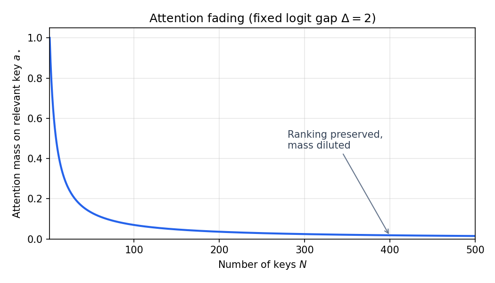
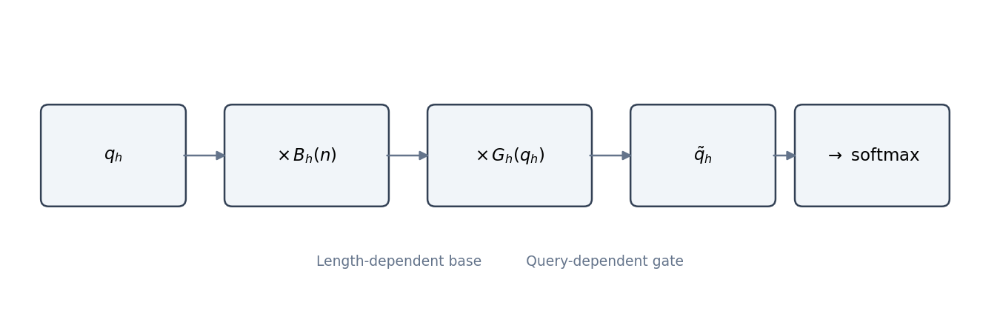

[Mohit Saharan](https://linkedin.com/in/msaharan), P29, 20260528, Draft
___
# Understanding Tabular Foundation Models: the architecture of TabICLv2 - 4

Subtitle: Query-aware scalable softmax
___
Part 3 showed how TabICLv2 compresses rows and runs in-context learning. The hidden failure mode is attention fading: as training context grows, ordinary softmax spreads mass across many keys even when one row is clearly best. Scalable Softmax (SSMax) rescales queries with \(s_h\log n\); Query-Aware Scalable Softmax (QASSMax) adds a learned length-dependent base and a bounded query-dependent gate so different queries can stay sharp or broad as context grows.

**What to watch for in this post**

- Softmax as temperature / logit scaling (unchanged ranking, changed sharpness)
- Why attention mass on the best key vanishes as \(N\) grows
- SSMax: per-head scale \(\propto \log n\)
- QASSMax: \(B_h(n)\) (length) + \(G_h(q_h)\) (query gate)
- Where it is applied: \(\text{TF}_\text{col}\) induced attention and \(\text{TF}_\text{icl}\)

As a reminder, the full pipeline is below. **In this episode, focus on QASSMax inside \(\text{TF}_\text{col}\) and \(\text{TF}_\text{icl}\).** Given an input table \(X\in\mathbb{R}^{n\times m}\), with \(n\) rows and \(m\) features, repeated feature grouping and target-aware embedding prepare grouped feature tokens. Then \(\text{TF}_\text{col}\) embeds each grouped feature position, \(\text{TF}_\text{row}\) aggregates into row representations \(h_i\), and \(\text{TF}_\text{icl}\) predicts test targets \(\hat{y}_i\). QASSMax is applied where the model must choose what to attend to among many candidates: in the first induced-attention stage of \(\text{TF}_\text{col}\) and in \(\text{TF}_\text{icl}\), where test rows attend to training rows.


*TabICLv2 pipeline; QASSMax is applied in the first induced-attention stage of TF_col and in TF_icl.*

## Query-aware scalable softmax

Query-aware scalable softmax, or QASSMax, modifies the logits used by softmax attention by rescaling the query before dot products are computed. Its purpose is to keep attention selective when the number of context samples becomes much larger than the sequence lengths seen during pretraining.

To avoid overloading notation, I will use \(N\) for the number of keys in a generic attention calculation. Later, when discussing TabICLv2 and the paper's formula, I will use \(n\) for the training-set size.

The argument has three steps. First, ordinary softmax is reviewed as a temperature-controlled normalization. Second, the attention-fading problem shows why context length changes the behavior of softmax. Third, SSMax and QASSMax are introduced as progressively more flexible ways to compensate for that length effect.

### Softmax as temperature

Start with standard scaled dot-product attention. For one attention head, a query \(q\in\mathbb{R}^{d_\text{head}}\) is compared with \(N\) keys \(k_1,\ldots,k_N\in\mathbb{R}^{d_\text{head}}\), where \(d_\text{head}\) is the dimension of that head. The unnormalized attention logit for key \(j\) is
$$
z_j=\frac{q^\top k_j}{\sqrt{d_\text{head}}},
$$
where \(j\in\{1,\ldots,N\}\). The attention weight assigned to key \(j\) is
$$
a_j=\text{softmax}(z)_j=\frac{\exp(z_j)}{\sum_{\ell=1}^{N}\exp(z_\ell)}.
$$
Here \(z=(z_1,\ldots,z_N)\), \(a_j\) is the normalized attention weight, and \(\ell\) is only the summation index over keys. The output is the weighted average \(\sum_{j=1}^N a_jv_j\), where \(v_j\) is the value vector associated with key \(j\).

QASSMax does not replace attention. It changes the logits before the softmax by rescaling the query. In the simplest scalar case, if the query is rescaled as \(\tilde{q}=\lambda q\), where \(\lambda>0\) is a scalar logit scale, then
$$
\tilde{z}_j=\frac{\tilde{q}^\top k_j}{\sqrt{d_\text{head}}}=\lambda z_j.
$$
So scalar query scaling is mathematically equivalent to scalar logit scaling. It is also equivalent to changing the softmax temperature. For a temperature \(\tau>0\),
$$
\text{softmax}_\tau(z)_j=\frac{\exp(z_j/\tau)}{\sum_{\ell=1}^{N}\exp(z_\ell/\tau)}.
$$
Writing \(\lambda=1/\tau\), we get
$$
\text{softmax}_\tau(z)=\text{softmax}(\lambda z).
$$
Lower temperature, or larger \(\lambda\), sharpens attention; higher temperature, or smaller \(\lambda\), spreads attention more broadly. The relative odds between keys \(j\) and \(\ell\) become
$$
\frac{a_j}{a_\ell}
=
\frac{\exp(\lambda z_j)}{\exp(\lambda z_\ell)}
=
\exp(\lambda(z_j-z_\ell)).
$$
Scaling therefore does not change which key has the highest logit. It changes how decisively the softmax concentrates probability mass on high-logit keys.

### Why softmax fades as context grows

This matters because standard softmax can suffer from attention fading. Suppose one relevant key has logit \(z_\star\), and the other \(N-1\) distractors all have a lower logit \(z_0\). Let \(\Delta=z_\star-z_0>0\) be the logit gap between the relevant key and a distractor. Under ordinary softmax,
$$
a_\star
=
\frac{\exp(z_\star)}{\exp(z_\star)+(N-1)\exp(z_0)}
=
\frac{1}{1+(N-1)\exp(-\Delta)}.
$$
For fixed \(\Delta\), \(a_\star\rightarrow0\) as \(N\rightarrow\infty\). Even if each distractor is individually less relevant, many distractors can collectively absorb the attention mass through the denominator. The problem is not that softmax forgets the ranking of logits; the problem is that the denominator grows with the number of competing keys.

*In plain terms: the model still knows which row looks best, but softmax divides attention among so many competitors that the best row gets only a tiny share.*



*Attention mass on the relevant key vs. number of distractors (fixed logit gap \(\Delta\)).*

### SSMax: scale logits with log n

Scalable Softmax, or SSMax, is the first fix for this specific failure mode. It keeps the ordinary softmax but makes the logit scale grow with context length, so the denominator grows while the relevant logit gap is also allowed to grow. In the TabICLv2 paper's notation, let \(q_h=(q_{hi})\) be a query vector at attention head \(h\), with head dimension indexed by \(i\), and let \(n\) be the size of the training set. SSMax rescales queries with a learnable per-head scalar \(s_h\):
$$
\tilde{q}_{hi}=q_{hi}\cdot s_h\log n.
$$
This yields scaled logits \(\tilde{z}_j=(s_h\log n)z_j\). In the one-relevant-key example, replacing \(N\) by \(n\) for the training rows gives
$$
a_\star
=
\frac{1}{1+(n-1)\exp(-s_h\Delta\log n)}
\approx
\frac{1}{1+n^{1-s_h\Delta}}.
$$
The approximation uses \(n-1\approx n\) and \(\exp(-s_h\Delta\log n)=n^{-s_h\Delta}\). It shows why \(\log n\) matters: to keep the relevant token visible as \(n\) grows, the relevant logit gap must effectively grow on the order of \(\log n\). In this simplified example, the attention on the relevant key stays large when the learned scale is strong enough that \(s_h\Delta>1\).

*So the relevant row does not disappear just because you added more rows—the logit gap must grow like \(\log n\) to keep up with the denominator.*

### QASSMax: length base + query gate

This SSMax derivation explains the length-scaling part of the solution, but it still gives every query in the same head the same scale. TabICLv2 extends SSMax with query-aware scalable softmax. Instead of using one scalar \(s_h\) per head, QASSMax rescales each query element as
$$
\tilde{q}_{hi}
=
q_{hi}
\underbrace{\cdot\text{MLP}_\text{base}(\log n)_{hi}}_\text{base scaling}
\cdot
\underbrace{(1+\tanh(\text{MLP}_\text{gate}(q_h)_i))}_\text{query-aware gating}.
$$
In vector notation, this is
$$
\tilde{q}_h=q_h\odot B_h(n)\odot G_h(q_h),
$$
where
$$
B_h(n)=\text{MLP}_\text{base}(\log n)_h\in\mathbb{R}^{d_\text{head}},
$$
and
$$
G_h(q_h)=1+\tanh(\text{MLP}_\text{gate}(q_h))\in(0,2)^{d_\text{head}}.
$$



*QASSMax rescales the query with a length-dependent base and a bounded query-dependent gate before softmax.*

Here \(\odot\) denotes element-wise multiplication, \(B_h(n)\) is the length-dependent base vector for head \(h\), and \(G_h(q_h)\) is the query-dependent gate for that head. For \(H\) attention heads, \(\text{MLP}_\text{base}: \mathbb{R}\rightarrow\mathbb{R}^{H\times d_\text{head}}\) takes \(\log n\) and outputs one base value per head dimension, while \(\text{MLP}_\text{gate}:\mathbb{R}^{d_\text{head}} \rightarrow \mathbb{R}^{d_\text{head}}\) maps the current query to an element-wise gate. This is the element-wise QASSMax variant used by the official default configuration. Both MLPs are two-layer MLPs with 64 hidden neurons and GELU activation. GELU stands for Gaussian Error Linear Unit; one common definition is \(\text{GELU}(x)=x\Phi(x)\), where \(\Phi(x)\) is the standard normal CDF. In the TabICLv2 implementation, the last layer of \(\text{MLP}_\text{gate}\) is initialized to zero, so the initial gate is \(G_h(q_h)=1\).

The two factors in QASSMax have different jobs. The base term \(B_h(n)\) handles the predictable effect of context length: as \(n\) changes, the model can learn how much the logits should be rescaled before softmax.

The length-dependent base follows the same principle as earlier scalable-attention methods such as SSMax and ASEntmax: normalization should adapt when the number of keys changes. TabICLv2 learns that adaptation with \(\text{MLP}_\text{base}(\log n)\) rather than a fixed power law. See **Further reading** below for entmax/ASEntmax background.

The gate \(G_h(q_h)\) handles the second job: it adds query awareness on top of the base length trend. This follows the principle behind selective attention: not every query should have the same attention sharpness. Some queries need to retrieve a highly specific row; others need to aggregate information more broadly. A test row that looks almost identical to one training row may need sharp attention on that neighbor; a test row in a sparse region of feature space may need to borrow signal from many training rows.

### Further reading: scalable attention background

ASEntmax comes from the entmax family. Entmax is a family of softmax alternatives that can produce sparse probability distributions by solving an entropy-regularized optimization problem over the probability simplex
$$
\mathcal{S}^N=\left\{p\in\mathbb{R}^N:\sum_{j=1}^N p_j=1,\ p_j\geq0\right\}.
$$
Here \(p=(p_1,\ldots,p_N)\) is a probability vector over \(N\) keys, \(p_j\) is the probability assigned to key \(j\), and \(\mathcal{S}^N\) is the set of all valid probability vectors over those keys. At a high level,
$$
\text{entmax}_\alpha(z)
=
\arg\max_{p\in\mathcal{S}^N}\left(p^\top z + H_\alpha(p)\right),
$$
where \(z\) is the vector of logits, \(H_\alpha\) is a Tsallis-entropy-style regularizer, and \(\alpha\) controls sparsity. The relevant lesson for QASSMax is not sparsity itself, because QASSMax still uses softmax. The relevant lesson is that attention normalization can benefit from a learned function of context length. ASEntmax uses a scaling form
$$
\delta+\beta(\log n)^\gamma.
$$
Here \(\delta\) is a length-independent offset, while \(\beta\) and \(\gamma\) are input-dependent quantities in ASEntmax. QASSMax does not adopt entmax's sparse normalization, but it does keep the idea that the attention transformation can depend on context length. It generalizes the length-scaling part through \(\text{MLP}_\text{base}(\log n)\).

### Why put the gate on the query, not the output?

Selective attention needs per-query sharpness, but a single scalar temperature per query is too coarse. QASSMax uses a bounded element-wise gate \(G_h(q_h)\in(0,2)^{d_\text{head}}\) that can reduce or increase the base scale without growing without limit. In a query-dependent temperature formulation, query row \(r\) might use
$$
a_{rj}
=
\frac{\exp(z_{rj}/\tau_r)}
{\sum_{\ell=1}^{N}\exp(z_{r\ell}/\tau_r)}.
$$
Here \(r\) indexes the query row or query token, \(z_{rj}\) is the attention logit between query \(r\) and key \(j\), \(a_{rj}\) is the resulting attention weight, and \(\tau_r>0\) is the temperature assigned to that query. Some gated attention mechanisms apply the gate after attention, for example
$$
\tilde{o}=g(q)\odot \text{Attn}(q,K,V).
$$
In this expression, \(K\) is the matrix of keys, \(V\) is the matrix of values, \(\text{Attn}(q,K,V)\) is the ordinary attention output for query \(q\), and \(\tilde{o}\) is the gated output. QASSMax applies the gate earlier, at the query-scaling stage. Because the gate changes \(\tilde{q}_h\), it changes the logits before softmax:
$$
\tilde{z}_j=
\frac{(q_h\odot B_h(n)\odot G_h(q_h))^\top k_j}
{\sqrt{d_\text{head}}}.
$$
So the gate affects the attention weights themselves, not only the post-attention output. Unlike the earlier scalar-temperature example, QASSMax is not generally equivalent to one scalar temperature per query, because \(B_h(n)\) and \(G_h(q_h)\) scale different head dimensions differently. The scalar-temperature view is still useful as intuition: QASSMax changes attention sharpness by changing the logits before softmax.

*QASSMax fights fading by sharpening logits as context length grows, and by letting each query decide how much sharpening it needs.*

### Where TabICLv2 uses QASSMax

These four design choices address the fading problem from above: \(\log n\) counteracts denominator growth, \(\text{MLP}_\text{base}(\log n)\) learns a context-length scaling law, element-wise scaling is more expressive than a single per-head scalar, and bounded query-aware gating lets different queries adjust sharpness without destabilizing length scaling. Applied to \(\text{TF}_\text{col}\) and \(\text{TF}_\text{icl}\), QASSMax improves long-context behavior. In the paper's needle-in-haystack classification task, the model must focus on one anchor sample among many negative samples. Without scalable softmax, attention entropy rises and accuracy drops as the number of negatives grows. QASSMax maintains low entropy and 100% accuracy even with 15K negatives, outperforming SSMax at extreme scales.

### Implementation in NanoTabICL

NanoTabICL attaches QASSMax only to the stages where attention must scale over many training rows: the column-wise induced attention blocks and the dataset-wise ICL blocks. This matches the paper-level placement: the first induced-attention stage of \(\text{TF}_\text{col}\) and \(\text{TF}_\text{icl}\), not the row-wise transformer.

```python
self.col_blocks = nn.ModuleList([
    InducedTransformerBlock(
        embed_dim=embed_dim,
        num_heads=col_nhead,
        n_inducing=n_cls_rows,
        ssmax=True,
    )
    for _ in range(col_num_blocks)
])

self.icl_blocks = nn.ModuleList([
    TransformerBlock(embed_dim=icl_dim, num_heads=icl_nhead, ssmax=True)
    for _ in range(icl_num_blocks)
])
```

There is one subtlety in the column stage. `InducedTransformerBlock` contains two attention calls, and QASSMax is attached to the first one:

```python
self.tfm1 = TransformerBlock(embed_dim=embed_dim, num_heads=num_heads, ssmax=ssmax)
self.tfm2 = TransformerBlock(embed_dim=embed_dim, num_heads=num_heads)

kv = self.tfm1(self.inducing_vectors.expand(q.shape[0], -1, -1), q, kv_max_idx=kv_max_idx)
return self.tfm2(q, kv, q_max_idx=q_max_idx)
```

So in \(\text{TF}_\text{col}\), QASSMax is used when the inducing vectors attend over the row tokens for a fixed grouped feature position. The shape at that point is an ordinary sequence-attention shape, `(batch * cols, rows, embed_dim)`, and `kv_max_idx=n_train` makes the effective key length the number of training rows. That is exactly the setting where the softmax denominator grows with context size.

The row-wise transformer blocks use RoPE but do not enable QASSMax:

```python
self.row_blocks = nn.ModuleList([
    TransformerBlock(embed_dim=embed_dim, num_heads=row_nhead, use_rope=True)
    for _ in range(row_num_blocks)
])
```

Inside `TransformerBlock`, the `ssmax=True` flag creates a `QASSMax` layer:

```python
self.ssmax_layer = (
    QASSMax(num_heads=num_heads, head_dim=embed_dim // num_heads)
    if ssmax
    else None
)
```

The layer is applied directly to the query tensor before rotary position encoding and before scaled dot-product attention:

```python
q = q if self.ssmax_layer is None else self.ssmax_layer(q=q, n=k.size(-2))
q, k = (t if self.rope is None else self.rope(t) for t in [q, k])
attn_output = nn.functional.scaled_dot_product_attention(...)
```

This placement matters. QASSMax changes the query before the logits \(q^\top k\) are computed, so it changes the attention weights themselves, not just the post-attention output.

The QASSMax module is short enough to read directly:

```python
class QASSMax(nn.Module):
    def __init__(self, num_heads: int, head_dim: int, n_hidden: int = 64):
        super().__init__()
        self.base_mlp = get_mlp(1, n_hidden, num_heads * head_dim)
        self.query_mlp = get_mlp(head_dim, n_hidden, head_dim)
        nn.init.zeros_(self.query_mlp[-1].weight)
        nn.init.zeros_(self.query_mlp[-1].bias)

    def forward(self, q: torch.Tensor, n: int) -> torch.Tensor:
        batch_size, num_heads, seq_len, head_dim = q.shape
        logn = q.new_tensor(math.log(max(1, n))).view(1, 1)
        return (
            self.base_mlp(logn).view(1, num_heads, 1, head_dim)
            * (1 + torch.tanh(self.query_mlp(q)))
            * q
        )
```

The input query tensor has shape:

```text
(batch, heads, query_len, head_dim)
```

The length-dependent base term starts from a scalar:

```text
logn: (1, 1)
```

After `base_mlp(logn)` and reshaping, it becomes:

```text
(1, heads, 1, head_dim)
```

That shape broadcasts across batch and query positions. It is the implementation of \(B_h(n)\), the learned length-dependent scaling vector for each head dimension.

The query gate is:

```python
1 + torch.tanh(self.query_mlp(q))
```

It has the same shape as `q`:

```text
(batch, heads, query_len, head_dim)
```

Because `tanh` lies in \((-1,1)\), the multiplicative gate lies in \((0,2)\). The final multiplication implements:
$$
\tilde{q}_h=q_h\odot B_h(n)\odot G_h(q_h).
$$

The zero initialization of the last `query_mlp` layer is also important:

```python
nn.init.zeros_(self.query_mlp[-1].weight)
nn.init.zeros_(self.query_mlp[-1].bias)
```

At initialization, `query_mlp(q)` is zero, so the gate starts as:
$$
1+\tanh(0)=1.
$$
That means QASSMax initially behaves like length-dependent scaling without extra query modulation. The query-aware part can then be learned gradually rather than perturbing attention sharply at initialization.

## Summary

**Takeaway:** QASSMax rescales attention queries with a learned length-dependent base and a bounded query gate so attention stays selective as training context grows.

Query-aware scalable softmax modifies attention logits by rescaling queries with both a context-length-dependent base term and a bounded query-dependent gate. This helps TabICLv2 keep attention sharp in long contexts while allowing different queries and latent dimensions to adjust the amount of scaling they need. The next post covers many-class classification, where TabICLv2 extends a model pretrained with at most 10 classes to settings with many more labels.
