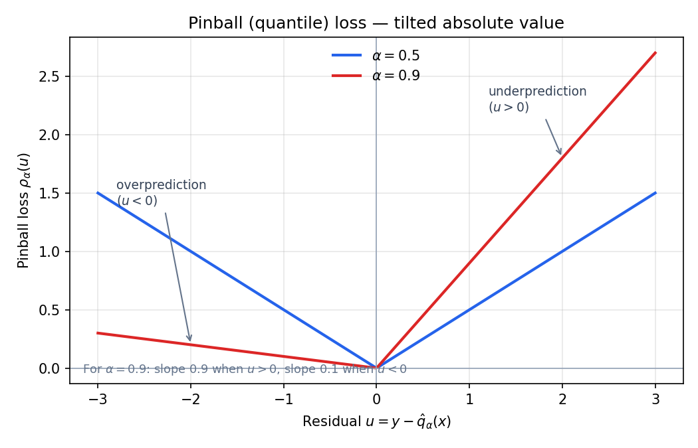
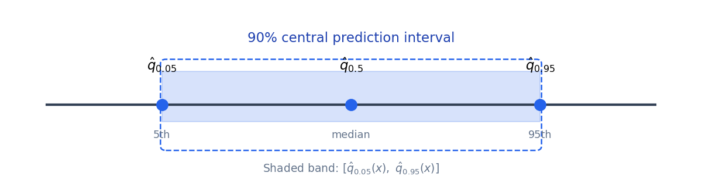

[Mohit Saharan](https://linkedin.com/in/msaharan), P31, 20260528
___
# Understanding Tabular Foundation Models: the architecture of TabICLv2 - 6

Subtitle: Quantile predictions for regression
___
For regression, TabICLv2 does not predict one number — it predicts an entire conditional distribution through 999 quantiles.

The previous post covered many-class classification, where TabICLv2 handles large label spaces through mixed-radix ensembling and hierarchical classification. This post covers quantile predictions for regression, the strategy TabICLv2 uses to represent predictive uncertainty without discretizing the continuous target into classification bins.

**What to watch for in this post**

- TabPFN-style binning vs TabICLv2 quantiles
- Pinball loss and the α = 0.9 asymmetry
- 999 quantile outputs, summed training loss, crossing at inference
- Prediction intervals and point estimate via averaging

For this post, focus on the **regression head**: same backbone as prior posts, but many quantile outputs per test row instead of class logits.

As a reminder, TabICLv2 maps a table through column embedding, row aggregation, and in-context learning to row representations \(h\). The architecture figure is below.

*TabICLv2 pipeline; this post covers the regression head (quantile outputs).*

## Quantile predictions for regression

Tabular foundation models adopt different strategies for regression. TabPFNv2 and TabPFN-2.5 model the predictive distribution by discretizing the target space into bins and applying cross-entropy loss. TabICLv2 instead uses a separate regression model that directly predicts quantiles.

The rest of this post has four parts: (1) what quantiles are, (2) pinball loss and why it targets them, (3) how TabICLv2 trains and fixes crossing quantiles, and (4) how those quantiles become intervals and a point prediction.

### What quantiles are

To see what this regression head is learning, first recall what a quantile represents.

*Start with the unconditional case — one target \(Y\), no features yet.*

Let \(Y\) be a real-valued target random variable. For a probability level \(\alpha\in(0,1)\), an \(\alpha\)-quantile is any value \(q_\alpha\) such that
$$
P(Y\leq q_\alpha)\geq \alpha
\quad\text{and}\quad
P(Y\geq q_\alpha)\geq 1-\alpha,
$$
where \(P(\cdot)\) denotes probability. This definition can be non-unique when the CDF has jumps or flat spots. If the cumulative distribution function is continuous and strictly increasing at \(q_\alpha\), the condition reduces to
$$
F_Y(q_\alpha)=\alpha,
$$
where \(F_Y(q)=P(Y\leq q)\) is the cumulative distribution function (CDF) of \(Y\). For example, \(q_{0.5}\) is the median, \(q_{0.9}\) is the 90th percentile, and \(q_{0.1}\) is the 10th percentile.

*Now make the distribution depend on the row.*

In supervised regression, the target distribution depends on the input row. To avoid overloading the table symbol \(X\), write \(Z\) for the random feature vector of a single row and \(x\) for a particular observed row. The conditional \(\alpha\)-quantile at that row is
$$
q_\alpha(x)=Q_x(\alpha),
\qquad
Q_x(\alpha)=\inf\{q\in\mathbb{R}:F_{Y\mid Z=x}(q)\geq\alpha\}.
$$
Here \(F_{Y\mid Z=x}(q)=P(Y\leq q\mid Z=x)\) is the conditional CDF of \(Y\) given the feature vector \(Z=x\), and \(Q_x\) is its generalized inverse. The symbol \(q\) inside the infimum is a candidate target value, not a probability level; \(\inf\) denotes the infimum, which gives the smallest threshold in the generalized-inverse sense.

When the conditional CDF is continuous and strictly increasing, \(Q_x(\alpha)\) is the usual inverse \(F^{-1}_{Y\mid Z=x}(\alpha)\).

Instead of asking the model for one conditional summary, TabICLv2 asks it for many summaries spread across the distribution. Specifically, it predicts 999 such quantiles at probability levels
$$
\mathcal{A}=\{0.001,0.002,\ldots,0.999\}.
$$
This gives a dense grid of estimated points on \(Q_x(\alpha)\), so the model predicts more than a single point estimate. It predicts many conditional quantiles of \(Y\mid Z=x\).

### Pinball loss

*Each of the 999 outputs is trained with pinball loss. Here is what that penalty looks like.*

Each quantile is trained with pinball loss, also called quantile loss or check loss. If the model predicts \(\hat{q}_\alpha(x)\) for level \(\alpha\) and the observed target is \(y\), define the residual
$$
u=y-\hat{q}_\alpha(x).
$$
The pinball loss is
$$
\rho_\alpha(u)
=
\begin{cases}
\alpha u, & u\geq 0,\\
(\alpha-1)u, & u<0.
\end{cases}
$$
Equivalently,
$$
\rho_\alpha(y-\hat{q})
=
(\alpha-\mathbf{1}\{y<\hat{q}\})(y-\hat{q}).
$$
Here \(\hat{q}\) is shorthand for \(\hat{q}_\alpha(x)\), and \(\mathbf{1}\{y<\hat{q}\}\) is an indicator that equals \(1\) when \(y<\hat{q}\) and \(0\) otherwise. The loss is shaped like a tilted absolute-value function. Underprediction means \(y>\hat{q}\), so \(u>0\), and the penalty slope with respect to the residual \(u\) is \(\alpha\). Overprediction means \(y<\hat{q}\), so \(u<0\), and the penalty slope magnitude is \(1-\alpha\).

*Pinball loss for α=0.5 and α=0.9: asymmetric slopes penalize under- and over-prediction differently.*

This asymmetry is what makes the loss target a specific quantile. For \(\alpha=0.5\),
$$
\rho_{0.5}(u)=0.5|u|,
$$
so minimizing the expected loss recovers a median. For \(\alpha=0.9\), overprediction is penalized with slope magnitude \(0.1\), while underprediction is penalized with slope \(0.9\). The model is therefore encouraged to place \(\hat{q}_{0.9}\) high enough that, under a calibrated conditional distribution, about 90% of outcomes fall below it.

*Intuition first: the loss penalizes under- and over-shooting differently. The calculation below shows that minimizing expected pinball risk recovers the \(\alpha\)-quantile.*

#### Proof sketch (optional depth)

For a fixed input \(x\), suppress \(x\) in the notation and consider choosing a scalar prediction \(q\) to minimize the expected pinball risk
$$
R_\alpha(q)=\mathbb{E}[\rho_\alpha(Y-q)].
$$
Here \(\mathbb{E}\) denotes expectation over the conditional distribution of \(Y\) at the fixed input \(x\). Assuming for exposition that this conditional distribution is continuous, so \(P(Y=q)=0\), the derivative is
$$
\frac{dR_\alpha(q)}{dq}
=
P(Y<q)-\alpha.
$$
Setting this to zero gives
$$
P(Y<q)=\alpha,
$$
which is precisely the \(\alpha\)-quantile condition for a continuous distribution. More generally, when the distribution has atoms or flat regions, the minimizers are values satisfying
$$
P(Y<q)\leq \alpha \leq P(Y\leq q).
$$
This is the standard quantile interval condition.

### Training and fixing crossing quantiles

For each training example \((x,y)\), TabICLv2 sums this loss over all levels in the grid \(\mathcal{A}\) defined above:
$$
\mathcal{L}(x,y)
=
\sum_{\alpha\in\mathcal{A}}
\rho_\alpha\left(y-\hat{q}_\alpha(x)\right).
$$

Training each quantile separately raises one practical issue: the outputs must behave like a valid quantile function. True quantile functions are monotone in \(\alpha\). If \(\alpha_1<\alpha_2\), then
$$
\alpha_1<\alpha_2
\quad\Rightarrow\quad
Q_x(\alpha_1)\leq Q_x(\alpha_2).
$$
Neural networks do not automatically guarantee this ordering when each quantile is predicted as a separate output dimension, so predicted quantiles can cross.

TabICLv2 handles crossing at inference time when it constructs a full predictive distribution. It first enforces monotonicity by sorting the predicted quantiles by default, or by using isotonic regression as an alternative (Barlow & Brunk, 1972; Busing, 2022).

It then extrapolates beyond the smallest and largest predicted probability levels with parametric exponential tails and derives closed-form quantities such as the PDF (probability density function), CDF, and moments. Moments here mean summaries such as the mean and variance when they exist.

### Prediction intervals and point estimates

Prediction intervals are a direct use of quantiles. For a chosen error rate \(\gamma\in(0,1)\), a central \((1-\gamma)\) interval is
$$
\left[\hat{q}_{\gamma/2}(x),\ \hat{q}_{1-\gamma/2}(x)\right].
$$

*90% central prediction interval from the 5th and 95th predicted quantiles.*

For example, a 90% interval uses \(\gamma=0.1\):
$$
\left[\hat{q}_{0.05}(x),\ \hat{q}_{0.95}(x)\right].
$$
If the predicted quantiles are calibrated, such intervals should contain the true target approximately 90% of the time over repeated samples from the same data-generating process. This coverage is an empirical calibration property of the predictions, not something guaranteed merely by using pinball loss or by sorting the quantiles.

For point estimation, TabICLv2 takes the average of the predicted quantiles. The reason this is sensible is the quantile-function identity
$$
\mathbb{E}[Y\mid Z=x]=\int_0^1 Q_x(\alpha)\,d\alpha,
$$
when the conditional expectation exists. With a dense, evenly spaced grid of quantiles, this integral can be approximated by a simple average:
$$
\hat{\mu}(x)
\approx
\frac{1}{|\mathcal{A}|}\sum_{\alpha\in\mathcal{A}}\hat{q}_\alpha(x).
$$
Here \(\hat{\mu}(x)\) is the point prediction and \(|\mathcal{A}|=999\) is the number of predicted quantile levels. In practice, averaging the 999 quantiles is a fast, good point estimate — with one caveat for very heavy tails. Strictly speaking, the average over \(\mathcal{A}\) is an approximation to the integral over \((0,1)\), and it does not use the extrapolated tails outside \(0.001\) and \(0.999\). For ordinary cases this is a fast and effective point estimate; for very heavy-tailed conditional distributions, the extreme tails could matter more.

This explains the design tradeoff. The same regression head gives TabICLv2 a fast point estimate through averaging and richer distributional information through the reconstructed monotone quantile function.

## Summary

**Takeaway:** TabICLv2 predicts a dense grid of conditional quantiles rather than discretizing the target into bins. The same contextual backbone supports both a fast point estimate (average of quantiles) and richer probabilistic predictions (reconstructed monotone distribution).

**Miniseries index**

- [Post 1 — Repeated feature grouping](20260528-understanding-tfm-architecture-of-tabiclv2-1.md)
- [Post 2 — Target-aware embedding](20260528-understanding-tfm-architecture-of-tabiclv2-2.md)
- [Post 3 — Compression then ICL](20260528-understanding-tfm-architecture-of-tabiclv2-3.md)
- [Post 4 — QASSMax](20260528-understanding-tfm-architecture-of-tabiclv2-4.md)
- [Post 5 — Many-class classification](20260528-understanding-tfm-architecture-of-tabiclv2-5.md)
- [Hub — TabICLv2 under the hood](20260528-understanding-tfm-tabiclv2-under-the-hood.md)

This post completes the six-part architecture miniseries on TabICLv2.
