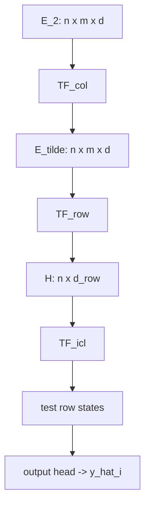

[Mohit Saharan](https://linkedin.com/in/msaharan), P28, 20260604

___
# Architecture of TabICLv2: compression-then-ICL

Subtitle: How TabICLv2 compresses target-aware feature tokens into row representations, then uses dataset-wise in-context learning to predict test rows.
___
In the previous post, we looked at target-aware embedding: the step where TabICLv2 injects observed labels into the feature tokens of training rows while keeping test rows unlabeled. At that point, the model has a target-aware tensor with one token for every row and every grouped feature position.

This post covers the next architectural step: compression-then-ICL. TabICLv2 does not run dataset-level in-context learning directly over all \(n\times m\) row-feature tokens. It first contextualizes grouped feature positions across rows, compresses each row into a smaller row representation, and then runs in-context learning over those row tokens.


*TabICLv2 pipeline; this post covers the compression-then-ICL stack.*

In this post, we start from the target-aware tensor \(E_2\), pass it through column-wise and row-wise transformer blocks, and end with dataset-wise ICL, where test row representations attend to labeled training row representations. A short quiz at the end lets you check whether the architecture and label-flow details are clear.

## Compression-then-ICL

### Starting point: target-aware tokens \(E_2\)

Before compression begins, TabICLv2 has already constructed a target-aware token tensor
$$
E_2\in\mathbb{R}^{n\times m\times d}.
$$
Here \(d\) is the token embedding dimension. Each token \(E_2[i,j]\in\mathbb{R}^d\) represents row \(i\) and grouped feature position \(j\). After repeated feature grouping, \(m\) denotes the number of grouped feature positions being processed by the transformer stack.

The previous post derived target-aware embedding in full. For training rows, the update is
$$
E_2[i,j]=E_1[i,j]+u_i,
$$
where \(E_1\) is the feature-only tensor from repeated feature grouping and \(u_i\) is the row-level target vector from target-aware embedding (see the previous post for \(\operatorname{Embed}_\text{TAE}\) and the test-row masking rule). For a labeled row, the same target vector is broadcast across all grouped feature positions.

The important point is that compression does not operate on raw feature tokens. It operates on feature tokens that already contain training-label information. For training rows, each grouped feature token has access to the observed target through \(u_i\). For test rows, the target component is absent, because the target is what the model must predict.

The compression-then-ICL pipeline explains what happens next. TabICLv2 must convert the \(n\times m\) grid of row-feature tokens into row-level representations that can be used for prediction. It does this in three stages:

1. column-wise embedding applies a Set Transformer \(\text{TF}_\text{col}\) to each grouped feature position;
2. row-wise interaction uses \(\text{TF}_\text{row}\) with learned \([\text{CLS}]\) tokens to compress grouped feature embeddings within each row;
3. dataset-wise ICL uses \(\text{TF}_\text{icl}\) so test row representations can attend to labeled training row representations.

The diagram below shows the same three-stage path, with tensor shapes at each step:



### Stage 1: Column-wise embedding (\(\text{TF}_\text{col}\))

The first stage processes one grouped feature position at a time, across rows. For a fixed grouped feature index \(j\), the model sees the row sequence
$$
(E_2[1,j],E_2[2,j],\ldots,E_2[n,j]).
$$
This is "column-wise" in the table sense: the grouped feature position is fixed, and the row index varies.

The column-wise block uses a Set Transformer-style variant of attention. Here, Set Transformer means attention through learned inducing tokens rather than direct all-pairs row attention.

Because the training-row tokens already contain target information, this stage can learn how a grouped feature behaves across labeled examples. For example, through the induced summaries, \(\text{TF}_\text{col}\) can relate a test row's token at position \(j\) to training-row tokens at the same position \(j\), where the training tokens encode both feature values and observed targets.

TabICLv2 does this with induced attention rather than full row-by-row attention. In the default no-leakage setting, a small set of learned inducing tokens first summarizes the training rows for each grouped feature position. Then all rows, including test rows, attend back to those summaries. Informally, for each \(j\),
$$
E_2[:,j]\quad\longrightarrow\quad \text{training-row summaries for position }j\quad\longrightarrow\quad \tilde{E}[:,j].
$$
The train-only summary step matters in this default setting. Test rows can receive context built from labeled examples, but they do not contribute to the summaries themselves. This keeps the direction of information aligned with supervised prediction: labeled rows inform unlabeled rows, not the other way around. Let
$$
\tilde{E}\in\mathbb{R}^{n\times m\times d}
$$
denote the output of the column-wise stage.

### Stage 2: Row-wise compression (\(\text{TF}_\text{row}\))

The second stage changes the axis of attention. After column-wise embedding, each token \(\tilde{E}[i,j]\) has context from other rows at the same grouped feature position. Now the model must combine the \(m\) grouped feature positions inside each row.

For a fixed row \(i\), the row-wise transformer receives
$$
(\tilde{E}[i,1],\tilde{E}[i,2],\ldots,\tilde{E}[i,m]),
$$
along with learned \([\text{CLS}]\) tokens. The grouped feature tokens provide the content of the row. The \([\text{CLS}]\) tokens provide learned readout positions whose outputs are kept after attention.

If there are \(c\) learned \([\text{CLS}]\) tokens, the row-wise transformer produces \(c\) summary vectors for row \(i\). These are flattened into a single row representation
$$
h_i\in\mathbb{R}^{d_\text{row}},
$$
where \(d_\text{row}=c\cdot d\) in the simple flattened-CLS view. This is the main compression step:
$$
\tilde{E}\in\mathbb{R}^{n\times m\times d}
\quad\longrightarrow\quad
H=(h_1,\ldots,h_n)\in\mathbb{R}^{n\times d_\text{row}}.
$$
The model has moved from one token per row-feature position to one representation per row.

### Stage 3: Dataset-wise ICL (\(\text{TF}_\text{icl}\))

The row representations
$$
h_1,\ldots,h_n
$$
become the tokens over which \(\text{TF}_\text{icl}\) operates. This is the stage that most directly resembles in-context learning: each row is now an example token, and test examples can use labeled training examples as context.

Before \(\text{TF}_\text{icl}\), TabICLv2 injects target information a second time. For training rows, the model adds another target embedding to the row representation. For test rows, no true target is supplied. This second embedding has a different role from the target-aware embedding in the previous post:

- the first target embedding entered before column-wise and row-wise processing, so labels could shape feature and row representations;
- the second target embedding enters after row compression, so the ICL transformer receives label values on context rows while test/query rows remain unlabeled.

To keep the same row-ordering convention as the previous post, let \(n_\text{train}\) be the number of training rows. In NanoTabICL, training rows are placed first, so
$$
\mathcal{I}_\text{train}=\{1,\ldots,n_\text{train}\},
\qquad
\mathcal{I}_\text{test}=\{n_\text{train}+1,\ldots,n\}.
$$
Define
$$
z_i =
\begin{cases}
\displaystyle h_i+\operatorname{Embed}_\text{ICL}(y_i), & i\in\mathcal{I}_\text{train},\\
h_i, & i\in\mathcal{I}_\text{test},
\end{cases}
$$
where \(z_i\in\mathbb{R}^{d_\text{row}}\) is the row token passed to \(\text{TF}_\text{icl}\), and \(\operatorname{Embed}_\text{ICL}\) maps an observed target into \(\mathbb{R}^{d_\text{row}}\). The ICL transformer lets test rows attend to labeled training rows and outputs contextualized test-row states; the prediction head then maps those states to \(\hat{y}_i\), the predicted target for test row \(i\).

## Why this design?

Now that the data path is defined, the design choice becomes clearer: TabICLv2 separates representation building from dataset-level prediction.

Column-wise and row-wise processing build representations. The column-wise stage relates the same grouped feature position across rows through induced summaries. The row-wise stage combines grouped feature positions into one row representation. Dataset-wise ICL then performs the final train-test interaction over row tokens.

The computational reason is that full attention over every row-feature token would make the dataset-level interaction much larger than necessary. The model would be reasoning over \(n\times m\) tokens when the final prediction problem is naturally row-level. Compression changes the final ICL input from a grid of feature tokens to a sequence of row tokens.

The representational reason is that the row tokens are not plain feature summaries. They have already passed through target-aware column-wise processing and row-wise aggregation. By the time \(\text{TF}_\text{icl}\) runs, each test row token can attend to labeled training row tokens that carry both feature context and target information.

## At a glance

| Stage | Input | Output | Role |
|-------|--------|--------|------|
| \(\text{TF}_\text{col}\) | \(E_2\in\mathbb{R}^{n\times m\times d}\) | \(\tilde{E}\in\mathbb{R}^{n\times m\times d}\) | contextualize each grouped feature position across rows |
| \(\text{TF}_\text{row}\) | \(\tilde{E}[i,1:m]\) plus \([\text{CLS}]\) tokens | \(h_i\in\mathbb{R}^{d_\text{row}}\) | compress each row's grouped feature tokens |
| \(\text{TF}_\text{icl}\) + output head | row tokens \(z_i\) | \(\hat{y}_i\) for test rows | use labeled training rows as in-context examples, then decode test-row states |

## Implementation in NanoTabICL

NanoTabICL implements a compact educational version of the compression-then-ICL stack in the same order as the architecture above. Production TabICLv2 adds engineering details such as inference managers, caching/offloading, and reserved CLS slots, but the same three-stage structure is visible in `NanoTabICLv2.forward`.

After repeated feature grouping and the first target-aware embedding, the working tensor is called `emb`:

```text
(batch, rows, cols, embed_dim)
```

Here `cols` is the number of grouped feature positions in NanoTabICL. At this point, `emb[:, :n_train]` has already received the first target embedding, so the compression stack starts from the implementation counterpart of \(E_2\).

### Row and column attention helper

The implementation snippets below rely on two thin wrappers around the same helper. The helper that makes row-wise and column-wise attention compact is `TableAttnBase`:

```python
def row_attn(self, q, kv=None, **kwargs):
    n_batch, n_rows, n_cols, embed_dim = q.shape
    q, kv = (None if t is None else t.flatten(0, 1) for t in [q, kv])
    return self(q, kv, **kwargs).reshape(n_batch, n_rows, -1, embed_dim)

def col_attn(self, q, kv=None, **kwargs):
    return self.row_attn(
        q.transpose(1, 2),
        None if kv is None else kv.transpose(1, 2),
        **kwargs,
    ).transpose(1, 2)
```

`row_attn` flattens `(batch, rows)` into one larger batch dimension, so standard sequence attention can run across columns inside each row. `col_attn` swaps the row and column axes, reuses `row_attn`, and swaps the axes back. This is the implementation trick that lets the same transformer block operate over either axis of a 2D table without writing separate attention kernels for row-wise and column-wise attention.

### Column-wise block

First, \(\text{TF}_\text{col}\) applies induced attention within each grouped feature position:

```python
for block in self.col_blocks:
    emb = block.col_attn(emb, kv_max_idx=n_train)
```

The call to `col_attn` means: keep the grouped feature position fixed and attend across rows. Internally, it transposes the table so each grouped feature position becomes its own row sequence, applies the same sequence module on that axis, and then transposes back. For the attention module, one fixed grouped feature position is seen as:

```text
(batch * cols, rows, embed_dim)
```

The argument `kv_max_idx=n_train` is the leakage-control detail. Inside `TransformerBlock.forward`, it slices the key/value sequence to the first `n_train` rows:

```python
if kv_max_idx is not None: kv = kv[..., :kv_max_idx, :]
```

In the column-wise induced block, this means the learned inducing vectors summarize only training rows in the default no-leakage path. The original row tokens then attend back to those train-derived summaries. Test rows can receive context from labeled training examples, but they do not contribute to the column-wise context unless an implementation path explicitly enables embedding with test rows.

The block itself is `InducedTransformerBlock`, which implements induced attention:

```python
self.tfm1 = TransformerBlock(embed_dim=embed_dim, num_heads=num_heads, ssmax=ssmax)
self.tfm2 = TransformerBlock(embed_dim=embed_dim, num_heads=num_heads)
self.inducing_vectors = nn.Parameter(0.02 * torch.randn(1, n_inducing, embed_dim))

kv = self.tfm1(self.inducing_vectors.expand(q.shape[0], -1, -1), q if kv is None else kv, kv_max_idx=kv_max_idx)
return self.tfm2(q, kv, q_max_idx=q_max_idx)
```

The first transformer call lets the learned inducing vectors query the training rows and produce a compact set of latent summaries in the default path:

```text
training-row tokens -> n_inducing latent summaries
```

The second transformer call lets the original row tokens attend back to those summaries. The output still has shape `(batch, rows, cols, embed_dim)`. So this block is not the final \(n\times m\) to \(n\) compression step; it is the column-wise contextualization step that prepares better tokens for row compression.

The full TabICLv2 implementation exposes an `embed_with_test` option for cases where one deliberately allows the column embedder's inducing points to attend to train and test rows together. NanoTabICL follows the default no-leakage path shown above.

### Row-wise block

Second, \(\text{TF}_\text{row}\) adds learned row-level `[CLS]` tokens and attends across feature positions within each row:

```python
emb = torch.cat([self.row_cls_tokens.expand(n_batch, n_rows, -1, -1), emb], dim=2)
for block in self.row_blocks[:-1]:
    emb = block.row_attn(emb)
emb = self.row_blocks[-1].row_attn(emb, q_max_idx=self.row_cls_tokens.size(-2))
emb = self.row_ln(emb).flatten(-2, -1)
```

Here `row_attn` keeps the row fixed and attends across the column axis. The prepended `row_cls_tokens` are learned summary positions. They are not labels and they are not additional input features; they are readout slots that can attend to the grouped feature tokens in the same row.

NanoTabICL prepends these CLS tokens with `torch.cat`, which gives the following shape transition:

| Step | Shape | Meaning |
|---|---|---|
| before CLS tokens | `(batch, rows, cols, embed_dim)` | one token per grouped feature position |
| after prepending CLS tokens | `(batch, rows, n_cls_cols + cols, embed_dim)` | each row gets learned summary tokens |
| after final `q_max_idx` | `(batch, rows, n_cls_cols, embed_dim)` | keep only CLS outputs |
| after `flatten(-2, -1)` | `(batch, rows, n_cls_cols * embed_dim)` | one row token per row |

The final row block is called with `q_max_idx=self.row_cls_tokens.size(-2)`, which means the model only computes outputs for the CLS positions in that last row-attention pass. The grouped feature-token outputs are no longer needed after they have contributed to the CLS summaries.

That flattened size is `icl_dim`:

```python
icl_dim = embed_dim * n_cls_cols
```

So the row-wise block is the implementation's main compression point:

```text
(batch, rows, cols, embed_dim)
    -> (batch, rows, icl_dim)
```

The full `tabicl` implementation avoids the explicit `torch.cat` by reserving CLS slots during column embedding and then replacing those reserved slots with learned CLS tokens before row attention. In that implementation, the shape before row interaction is closer to `(batch, rows, grouped_feature_positions + reserved_cls_slots, embed_dim)`. The mathematical role is the same: these positions are learned readout slots whose final outputs are concatenated into the row representation.

### ICL block

Third, \(\text{TF}_\text{icl}\) performs in-context learning over row tokens. This is where NanoTabICL injects targets a second time:

```python
emb[:, :n_train] += self.y_embed_icl(y[:, :, None])
for block in self.icl_blocks[:-1]:
    emb = block(emb, kv_max_idx=n_train)
emb = self.icl_blocks[-1](emb[:, n_train:], emb[:, :n_train])
return self.out_mlp(self.out_ln(emb))
```

At this point, before the second target injection, `emb` has shape:

```text
(batch, rows, icl_dim)
```

The call `self.y_embed_icl(y[:, :, None])` returns a tensor with shape `(batch, n_train, icl_dim)`. Adding it to `emb[:, :n_train]` marks the training row tokens as labeled context examples. Test rows are left without a target embedding.

The intermediate ICL blocks again use `kv_max_idx=n_train`, so every row is updated by attending only to training rows as keys and values. In the final ICL block, NanoTabICL avoids computing outputs for training rows because only test predictions are needed:

```text
queries:      emb[:, n_train:]   -> test rows
keys/values:  emb[:, :n_train]   -> training rows
```

So the final output contains predictions only for the test rows:

```text
(batch, n_test, out_dim)
```

That last-block shortcut is a NanoTabICL simplification for the hands-on implementation. The architectural statement is broader: \(\text{TF}_\text{icl}\) uses labeled training row representations as context to produce test-row states, and the output head decodes those states into predictions.

## Summary

Compression-then-ICL is the part of TabICLv2 that turns a grid of target-aware feature tokens into row-level predictions. The column-wise transformer first lets each grouped feature position learn from labeled examples across rows. The row-wise transformer then uses learned \([\text{CLS}]\) tokens to compress each row from \(m\) feature-position tokens into a fixed-dimensional row representation. Finally, the ICL transformer operates over row tokens, adding target information to training rows and letting test rows attend to that labeled context.

The main idea is separation of roles: feature and row processing happen before dataset-wise prediction, so the final ICL stage does not need to attend over every cell-level token.

One detail this post has mostly treated as a black box is query-aware scalable softmax (QASSMax). The actual TabICLv2 architecture uses QASSMax in the induced column attention and the ICL transformer for long-context scaling; the label-flow story above is unchanged. The next post covers QASSMax, the attention-scaling mechanism TabICLv2 uses to preserve selective attention as the number of context samples grows.

## Quiz

Take the quiz below to test your understanding, and share your answers and doubts in the comments. The difficulty increases from question 1 to question 10 in increasing order of the question number.

1. What are the three main stages in TabICLv2's compression-then-ICL pipeline?

   **Answer:** The three stages are column-wise embedding with \(\text{TF}_\text{col}\), row-wise compression with \(\text{TF}_\text{row}\), and dataset-wise in-context learning with \(\text{TF}_\text{icl}\). Column-wise embedding contextualizes each grouped feature position across rows, row-wise compression turns each row's grouped feature tokens into row representations, and dataset-wise ICL uses labeled training rows as context to predict test rows.

2. What does the tensor \(E_2\in\mathbb{R}^{n\times m\times d}\) represent before compression begins?

   **Answer:** \(E_2\) is the target-aware token tensor before compression. It contains one \(d\)-dimensional token for each row \(i\) and grouped feature position \(j\). For training rows, these tokens include feature information plus the observed target embedding; for test rows, they contain feature information without the unknown target.

3. Why are target embeddings added to training-row feature tokens but not to test-row feature tokens?

   **Answer:** Training-row targets are observed, so the model can use them as labeled context. Test-row targets are the values the model must predict, so adding them would leak the answer. This is why target-aware embedding broadcasts label information across training-row feature tokens while leaving test-row feature tokens unlabeled.

4. In \(\text{TF}_\text{col}\), which axis is attended over for a fixed grouped feature position \(j\)?

   **Answer:** For a fixed grouped feature position \(j\), \(\text{TF}_\text{col}\) attends over the row axis. The model processes the sequence \((E_2[1,j], E_2[2,j], \ldots, E_2[n,j])\), so the grouped feature position stays fixed while rows vary.

5. What role do learned inducing tokens play in the column-wise Set Transformer block?

   **Answer:** Learned inducing tokens provide a compact attention bottleneck. They first query the row tokens for a grouped feature position to form a small set of latent summaries, and then the original row tokens attend back to those summaries. This avoids full all-pairs attention across rows while still letting tokens receive column-wise context.

6. Why does the default no-leakage setting build column-wise summaries from training rows only?

   **Answer:** The default setting builds summaries from training rows only so that labeled examples inform test examples, but test examples do not influence the context summaries. This preserves the supervised prediction direction and prevents unlabeled test rows from contributing to the representation used as context.

7. How do the learned \([\text{CLS}]\) tokens in \(\text{TF}_\text{row}\) help convert an \(n\times m\times d\) tensor into row-level representations?

   **Answer:** For each row, learned \([\text{CLS}]\) tokens are added as readout positions before row-wise attention. These tokens attend across the grouped feature tokens within that row and collect a fixed number of summary vectors. The model then keeps the CLS outputs and flattens them, producing one row representation \(h_i\) instead of \(m\) feature-position tokens.

8. Explain why NanoTabICL injects target information twice: once before column-wise processing and once before the ICL block.

   **Answer:** The first target injection happens before column-wise and row-wise processing, so labels can shape feature-level and row-level representations during compression. The second target injection happens after row compression, so the ICL transformer receives explicitly labeled training-row tokens as context while test-row tokens remain unlabeled. The two injections serve different parts of the pipeline: representation building first, dataset-wise prediction second.

9. In the final ICL block, why can the implementation use test rows as queries and training rows as keys and values instead of computing outputs for every row?

   **Answer:** Only test-row predictions are needed at the end. Training rows have already served as labeled context, so the final block can compute outputs only for test rows by using test row representations as queries and training row representations as keys and values. This saves computation without changing the prediction target.

10. Suppose \(\text{TF}_\text{icl}\) attended over every cell-level token instead of compressed row tokens. What computational and modeling tradeoffs would this create compared with the compression-then-ICL design?

    **Answer:** Attending over every cell-level token would make the ICL stage operate over \(n\times m\) tokens instead of \(n\) row tokens, greatly increasing the attention cost and memory use. It could preserve more fine-grained feature-position information for the final interaction, but it would also force the dataset-wise predictor to reason over cell-level details rather than row-level examples. Compression-then-ICL trades some token-level granularity for a more efficient and natural row-level in-context learning problem, where each token corresponds to one example.
