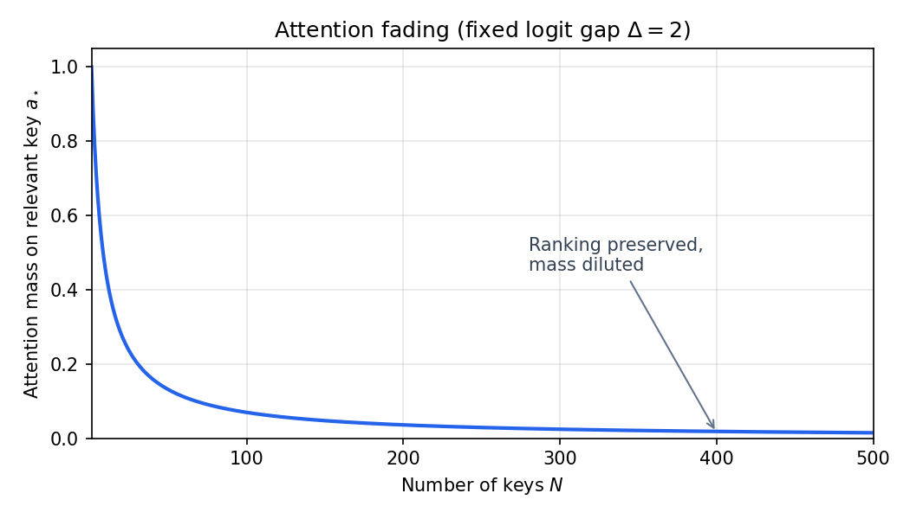
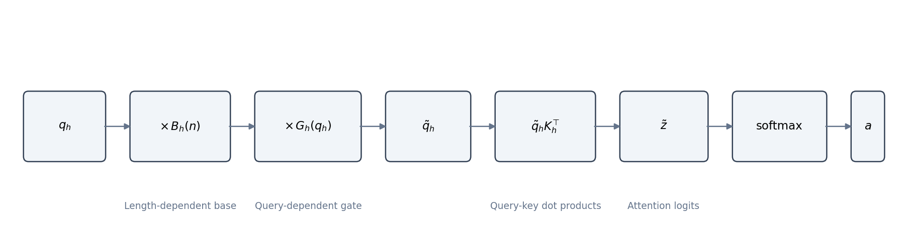

[Mohit Saharan](https://linkedin.com/in/msaharan), P29, 20260605

___
# Architecture of TabICLv2: query-aware scalable softmax

Subtitle: How TabICLv2 uses query-aware scalable softmax (QASSMax) to prevent attention fading in tabular in-context learning.
___
In the previous post, we looked at compression-then-ICL: the part of TabICLv2 that turns the \(n\times m\) grid of row-feature tokens into row representations, then lets test rows attend to labeled training rows. That design makes the final prediction stage row-level, which is exactly where in-context learning happens.

But the row-level ICL transformer is not the only place where attention must scale with training-set size. TabICLv2 also uses attention over rows inside the column-wise induced-attention stage. As the number of training rows grows, ordinary softmax attention can become too diffuse. Even when one training row is the best match for a query row, or the most useful row for an inducing vector to summarize, the softmax denominator grows with all the other rows. The best row can then receive only a small fraction of the attention mass. This is the attention-fading problem.

This post covers Query-Aware Scalable Softmax, or QASSMax, the mechanism TabICLv2 uses to make attention more robust as context size changes. We will start with ordinary softmax as a temperature-controlled normalization, show why attention fades when the number of keys grows, then build up from Scalable Softmax (SSMax) to QASSMax.


*TabICLv2 pipeline; QASSMax is applied in the first induced-attention stage of TF_col and in TF_icl.*

The figure shows the architectural destination; the next sections explain why those two attention sites need length-aware softmax in the first place. The post ends with a quiz that you can take to test your understanding.

## Query-aware scalable softmax

Query-aware scalable softmax, or QASSMax, modifies attention by rescaling the query before the query-key dot products are computed. Because softmax is applied to those dot products, changing the query changes the logits. With scalar scaling, this changes how sharp or broad the attention distribution becomes; with element-wise scaling, it can also change the ranking of keys.

The purpose is to keep attention selective when the number of context samples becomes much larger than the sequence lengths seen during pretraining. To avoid overloading notation, I will use \(N\) for the number of keys in a generic attention calculation. When we specialize the discussion to TabICLv2, I will use \(n\) for the number of training rows.

### Softmax as temperature

Start with standard scaled dot-product attention for one attention head. Let
$$
q\in\mathbb{R}^{d_\text{head}}
$$
be the query vector, and let
$$
k_1,\ldots,k_N\in\mathbb{R}^{d_\text{head}}
$$
be the \(N\) key vectors. Here \(d_\text{head}\) is the dimension of one attention head. The unnormalized attention logit for key \(j\) is
$$
z_j=\frac{q^\top k_j}{\sqrt{d_\text{head}}},
$$
where \(j\in\{1,\ldots,N\}\). The attention weight assigned to key \(j\) is
$$
a_j=\text{softmax}(z)_j=\frac{\exp(z_j)}{\sum_{\ell=1}^{N}\exp(z_\ell)}.
$$
Here \(z=(z_1,\ldots,z_N)\), \(a_j\) is the normalized attention weight, and \(\ell\) is only the summation index over keys. The attention output is the weighted average
$$
\sum_{j=1}^N a_jv_j,
$$
where \(v_j\) is the value vector associated with key \(j\).

Now rescale the query by a positive scalar \(\lambda\):
$$
\tilde{q}=\lambda q,
\qquad
\lambda>0.
$$
The new logit is
$$
\tilde{z}_j=\frac{\tilde{q}^\top k_j}{\sqrt{d_\text{head}}}=\lambda z_j.
$$
So scalar query scaling is the same as scalar logit scaling. It is also the same as changing the softmax temperature. For temperature \(\tau>0\),
$$
\text{softmax}_\tau(z)_j=\frac{\exp(z_j/\tau)}{\sum_{\ell=1}^{N}\exp(z_\ell/\tau)}.
$$
Writing \(\lambda=1/\tau\), we get
$$
\text{softmax}_\tau(z)=\text{softmax}(\lambda z).
$$
Lower temperature, or larger \(\lambda\), makes the distribution sharper. Higher temperature, or smaller \(\lambda\), makes it broader. The relative odds between keys \(j\) and \(\ell\) become
$$
\frac{a_j}{a_\ell}
=
\frac{\exp(\lambda z_j)}{\exp(\lambda z_\ell)}
=
\exp(\lambda(z_j-z_\ell)).
$$
The key point is that scaling does not change the ranking of logits. If \(z_j>z_\ell\), then \(\lambda z_j>\lambda z_\ell\). Scaling changes how decisively softmax turns that ranking into probability mass.

### Why softmax fades as context grows

This matters in long contexts because the softmax denominator grows with the number of keys. Consider a simplified attention calculation with one relevant key and many distractor keys:

- the relevant key has logit \(z_\star\);
- each of the \(N-1\) distractors has lower logit \(z_0\); and
- the logit gap is \(\Delta=z_\star-z_0>0\).

Under ordinary softmax, the attention weight on the relevant key is
$$
a_\star
=
\frac{\exp(z_\star)}{\exp(z_\star)+(N-1)\exp(z_0)}
=
\frac{1}{1+(N-1)\exp(-\Delta)}.
$$
For a fixed gap \(\Delta\), the denominator grows as \(N\) grows, so
$$
a_\star\rightarrow0
\qquad\text{as}\qquad
N\rightarrow\infty.
$$
The problem is not that softmax forgets which key has the highest logit. The relevant key still ranks first. The problem is that many weaker keys can collectively absorb most of the probability mass.

In TabICLv2, this matters at the attention sites whose key sequence grows with the number of training rows. In \(\text{TF}_\text{icl}\), a test row may attend over many labeled training rows; in the first induced-attention step of \(\text{TF}_\text{col}\), learned inducing vectors summarize many training-row tokens for a fixed grouped feature position. In both cases, as the number of training rows grows, the ordinary softmax denominator grows with all the other rows too. This is attention fading.



*Attention mass on the relevant key vs. number of distractors (fixed logit gap \(\Delta\)).*

### SSMax: scale logits with log n

Scalable Softmax, or SSMax, addresses this failure mode by making the logit scale grow with context length. It keeps softmax as the normalization function, but rescales the query before computing attention logits.

Now specialize from \(N\) generic keys to \(n\) training rows. In the TabICLv2 paper's notation, let \(q_h=(q_{hi})\) be a query vector at attention head \(h\), where \(i\) indexes the coordinates inside the head. SSMax rescales the query with a learnable per-head scalar \(s_h\):
$$
\tilde{q}_{hi}=q_{hi}\cdot s_h\log n.
$$
This makes each logit
$$
\tilde{z}_j=(s_h\log n)z_j.
$$
Returning to the one-relevant-key example, the attention weight becomes
$$
a_\star
=
\frac{1}{1+(n-1)\exp(-s_h\Delta\log n)}
\approx
\frac{1}{1+n^{1-s_h\Delta}}.
$$
The approximation uses \(n-1\approx n\) and
$$
\exp(-s_h\Delta\log n)=n^{-s_h\Delta}.
$$
This shows why \(\log n\) appears: the softmax denominator grows with the number of keys, so the effective relevant-vs-distractor gap must also grow with context length. In this simplified example, assuming \(s_h>0\), \(s_h\Delta>1\) is where the relevant key does not fade away as \(n\) becomes large.

That condition is only intuition from the toy setup. Real attention has many different logit values, not one repeated distractor logit. The useful lesson is the scaling law: increasing the context length changes the softmax denominator, so the model benefits from a length-aware logit scale.

### QASSMax: length base + query gate

SSMax gives every query in the same attention head the same length-dependent scale. QASSMax keeps the length-aware idea but makes it more flexible in two ways:

- the base scale is a learned vector function of \(\log n\), not one scalar \(s_h\); and
- the scale is modulated by a bounded gate that depends on the current query.

For head \(h\), let \(q_h=(q_{hi})\) be the query vector, with \(i\) indexing head dimensions. QASSMax rescales each query element as
$$
\tilde{q}_{hi}
=
q_{hi}
\underbrace{\cdot\text{MLP}_\text{base}(\log n)_{hi}}_\text{base scaling}
\cdot
\underbrace{(1+\tanh(\text{MLP}_\text{gate}(q_h)_i))}_\text{query-aware gating}.
$$
Equivalently, in vector notation,
$$
\tilde{q}_h=q_h\odot B_h(n)\odot G_h(q_h),
$$
where
$$
B_h(n)=\text{MLP}_\text{base}(\log n)_h\in\mathbb{R}^{d_\text{head}},
$$
and
$$
G_h(q_h)=1+\tanh(\text{MLP}_\text{gate}(q_h))\in(0,2)^{d_\text{head}}.
$$
Here \(\odot\) denotes element-wise multiplication. \(B_h(n)\) is the length-dependent base vector for head \(h\), and \(G_h(q_h)\) is the query-dependent gate for that same head.



*QASSMax rescales the query with a length-dependent base and a bounded query-dependent gate before query-key dot products form the logits sent to softmax.*

For \(H\) attention heads, the base network has type
$$
\text{MLP}_\text{base}:\mathbb{R}\rightarrow\mathbb{R}^{H\times d_\text{head}}.
$$
It takes \(\log n\) as input and returns one base scale for every head dimension. The gate network has type
$$
\text{MLP}_\text{gate}:\mathbb{R}^{d_\text{head}}\rightarrow\mathbb{R}^{d_\text{head}}.
$$
It maps the current query to an element-wise gate. This is the element-wise QASSMax variant used by the official default configuration.

The two terms have different roles. The base term \(B_h(n)\) handles the predictable effect of context length. As \(n\) changes, the model can learn how much the logits should be rescaled before softmax.

The gate \(G_h(q_h)\) handles query-specific sharpness. Some queries should retrieve one highly relevant row. Other queries should aggregate signal from many rows. Because
$$
\tanh(x)\in(-1,1),
$$
the gate satisfies
$$
G_h(q_h)\in(0,2)^{d_\text{head}}.
$$
So the query-dependent part can reduce or increase the magnitude of the base scaling contribution, but the gate itself is bounded. The full scale is still not guaranteed to be positive, because the base MLP output is unconstrained.

There is one important difference from ordinary temperature scaling. A positive scalar temperature changes attention sharpness while preserving the ranking of logits. QASSMax uses element-wise scaling, and \(\text{MLP}_\text{base}(\log n)\) is not constrained to be a positive scalar, so it can change the direction of the query vector and therefore can change logit rankings as well as sharpness.

At initialization, QASSMax behaves like length-dependent scaling without extra query modulation. The query-aware part can be learned gradually.

### Why put the gate on the query, not the output?

One design choice remains: the gate is applied to the query before attention, rather than to the output after attention.

Selective attention needs per-query sharpness. A scalar temperature can express this idea in a simple form. For query row or query token \(r\), let \(z_{rj}\) be the attention logit between query \(r\) and key \(j\). With a query-specific temperature \(\tau_r>0\), the attention weight would be
$$
a_{rj}
=
\frac{\exp(z_{rj}/\tau_r)}
{\sum_{\ell=1}^{N}\exp(z_{r\ell}/\tau_r)}.
$$
QASSMax is more expressive than this scalar-temperature view because it scales different head dimensions differently and can change more than sharpness alone. The scalar-temperature equation is still useful as intuition: the query participates in controlling how selective its attention distribution should be.

Some gated attention mechanisms apply the gate after attention, for example
$$
\tilde{o}=g(q)\odot \text{Attn}(q,K,V).
$$
Here \(K\) is the matrix of keys, \(V\) is the matrix of values, \(\text{Attn}(q,K,V)\) is the ordinary attention output for query \(q\), and \(\tilde{o}\) is the gated output. This kind of gate changes the output after attention weights have already been computed.

QASSMax applies the gate earlier. Because the gate changes the query \(\tilde{q}_h\), it changes the logits before softmax:
$$
\tilde{z}_j=
\frac{(q_h\odot B_h(n)\odot G_h(q_h))^\top k_j}
{\sqrt{d_\text{head}}}.
$$
So the gate affects the attention weights themselves, not only the post-attention output. This is why QASSMax is a softmax-logit modification rather than an output gating mechanism.

In short, QASSMax fights fading in two places: the base term adapts to context length, and the query gate lets each query adjust its attention geometry and selectivity.

### Where TabICLv2 uses QASSMax

TabICLv2 uses QASSMax where the number of training rows directly affects the number of keys. There are two such places in the architecture:

- the first induced-attention stage of \(\text{TF}_\text{col}\), where inducing tokens summarize row tokens for a fixed grouped feature position; and
- \(\text{TF}_\text{icl}\), where row representations attend across the dataset.

It is not used in the row-wise transformer that compresses feature positions within one row. That stage attends across columns, not across a large set of training examples.

The paper's stress test makes the failure mode concrete.

This placement matches the failure mode. In the paper's needle-in-haystack classification task, the model must focus on one anchor sample among many negative samples. Without scalable softmax, normalized attention entropy rises and accuracy drops as the number of negatives grows. The paper reports entropy divided by \(\log n\) and averaged across heads and layers in \(\text{TF}_\text{icl}\). QASSMax keeps that entropy low and maintains 100% accuracy even with 15K negatives, outperforming SSMax at extreme scales.

The implementation section below shows how this placement appears in NanoTabICL.

### Implementation in NanoTabICL

NanoTabICL wires QASSMax through the `ssmax=True` flag. The flag name is broad, but in this implementation it constructs a `QASSMax` layer. The flag is enabled only in the attention stages where the key sequence can grow with the number of training rows:

```python
self.col_blocks = nn.ModuleList([
    InducedTransformerBlock(
        embed_dim=embed_dim,
        num_heads=col_nhead,
        n_inducing=n_cls_rows,
        ssmax=True,
    )
    for _ in range(col_num_blocks)
])

self.icl_blocks = nn.ModuleList([
    TransformerBlock(embed_dim=icl_dim, num_heads=icl_nhead, ssmax=True)
    for _ in range(icl_num_blocks)
])
```

The row-wise transformer blocks do not enable QASSMax:

```python
self.row_blocks = nn.ModuleList([
    TransformerBlock(embed_dim=embed_dim, num_heads=row_nhead, use_rope=True)
    for _ in range(row_num_blocks)
])
```

So the placement is:

| Stage | Code path | QASSMax? | Reason |
|---|---|---|---|
| column-wise induced attention | `self.col_blocks` | yes | inducing tokens attend over training rows |
| row-wise feature interaction | `self.row_blocks` | no | attention is across feature positions within one row |
| dataset-wise ICL | `self.icl_blocks` | yes | row tokens attend over training rows |

This matches the motivation from the previous sections. QASSMax is used when the number of keys is tied to training-set size. It is not used merely because a transformer block exists.

#### Column-wise induced attention

The column-wise stage has one important detail. `InducedTransformerBlock` contains two transformer calls:

```python
self.tfm1 = TransformerBlock(embed_dim=embed_dim, num_heads=num_heads, ssmax=ssmax)
self.tfm2 = TransformerBlock(embed_dim=embed_dim, num_heads=num_heads)

kv = self.tfm1(self.inducing_vectors.expand(q.shape[0], -1, -1), q if kv is None else kv, kv_max_idx=kv_max_idx)
return self.tfm2(q, kv, q_max_idx=q_max_idx)
```

Only the first transformer, `tfm1`, receives `ssmax=ssmax`. The second transformer, `tfm2`, is constructed without QASSMax because it attends over the fixed number of inducing vectors, not directly over all training rows.

```python
for block in self.col_blocks:
    emb = block.col_attn(emb, kv_max_idx=n_train)
```

The `col_attn` wrapper transposes the table so each grouped feature position is processed as a separate sequence over rows. Inside the attention module, the effective shape is:

```text
(batch * cols, rows, embed_dim)
```

The argument `kv_max_idx=n_train` slices the key/value sequence to the labeled training rows before attention runs. Therefore, when QASSMax is called in `tfm1`, its length argument is the number of training rows:

```text
n = k.size(-2) = n_train
```

This is exactly the long-context setting QASSMax is meant for. The learned inducing vectors query a potentially large set of training-row tokens for a fixed grouped feature position.

#### Dataset-wise ICL attention

The second QASSMax placement is the dataset-wise ICL stack. After row compression, `emb` has shape:

```text
(batch, rows, icl_dim)
```

NanoTabICL adds target information to training row tokens, then applies the ICL blocks:

```python
emb[:, :n_train] += self.y_embed_icl(y[:, :, None])
for block in self.icl_blocks[:-1]:
    emb = block(emb, kv_max_idx=n_train)
emb = self.icl_blocks[-1](emb[:, n_train:], emb[:, :n_train])
```

For the intermediate ICL blocks, `kv_max_idx=n_train` means every row can query the sequence, but keys and values are restricted to training rows. For the final ICL block, the query sequence is explicitly test rows and the key/value sequence is explicitly training rows:

```text
queries:      emb[:, n_train:]   -> test rows
keys/values:  emb[:, :n_train]   -> training rows
```

In both cases, the key length passed to QASSMax is the training context size. So the ICL transformer receives the same length-aware query scaling discussed above.

#### Query scaling inside `TransformerBlock`

Inside `TransformerBlock`, the `ssmax=True` flag creates a `QASSMax` layer:

```python
self.ssmax_layer = (
    QASSMax(num_heads=num_heads, head_dim=embed_dim // num_heads)
    if ssmax
    else None
)
```

The attention method first projects query, key, and value vectors, then reshapes them into multi-head form:

```text
(batch, seq_len, embed_dim)
    -> (batch, heads, seq_len, head_dim)
```

Then QASSMax is applied directly to the projected query tensor:

```python
q = q if self.ssmax_layer is None else self.ssmax_layer(q=q, n=k.size(-2))
q, k = (t if self.rope is None else self.rope(t) for t in [q, k])
attn_output = nn.functional.scaled_dot_product_attention(...)
```

This placement matters. In NanoTabICL, the QASSMax-enabled blocks do not use RoPE; RoPE is enabled in the row-wise transformer, where QASSMax is not used. In this implementation, QASSMax changes the projected query before `scaled_dot_product_attention` computes the logits \(q^\top k\), so it changes the attention weights themselves, not only the post-attention output.

#### The QASSMax module

The module has two learned pieces: `base_mlp` for length-dependent scaling and `query_mlp` for query-dependent modulation.

Both pieces are two-layer MLPs with 64 hidden neurons and GELU activation. GELU stands for Gaussian Error Linear Unit; one common definition is
$$
\text{GELU}(x)=x\Phi(x),
$$
where \(\Phi(x)\) is the standard normal CDF.

```python
class QASSMax(nn.Module):
    def __init__(self, num_heads: int, head_dim: int, n_hidden: int = 64):
        super().__init__()
        self.base_mlp = get_mlp(1, n_hidden, num_heads * head_dim)
        self.query_mlp = get_mlp(head_dim, n_hidden, head_dim)
        nn.init.zeros_(self.query_mlp[-1].weight)
        nn.init.zeros_(self.query_mlp[-1].bias)

    def forward(self, q: torch.Tensor, n: int) -> torch.Tensor:
        batch_size, num_heads, seq_len, head_dim = q.shape
        logn = q.new_tensor(math.log(max(1, n))).view(1, 1)
        return (
            self.base_mlp(logn).view(1, num_heads, 1, head_dim)
            * (1 + torch.tanh(self.query_mlp(q)))
            * q
        )
```

The forward pass starts from the projected query tensor:

```text
(batch, heads, query_len, head_dim)
```

The length input is converted to a one-element tensor:

```text
logn: (1, 1)
```

After `base_mlp(logn)` and `.view(1, num_heads, 1, head_dim)`, the base scale has shape:

```text
(1, heads, 1, head_dim)
```

This is the implementation of \(B_h(n)\). The singleton batch and query dimensions make the same length-dependent scale broadcast across all examples and all query positions.

The query-dependent gate is:

```python
1 + torch.tanh(self.query_mlp(q))
```

It has the same shape as `q`:

```text
(batch, heads, query_len, head_dim)
```

This is the implementation of \(G_h(q_h)\). Because `tanh` lies in \((-1,1)\), the multiplicative gate lies in \((0,2)\). The final return statement multiplies the original query by both terms:

$$
\tilde{q}_h=q_h\odot B_h(n)\odot G_h(q_h).
$$

The zero initialization of the last `query_mlp` layer controls the starting behavior:

```python
nn.init.zeros_(self.query_mlp[-1].weight)
nn.init.zeros_(self.query_mlp[-1].bias)
```

At initialization, `query_mlp(q)` is zero, so the gate starts as:
$$
1+\tanh(0)=1.
$$
So QASSMax initially behaves like length-dependent scaling without extra query modulation. The query-aware part is learned gradually rather than perturbing attention sharply at initialization.

The implementation therefore mirrors the mathematical decomposition from the previous section:

| Math term | NanoTabICL code | Shape |
|---|---|---|
| \(q_h\) | `q` | `(batch, heads, query_len, head_dim)` |
| \(B_h(n)\) | `self.base_mlp(logn).view(...)` | `(1, heads, 1, head_dim)` |
| \(G_h(q_h)\) | `1 + torch.tanh(self.query_mlp(q))` | `(batch, heads, query_len, head_dim)` |
| \(\tilde{q}_h\) | returned product | `(batch, heads, query_len, head_dim)` |

That is the whole implementation idea: QASSMax is not a separate attention kernel. It is a learned query rescaling step inserted immediately before ordinary scaled dot-product attention.

## Summary

Ordinary softmax attention can fade as the number of keys grows: even a clearly relevant row can lose attention mass to many individually weaker distractors. SSMax addresses this by scaling logits with a learned factor proportional to \(\log n\), matching the way the softmax denominator grows with context length.

QASSMax makes that idea more flexible. It rescales the query with a learned length-dependent base term \(B_h(n)\) and a bounded query-dependent gate \(G_h(q_h)\), so attention can adapt both to the number of training rows and to the specific query being processed. In NanoTabICL, this appears exactly where long row contexts matter: the first induced-attention step of the column-wise transformer and the dataset-wise ICL transformer.

The next post covers many-class classification, where TabICLv2 extends a model pretrained with at most 10 classes to settings with many more labels.

## Quiz

Take the quiz below to test your understanding, and share your answers and doubts in the comments. The difficulty increases from question 1 to question 10 in increasing order of the question number.

1. What practical attention problem does QASSMax address in TabICLv2?

   **Answer:** QASSMax addresses attention fading when the number of training-row keys grows. With ordinary softmax, many individually weaker keys can collectively absorb most of the attention mass. This can make the best matching training row receive only a small attention weight in \(\text{TF}_\text{icl}\), and it can also make the most useful row for an inducing vector receive too little mass in the first induced-attention step of \(\text{TF}_\text{col}\).

2. Why is multiplying the query vector by a positive scalar equivalent to changing softmax temperature?

   **Answer:** Attention logits are computed from query-key dot products. If the query is multiplied by \(\lambda>0\), each logit \(z_j\) is multiplied by \(\lambda\). Softmax over \(\lambda z\) is the same as softmax with temperature \(\tau=1/\lambda\). Larger \(\lambda\) lowers the temperature and sharpens the distribution; smaller \(\lambda\) raises the temperature and broadens it.

3. In the one-relevant-key example, why does the relevant key's attention weight go to zero as \(N\) grows under ordinary softmax?

   **Answer:** With one relevant key and \(N-1\) distractors, the relevant key receives
   $$
   a_\star=\frac{1}{1+(N-1)\exp(-\Delta)}.
   $$
   For fixed logit gap \(\Delta\), the term \((N-1)\exp(-\Delta)\) grows as \(N\) grows, so the denominator grows and \(a_\star\) tends toward zero.

4. What is the basic scaling idea behind SSMax?

   **Answer:** SSMax scales logits by a length-dependent factor proportional to \(\log n\). In the TabICLv2 notation used in this post, it rescales each query element as \(\tilde{q}_{hi}=q_{hi}\cdot s_h\log n\), where \(s_h\) is a learnable per-head scalar and \(n\) is the number of training rows.

5. Why does \(\log n\) appear in scalable softmax rather than just \(n\)?

   **Answer:** The softmax denominator grows roughly linearly with the number of keys, while logits enter softmax through exponentials. Scaling the logit gap by \(\log n\) turns the exponential term into a power of \(n\), for example \(\exp(-s_h\Delta\log n)=n^{-s_h\Delta}\). This matches the growth form of the denominator in the simplified fading calculation.

6. What are the two multiplicative components QASSMax adds to the query?

   **Answer:** QASSMax multiplies the query by a length-dependent base scale and a query-dependent gate. In vector form,
   $$
   \tilde{q}_h=q_h\odot B_h(n)\odot G_h(q_h),
   $$
   where \(B_h(n)=\text{MLP}_\text{base}(\log n)_h\) and \(G_h(q_h)=1+\tanh(\text{MLP}_\text{gate}(q_h))\).

7. What does the bounded query gate \(1+\tanh(\text{MLP}_\text{gate}(q_h))\) allow the model to do?

   **Answer:** The gate lets each query adjust how strongly it uses the length-dependent base scale. Because \(\tanh(x)\in(-1,1)\), the gate lies in \((0,2)\). This means the query-dependent part can reduce or increase the magnitude of the base scaling contribution, allowing some queries to attend sharply to a few rows while others aggregate information more broadly. The full scale is still not guaranteed to be positive, because the base MLP output is unconstrained.

8. Why can QASSMax change more than just the sharpness of the attention distribution?

   **Answer:** A positive scalar temperature rescales every logit by the same factor and preserves the ranking of keys. QASSMax uses element-wise query scaling through learned vectors, and the base MLP is not constrained to act like one positive scalar. This can change the direction of the query vector, so it can change query-key dot-product rankings as well as attention sharpness.

9. Where is QASSMax used in NanoTabICL, and where is it not used?

   **Answer:** NanoTabICL enables QASSMax in the first induced-attention step of the column-wise blocks and in the dataset-wise ICL blocks. It is not used in the row-wise feature-interaction blocks because those blocks attend across feature positions within one row, not across a large number of training examples. In the induced column block, the second transformer also does not use QASSMax because it attends over a fixed number of inducing vectors.

10. In the NanoTabICL `QASSMax.forward` method, why does `base_mlp(logn)` have shape `(1, heads, 1, head_dim)` after reshaping, while the query gate has the same shape as `q`?

    **Answer:** The base scale depends only on the context length \(n\), so it is shared across the batch and query positions. Reshaping it to `(1, heads, 1, head_dim)` lets it broadcast over all examples and all query tokens. The query gate depends on each projected query vector, so it has shape `(batch, heads, query_len, head_dim)` and can modulate each query position separately.
