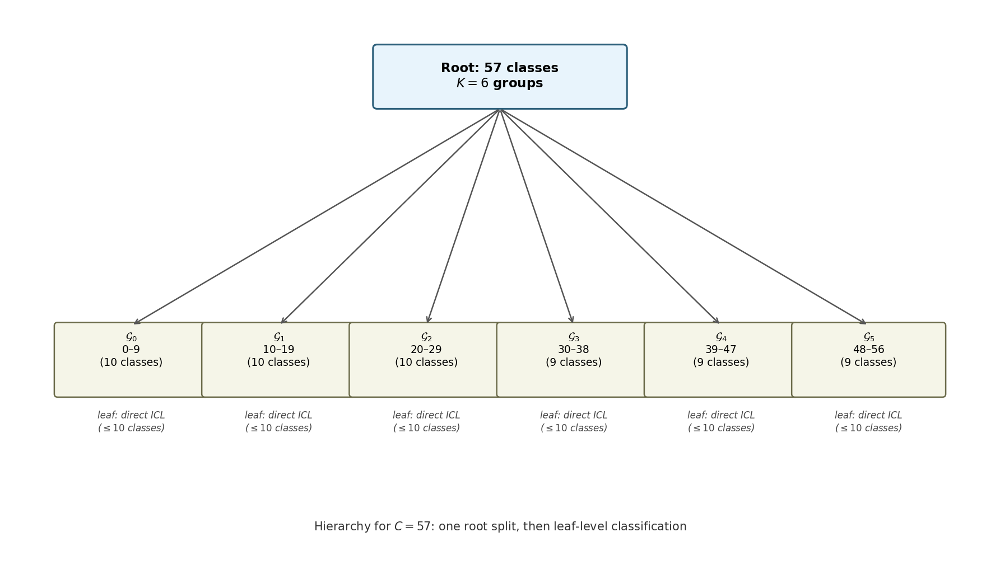

[Mohit Saharan](https://linkedin.com/in/msaharan), P30, 20260605

___
# Architecture of TabICLv2: many-class classification

Subtitle: How TabICLv2 handles classification tasks with more than 10 classes by decomposing labels on the embedding side and predictions on the output side.
___
The previous post covered query-aware scalable softmax, which lets TabICLv2 scale to more context rows. This post examines a different scaling problem: classification with more classes than the model saw during pretraining. TabICLv2's usual classifier checkpoint supports at most `max_classes=10`, while real tabular targets can contain dozens or hundreds of product categories, diagnosis codes, customer segments, or other labels.

Supporting more than \(10\) classes is not simply a matter of widening the output head. Observed training labels enter TabICLv2 twice: first through target-aware embedding before \(\text{TF}_\text{col}\), and again at the ICL stage before \(\text{TF}_\text{icl}\). The native model expects small class ids at both points and produces only \(10\) logits per prediction.

TabICLv2 preserves that pretrained interface by decomposing the large label space on both sides of the architecture. Mixed-radix ensembling converts each training label into several small-label views for target-aware column embedding. Hierarchical classification composes several node-local predictions, each with at most \(10\) choices, into probabilities over the original classes. This post explains both mechanisms, how they work together, and the boundary between the full TabICLv2 implementation and NanoTabICL's native small-class model.


*TabICLv2 architecture; many-class classification affects target-aware embedding and in-context learning.*

## Many-class classification

The two mechanisms introduced above operate only on observed training labels; test labels remain the unknown values to be predicted. Throughout this post, class labels are assumed to have been encoded as contiguous integers from \(0\) to \(C-1\). Both many-class mechanisms rely on this assumption: the mixed-radix implementation infers the class count as `y_train.max() + 1`, and hierarchical decoding uses original class labels as output-column indices.

The discussion starts with hierarchical classification because the output bottleneck is the easiest one to see. Mixed-radix ensembling then solves the analogous problem on the input-label side.

### The output bottleneck: more than 10 classes

TabICLv2 is pretrained on classification tasks with at most 10 classes. Let \(C\) be the number of downstream classes, \(x\) be the test row representation being classified, and \(y\in\{0,\ldots,C-1\}\) be the true class label. A direct \(C\)-class classifier would assign probabilities with a \(C\)-way softmax:
$$
p(y=c\mid x)=\frac{\exp(s_c(x))}{\sum_{r=0}^{C-1}\exp(s_r(x))},
$$
where \(s_c(x)\) is the score, or logit, for class \(c\). This is natural when \(C\leq 10\), but it no longer matches the interface the model was trained to use when \(C\) is much larger.

TabICLv2's solution is to avoid that direct \(C\)-way decision. Instead of training a new large head, it repeatedly asks the native classifier to solve decisions with at most \(10\) choices.

### Hierarchical classification

Let the full class set be
$$
\mathcal{Y}=\{0,1,\ldots,C-1\}.
$$
A hierarchy starts by partitioning \(\mathcal{Y}\) into disjoint groups:
$$
\mathcal{Y}=\mathcal{G}_0\cup\mathcal{G}_1\cup\cdots\cup\mathcal{G}_{K-1},
\qquad
\mathcal{G}_a\cap\mathcal{G}_b=\varnothing \quad(a\ne b),
$$
where \(K\leq 10\). The root classifier predicts which group contains the true class. If a group still contains more than \(10\) original classes, that group is partitioned again. Repeating this process creates a tree whose internal nodes each have at most \(10\) children. When a node contains at most \(10\) original classes, the native classifier can predict directly among those classes.

Each original class is then identified by a path through the tree: group choices at internal nodes, followed by a final class choice inside a small leaf node. For class \(c\), write \(v_t(c)\) for the node visited at depth \(t\), \(b_t(c)\) for the local branch or local class choice made there, and \(L(c)\) for the number of local decisions needed to identify \(c\). The decision path is
$$
\pi(c)=\left((v_0(c),b_0(c)),\ldots,(v_{L(c)-1}(c),b_{L(c)-1}(c))\right).
$$
Each local decision stays inside the pretrained class budget:
$$
b_t(c)\in\{0,\ldots,K_t(c)-1\},
\qquad K_t(c)\leq 10,
$$
where \(K_t(c)\) is the number of available choices at the node reached by class \(c\) at step \(t\). The model never has to solve a \(C\)-way decision directly. It solves several decisions with at most \(10\) choices whose combination identifies one original class.

Let \(\mathcal{D}\) denote the complete labeled context dataset and \(\mathcal{D}_v\) the subset assigned to node \(v\). At depth \(t\), write the node-local probability as
$$
p_{v_t(c)}\left(b_t(c)\mid x,\mathcal{D}_{v_t(c)}\right).
$$
Multiplying the node-local probabilities along the path for class \(c\) gives
$$
p(y=c\mid x,\mathcal{D})
=
\prod_{t=0}^{L(c)-1}
p_{v_t(c)}\left(b_t(c)\mid x,\mathcal{D}_{v_t(c)}\right).
$$
So the probability of an original class is the product of the local probabilities along its path. TabICLv2 therefore replaces a single \(C\)-way softmax with a composition of native predictions, each using at most \(10\) labels and logits.

### Building the tree in TabICLv2

TabICLv2 builds the hierarchy from the sorted observed class labels. For the usual `max_classes=10` classifier checkpoint, if a node contains \(N\) classes and \(N>10\), the number of child groups is
$$
K=\min\left(\left\lceil\frac{N}{10}\right\rceil,10\right),
$$
where \(N\) is the number of classes at the current node. The \(N\) classes are split into \(K\) nearly equal contiguous groups. Any child group that still contains more than \(10\) classes is split again. This keeps every local classifier within the model's native class capacity while keeping the tree reasonably balanced.

This is a computational hierarchy over contiguous ranges of encoded class ids, not a learned or domain-defined taxonomy. Nearby encoded ids need not be semantically related. When a broader prediction ensemble includes class-id shuffling, different members can also group the original labels differently.

For example, with \(C=57\), the root node uses
$$
K=\min(\lceil57/10\rceil,10)=6
$$
groups, with sizes close to \(57/6\). The first three groups contain 10 classes each, and the last three groups contain 9 classes each. Because every group already has at most \(10\) classes, the tree has two prediction levels: the root predicts among six groups, and the child classifiers predict directly among their 9 or 10 original classes. For a larger \(C\), some root groups would still contain more than \(10\) classes, so those groups would be split recursively.



*Hierarchy for \(C=57\): one root split into six contiguous groups, followed by direct leaf-level ICL classification.*

### Inference with the native ICL predictor

At inference time, TabICLv2 applies the hierarchy by recursively calling the native small-class ICL predictor. The hierarchy is not a new \(C\)-class output head; it is a wrapper around the pretrained predictor. The implementation does not pass previous branch choices into one autoregressive decoder. Instead, each tree node \(v\) makes a fresh native ICL prediction using its assigned training subset \(\mathcal{D}_v\). For each candidate class, its predefined path identifies the node-specific contexts whose probabilities contribute to its score, and the implementation recursively evaluates every child rather than selecting only one branch at runtime.

Operationally, the wrapper performs the following steps:

1. Partition the class set at each node into at most \(10\) groups.
2. At an internal node, select that node's training-row subset, relabel those rows by their child-group index, and run the native ICL classifier on the test row to obtain group probabilities.
3. At a leaf node, select its training-row subset, relabel its original classes to contiguous local ids, and run the native classifier directly among those classes.
4. Score every valid original class by multiplying the probabilities along its path.
5. Take the argmax if a hard class prediction is needed.

The key detail is that this is not greedy decoding. TabICLv2 does not choose one group at the root and discard the rest. It recursively scores child nodes and combines probabilities, so every valid class receives a probability.

### Picking the predicted class

For every valid class \(c<C\), the path score is the product of the internal group probabilities and the final local class probability along \(\pi(c)\). Mathematically, the same argmax can be computed in log space:
$$
\hat{y}
=
\arg\max_{0\leq c<C}
\sum_{t=0}^{L(c)-1}
\log p_{v_t(c)}\left(b_t(c)\mid x,\mathcal{D}_{v_t(c)}\right).
$$
The current implementation performs the recursive probability multiplications directly. The composed probabilities are sufficient for prediction, but callers may still request a logits-shaped output. In that case, the implementation returns derived logits, rather than raw decoder logits, by converting each final composed probability \(p\) as
$$
\ell=\tau\log(p+\epsilon),
$$
where \(\tau\) is the softmax temperature and the implementation uses \(\epsilon=10^{-6}\).

That completes the output-side story: after row representations are built, the model can score every original class by composing native small-class predictions. The other bottleneck happens earlier in the pipeline, before \(\text{TF}_\text{col}\), where labeled context rows still need target-aware embeddings.

### Mixed-radix ensembling

Hierarchical classification fixes prediction, but it cannot by itself explain how the model processes labeled context rows with many-class targets. Before the model reaches \(\text{TF}_\text{icl}\), those rows have already passed through target-aware embedding and \(\text{TF}_\text{col}\). If \(C>10\), the raw class id is too large for the native target-aware embedding interface. Mixed-radix ensembling (MRE) fixes this input-side problem by turning each large label into several small-label views, running \(\text{TF}_\text{col}\) once per view, and averaging the resulting representations. Hierarchical relabeling then keeps the later ICL-side label embedding within `max_classes` during recursive local predictions.

The mixed-radix construction begins by representing one large class id as several small digits. The implementation chooses the smallest possible number of views,
$$
D=\left\lceil\frac{\log C}{\log 10}\right\rceil,
$$
then computes a balanced initial base
$$
k=\min\left(\left\lceil C^{1/D}\right\rceil,10\right).
$$
Starting from the balanced list \([k,\ldots,k]\), the implementation returns \(D\) positive-integer bases, also called radices,
$$
[k_0,k_1,\ldots,k_{D-1}]
$$
such that
$$
k_i\leq 10,
\qquad
\prod_{i=0}^{D-1}k_i\geq C.
$$
The product condition ensures that there are enough digit combinations to represent all \(C\) classes, while the per-base upper bound keeps every digit within the native class capacity. A base of 1 would add no information, so the useful selected bases are nontrivial. For example, with \(C=25\), the implementation selects the balanced bases \([5,5]\), rather than another valid but less balanced choice such as \([10,3]\).

For a class label \(y\in\{0,\ldots,C-1\}\), define positional weights
$$
w_i=\prod_{j=i+1}^{D-1}k_j,
\qquad i=0,\ldots,D-1,
$$
with the convention that an empty product is \(1\), so \(w_{D-1}=1\). Here \(w_i\) is the place value of digit \(i\). The mixed-radix digits are
$$
y^{(i)}=\left\lfloor\frac{y}{w_i}\right\rfloor \bmod k_i,
\qquad i=0,\ldots,D-1.
$$
Each digit stays within a small class range:
$$
y^{(i)}\in\{0,\ldots,k_i-1\},
$$
so every digit is compatible with the 10-class pretraining regime. For represented labels, the original class id can be reconstructed from its digits:
$$
y=\sum_{i=0}^{D-1}y^{(i)}w_i,
$$
where \(y<C\). If \(\prod_i k_i>C\), some digit combinations do not correspond to real downstream classes. Those combinations are simply unused.

For example, suppose \(C=57\), the same class count used in the hierarchy example. The two mechanisms decompose those labels differently: hierarchy splits the labels into contiguous ranges for output prediction, while mixed radix splits each class id into digits for input embedding.

For MRE, the implementation first minimizes \(D\). Two views are sufficient, and \(\lceil\sqrt{57}\rceil=8\), so the balanced bases selected are \([8,8]\), with \(8\cdot8=64\geq57\). The bases \([10,6]\) would also satisfy the capacity constraints because \(10\cdot6=60\geq57\), but they are less balanced. With \([8,8]\), digit \(y^{(0)}\) is the high place and \(y^{(1)}\) is the low place:
$$
y^{(0)}=\left\lfloor\frac{y}{8}\right\rfloor \bmod 8,
\qquad
y^{(1)}=y\bmod 8.
$$
Class \(y=42\) becomes \((5,2)\), because \(42=5\cdot8+2\). Class \(y=56\) becomes \((7,0)\). The combinations \((7,1)\) through \((7,7)\) would represent 57 through 63, so they are unused when the true class set has only 57 classes.

In TabICLv2, these digits provide several small-label views of the original class. Instead of embedding the large class id \(y\) directly, the model embeds one digit \(y^{(i)}\) at a time. Operationally, TabICLv2 creates one labeled-context view per digit, runs \(\text{TF}_\text{col}\) once per view, and averages the resulting representations.

Let \(E_1[r,j]\in\mathbb{R}^d\) denote the \(d\)-dimensional feature-group representation for row \(r\) and grouped feature position \(j\) before target-aware embedding. For mixed-radix digit view \(i\), define the masked target vector
$$
u_r^{(i)}
=
\begin{cases}
\operatorname{Embed}_\text{TAE}\left(y_r^{(i)}\right), & r\in\mathcal{I}_\text{train},\\
\mathbf{0}_d, & r\in\mathcal{I}_\text{test}.
\end{cases}
$$
The same learned target-aware encoder is reused for every digit view. When writing \(E_1+u^{(i)}\) below, \(u_r^{(i)}\) is broadcast across every grouped feature position \(j\) in row \(r\), so the addition means \(E_1[r,j]+u_r^{(i)}\). A simplified view of the averaged representation is
$$
O_\text{avg}
=\frac{1}{D}\sum_{i=0}^{D-1}
\text{TF}_\text{col}\left(E_1+u^{(i)}\right).
$$
Here \(O_\text{avg}\) is the averaged column-transformer representation across the \(D\) digit views. This is MRE. It exposes information about a large class label through several small-label views, each compatible with the pretrained target-aware embedding interface.

The important boundary is that MRE is not the final many-class decoder. It prepares representations by making context labels embeddable. Hierarchical classification then handles the final prediction over the original \(C\) classes.

### Operational implication

Both mechanisms require repeated use of the native model: MRE uses multiple label views, and hierarchical classification uses node-specific training subsets. Consequently, the current full implementation does not support KV caching for many-class classification because these changing inputs are incompatible with the available caching path.

With the full many-class orchestration established, NanoTabICL provides a concrete view of the native small-class interface that both mechanisms reuse.

## Implementation in NanoTabICL

NanoTabICL is also a useful boundary marker: it exposes that native interface, but it stops before the many-class orchestration. In particular, the compact repository does not include:

- the recursive hierarchical classification wrapper;
- mixed-radix digit construction;
- multiple \(\text{TF}_\text{col}\) passes over digit views;
- path-probability decoding for \(C>10\).

The standard README classification example shows this native interface directly:

```python
model = NanoTabICLv2(max_classes=10, out_dim=10)
X_train_and_test = torch.randn(batch_size, n_train+n_test, n_cols)
y_train = torch.randint(10, size=(batch_size, n_train)).float()
y_test_pred_logits = model(X_train_and_test, y_train)
```

The two NanoTabICL constructor arguments that matter for this post are `max_classes` and `out_dim`:

```python
def __init__(self, max_classes: int, out_dim: int, ...):
    # classification: max_classes = out_dim (= 10 typically)
```

NanoTabICL exposes these as independent constructor arguments, and they control different sides of the compact model:

| Argument | Role in NanoTabICL |
|----------|--------------------|
| `max_classes=10` | size of the class-embedding tables used for observed training labels |
| `out_dim=10` | number of logits emitted for each test row |

In the full TabICLv2 classification constructor, `out_dim` is not independently exposed: it is set internally to `max_classes`. NanoTabICL's explicit separation still helps show the two sides of the native interface.

The two target embedding tables are initialized in `__init__`:

```python
self.y_embed_in = (
    ClassEmbedding(max_classes, embed_dim)
    if max_classes > 0
    else nn.Linear(1, embed_dim)
)
self.y_embed_icl = (
    ClassEmbedding(max_classes, icl_dim)
    if max_classes > 0
    else nn.Linear(1, icl_dim)
)
```

For classification, `max_classes > 0`, so both are `ClassEmbedding` layers. The first table injects labels into feature tokens before \(\text{TF}_\text{col}\). This is the native interface that MRE repeatedly uses with different digit views:

```python
emb = self.x_embed(x)
emb[:, :n_train] += self.y_embed_in(y[:, :, None, None])
```

At this point `emb` has shape `(batch, rows, cols, embed_dim)`. The slice `emb[:, :n_train]` selects only labeled training rows, and `y[:, :, None, None]` gives the target embedder singleton axes so the resulting label vector can broadcast across all feature positions in each training row. Test rows are not touched.

The second table injects labels again after row compression, just before dataset-wise ICL. Hierarchical classification reuses this embedding and the later output head for each node-local prediction:

```python
emb[:, :n_train] += self.y_embed_icl(y[:, :, None])
for block in self.icl_blocks[:-1]:
    emb = block(emb, kv_max_idx=n_train)
emb = self.icl_blocks[-1](emb[:, n_train:], emb[:, :n_train])
```

Now `emb` has shape `(batch, rows, icl_dim)`, so `self.y_embed_icl(...)` returns one row-level label vector per training row. In the loop, `kv_max_idx=n_train` restricts keys and values to training rows, preventing test rows from being used as labeled context. The ICL blocks use the training rows as labeled context, and the final block computes outputs only for test rows:

```text
queries:      emb[:, n_train:]   -> test rows
keys/values:  emb[:, :n_train]   -> training rows
```

Implementation note: the README stores `y_train` as a float tensor, but the classification embedder casts labels to integer indices before lookup:

```python
class ClassEmbedding(nn.Embedding):
    def forward(self, y: torch.Tensor) -> torch.Tensor:
        return super().forward(y.squeeze(-1).long())
```

The classification path is therefore still a lookup-table path. Labels can be carried as floats in the example tensor, but their values must be valid class indices from 0 to 9.

The output head is a separate MLP:

```python
self.out_mlp = get_mlp(icl_dim, icl_dim * 2, out_dim)

return self.out_mlp(self.out_ln(emb))
```

With `out_dim=10`, the returned tensor has shape:

```text
(batch, n_test, 10)
```

Those 10 values are the native small-class logits. This gives the concrete interface that the many-class wrappers depend on:

```text
training labels 0..9
    -> class embeddings for feature-level and row-level target injection
    -> compression-then-ICL over labeled training rows
    -> 10 logits per test row
```

For \(C>10\), full TabICLv2 adds orchestration around this interface. Mixed-radix ensembling repeatedly feeds small digit labels into the target-aware embedding side, keeping context-label embeddings compatible with \(\text{TF}_\text{col}\). Hierarchical classification repeatedly asks the native small-class predictor to solve node-local branch decisions during the \(\text{TF}_\text{icl}\) stage. NanoTabICL does not include those wrappers; it makes the reuse point visible.

## Summary

TabICLv2 supports many-class classification without changing the small-class interface learned during pretraining. Because observed labels enter the model before both \(\text{TF}_\text{col}\) and \(\text{TF}_\text{icl}\), it must decompose the problem at both stages rather than merely replace the output head.

Mixed-radix ensembling handles the target-aware embedding side. It expresses each large class id as several digits with at most \(10\) values, runs the column transformer for each digit view, and averages the resulting representations. Hierarchical classification handles the ICL and output side. It organizes the original classes into a balanced tree, makes fresh native predictions among at most \(10\) choices at each node, and multiplies probabilities along each path to score every original class.

Together, these mechanisms turn one unsupported \(C\)-class task into multiple predictions that remain within the model's native label and logit capacity. That reuse requires multiple forward passes over different label views and node-specific contexts, which is also why the current many-class path does not support KV caching. NanoTabICL exposes the small-class interface being reused through `max_classes=10`, its two class-embedding stages, and `out_dim=10`, but leaves out the mixed-radix and hierarchical orchestration.

The next post covers quantile predictions for regression, the regression strategy TabICLv2 uses to model predictive uncertainty without discretizing the target into classification bins.

## Quiz

Take the quiz below to test your understanding, and share your answers and doubts in the comments. The questions get progressively harder from 1 to 10.

1. What are the two many-class bottlenecks TabICLv2 has to handle when \(C>10\)?

   **Answer:** The first bottleneck is at the target-aware column-embedding stage: labeled context rows need target embeddings, but the pretrained classification embedder expects small class ids. The second bottleneck is at the ICL stage: observed context labels are injected again and the native classifier emits only \(10\) logits, so both node-local label encoding and output prediction must stay within the pretrained interface.

2. Which mechanism handles the output side of many-class classification, and which mechanism handles the input-label embedding side?

   **Answer:** Hierarchical classification handles the ICL side by turning one \(C\)-class prediction into several node-local predictions with at most \(10\) choices. Mixed-radix ensembling handles the target-aware column-embedding side by rewriting each large class id as several small digits before target-aware embedding.

3. Why does TabICLv2 avoid adding a new direct \(C\)-class output head for many-class classification?

   **Answer:** A new direct \(C\)-class head would no longer match the small-class interface used during pretraining. TabICLv2 instead reuses the pretrained native classifier by decomposing the large prediction into local decisions with at most \(10\) choices each.

4. In hierarchical classification, what does the path \(\pi(c)\) represent for an original class \(c\)?

   **Answer:** The path \(\pi(c)\) records the visited node and local branch or class choice at each depth needed to identify class \(c\). Each node-local prediction assigns probabilities among at most \(10\) options using its own training-row subset, and the full path uniquely maps back to the original class.

5. How is the probability of an original class computed from local hierarchical predictions?

   **Answer:** The probability of an original class is computed by multiplying the local probabilities along that class's path through the hierarchy:
   $$
   p(y=c\mid x,\mathcal{D})=
   \prod_{t=0}^{L(c)-1}
   p_{v_t(c)}\left(b_t(c)\mid x,\mathcal{D}_{v_t(c)}\right).
   $$
   Mathematically, the same comparison can be done in log space by summing log probabilities. The current implementation instead multiplies the probabilities recursively and, when logits are requested, returns derived logits of the form \(\tau\log(p+\epsilon)\), rather than raw decoder logits.

6. For \(C=57\) and `max_classes=10`, why does the root node use six groups in the example hierarchy?

   **Answer:** The number of root groups is
   $$
   K=\min(\lceil57/10\rceil,10)=6.
   $$
   This creates six nearly equal contiguous groups. Each group then contains either 9 or 10 original classes, so the next prediction can be handled directly by the native small-class classifier.

7. Why is hierarchical decoding in TabICLv2 not greedy decoding?

   **Answer:** TabICLv2 does not pick one root group and discard all others. It recursively scores every child node using that node's training-row subset and combines the probabilities along every valid class path. This gives every original class \(c<C\) a score before the final argmax is taken.

8. What conditions must the mixed-radix bases \([k_0,k_1,\ldots,k_{D-1}]\) satisfy, and how does TabICLv2 choose among valid bases?

   **Answer:** Each positive-integer base must satisfy \(k_i\leq 10\), and the product must satisfy
   $$
   \prod_{i=0}^{D-1}k_i\geq C.
   $$
   The per-base upper limit keeps each digit compatible with the small-class target embedding interface, while the product condition ensures there are enough digit combinations to represent all \(C\) original classes. The implementation computes
   $$
   D=\left\lceil\frac{\log C}{\log 10}\right\rceil,
   \qquad
   k=\min\left(\left\lceil C^{1/D}\right\rceil,10\right),
   $$
   and initializes all \(D\) bases to \(k\). A base of 1 would add no information, so useful selected bases are nontrivial.

9. With mixed-radix bases \([8,8]\) for \(C=57\), what digits represent class \(y=42\), and which digit combinations are unused?

   **Answer:** With bases \([8,8]\), the high digit is \(\lfloor y/8\rfloor\bmod8\) and the low digit is \(y\bmod8\). For \(y=42\), the digits are \((5,2)\), because \(42=5\cdot8+2\). Since \(8\cdot8=64\) but only 57 classes are valid, the combinations representing 57 through 63 are unused; these are \((7,1)\) through \((7,7)\).

10. What many-class machinery does NanoTabICL expose, and what does it deliberately leave out?

    **Answer:** NanoTabICL exposes the native small-class interface that full TabICLv2 reuses: `max_classes=10` class embeddings for observed training labels, `out_dim=10` logits for test rows, feature-level target injection before \(\text{TF}_\text{col}\), and row-level target injection before \(\text{TF}_\text{icl}\). It does not implement the recursive hierarchical classification wrapper, mixed-radix digit construction, multiple \(\text{TF}_\text{col}\) passes over digit views, or path-probability decoding for \(C>10\).
